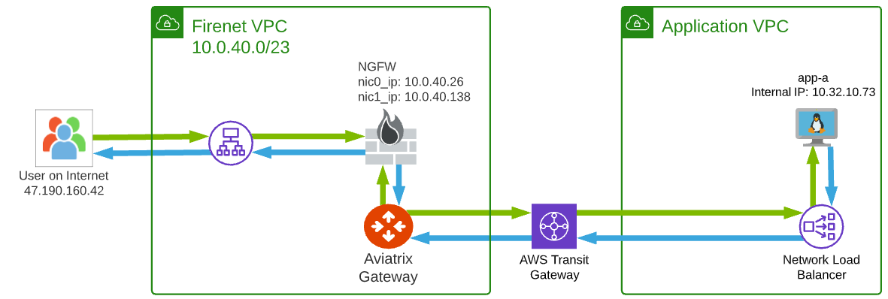
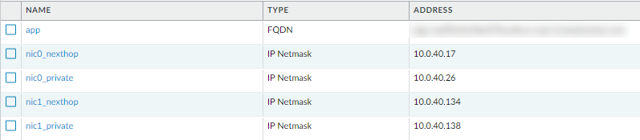

.. meta::
  :description: Firewall Network
  :keywords: AWS Transit Gateway, AWS TGW, TGW orchestrator, Aviatrix Transit network, Transit DMZ, Egress, Firewall

=========================================================
AWS Ingress Firewall Setup Solution 
=========================================================

This document illustrates a simple architecture for Ingress traffic inspection firewall that leverages AWS Load Balancers, `Aviatrix TGW Orchestrator <https://docs.aviatrix.com/HowTos/tgw_faq.html>`_ and `Aviatrix Firewall Network <https://docs.aviatrix.com/HowTos/firewall_network_faq.html>`_. The solution is ideal when ingress traffic must be inspected by an NGFW before entering the internal network.

The deployment is shown as the diagram below. 

|aws_tgw_ngfw_ingress_design|

The design is accomplished by:

1. Using `Aviatrix TGW Orchestrator <https://docs.aviatrix.com/HowTos/tgw_faq.html>`_ to deploy AWS Transit Gateway and attach the Application VPC.
2. Deploying `Aviatrix Firewall Network <https://docs.aviatrix.com/HowTos/firewall_network_faq.html>`_ and NGFWs.
3. Build the Application Load Balancer.
4. Configure the NGFW to send traffic accordingly.

In this unified architecture, firewalls can be used for Ingress, Egress, North-South and VPC to VPC filtering. Ingress traffic must be NAT'd to the NGFW's internal IP. Firewall instances can be scaled out as applications scale for all traffic types.

.. Note::
  This architecture works for both `AWS Network Load Balancer <https://docs.aws.amazon.com/elasticloadbalancing/latest/network/introduction.html>`_ and `AWS ALB. <https://docs.aws.amazon.com/elasticloadbalancing/latest/application/create-application-load-balancer.html>`_. ALB is used for illustration purpose. 

  You can create multiple load balancers in front of the firewall.

1. Use `Aviatrix TGW Orchestrator <https://docs.aviatrix.com/HowTos/tgw_faq.html>`_ to deploy AWS Transit Gateway and attach the Application VPC.
-------------------------------------------------------------------------------------------------------------------------------------------------

- Follow `Aviatrix TGW Orchestrator workflow <https://docs.aviatrix.com/HowTos/tgw_plan.html>`_ to:
   - Create an Application domain. This domain can be named something else and can be an existing domain. 
   - Build Connection policy between Application domain and Firewall domain so that traffic in and out of the domain is inspected. 
   - Attach the Application VPC to the TGW. 

2. Follow `Aviatrix Firewall Network workflow <https://docs.aviatrix.com/HowTos/firewall_network_workflow.html>`_ to launch FireNet gateways and firewall instances. Enable `Egress <https://docs.aviatrix.com/HowTos/firewall_network_faq.html#how-do-i-enable-egress-inspection-on-firenet>`_ if desired.
-----------------------------------------------------------------------------------------------------------------------------------------------------------------------------------------------------------------------------------------------------------------------------------------------------------

3. Create AWS ALB in front of the NGFW.
---------------------------------------

In Firenet/Security VPC, create an AWS ALB, make sure you select the following. 
- Select internet-facing.
- For the Availability Zone subnets, specify subnets in the same AZs the NGFW instances. The ALB can share subnets with the NGFW egress NIC.
- Routing Target group contain the Firewall Instances.

4. Configure the NGFW to forward traffic to the backend.
--------------------------------------------------------

.. note:: These steps assume that the NGFW is configured per the appropriate workflow.
   The below example uses a Palo Alto NGFW. The Palo Alto workflow is `here <https://docs.aviatrix.com/HowTos/config_paloaltoVM.html>`_.

- Log into the Palo Alto console.
- Create Address Objects (these will be different for each NGFW):
   - nic0_private (private IP of Internet-facing NIC)
   - nic0_nexthop (first IP in Internet facing subnet)
   - nic1_private (private IP of Internal-facing NIC)
   - nic1_nexthop (first IP in Internet-facing subnet)
   - app (FQDN of back end Load Balancer)
|address_objects|

- Create route(s) for ALB instances in other AZs. This is needed because the ALB does cross-zone Load Balancing and cannot be disabled.
   - In the default router, add a Static Route for each additional AZ.
   - Destination: Subnet for ALB in another AZ.
   - Next hop: Address Object named nic0_nexthop.
   - Interface: ethernet1/1
|static_route|

- Create a NAT rule for inbound traffic:  
   - Original Packet:
      -  Source zone: external
      -  Destination Zone: external
      -  Destination Interface: ethernet1/1
      -  Service: service-http (or whatever is appropriate)
      -  Source Address: any
      -  Destination Address: nic0_private
   - Translated Packet:
      -  Source Address Translation Type: Dynamic IP and Port
      -  Source Address Translated Address: nic1_private
      -  Destination Address Translation Type: Dynamic IP (with session distribution)
      -  Destination Translated Address: Address Object named app
      -  Destination Translated Port: 80 (match the service port from the Original Packet)
|nat_rule|

- Create a Security Rule for inbound traffic:
   -  Source Zone: external
   -  Source Address: all ALB subnets
   -  Destination Zone: internal
   -  Destination Address: Address Objects app and nic0_private.
   -  Service: service-http (match the service used in the NAT rule)
|security_rule|

- Commit

5. Validate:
---------------
- Test the Public DNS name of the ALB in a web browser. The web site should appear.
- Timeouts are often a AWS Security Group issue. Make sure the backend app can accept traffic from the ALB subnets.
 
Capturing Client IP
-------------------------

Using AWS ALB
^^^^^^^^^^^^^^^^^^

AWS ALB automatically preserves client IP address, you can find the client IP address in the HTTP header 
field "X-Forwarded-For". 

To view the client IP address in the access log, 
follow the instructions in `How to save client IP in access logs <https://aws.amazon.com/premiumsupport/knowledge-center/elb-capture-client-ip-addresses/>`_. 

Using AWS NLB
^^^^^^^^^^^^^^^^^^^^

When NLB uses IP address as target group, the client IP address of the packet reaching to the application is one of the NLB node private IP address. If you like to get the original client IP address, you need to enable function `proxy_protocol_v2.enabled under Target Group Attributes <https://docs.aws.amazon.com/elasticloadbalancing/latest/network/load-balancer-target-groups.html#target-group-attributes>`_ on the NLB. Review the section "Enable Proxy Protocol" in the above AWS document or follow the same steps as below to enble this function on NLB using the AWS console.

	- Open the Amazon EC2 console at https://console.aws.amazon.com/ec2/.

	- On the navigation pane, under LOAD BALANCING, choose Target Groups.

	- Select the target group.

	- Choose Description, Edit attributes.

	- Select Enable proxy protocol v2, and then choose Save.

Also, you need to configure/support Proxy Protocol feature on your web server to retrieve the client original IP address. Please follow the steps below which are refering to the AWS document `How do I capture client IP addresses in my ELB access logs? <https://aws.amazon.com/premiumsupport/knowledge-center/elb-capture-client-ip-addresses/>`_.
 
	- Take Apache/2.4.41 (Ubuntu) for example
	
	- Find and open Apache configuration file.
	
		::
			
			/etc/apache2/apache2.conf
	
	- Edit/add remoteip module configuration into Apache configuration file as below:
			
		::
		
			LoadModule remoteip_module /usr/lib/apache2/modules/mod_remoteip.so

		- https://httpd.apache.org/docs/2.4/mod/mod_remoteip.html
		
		- https://httpd.apache.org/docs/2.4/mod/mod_remoteip.html#remoteipproxyprotocol

	- Confirm that the mod_remoteip module loads by issuing command as below
	
		::
		
			$sudo apachectl -t -D DUMP_MODULES | grep -i remoteip
		
	- Review the output and verify that it contains a line similar to:
	
		::
		
			remoteip_module (shared)

		- Notes: If you are not able to view the prompt message, please make sure that your apache version support that module or attempt to load that module into the apache configuration.

	- Configure the following line to your Apache configuration file (take /etc/apache2/sites-available/000-default.conf for example) to enable Proxy Protocol support. 
		
		::
		
			RemoteIPProxyProtocol On
			
	- To view client IP address in the access log, edit/add commands into LogFormat section as below:

		::
		
			LogFormat "%h %p %a %{remote}p %l %u %t \"%r\" %>s %b \"%{Referer}i\" \"%{User-Agent}i\"" combined

	- Save the changes

	- Reload the Apache service by issuing command.
	
		::
		
			#systemctl reload apache2

	- Open the Apache access logs on your Apache server

	- Verify that client IP addresses are now recorded under the X-Forwarded-For header.

	- Notes: 
	
		- Commands and file location varies by configuration
	
		- For other OSs and web services, please find detail in the document `How do I capture client IP addresses in my ELB access logs? <https://aws.amazon.com/premiumsupport/knowledge-center/elb-capture-client-ip-addresses/>`_

.. disqus::
