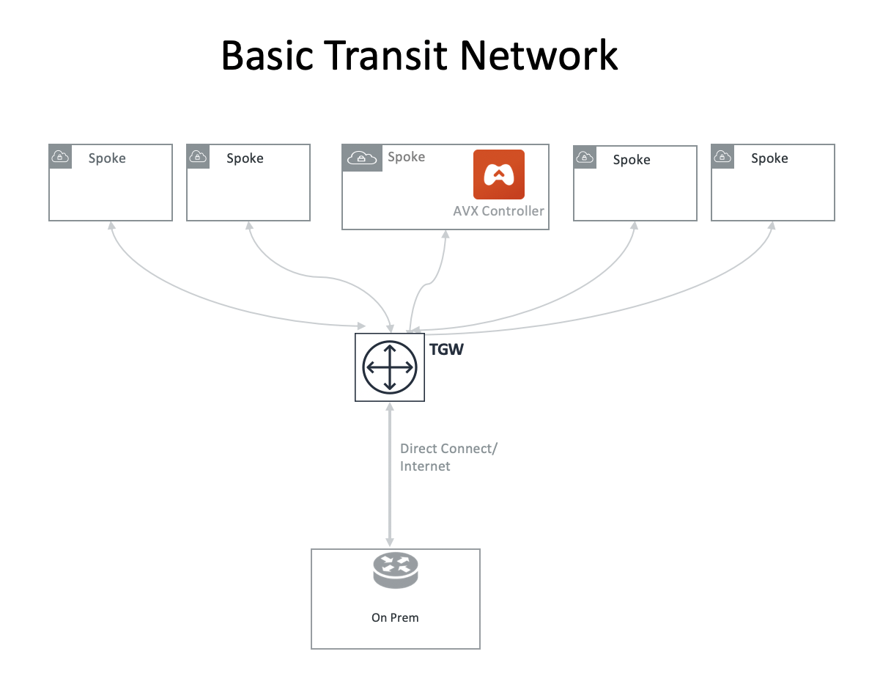
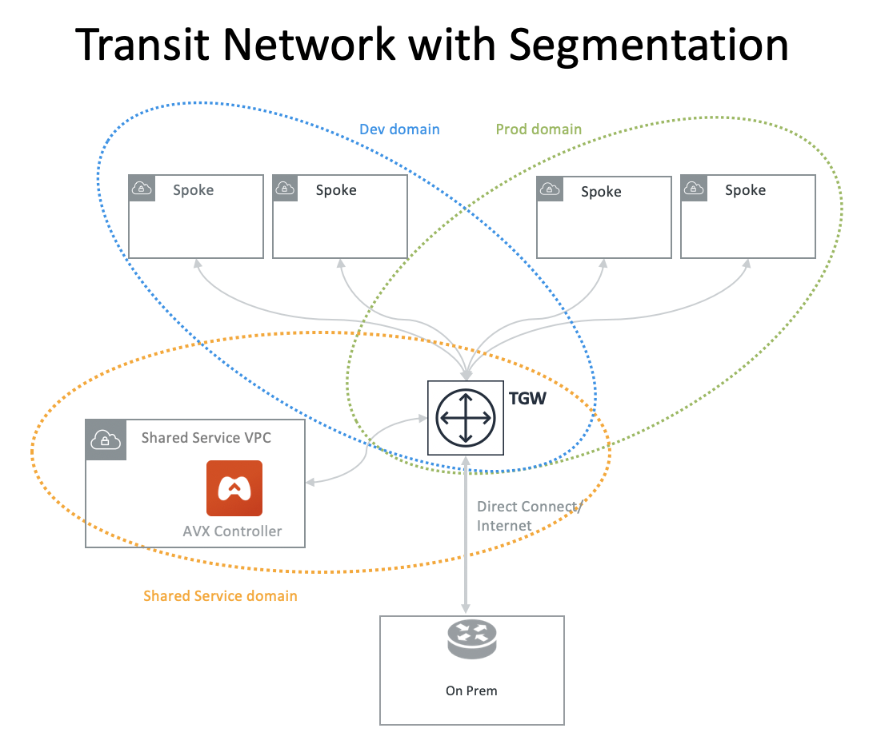
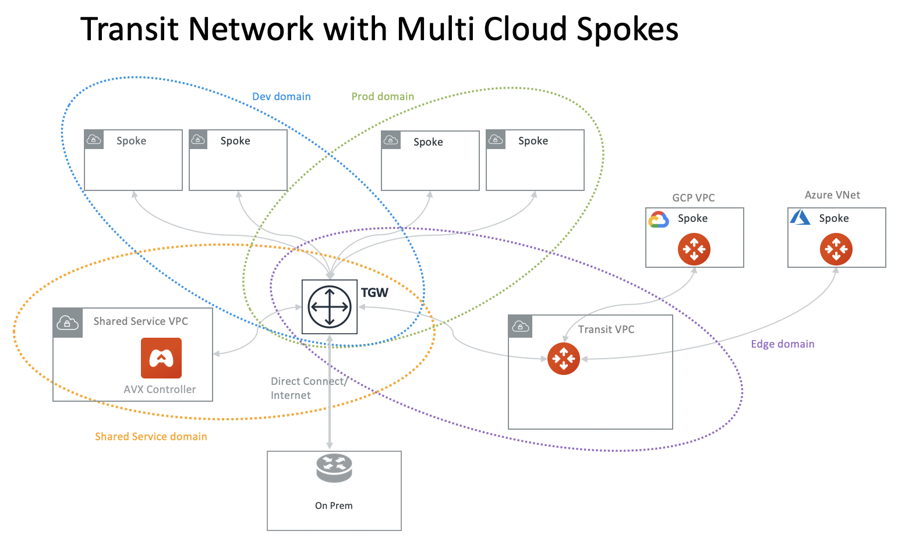
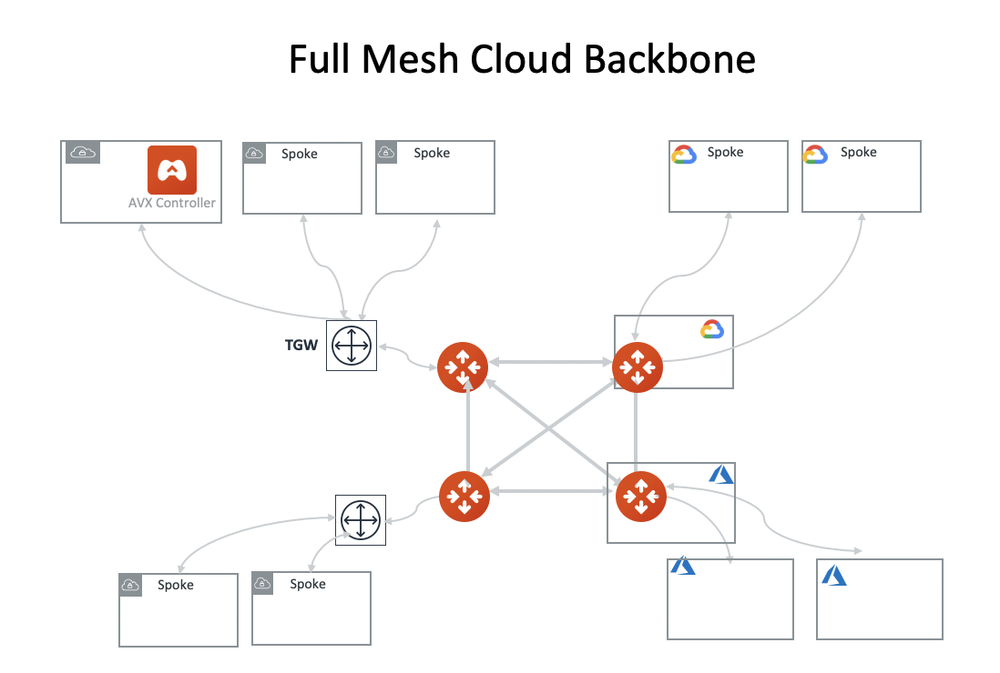

.. meta::
  :description: TGW Orchestrator Overview
  :keywords: Transit Gateway, AWS Transit Gateway, AWS TGW, TGW orchestrator, Aviatrix Transit network

=========================================================
AWS Transit Gateway Orchestrator 
=========================================================

The AWS Transit Gateway (TGW) Orchestrator is a feature in Aviatrix Controller. It provides a point-and-click workflow to build a transit 
network and manages all network routing updates. The Orchestrator runs AWS APIs and uses building blocks such as
AWS Transit Gateway, Transit Gateway route tables and VPC route tables, to automate the transit network deployment. In addition, 
the Orchestrator extends the AWS native service to include multi cloud support and a scale out architecture for firewall deployment. Whatever 
requirements you had in mind, the Orchestrator got you covered.

Here is what you can do with the Orchestrator. 

1. Build a Basic Transit Network
------------------------------------

Use the Orchestrator to build a basic transit network with the following benefits:

 - Point-and-Click workflow is simple to follow and easy to deploy.  
 - Support cross accounts VPC attachments to TGW with a single pane of glass. 
 - The Orchestrator periodically polls TGW route table to monitor route changes from on-prem and automatically programs Spoke VPC route tables. 
 - TGW Direct Connect Gateway (DXGW) support.
 - TGW VPN support.
 - Support up to 100 routes (Per AWS VPN route table and DXGW route table limits).
 - Graphic view of TGW VPC attachments.
 - List view of TGW route table entries and VPC route table entries.
 - Continuous monitoring the configuration consistency and alerting for out-of-band changed. 

|basic|

2. Build a Transit Network with Segmentation
-----------------------------------------------

Layering on the basic transit network, you can use the Orchestrator to add network segmentation:

 - Create network isolation by defining multiple Security Domains where VPCs in one domain cannot communicate with VPCs in another domain.
 - Create network connection of isolated segments by defining connection policies that allow one domain to communicate with another domain.
 - Build network segmentation by creating multiple TGW route tables and automatically updates all TGW  route table propagations. 

|with_security_domain|

3. Build a Transit Network with Multi Cloud Spokes
----------------------------------------------------

By deploying an Aviatrix Transit Gateway, you can use the Orchestrator to extend the deployment to include multi cloud Spokes. 

 - Connect Azure VNets as Spokes to the AWS transit network. 
 - Connect GCP VPCs as Spokes to the AWS transit network.

|multi_cloud|

4. Build a Full Mesh Cloud Backbone
---------------------------------------------------------------

By deploying multiple Aviatrix Transit Gateways, you can build a full mesh cloud backbone.

 - Connect Azure transit network with the AWS transit network.
 - Connect GCP transit network with the AWS transit network. 

|cloud_backbone|

.. |multi-region| image:: tgw_design_patterns_media/multi-region.png
   :scale: 30%

.. |insane-mode| image:: tgw_design_patterns_media/insane-mode.png
   :scale: 30%

.. |transit-DMZ| image:: tgw_design_patterns_media/transit-DMZ.png
   :scale: 30%

.. disqus::
