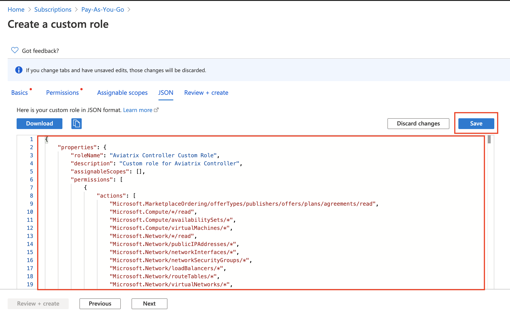
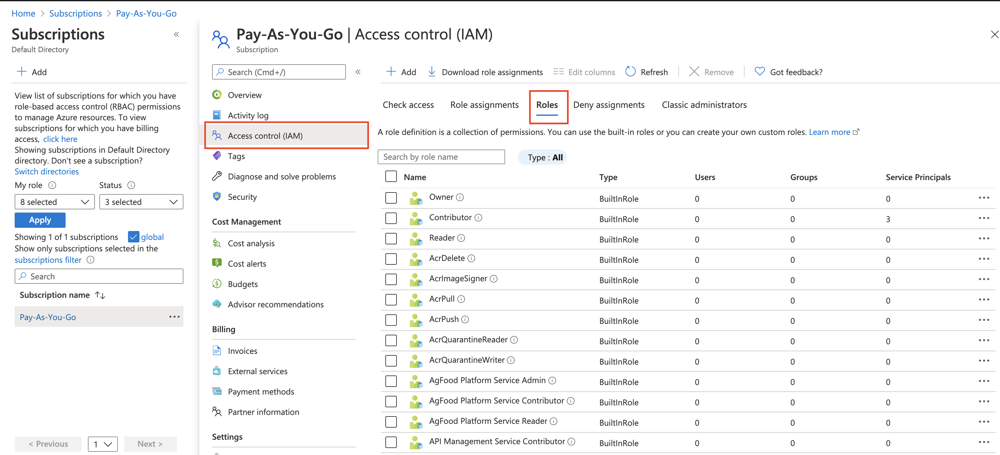
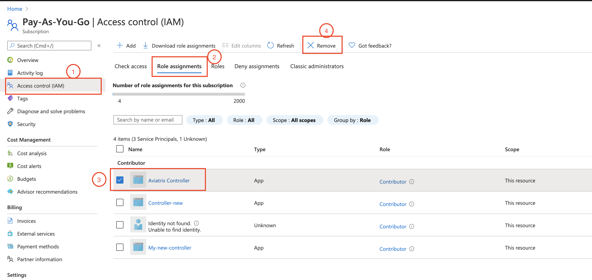
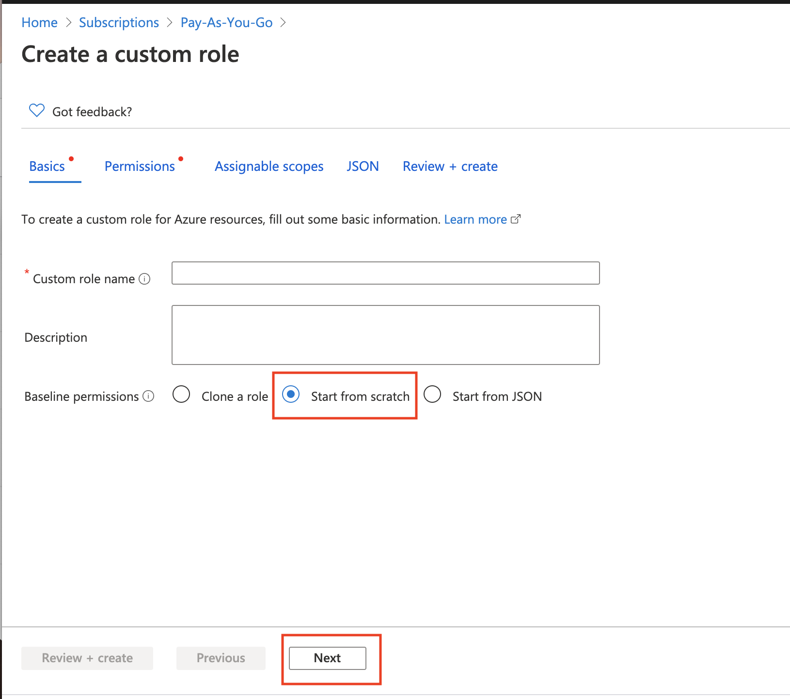
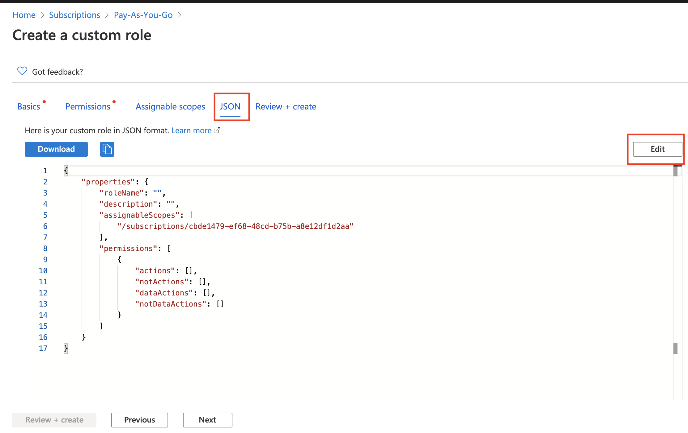
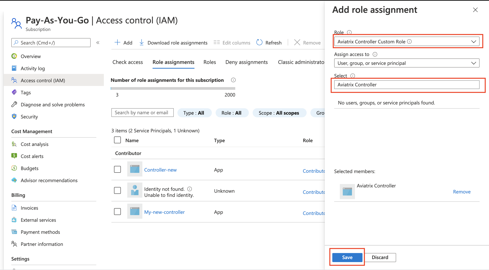
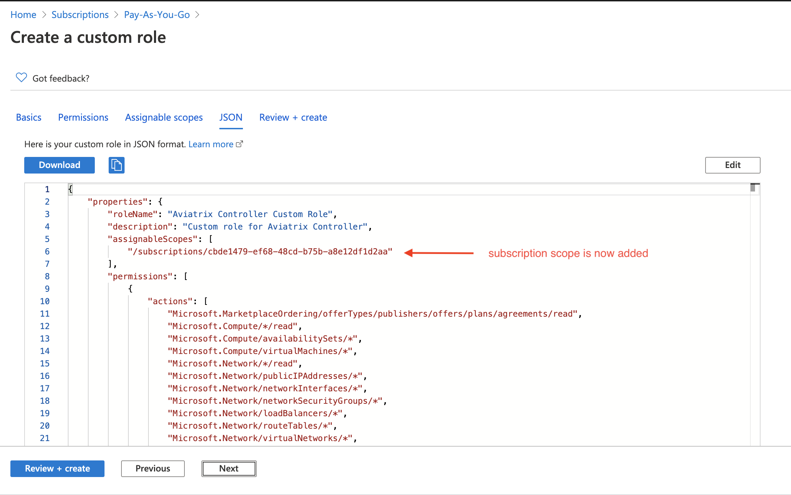
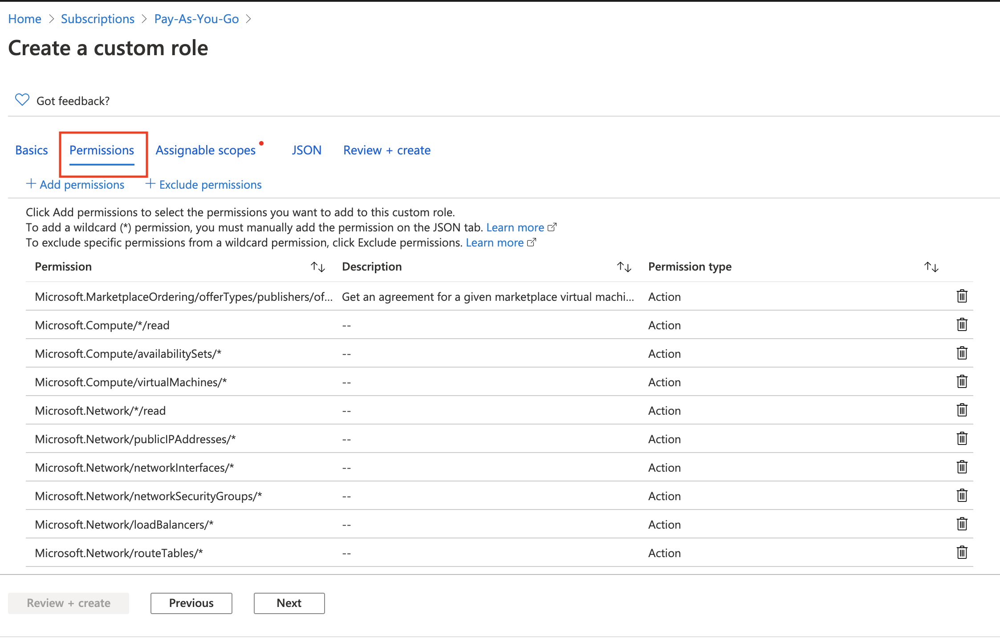

.. meta::
  :description: Describe how to customize Azure IAM role
  :keywords: account, aviatrix, AWS IAM role, Azure API credentials, Google credentials 

=================================
Use Azure IAM Custom Role 
=================================

When Aviatrix Controller uses Azure API to manage networking and gateway resources, an application must be first created in 
Azure AD with an identity of Service Principal. This service principal requires an Azure IAM role assignment together with a set of 
permissions required by the Aviatrix Controller to provide service. By default we use the Azure built-in "Contributor" role. Contributor 
roles has access to all resources of the subscription. 

If you wish to limit the Controller access permissions, you can do so by creating a custom role with a set of permissions required 
by the Controller as shown below. This document describes how to accomplish this task through Azure portal. 

1. Aviatrix required custom role permissions
------------------------------------------------

::

    {
        "properties": {
            "roleName": "Aviatrix Controller Custom Role",
            "description": "Custom role for Aviatrix Controller",
            "assignableScopes": [],
            "permissions": [
                {
                    "actions": [
                        "Microsoft.MarketplaceOrdering/offerTypes/publishers/offers/plans/agreements/*",
                        "Microsoft.Compute/*/read",
                        "Microsoft.Compute/availabilitySets/*",
                        "Microsoft.Compute/virtualMachines/*",
                        "Microsoft.Network/*/read",
                        "Microsoft.Network/publicIPAddresses/*",
                        "Microsoft.Network/networkInterfaces/*",
                        "Microsoft.Network/networkSecurityGroups/*",
                        "Microsoft.Network/loadBalancers/*",
                        "Microsoft.Network/routeTables/*",
                        "Microsoft.Network/virtualNetworks/*",
                        "Microsoft.Storage/storageAccounts/*",
                        "Microsoft.Resources/*/read",
                        "Microsoft.Resourcehealth/healthevent/*",
                        "Microsoft.Resources/deployments/*",
                        "Microsoft.Resources/tags/*",
                        "Microsoft.Resources/marketplace/purchase/*",
                        "Microsoft.Resources/subscriptions/resourceGroups/*"
                    ],
                    "notActions": [],
                    "dataActions":[],
                    "notDataActions":[]
                }
            ]
        }
    }  

 
2. Create a Custom Role
----------------------------------------------------

 a. Login to Azure portal. Go to Subscriptions. Select the subscription whose network already managed by Aviatrix Controller and click in. 
 b. Next click Access control (IAM)
 c. Next click Roles as shown below.

 |iam_role|

 d. Next click +Add Role and select "Add custom role".
 e. Next select Start from scratch and click Next, as shown below. 

 |start_from_scratch|  

 f. Next click JSON, click Edit. 

 |click_json|

 g. Next remove the existing JSON template and copy and paste the above Aviatrix required permissions JSON into the Editor box, as shown below. Click Save.
 
 |aviatrix_custom_role|
 
 h. Next click Permissions. You should see the permissions have been populated, as shown below. 

  |show_permission|

 i. Next click Assignable scopes, click Add assignable scopes, select the subscription. 

 j. Next click JSON, you should say the subscription has been added to the assignableScopes, as shown below. 

 |subscription_scope|

 k. Next click Review + create, click Create.

3. Replace the Contributor Role
--------------------------------

 a. (This step is optional, it is only applicable if you have already assigned "Contributor" role to the Aviatrix Controller service principal. If not, skip this step and proceed to the next step.)  Now that you have created a custom role called Aviatrix Controller Custom Role, go ahead replace the Contributor role, as shown below.

 |remove_contributor|

 b. Click +Add, select Add role assignment. Fill in the fields as shown below
 
 |replace_role|

Done.

4. Multiple Custom Roles Approach
----------------------------------

The Aviatrix role permissions can be split into multiple custom roles each with a subset of permissions. Subscription permission must 
be at the subscription scope. The additional permission may have
the scope of one or more Resource Groups. 

Below is an example where the "Aviatrix Custom Role for subscription" has the scope of subscription and the remaining permissions has the scope of
Resource Group. 

4.1 Subscription Scope IAM Custom Role
~~~~~~~~~~~~~~~~~~~~~~~~~~~~~~~~~~~~~~~~

::

    {
        "properties": {
            "roleName": "Aviatrix Custom Role for subscription",
            "description": "Aviatrix Custom role for gateway subscription permission",
            "assignableScopes": [],
            "permissions": [
                {
                    "actions": [
                        "Microsoft.MarketplaceOrdering/offerTypes/publishers/offers/plans/agreements/*"
                    ],
                    "notActions": [],
                    "dataActions":[],
                    "notDataActions":[]
                }
            ]
        }
    }

4.2 Resource Group Scope IAM Custom role 
~~~~~~~~~~~~~~~~~~~~~~~~~~~~~~~~~~~~~~~~~~~

Note when creating a custom role for a resource group on Azure portal, start at Subscription -> Resource groups, select one resource group 
and click "Access Control (IAM). Then follow the role creation process with the permission described in the file below 
to create the role. After the role is created, assign the role to the Service principal of the Aviatrix Controller application.

::

    {
        "properties": {
            "roleName": "Aviatrix Custom Role for services",
            "description": "Aviatrix Custom role for the network and gateway services",
            "assignableScopes": [],
            "permissions": [
                {
                    "actions": [
                        "Microsoft.Compute/*/read",
                        "Microsoft.Compute/availabilitySets/*",
                        "Microsoft.Compute/virtualMachines/*",
                        "Microsoft.Network/*/read",
                        "Microsoft.Network/publicIPAddresses/*",
                        "Microsoft.Network/networkInterfaces/*",
                        "Microsoft.Network/networkSecurityGroups/*",
                        "Microsoft.Network/loadBalancers/*",
                        "Microsoft.Network/routeTables/*",
                        "Microsoft.Network/virtualNetworks/*",
                        "Microsoft.Storage/storageAccounts/*",
                        "Microsoft.Resources/*/read",
                        "Microsoft.Resourcehealth/healthevent/*",
                        "Microsoft.Resources/deployments/*",
                        "Microsoft.Resources/tags/*",
                        "Microsoft.Resources/marketplace/purchase/*",
                        "Microsoft.Resources/subscriptions/resourceGroups/*"
                    ],
                    "notActions": [],
                    "dataActions":[],
                    "notDataActions":[]
                }
            ]
        }
    }

5. Additional References
--------------------------

To learn more on Azure custom role and how to configure it, refer to `Azure Custom Roles. <https://docs.microsoft.com/en-us/azure/role-based-access-control/custom-roles>`_

To view the complete Azure role permissions, refer to `Azure resource provider operations. <https://docs.microsoft.com/en-us/azure/role-based-access-control/resource-provider-operations>`_. 

.. disqus::
