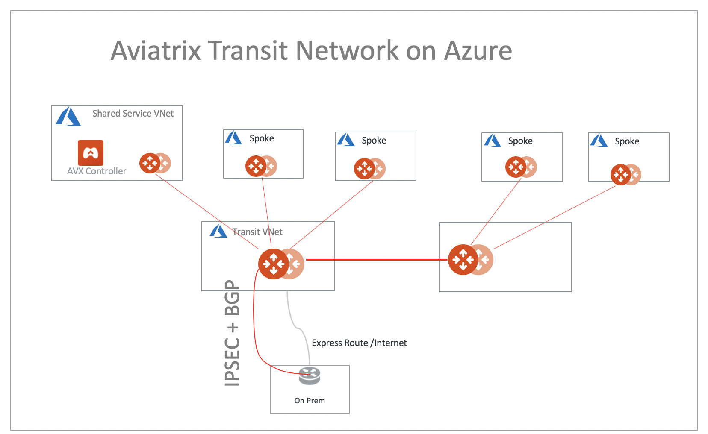
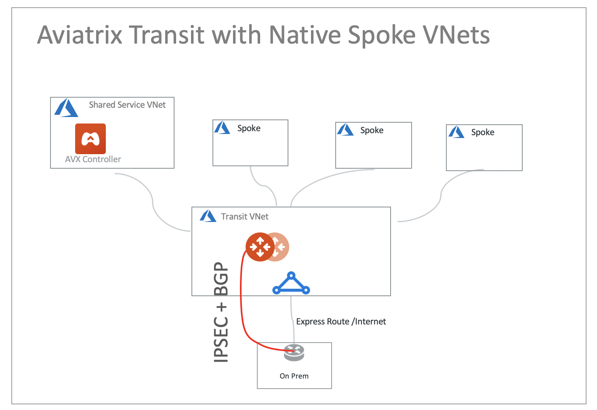
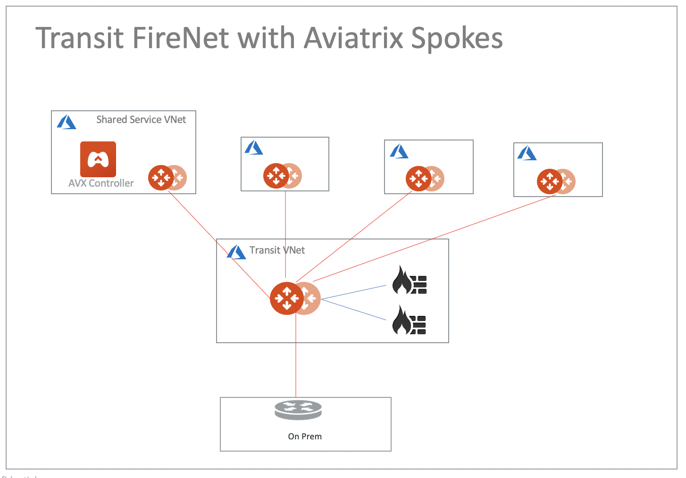
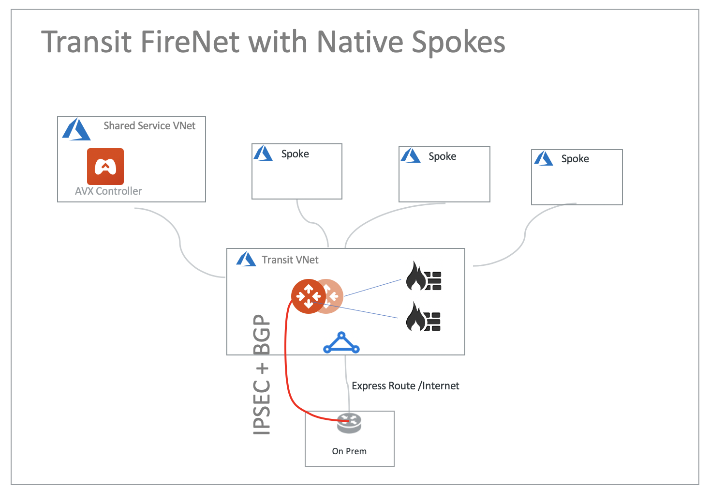
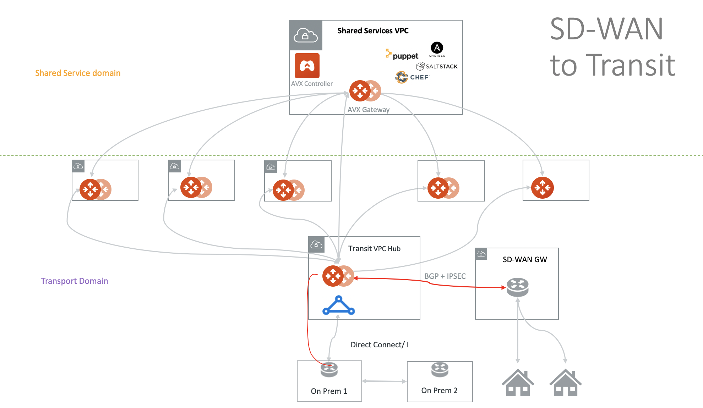

=======================================
Azure Transit Network Design Patterns
=======================================

There are many design patterns for networking and networking security deployment in the cloud. 
This document summarizes these design patterns that apply to Azure networks. 

Aviatrix Encrypted Transit Network 
-------------------------------------

In this design, all packets in flight between Spoke VNets and Transit to on-prem are encrypted. 
 
|aviatrix_transit_azure|

.. Tip::

  Aviatrix Transit supports high performance (Insane Mode) IPsec performance over ExpressRotue and Azure Peering.

Aviatrix Transit with Native Spokes
--------------------------------------

Aviatrix Transit also supports Azure native Spoke VNets. 

|aviatrix_transit_native_spoke|

Transit FireNet with Aviatrix Spokes
------------------------------------

You can apply firewall inspections for east-west, north-south and ingress/egress traffic.

|transit_firenet_aviatrix_spokes|

Transit FireNet with Native Spokes
-------------------------------------------

Firewall inspections can be applied to native Spoke VNet, on-prem to transit and north-south traffic. 

|transit_firenet_native_spokes|

Please refer to `Transit FireNet Workflow for Azure Native Spoke VNets <https://docs.aviatrix.com/HowTos/transit_firenet_azure_native_spokes_workflow.html>`_ for more details.

SD-WAN Integration
--------------------

If you have multiple sites to connect to the cloud, you can use an Aviatrix Transit Gateway to terminate the many site2cloud to branch offices.

Alternatively, you can use a SD-WAN termination point in the VNets to connect to the branches.

Both options can be described in the diagram below.

|transit_sdwan|

Aviatrix Transit Gateway for Azure Spoke-to-Spoke Connectivity
---------------------------------------------------------------

If you use Azure ExpressRoute gateway to connect Spoke VNets to on-prem, you can use Aviatrix Transit Gateway for Spoke-to-Spoke connectivity, 
as shown in the diagram below. To connect Spoke VNet, follow the `Step 6b in the Multi-Cloud Transit Network workflow <https://docs.aviatrix.com/HowTos/transitvpc_workflow.html#b-attach-azure-arm-spoke-vnet-via-native-peering>`_.

|transit_azure_native_spoke|

Multi-Cloud Transit with Native Spokes
------------------------------------------------

Use Aviatrix Transit Gateways to interconnect transit network for a multi cloud network deployment, as shown in the diagram below. 

|multi_cloud_transit_native|

.. |transit_azure_native_spoke| image:: transitvpc_designs_media/transit_azure_native_spoke.png
   :scale: 30%

.. |multi_cloud_transit_native| image:: transitvpc_designs_media/multi_cloud_transit_native.png
   :scale: 30%

.. |transit_firenet| image:: transit_firenet_media/transit_firenet.png
   :scale: 30%

.. |transit_firenet_aviatrix_egress| image:: transit_firenet_media/transit_firenet_aviatrix_egress.png
   :scale: 30%

.. disqus::
