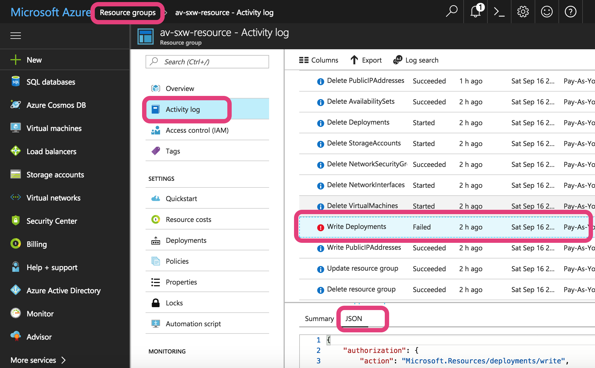

####################################################
How to Troubleshoot Azure RM Gateway Launch Failure
####################################################

Before you launch an Aviatrix gateway in Azure RM, you must first subscribe to the Aviatrix Companion Gateway in Azure marketplace. 

To check if you have done so, follow these steps.
  1. Log in to Azure Portal.
  #. Click More Services.
  #. Click Subscriptions.
  #. Click the subscription in which you wish to launch an Aviatrix gateway.
  #. Under Settings, click Programmatic deployment.
  #. You should see that the Aviatrix companion gateway is in the "Enable" state. 
  #. If the Aviatrix companion gateway is in a Disabled state, click to enable. 
  #. If you do not see an Aviatrix companion gateway at all, follow `these instructions <http://docs.aviatrix.com/HowTos/CompanionGateway.html>`_

When the Aviatrix Controller fails to launch a gateway, there is a toaster error message 
on the Controller console. If this message does not help you understand the root cause, 
take the following
steps to further troubleshoot.

1. Disable Rollback Function
-----------------------------
Typically, when a gateway launch fails, the Controller rolls back all resources including the ones allocated from Azure. In this case, disable the rollback function. 
Go to Troubleshoot -> Diagnostics -> KEEP GATEWAY ON ERROR. Enable it to make it True. Note this rollback only applies to the next gateway launch. Each time when you need to disable the rollback of gateway creation, you need to turn on this option. 

2. Launch the Gateway and Observe Failure
------------------------------------------
From the Controller console, launch the gateway again and observe the failure. 

3. Check on Azure Portal Activity Log
---------------------------------------
  1. Login in to Azure Portal. 
  #. Click More Services. 
  #. Click Resource Groups. 
  #. Click the resource group created by Aviatrix Controller. The resource group should have a prefix "av-". Click Activity Log. 
  #. Click the error message in red color.  
  #. The specific error message should have a Summary tab and a JSON tab. 
  #. Click the JSON tab to examine the detailed error message, as shown below:

|image0| 

4. Get Help from Aviatrix Support
---------------------------------
If you still cannot figure out the problem, please open a support ticket at `Aviatrix Support Portal <https://support.aviatrix.com>`_ to get help.

.. disqus::
