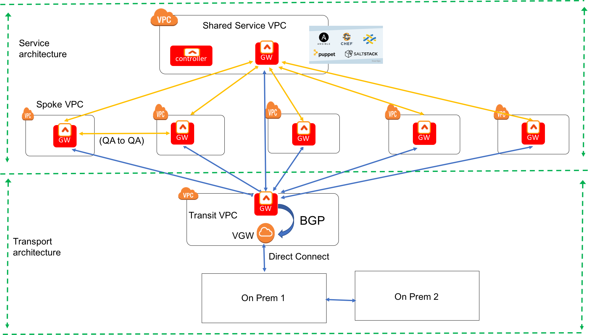
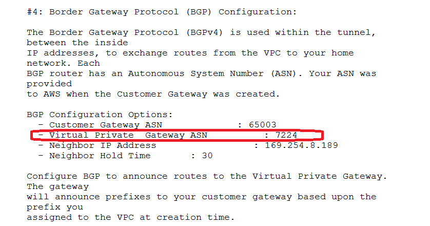
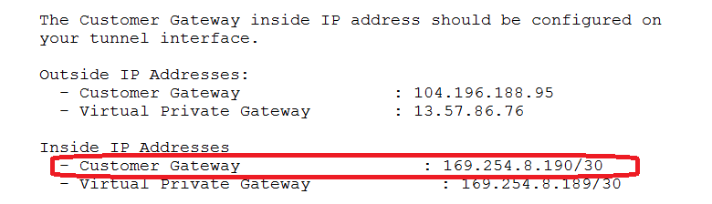
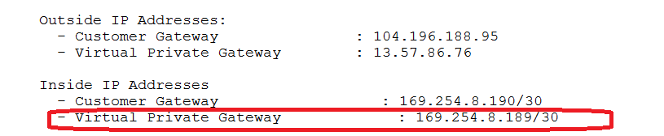
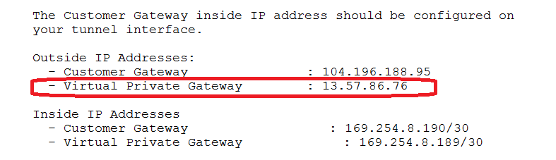
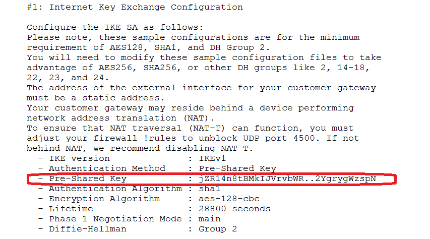

.. meta::
   :description: BGP, transitive peering, Peering
   :keywords: BGP, transitive peering, Aviatrix inter region peering, inter cloud peering

##############################################
Transit Network with BGP Setup Instructions 
##############################################

.. Important:: 

  This document is obsolete for release 3.1 and later releases. Follow `Transit Network workflow instructions <http://docs.aviatrix.com/HowTos/transitvpc_workflow.html>`__ to setup a Transit Network. 

Introduction
=============

`Aviatrix Services Architecture <http://aviatrix.com/blog/architectural-evolution-networking-public-cloud/>`_ builds automated and scalable network architecture for the cloud,
as shown in the diagram below. Key characteristics in this architecture:

 - Spoke VPC to Spoke VPC networking is direct without going through the Transit VPC and is orchestrated by the central controller. Spoke VPCs do not run BGP protocol.
 - BGP runs between the gateway in the Transit VPC and AWS VGW to facilitate communication between Spoke VPC and on-prem. The idea is you need to configure on-prem connectivity to VGW once and there is no need again when new Spoke VPC is stood up.

|image0|

This guide provides instructions on how to enable BGP for a Transit VPC solution.
Aviatrix gateway deployed in Transit VPC exchanges routes with a VGW that connects to on-prem by Direct Connect or Internet. Review the `Best Practice section <http://docs.aviatrix.com/HowTos/bgp_transitive_instructions.html#best-practice>`_ before you proceed. 

Deployment Steps
=================

1. Establish BGP between Aviatrix Gateway and VGW in Transit VPC
-------------------------------------------------------------------

This step launches an Aviatrix gateway in Transit VPC and builds a IPSEC connection to VGW with BGP enabled. 

a. At AWS Console create a VGW (the VGW is not attached to a VPC) which we will  use to connect to on-prem over Direct Connect or Internet. For information on how to connect a VGW to Direct Connect, follow `the steps <http://docs.aws.amazon.com/directconnect/latest/UserGuide/create-vif.html>`_ for details. For IPSEC configuration, refer to `this doc <http://docs.aws.amazon.com/AmazonVPC/latest/UserGuide/VPC_VPN.html>`__ for IPSEC over Internet configuration guide.

#. From Aviatrix Controller console, launch an Aviatrix Gateway in the Transit VPC. This Aviatrix Gateway in the Transit VPC is the Customer Gateway (CGW) from VGW point of view. 

#. At AWS Console, create Customer Gateway (CGW) in Transit VPC with the following configuration:

   - Routing: Dynamic

   - IP Address: Public IP of Aviatrix Gateway in Transit VPC.

#. At AWS Console create AWS VPN Connection in Transit VPC with the following configuration:

   - Virtual Private Gateway: VGW in Transit VPC

   - Customer Gateway: CGW created above

   - Routing Options: Dynamic (requires BGP)

#. At AWS Console, download configuration template from AWS VPN Connection for "Generic" vendor (Referred as 'Configuration Template' below) .

#. At AWS Console, detach VGW from Transit VPC (if it was attached).

#. At Aviatrix Controller console, create Site2Cloud tunnel on Aviatrix Gateway to work with AWS VGW with the following configuration:

   - VPC ID/VNet Name: Transit VPC ID

   - Connection Type: Unmapped

   - Connection Name: Any name

   - Remote Gateway Type: AWS VGW

   - Tunnel Type: UDP

   - Algorithms: Deselected

   - Encryption over ExpressRoute/DirectConnect: Deselected

   - BGP: Selected

   - Remote AS Number: "IPSec Tunnel #1"->"Border Gateway Protocol (BGP) Configuration"->"Virtual Private Gateway ASN" from 'Configuration Template'

   |image1|

   - CGW Inside IP Address: "IPSec Tunnel #1"->"Tunnel Interface Configuration"->"Inside IP Addresses"->"Customer Gateway" from 'Configuration Template'

   |image2|

   - VGW Inside IP Address: "IPSec Tunnel #1"->"Tunnel Interface Configuration"->"Inside IP Addresses"->"Virtual Private Gateway" from 'Configuration Template'

   |image3|

   - Advertise Network: Transit VPC CIDR

   - Enable HA: Deselected

   - Primary Cloud Gateway: Aviatrix Gateway in Transit VPC

   - Remote Gateway IP Address: "IPSec Tunnel #1"->"Tunnel Interface Configuration"->"Outside IP Addresses"->"Virtual Private Gateway" from 'Configuration Template'

   |image4|

   - Pre-shared Key: "IPSec Tunnel #1"->"Internet Key Exchange Configuration"->"Pre-Shared Key" from 'Configuration Template'

   |image5|

#. At Aviatrix Controller console, Advanced Config -> BGP:

   - Edit "Local AS Num" if required

   - Enable "BGP"

#. At Aviatrix Controller's Site2Cloud page:

   - Make sure site2cloud tunnel is up and working

   - View “Remote Subnet”, this is on-prem network obtained through route exchange between.

2. Connect Spoke VPC to on-prem
---------------------------------

a. At Aviatrix Controller console, launch an Aviatrix Gateway in a spoke VPC.

#. At Controller console, Peering -> Encrypted Peering, create peering between Aviatrix Gateways at spoke VPC and Transit VPC.

#. At Controller console, Peering -> Transitive Peering, create transitive peering from spoke VPC to on-prem via Transit VPC. Transitive Peering configuration:i

   - Source Gateway: Spoke VPC Gateway

   - Nexthop Gateway: Transit VPC Gateway

   - Destination CIDR: on-prem network displayed at Site2Cloud -> "Remote Subnet"

#. At Controller's Site2Cloud page, select the Site2Cloud connection created above by Aviatrix gateway at Transit VPC with BGP. At "BGP Advertised Networks" field, append Spoke VPC's CIDR to the list.

#. Repeat the above section for each Spoke VPC connected to Transit VPC.

Building HA Transport Links
===========================

There are multiple patterns to build HA in the transport link. AWS VGW can be used to
create two Direct Connect links, two IPSEC over Internet links and one Direct Connect and
one IPSEC over Internet links. Refer to `this doc <https://aws.amazon.com/answers/networking/aws-multiple-data-center-ha-network-connectivity/>`__ for details.

Best Practice 
===============

- **Plan your cloud address space** when designing a Transit VPC network. Best practice is to allocate a network address space from which the spoke VPC CIDRs are created.  Make sure this network address space is unique and not overlapping with any on-prem network.  For example, allocate 172.34.0.0/16 as your cloud address space. The spoke VPC CIDRs would be 172.34.1.0/24, 172.34.2.0/24, etc.  With this approach, you just need advertise one prefix 172.34.0.0/16 once.  When a new spoke VPC come up, you do not need to modify advertise network at the site2cloud page. 

- **Edit BGP Advertise Network** after BGP has learned the on-prem network prefixes. When creating the Site2Cloud connection, leave the "Advertised Networks" blank. After Site2Cloud connection is created, go to Advanced Config to enable BGP. Go back to Site2Cloud connection, if you see list of subnets under Remote Subnet, it implies BGP has come up. At this point, click the connection to Edit BGP Advertised Networks. Enter the entire cloud address space as suggested above. This approach helps you see the list of the on-prem network prefixes to make sure you do not enter overlapping addresses.  

BGP Troubleshooting
===================

Aviatrix BGP is implemented based on Quagga open source software. You can get debugging
information at Controller console. Advanced Config -> BGP -> Diagnostic.

Release 3.0 Limitations
========================

You need to edit each Spoke VPC Transitive Peering settings when on-prem network is changed. The changed network can be viewed from the Controller Advanced -> BGP page.

.. disqus::
