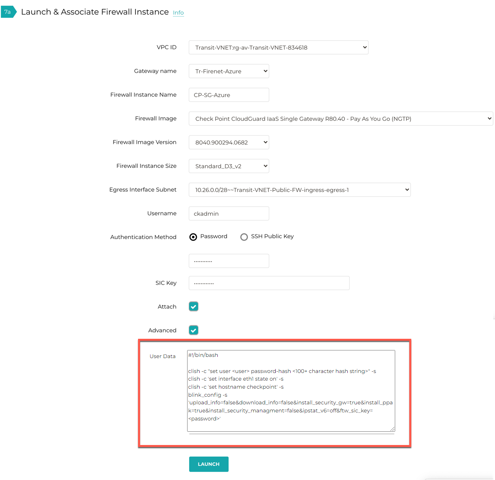

.. meta::
  :description: Firewall Network
  :keywords: Azure Transit Gateway, Aviatrix Transit network, Transit DMZ, Egress, Firewall, Bootstrap, Check Point, Security Gateway

===============================================================================
Bootstrap Configuration Example for Check Point Security Gateway in AWS/Azure
===============================================================================

This document applies to both AWS and Azure

Using bootstrap option significantly simplifies Check Point Security Gateway initial configuration setup.

In this document, we provide a basic bootstrap example for Check Point. Bootstrap Configuration can be a vendor specific script or configuration.

For a manual setup, follow `manual setup example. <https://docs.aviatrix.com/HowTos/config_CheckPointAzure.html>`_

Configure Check Point Security Gateway using Custom Data
---------------------------------------------------------

Follow the Aviatrix Firewall Network (FireNet) workflow
to `Step 7a. <https://docs.aviatrix.com/HowTos/firewall_network_workflow.html#a-launch-and-associate-firewall-instance>`_. to launch the firewall instance.

Go to Aviatrix Controller's console -> Firewall Network  -> Step -> Step 7a Launch & Associate Firewall Instance

Fill in the required fields. Click Advanced. Fill in the following parameters.

================================  ======================
**Advanced Field**                **Example Value**
================================  ======================
User Data                          Bootstrap Configuration
================================  ======================

Sample Fortigate Bootstrap Configuration to configure firewall "Allow-all" policy, health check policy and RFC 1918 static routes is shown below:

    ::

        #!/bin/bash

        clish -c "set user admin password-hash \$6\$d76f84f720ece349\$GJp4So2HJtbivPgoF3WXXjvzzoUUwA3KbS14N3epYimRYMGILKLKobCMrH7KLeGzepIDpm1GB7z2wBhygtJZM0" -s
        clish -c 'set interface eth1 state on' -s
        clish -c 'set hostname checkpoint' -s
        blink_config -s 'upload_info=false&download_info=false&install_security_gw=true&install_ppak=true&install_security_managment=false&ipstat_v6=off&ftw_sic_key=Aviatrix123#'

|cp_bootstrap_example|

Launch the instance. Wait for 15 minutes for it to boot up and initialize.

Login to the HTTPS interface of the public IP with username "admin", password "Aviatrix123#"

Ready to go!
----------------

Now your firewall instance is ready to receive packets!

Next step is to validate your configurations in the Check Point Security Gateway, and configure polices for Ingress and Egress inspection.

By default, all traffic is allowed in Check Point that can be verfied by launching one instance in PROD Spoke VNET and DEV Spoke VNET. Start ping packets from a instance in DEV Spoke VNET to the private IP of another instance in PROD Spoke VNET. The ICMP traffic should go through the Check Point and be inspected in Security Gateway.

Additional References
--------------------------

Check Point Reference `Custom Data <https://supportcenter.checkpoint.com/supportcenter/portal?eventSubmit_doGoviewsolutiondetails=&solutionid=sk105242&partition=General&product=vSEC>`_

.. disqus::
