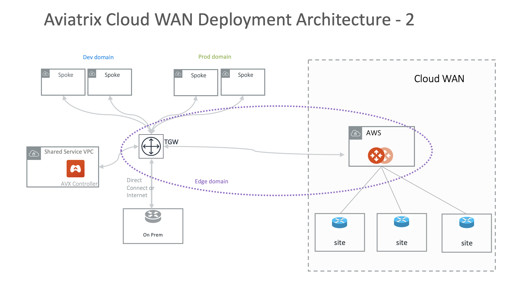

.. meta::
  :description: CloudWAN FAQ
  :keywords: SD-WAN, Cisco IOS, Transit Gateway, AWS Transit Gateway, AWS TGW, TGW orchestrator, Aviatrix Transit network

============================================================
Aviatrix CloudWAN FAQ
============================================================

What is the Aviatrix CloudWAN?
---------------------------------------

Aviatrix CloudWAN is a feature where Aviatrix Controller manages and help connect on-prem Cisco IOS Routers to the cloud directly. 

CloudWAN can be used to fulfill the following tasks. 

 1. Manage multiple Cisco IOS Routers from the Aviatrix Controller. This includes uploading and viewing the IOS configuration, making configuration changes and monitoring the health and stats of these routers. 
 #. Auto connect Cisco IOS routers to the Aviatrix Transit Gateway or AWS TGW with IPSEC VPN over the Internet, thus allowing them to be part of the Transit Network where they gain connectivity to Spoke VPCs. 

What are the CloudWAN deployment architectures?
--------------------------------------------------

There are three ways to deploy CloudWAN. 

CloudWAN Deployment 1
^^^^^^^^^^^^^^^^^^^^^^^^^

CloudWAN can be deployed to connect with Aviatrix Transit Network as shown below

|cloud_wan_1|

CloudWAN Deployment 2
^^^^^^^^^^^^^^^^^^^^^^^^^

Alternatively you can deploy CloudWAN as an attachment to TGW where the Aviatrix Transit Gateway functions as edge to the TGW. 

|cloud_wan_2|

CloudWAN Deployment 3
^^^^^^^^^^^^^^^^^^^^^^^^^

In this deployment IPsec tunnels are built directly to TGW VPN.

|cloud_wan_3|

What are the benefits of CloudWAN?
-----------------------------------------

 - **No Friction** Leverage what you have already invested in the on-prem edge router for connecting to the cloud. 
 - **Shortest Latency** Leverage AWS Global Accelerator to connect your on-prem routers to the nearest AWS edge and route through the AWS backbone with the optimal path. 
 - **Automation** Avoid human errors and the complexity of VPN configuration when building VPN connections to the cloud. 
 - **Centrally Managed** Use the single pane of glass to both provision and monitor router health and stats. 

How does CloudWAN work?
--------------------------

CloudWAN leverages AWS Global Accelerator and the AWS backbone for the shortest latency path to the cloud. 

|global_accelerator|

For example, if the application is in us-west-2 and you have a branch office in Singapore country. If you built an IPSEC tunnel to the 
gateway in us-west-2 without deploying CloudWAN, the traffic initiated from Singapore typically traverse through many ISP carriers and eventually
to AWS us-west-2. On the other hand, with CloudWAN, traffic from Singapore gets to the first ISP, hops onto the AWS edge in the area and 
moves through the uncongested AWS backbone to us-west-2. Both latency and jitter should be minimal. 

Can I use CloudWAN just to manage the Cisco routers?
------------------------------------------------------

Yes. You can use CloudWAN for making changes to the routers from a central place, even if you are not ready to connect 
the on-prem routers to the cloud. 

What are the use cases for CloudWAN?
--------------------------------------

CloudWAN can be used to connect branch routers to the cloud directly. It can also be used to manage routers you deploy in the branch or partner network where you have full access. 

Can CloudWAN manage other vendor devices?
---------------------------------------------

No. Currently CloudWAN only manages Cisco IOS routers. 

How many routers can CloudWAN manage?
---------------------------------------

If the on-prem router terminates with Aviatrix Transit Gateway, there is no limitation on how many routers can be connected. 

What are the requirements to deploy CloudWAN?
-------------------------------------------------

Each managed Cisco router needs Internet access and a public IP address. 

What routing protocols are supported on CloudWAN?
----------------------------------------------------

CloudWAN supports BGP and static routing. 

Can CloudWAN support branch to branch communications?
---------------------------------------------------------

When BGP is enabled on the branch router, CloudWAN can route traffic between branches. 

How to configure CloudWAN?
-----------------------------

Follow the `CloudWAN workflow to get started. <https://docs.aviatrix.com/HowTos/cloud_wan_workflow.html>`_. 

How should I secure my IOS router?
--------------------------------------

When a router is attached, an ACL rule to permit TCP port 22 access from the Aviatrix Controller. 
 
What Cisco routers are supported?
-----------------------------------

Cisco routers that run IOS Classic and IOS XE are supported. For example, ISR G2, ASR and ISR G3. 

.. |cloud_wan_1| image:: cloud_wan_faq_media/cloud_wan_1.png
   :scale: 30%

.. |domain_policy_diagram| image:: tgw_overview_media/domain_policy_diagram.png
   :scale: 30%

.. |tgw_view| image:: tgw_overview_media/tgw_view.png
   :scale: 30%

.. |tgw_transit_vpc_compare| image:: tgw_overview_media/tgw_transit_vpc_compare.png
   :scale: 30%

.. |tgw_transit_orchestrator_compare| image:: tgw_overview_media/tgw_transit_orchestrator_compare.png
   :scale: 30%

.. disqus::
