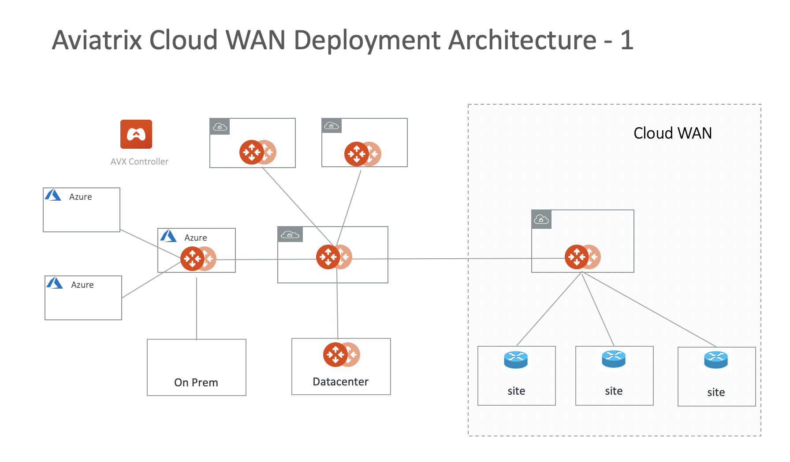
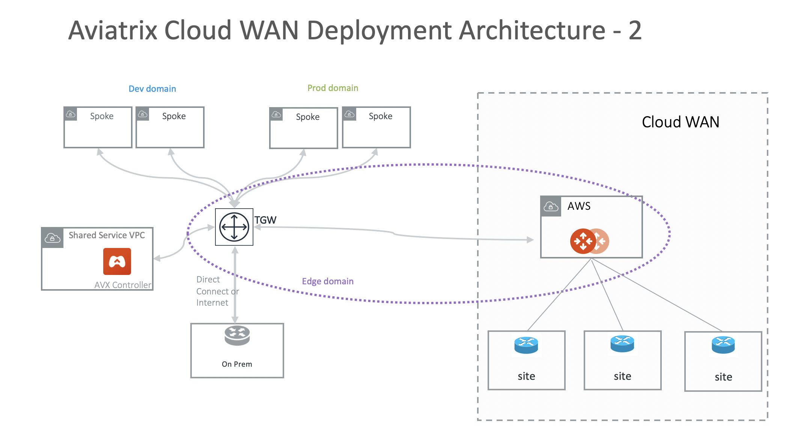

.. meta::
  :description: CloudWAN Workflow
  :keywords: SD-WAN, Cisco IOS, Transit Gateway, AWS Transit Gateway, AWS TGW, TGW orchestrator, Aviatrix Transit network

============================================================
Aviatrix CloudWAN Workflow
============================================================

.. important::

  This feature has been **deprecated** from release 6.8.1148. Instead, use Aviatrix Edge to attach on-prem hardware to the cloud.

Registering a Branch Router
---------------------------------------

Register a branch router to the Controller so the Controller can access its configuration, make changes to it, and 
monitor its health and statistics. 

Connecting to the Controller
--------------------------------------------------

After a branch router is registered, the Controller connects to its publicly accessible interface of the branch router to retrieve its configuration. 

Preparing to Attach
----------------------------

This step retrieves the IOS router configuration and let user select the network interfaces. 

In the dropdown menu, select the branch device. Click **Upload Config**. After the configuration is uploaded, the dropdown menu should the list of interfaces. Select one and click **Save**. 

Attaching Branch to Cloud
-----------------------------------------

This step has 3 options. 
It creates an IPsec tunnel between the IOS router and the Aviatrix Transit Gateway, between the IOS router and TGW VPN or IOS router and Azure vWAN. 

Option 1: Attaching to an Aviatrix Transit Gateway
^^^^^^^^^^^^^^^^^^^^^^^^^^^^^^^^^^^^^^^^^^^^^^^^^^

If you connect the branch router to an Aviatrix Transit Gateway, refer to the following fields to attach the branch router. 

=========================================              ==========================
Input Field                                            Value
=========================================              ==========================
Branch                                                 A registered branch router.
Aviatrix Transit Gateway                               An Aviatrix Transit Gateway in AWS. (Other cloud types not supported)
Connection Name                                        A unique name for the connection.
BGP                                                    Select BGP if BGP is the protocol between branch and Aviatrix Transit Gateway.
Aviatrix Transit Gateway BGP ASN                       If BGP is selected, enter the BGP ASN number for the Aviatrix Transit Gateway.
Branch Router's BGP ASN                                If BGP is selected, enter BGP ASN number on the branch router.
Remote Subnet(s)                                       If Static is selected, enter the on-prem subnet CIDRs that have connectivity with cloud VPCs. 
Algorithm                                              Default is unchecked. Leave it unchecked. 
Enable Global Accelerator                              Check the box to enable AWS Global Accelerator for the branch router to hop onto the nearest AWS edge and traverse the AWS backbone to get to the Aviatrix Transit Gateway.
Enable Branch Router HA                                Check the box if there is a second interface with public IP address to build a redundant IPSEC tunnel. 
Pre-shared Key                                         Optional parameter. Leave it unchecked.
Local Tunnel IP                                        Optional parameter. Leave it unchecked. 
Remote Tunnel IP                                       Optional parameter. Leave it unchecked. 
=========================================              ==========================

Option 2: Attaching to TGW VPN
^^^^^^^^^^^^^^^^^^^^^^^^^^^^^^

To connect a branch router to TGW VPN, refer to the following fields to attach the branch router.

=========================================              ==========================
Input Field                                            Value
=========================================              ==========================
Branch                                                 A registered branch router.
AWS Transit Gateway                                    An AWS Transit Gateway.
Connection Name                                        A unique name for the connection.
Branch Router's BGP ASN                                Only BGP is supported. Enter BGP ASN number on the branch router.
Algorithm                                              Default is unchecked. Leave it unchecked.
Security Domain Name                                   An Aviatrix TGW Orchestrator Security Domain
Enable Global Accelerator                              Check the box to enable AWS Global Accelerator for the branch router to hop onto the nearest AWS edge and traverse the AWS backbone to get to the AWS TGW.
=========================================              ==========================

Option 3: Attaching to Azure vWAN
^^^^^^^^^^^^^^^^^^^^^^^^^^^^^^^^^

To connect a branch router to Azure vWAN, select Azure Virtual WAN. For a detailed example, refer to `CloudWAN on Azure vWAN Configuration Example <https://docs.aviatrix.com/HowTos/cloud_wan_workflow_azure_vwan.html>`_.

=========================================              ==========================
Input Field                                            Value
=========================================              ==========================
Branch                                                 A registered branch router.
Azure Virtual WAN                                      Azure vWAN option
Access Account Name                                    The Access Account for Azure subscription 
Resource Group                                         The resource group on Azure
Hub Name                                               Azure vWAN Hub created on Azure portal
Connection Name                                        A unique name for the connection.
Branch Router's BGP ASN                                Only BGP is supported. Enter BGP ASN number on the branch router.
=========================================              ==========================

List/Edit
------------

This page allows you to do manual edit of an registered or connected IOS router. 

Highlight a branch device and click **Edit**. Two panels should come up. On the left side is the latest IOS 
router configuration. Click **Show Previous Commit Diff** to highlight the diffs in configuration. 

On the right side of the panel, you can enter IOS commands to make changes. For example, to change the router name, 
enter the following commands and click **Commit**. 

::

  hostname myrouter

Saving & Restoring Config
------------------------------------

For each branch router under management, multiple copies of IOS configuration can be saved on the Aviatrix Controller. 
Go to CloudWAN > List/Edit page, select one branch router under management, click the 3 dots skewer, select **Save Config**. 
Enter the Configuration Name and optional description. 

Saved Configurations can be applied to a branch router via "Restore A Configuration". 
Go to CloudWAN > List/Edit page, select one branch router, click the 3 dots skewer, and click **Save Config**. 
On the Restore a Configuration page, select a saved configuration and click **Restore**. The action will trigger a commit of 
saved IOS configuration to the router. Click **Show Config** to view the saved configuration. 

AWS Network Manager Integration
-------------------------------------------------------

Aviatrix CloudWAN can be integrated with AWS Network Manager for visualization. Follow the steps below to:

 - Create a Global Network
 - Register AWS Transit Gateway
 - Register Branch Device

Configuration Tags
----------------------------

Aviatrix CloudWAN automatically programs CLIs required to connect to Aviatrix Transit Gateway or TGW VPN. 
There are times when you need to add additional CLIs to the routers. Configuration Tags provide a way to 
manage these additional CLIs in a scalable way. 

A tag contains a block of CLI commands. 
A tag can be attached to one or more branch routers. When Commit a tag, CLIs commands in the
tag is committed to the routers attached to the tag. 

Creating a Tag
--------------------------

Provide a unique name to a new tag. For example, name the tag tier1-branches.

Editing a Tag
----------------------

For a given tag, enter CLI commands exactly the way it should be programmed. 

Attaching to Branch Routers
----------------------------------------

Select branch routers to be part of Include or Exclude list to a given tag. 

Committing a Tag to Branch Router
--------------------------------------------

Select a tag, click **Commit**. The CLIs in the tag are committed to the branch routers attached to the tag. 

.. disqus::
