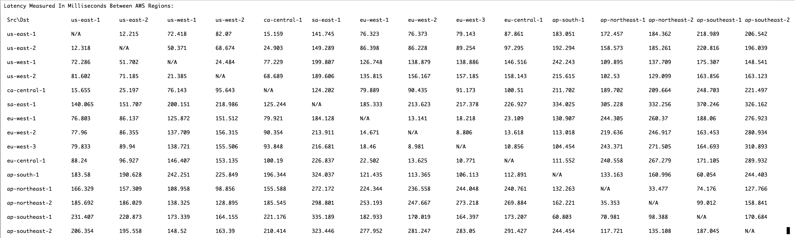

.. meta::
   :description: How to use AWS CloudFormation Conditions
   :keywords: CloudFormation, Conditions, Fn::Or, Fn::Equals, Aviatrix, AWS

===========================================================================================
CloudFormation Condition Function Example
===========================================================================================

AWS CloudFormation is a popular tool to automate AWS resource management. There are situations
when you need to create a resource or specify a property based on the value of input parameters. 
You may use `Condition Functions <https://docs.aws.amazon.com/AWSCloudFormation/latest/UserGuide/intrinsic-function-reference-conditions.html>`_ to address such types of requirements. 

Here is an example of how to use Conditions in a CloudFormation script. 

In this example, we want to specify "unlimited", a CPU credit property that only applies to t2/t3 
series instances when a user selects such instance type. If the user input is not t2 series, for example, m4 series, the CPU credit property cannot be specified as it does not exist. 

The code to define a condition that tests if the input parameter is t2.large, t2.xlarge, or 
t2.2xlarge is as follows.

:: 

   "Conditions": {
        "AviatrixIAMRoleNotExist": {
            "Fn::Equals": [
                {
                    "Ref": "IAMRoleParam"
                },
                "New"
            ]
        },
        "T2SeriesTrue": {
            "Fn::Or": [
                 {"Fn::Equals" : [{"Ref" : "InstanceTypeParam"}, "t2.large"]},
                 {"Fn::Equals" : [{"Ref" : "InstanceTypeParam"}, "t2.xlarge"]},
                 {"Fn::Equals" : [{"Ref" : "InstanceTypeParam"}, "t2.2xlarge"]}

            ]
        }
    }, 

Where T2SeriesTrue is the condition to test out if input parameter InstanceTypeParam is one 
of the t2 series. Note "Fn::Or" is used to allow multiple choices, if any of them is "True", the 
condition returns "True". 

The code to use the condition to specify the CPU Credit type is as follows:

:: 
  
      "CreditSpecification": {
          "Fn::If" : [
              "T2SeriesTrue", 
              {"CPUCredits": "unlimited"},
              {"Ref": "AWS::NoValue"}
          ]
      }

where if condition T2SeriesTrue is "True", CPUCredits will be set to "unlimited", otherwise
it is not specified. 

To view the entire CloudFormation script that is used to launch the Aviatrix Controller, 
visit the `repo on github. <https://github.com/AviatrixSystems/aws-controller-launch-cloudformation-templates/blob/master/cloudformation-templates/avx-awsmp-BYOL.template>`_

   

.. disqus::    
