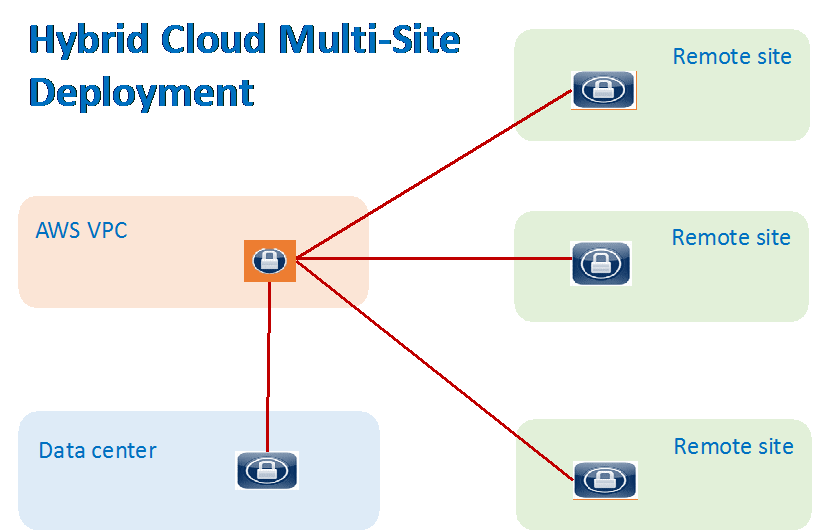

.. meta::
   :description: CloudN for Site 2 Cloud
   :keywords: Site2cloud, site to cloud, aviatrix, ipsec vpn, tunnel

==============================
CloudN for Site2Cloud 
==============================

CloudN can be deployed on-prem as a virtual router. 
This guide helps you to configure Site2Cloud IPsec tunnels on CloudN that connect to an Aviatrix Gateway in an AWS VPC, Azure VNet, or Google Cloud VPC. 
(CloudN can also connect to any third-party router or 
firewall for IPsec tunnel).    

|image8|

Configuration Workflow
======================

Before you start, make sure you have the latest software by checking the
Dashboard. If an alert message is displayed, click Upgrade to download the
latest software.

The Site2Cloud on CloudN configuration workflow is very simple.  

1. If the remote cloud gateway is an Aviatrix gateway, you should already have
   a configuration text file for this connection. If you need help getting 
   file, check out `this link. <http://docs.aviatrix.com/HowTos/site2cloud.html>`_ 

     a. Click Site2Cloud on the left navigation panel, and then click **+Add New**. 
     #. Click **Import** (located at the right corner of the page).
     #. Click **OK**. You are done. 
     #. Refresh the screen, the tunnel should be up. 
     #. Add a static route on the default gateway where CloudN is deployed to point to CloudN as the next hop to reach the remote site. 

#. If the remote side is NOT an Aviatrix gateway:

     a. Click Site2Cloud > **+Add New**.
     #. Enter a Connection Name. For example: store1-to-cloud.
     #. At Remote Gateway IP Address, fill in the public IP address of the 
        remote gateway. For example, 54.12.1.4
     #. Enter the Pre-shared Key.
     #. Enter Remote Subnet CIDR blocks. For example, 10.2.2.0/24
     #. Enter Local Subnet CIDR blocks. For example, 192.168.1.0/24
     #. Click **OK**. 
     #. Add a static route on the default gateway where CloudN is deployed to point to CloudN as the next hop to reach the remote site. 

Troubleshooting
===============

To check a tunnel state, go to Site2Cloud. The tunnel status will be
displayed in a popup window.

To troubleshoot a tunnel state, go to Site2Cloud > Diagnostics.

.. disqus::
