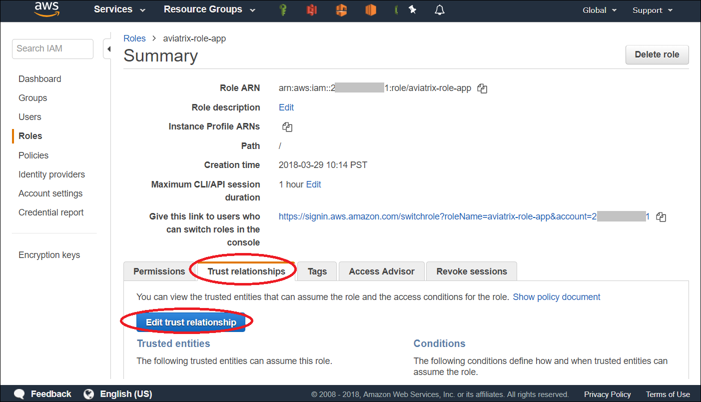
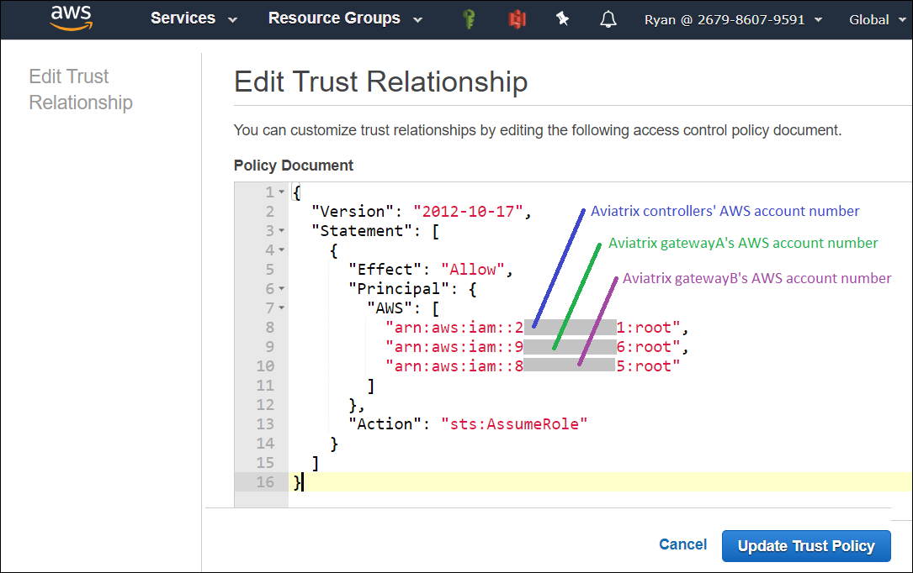
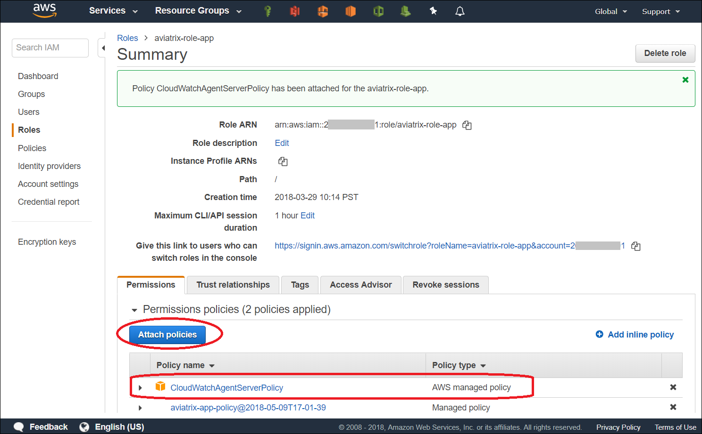
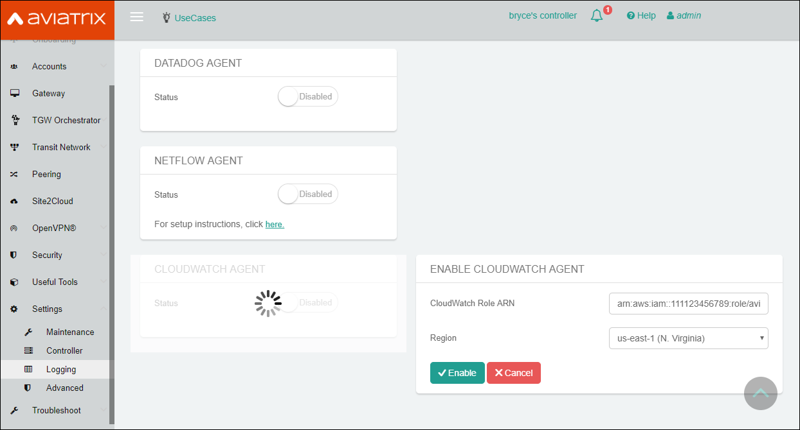
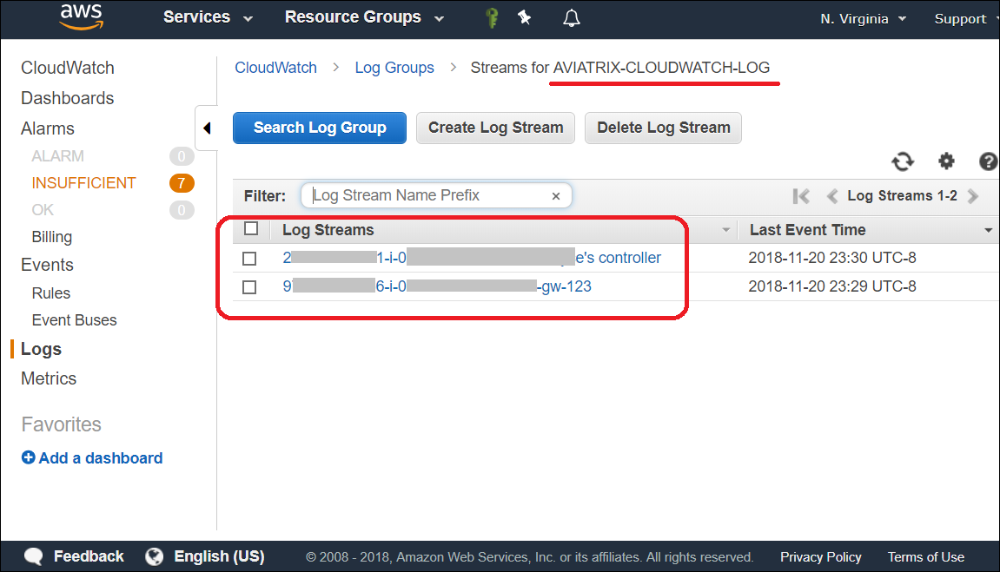
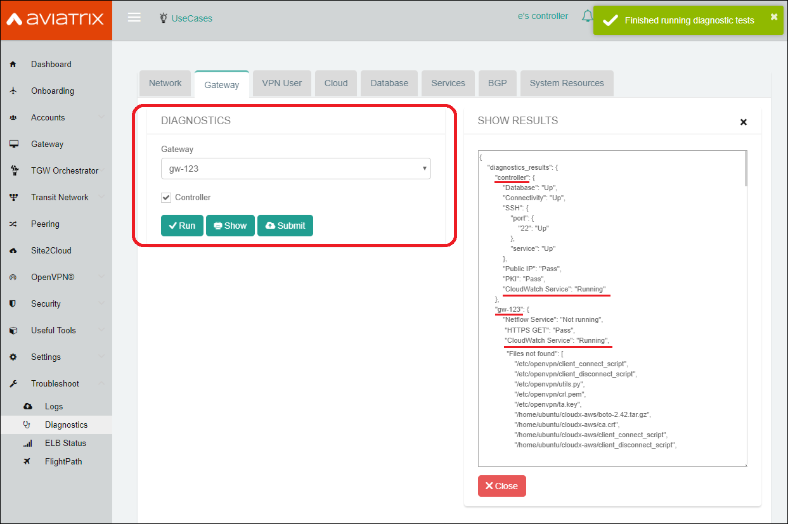

.. meta::
   :description: AWS CloudWatch integration
   :keywords: Logging, CloudWatch

=================================
 AWS CloudWatch Integration 
=================================

Starting in release 4.0, Aviatrix Controller and gateway syslog can be exported to AWS `CloudWatch <https://aws.amazon.com/cloudwatch/features/>`_ Logs.

Prerequisites on CloudWatch IAM role:
--------------------------------------

Aviatrix CloudWatch integration assumes 

1. The AWS account where the logs will be stored must have the following IAM policy configured. 
enabled, and it must have built a IAM trust relationship with all the AWS accounts of the Aviatrix Controller 
and gateways. 

In addition all AWS accounts of the Aviatrix Controller and gateways 

1. Add CloudWatchAgentServer policy:

         {
            "Effect": "Allow",
            "Action": [
                "cloudwatch:PutMetricData",
                "ec2:DescribeTags",
                "logs:PutLogEvents",
                "logs:DescribeLogStreams",
                "logs:DescribeLogGroups",
                "logs:CreateLogStream",
                "logs:CreateLogGroup"
            ],
            "Resource": "*"
        },
        {
            "Effect": "Allow",
            "Action": [
                "ssm:GetParameter"
            ],
            "Resource": "arn:aws:ssm:*:*:parameter/AmazonCloudWatch-*"
        }

2. Edit Trust Relationship to monitoring Aviatrix Controller and gateway accounts:
        {
          "Version": "2012-10-17",
          "Statement": [
            {
              "Effect": "Allow",
              "Principal": {
                "AWS": [
                  "arn:aws:iam::xxxxxxxxxxxx:root",
                   or "arn:aws:iam::xxxxxxxxxxxx:role/aviatrix-role-ec2",
                  "arn:aws:iam::yyyyyyyyyyyy:root"
                ]
              },
              "Action": "sts:AssumeRole"
            }
          ]
        }

To enable, click Settings on the main navigation bar, click Logging, scroll down to CloudWatch AGENT.

Input the CloudWatch role ARN and the AWS region of the CloudWatch Logs service and click Enable. All AWS controller and gateways will have CloudWatch enabled. 

|image-cloudwatch|

.. |image-cloudwatch| image:: cloudwatch_media/cloudwatch.png

|

Prerequsite 01: Aivatrix IAM Role , "aviatrix-role-app"
---------------------------------------------------------

.. Note:: In order for Aviatrix controllers and gateways in other AWS accounts to send/update logs to the collector's AWS account, the collector's AWS account must meet the following 3 requirements:

        1. Having an IAM role (highly recommend naming the role as "aviatrix-role-app") `See instructions here if you don't already have the role. <https://docs.aviatrix.com/HowTos/HowTo_IAM_role.html#create-aviatrix-role-ec2-role>`__
        |
        2. Specifying permissions for Aviatrix Controllers' and Gateways' AWS accounts. (AWS terminology: Adding Trust-Relationships)
        |
        3. Attaching AWS IAM policy to the role
..

    **Step 01: Have an IAM role ready**
    
        |image1|

    **Step 02: Add Trust-Relationships**

        |image2|

        |image3|

    **Step 03: Attach AWS IAM policy to the role**

        |image4|

|

Prerequsite 02: Aivatrix IAM Role, "aviatrix-role-ec2"
---------------------------------------------------------

.. Note:: If your Aviatrix controllers and gateways are IAM role based EC2 instances, then those instances must attach the Aivatrix IAM Role, "aviatrix-role-ec2". `See instructions here if you don't already have the role. <https://docs.aviatrix.com/HowTos/HowTo_IAM_role.html#create-aviatrix-role-ec2-role>`__
..

|

Enable Aviatrix CloudWatch
--------------------------

        |image5|

.. Note:: 
    **ARN of IAM role:** Specify the ARN of the IAM role in the collector's AWS account.
    **Region:** Specify which region you wish to store your logs.
..    

|

Result & Output:
--------------------------

    In AWS CloudWatch:

        |image6|

        |image7|

    AWS CloudWatch Agent should be running on controller and all gateways. Shown as the following:

        |image8|

.. |image1| image:: ./cloudwatch_media/img_01_aviatrix_cloudwatch_iam_role.png
    :width: 6.00000 in
    :height: 4.00000 in

.. |image6| image:: ./cloudwatch_media/img_06_aws_cloudwatch_result_01.png
    :width: 8.00000 in
    :height: 6.00000 in

    

.. add in the disqus tag

.. disqus::

