=================================
 AWS CloudWatch Integration 
=================================

Starting in release 4.0, Aviatrix Controller and gateway syslog can be exported to AWS `CloudWatch <https://aws.amazon.com/cloudwatch/features/>`_ Logs.

.. Note:: 
    * Only AWS gateways and Controllers are supported. Other cloud types are not supported.
    * AWS gateways created from an access account with AWS secret key and access key are not supported.
..

|

Step 1: Prepare on the Collector account for Aviatrix logs
---------------------------------------------------------------------------------------

In order for Aviatrix controllers and gateways in different AWS accounts to send/update logs to the collector's AWS account, follow the instructions below to setup IAM role and policies on the collector's AWS account.

        1. Go to AWS console, create an  IAM role with a name aviatrix-role-cloudwatch. 
   
        2. Add Trust-Relationships for Aviatrix Controllers' and all gateways' AWS accounts. If you are already using CloudWatch for logs from all your AWS accounts, you may have already built the trust relationship between accounts. If this is the case, skip this step. 
        
        3. Attach AWS IAM Cloudwatch policy to the role aviatrix-role-cloudwatch.

    **a: Create an IAM role aviatrix-role-cloudwatch**, make sure the role name is "aviatrix-role-cloudwatch".
               
        |image10|
        
        |image11|
        
        |image12|

        |image1|

    **b: Add Trust-Relationships for controllers and gateways AWS accounts**

        |image2|

        |image3|

    **c: Attach AWS IAM policy for "CloudWatchAgentServerPolicy" to the role**

        |image4|

|

    **d: Retrieve the ARN of the IAM Role**

        |image9|

|

Step 2 Enable CloudWatch log on the Controller
----------------------------------------------------

        |image5|

.. Note:: 
    * ARN of IAM role: Specify the ARN of the IAM role in the collector's AWS account.
    * Region: Specify which region you wish to store your logs.
..    

|

Result & Output:
--------------------------

    In AWS CloudWatch:

        |image6|

        |image7|

    To view Aviatrix Controller's and Gateways' CloudWatch Service Status:

        |image8|

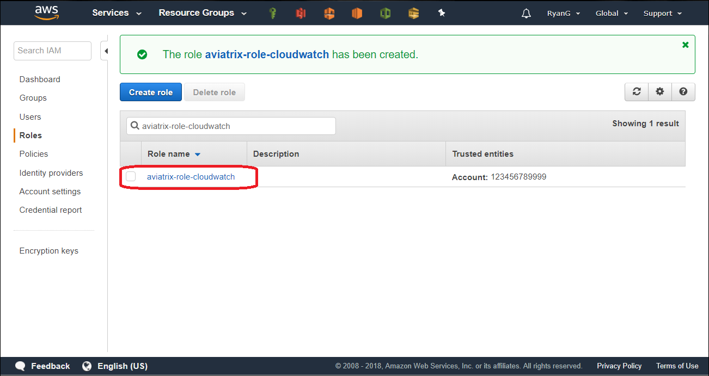

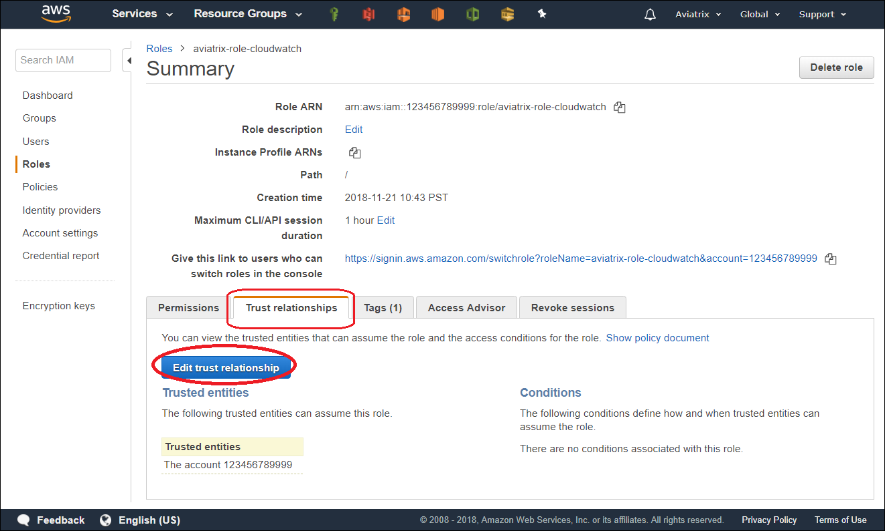

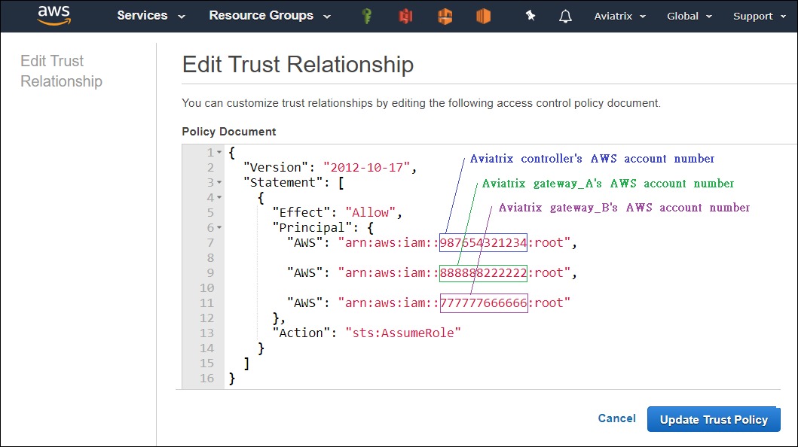

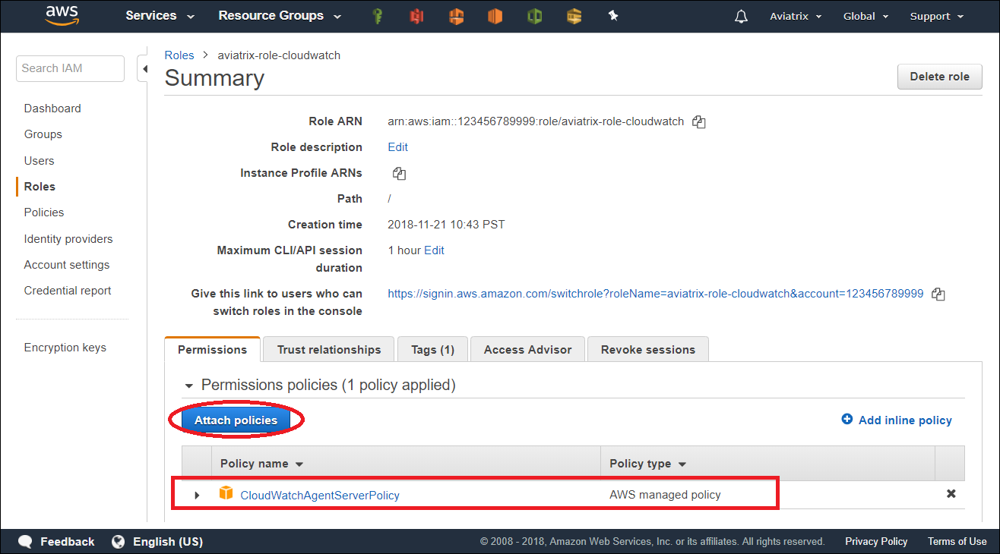

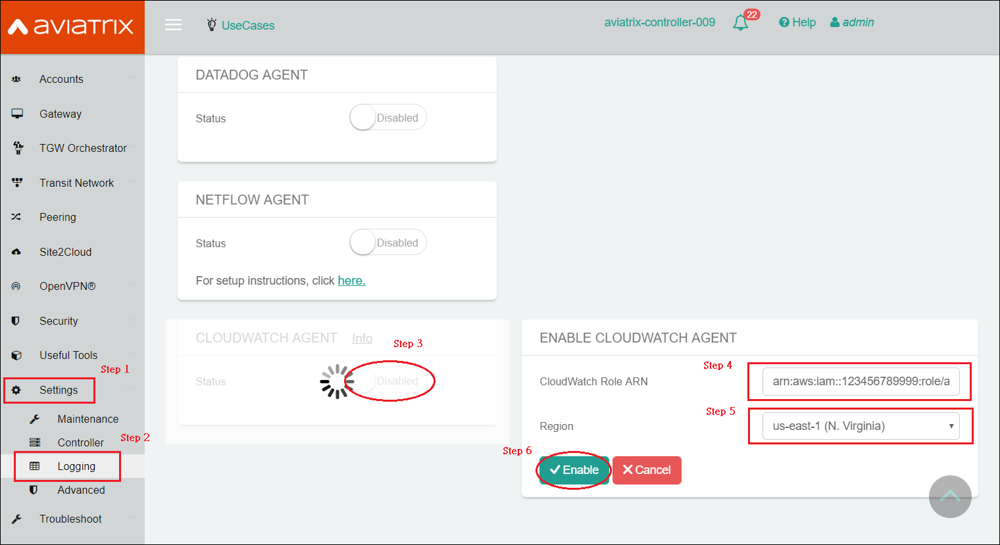

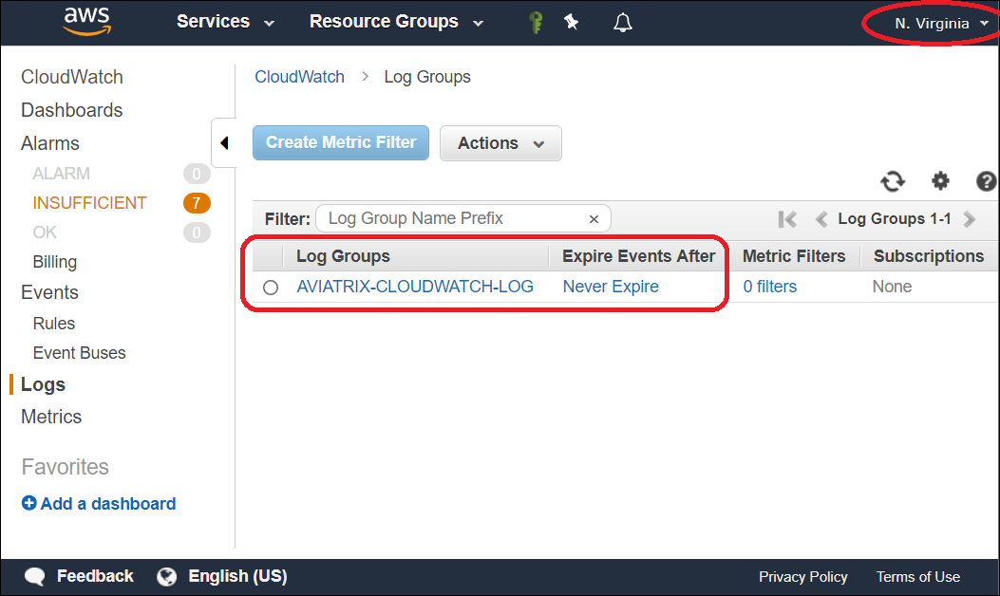

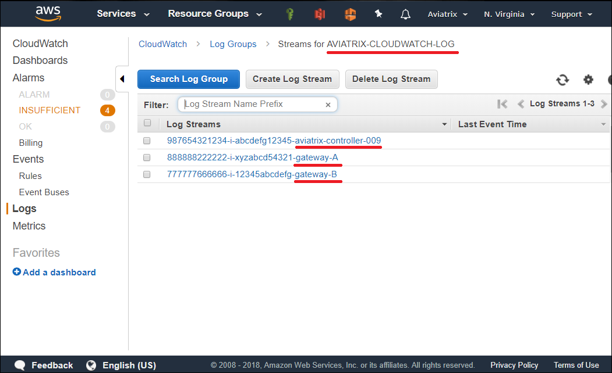
    
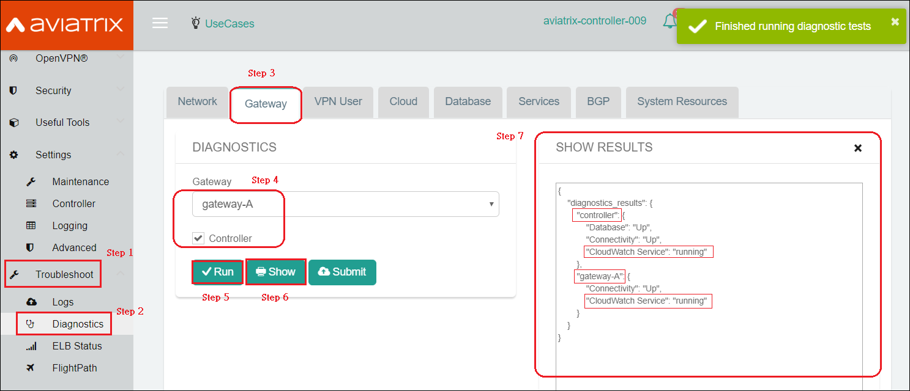
    
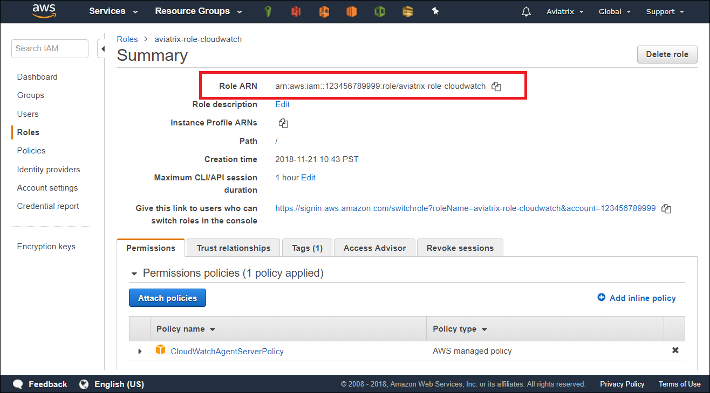

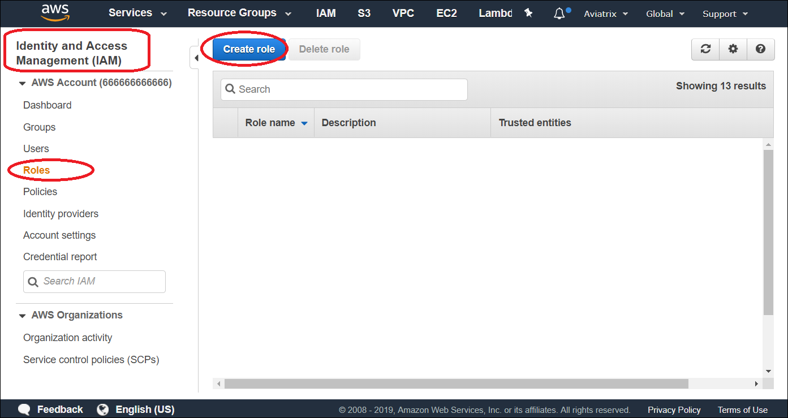
    
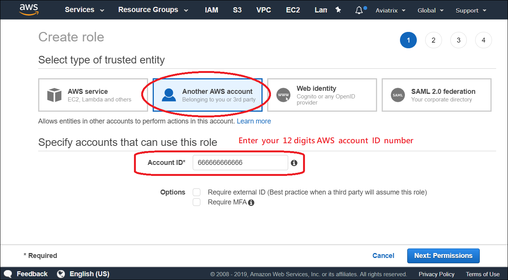
    
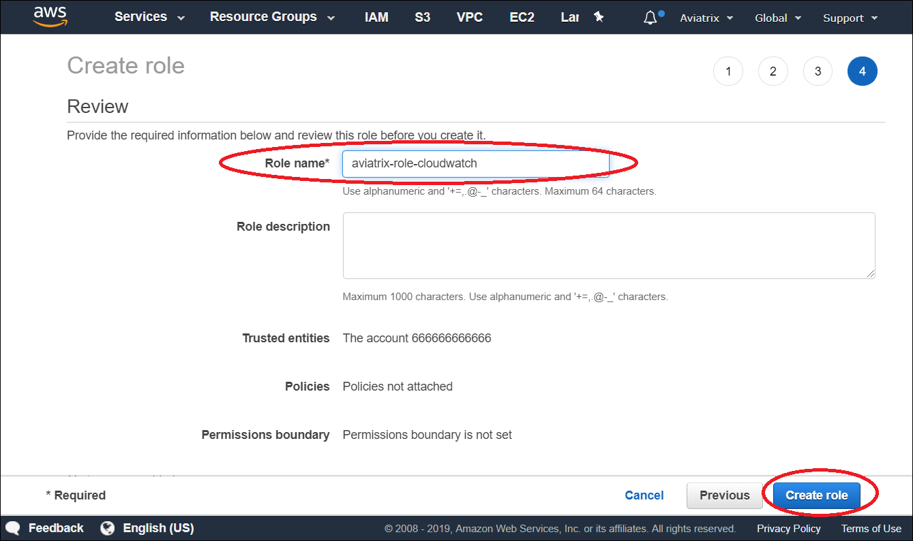

**Note:**
Logs from CloudWatch can be exported to S3 buckets. Please follow `AWS Documentation <https://docs.aws.amazon.com/AmazonCloudWatch/latest/logs/S3Export.html>`_

.. add in the disqus tag

.. disqus::

