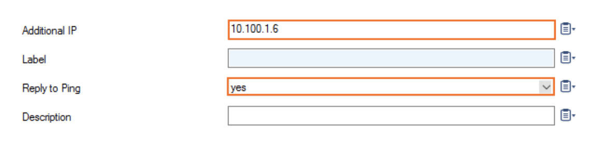

.. meta::

**Some notes before deployment:**

1. This document complements the existing deployment guide that was designed to help you to associate a Palo Alto VM-Series. We are going to assume that you have completed all the steps up to `launching and associating a firewall instance <https://docs.aviatrix.com/HowTos/firewall_network_workflow.html#launching-and-associating-firewall-instance>`_ before launching this firewall instance. Launching and associating a firewall instance is not necessary as it is Palo Alto VM-Series specific.
2. Currently, we do not have full integration between the Aviatrix dashboard and the Barracuda CloudGen Firewall, which means that you will not be able to update the firewall routing table via API, as it is currently possible with the Palo Alto VM-Series.

=============================================================
Deploying a Barracuda CloudGen Firewall for use with the Aviatrix FireNet
==============================================================

The goal of this document is to provide a step-by-step guide to launch and configure one or more Barracuda CloudGen Firewall instances to be integrated with the Aviatrix Firewall Network.

This setup will include basic “allow-all” policies to serve as initial configuration to validate intended traffic is passing through the firewall instance.

Setting up Firewall Network (FireNet)
-------------------------------------------------

Complete all the steps of the Firewall Network Workflow in the Aviatrix Controller up to `"Attaching Aviatrix FireNet Gateway to TGW Firewall Domain" <https://docs.aviatrix.com/HowTos/firewall_network_workflow.html#attaching-aviatrix-firenet-gateway-to-tgw-firewall-domain>`_ to prepare your Firewall VPC (FireNet VPC). This will also set up the subnets that you will need later for launching a Barracuda Firewall instance.

Deploying the Barracuda CloudGen Firewall Instance from the AWS Marketplace
---------------------------------------------------------------------------------------------------

The Barracuda CloudGen Firewall is available as a Pay-As-You-Go(PAYG) or Bring-Your-Own-License(BYOL) model. For ease of use, we will use the PAYG model in this example.

1. Select the **Launch Instance** link in the AWS console from the Region your Firenet has been deployed in. 

* Choose the AWS Marketplace link and search for Barracuda. 
* Choose the Barracuda CloudGen Firewall for AWS - PAYG.  

|image1|

2. Click **Continue** when prompted.

|image2|

3. Choose an instance size. A t2.small can be used for the Demo. Click **Next: Configure Instance Details**.

|image3|

4. Choose the VPC created for the Aviatrix FireNet from the dropdown. Click the Public-FW-ingress-egress-us-east-1b subnet. In this example, we are using the US-East region.

|image4|

5. Scroll down to adjust the network interfaces. Click **Add Device** to add another Network Interface. On the Subnet dropdown for eth1, choose the aviatrix-fireGW-DMZ-firewall subnet.  

|image5|

6.. Click **Next: Add Storage**, then **Next: Add Tags**. Add any necessary tags then click **Next: Configure Security Group**. No changes need to be made to the Security Group now. Click **Review and Launch**, the Launch on the next screen. You will be prompted for a key pair.  None will be needed for the Firewall. Choose **Launch Instances**.
7. You'll need to configure an Elastic IP in the AWS Console to connect to the Barracuda management interface. `This <https://docs.aws.amazon.com/AWSEC2/latest/UserGuide/elastic-ip-addresses-eip.html>`_ link will guide you through setting up an Elastic IP.  Once allocated, it will need to be associated to the private IP address of the Barracuda on eth0.

Logging in to Firewall and Configuring Interfaces
-----------------------------------------------------------------

1. Barracuda recommends configuring its instances with the Firewall Admin, a stand-alone Windows application. Directions on downloading and using it can be found `here <https://campus.barracuda.com/product/cloudgenfirewall/doc/79463207/barracuda-firewall-admin/>`_
2. Open the Admin Client and use the Elastic IP, root as the Username, and the instance id from the AWS console as the initial password.  

|image6|

3. You will be prompted to change the password upon first logging in. Once prompted to log in again, you will be asked to choose how you will administer the Firewall. Choose Manage via Firewall Admin and confirm.

|image7|

4. These steps will be following the `Barracuda Documentation <https://campus.barracuda.com/product/cloudgenfirewall/doc/79462723/how-to-add-aws-elastic-network-interfaces-to-a-firewall-instance/>`_ for adding an additional interface.  
Once logged in you will need to configure the second(eth1) interface on the Barracuda. Go to Configuration > Configuration Tree > Box > Network.

|image8|

5. Click **Lock**.
6. In the left menu, click **Interfaces**.
7. In the Network Interface Cards table, double-click the 10dynmod entry. The window will open.

|image9|

8. From the Number of Interfaces, select the number of network interfaces attached to the firewall instance, in this case 2. Click **Ok**.

|image10|

9. Click **Send Changes** and **Activate**.

Now, add a Direct Attached Route for the second Network Interface.

1. Go to Configuration > Configuration Tree > Box > Network.
2. Click **Lock**.
3. In the left menu, click **Routing**.
4. Click **+ **in the IPv4 Routing Table to add an attached route.
5. Target Network address will be the subnet you put on eth1, the aviatrix-fireGW-DMZ-firewall subnet.

* For the Route Type, select direct attached network.
* Interface Name, select eth1.
* Trust Level, select Trusted.

|image11|

6. Click **OK**.
7. Click **Send Changes** and **Activate**.

The Network Configuration will need to be activated now.

1. Go to Control > Box.
2. In the Network section of the left menu, click **Activate new network configuration**. The Network Activation window opens.
3. Click Failsafe.

The route is now pending in Control > Network.

|image12|

A virtual IP needs to be added to the Virtual Server.  It will be the private IP assigned to your eth1 interface from the AWS console.

1. Go to Configuration > Configuration Tree > Box > Virtual Servers > your virtual server > Server Properties.
2. Click **Lock**.
3. Click **+** in the Additional IP table. The Additional IP window opens.

* In Additional IP, add the private IP address configured for the network interface in step 1.
* Reply to Ping, select **Yes**.

|image13|

4. Click **OK**.
5. Click **Send Changes** and **Activate**.

Creating Static Routes for Routing of Traffic VPC-to-VPC
------------------------------------------------------------------------

The next step is to update the route table. For the purpose of this guide, we suggest adding three routes, each for a RFC1918 address pointing to the private IP of the eth2/ENI of the Aviatrix gateway in question (whether you are attaching the instance to the main or to the backup gateway). 

1. Go to Configuration > Configuration Tree > Box > Network.
2. Click **Lock**.
3. In the left menu, click **Routing**.
4. Click **+** in the IPv4 Routing Table to add a gateway route.

* Target Network address will be a summary of your VPCs or all private addresses.
* Route Type, select gateway.
* Gateway, add the private IP of the eth2 interface of your primary Aviatrix FireNet Gateway.
* Trust Level, select **Trusted**.

|image14|

5. Click **OK**.
6. Click **Send Changes** and **Activate**.

The Network Configuration will need to be activated now.

1. Go to Control > Box.
2. In the Network section of the left menu, click **Activate new network configuration**. The Network Activation window opens.
3. Click **Failsafe**.

For the second interface to become available to the Barracuda the instance will need to be rebooted from the AWS console.
If it hasn't already been done, Source/Dest. Check will also need to be disabled for both of the ENIs associated to the Barracuda.

|image15|

Configuring Basic Traffic Policy to Allow Traffic
-----------------------------------------------------------

Security Groups in AWS for the Barracuda ENIs will need to be adjusted as necessary to allow the traffic from the various VPCs to hit the interface.

Building rules to allow VPC-to-VPC traffic, and Egress traffic if needed is next.

There are two pre-built rules, CLOUD-NET-2-INTERNET and CLOUD-NET-2-CLOUD-NET, that we can adjust to match your VPCs within AWS.

1. Go to Configuration > Configuration Tree > Virtual Servers > your virtual server > NGFW(Firewall) > Forwarding Rules.
2. Click **Lock**.
3. Open the CLOUD-NET-2-INTERNET rule and add your VPCs CIDR ranges to the Source field.

|image16|

4. Click OK.
5. Click Send Changes and Activate.

Do the same for the CLOUD-NET-2-CLOUD-NET rule, adding your VPCs to the Source and Destination fields. Leaving the Connection Method as Original Source IP will help in any future troubleshooting or logging.

|image17|

Ready to Go
-----------------------

Now your firewall instance is ready to receive packets.

The next step is specifying which Security Domain needs packet inspection by defining a connection policy that connects to the firewall domain. This is done by `this step <https://docs.aviatrix.com/HowTos/firewall_network_workflow.html#launching-and-associating-firewall-instance>`_ in the Firewall Network workflow.

For example, deploy Spoke-1 VPC in Security_Domain_1 and Spoke-2 VPC in Security_Domain_2. Build a connection policy between the two domains. Build a connection between Security_Domain_2 to Firewall Domain.

Launch one instance in Spoke-1 VPC and Spoke-2 VPC. From one instance, ping the other instance. The ping should go through. 

Viewing the Traffic Log
----------------------------------

Traffic can be viewed on the Firewall section of the Firewall Admin.  The two most useful views are Live and History. History will show you any expired sessions and any traffic blocked by the firewall, while the Live view will show any active sessions.

|image18|

Scaling Out
----------------------

Additional Firewall instances can be added to the FireNet as needed, and load balanced using the Aviatrix Gateways.

.. |image4| image:: ./barracuda_images/image4.png
    :width: 100%
.. |image5| image:: ./barracuda_images/image5.png
    :width: 100%
.. |image6| image:: ./barracuda_images/image6.png
    :width: 100%

.. |image9| image:: ./barracuda_images/image9.png
    :width: 100%

.. |image11| image:: ./barracuda_images/image11.png
    :width: 100%

.. |image14| image:: ./barracuda_images/image14.png
    :width: 100%
.. |image15| image:: ./barracuda_images/image15.png
    :width: 100%
.. |image16| image:: ./barracuda_images/image16.png
    :width: 100%

