.. meta::
  :description: Firewall Network
  :keywords: Azure Transit Gateway, Aviatrix Transit network, Transit DMZ, Egress, Firewall

=========================================================
Example Config for CheckPoint VM in Azure
=========================================================

**Prerequisites:**
    - Basic CheckPoint Architecture Understanding
    - CheckPoint Security Management instance to manage CheckPoint CloudGauard IAAS Gateway.

The following CheckPoint AMIs and software versions are supported in Azure.

==================================================================================             ====================
**Supported AMI Name**                                                                         **Software Version**
==================================================================================             ====================
CloudGuard IaaS Next-Gen Firewall with Threat Prevention & SandBlast (NGTX) - PAYG              R80.40, R80.30
CloudGuard IaaS Next-Gen Firewall with Thread Prevention (NGTP) - PAYG                          R80.40, R80.30
CloudGuard IaaS Standalone (Gateway + Management) R80.40 - BYOL                                 R80.40
==================================================================================             ====================

.. important::

  - CheckPoint Standalone do not require Security Management to manage polices.
  - Gateway NGTP and NGTX both requires Security Management to configure Firewall Polices in the Gateway

In this document, we provide an example to set up the CheckPoint Firewall instance for you to validate that packets are indeed sent to the CheckPoint Firewall for VPC to VPC and from VPC to internet traffic inspection.

The Aviatrix Firewall Network (FireNet) workflow launches a CheckPoint Firewall instance at `Step 7a <https://docs.aviatrix.com/HowTos/firewall_network_workflow.html#a-launch-and-associate-firewall-instance>`_.
After the launch is complete, the console displays the CheckPoint Firewall instance with its public IP address of management/egress interface for you to login to the console.

Here is the Firewall information in this example for your reference. Please adjust it depending on your requirements.

==========================================      ==========
**Example setting**                             **Example value**
==========================================      ==========
Firewall Image                                  Check Point CloudGuard IaaS Single Gateway R80.40 - PAYG (NGTP)
Firewall Image Version                          8040.900294.0593
Firewall Instance Size                          Standard_D3_v2
Egress Interface Subnet                         Select the subnet whose name contains "Public-FW-ingress-egress".
Key Pair Name (Optional)                        The .pem file name for SSH access to the firewall instance.
Attach                                          Check
==========================================      ==========

.. note::

  CheckPoint Firewall instance has only 2 interfaces as described below. Additionally, firewall instance eth1 is on the same subnet as FireNet gateway eth2 interface.

========================================================         ===============================          ================================
**CheckPoint VM instance interfaces**                             **Description**                          **Inbound Security Group Rule**
========================================================         ===============================          ================================
eth0 (on subnet -Public-FW-ingress-egress)                       Egress or Untrusted interface            Allow ALL
eth1 (on subnet -dmz-firewall-lan)                               LAN or Trusted interface                 Allow ALL (Do not change)
========================================================         ===============================          ================================

Below are the steps for initial setup.

.. important::

  For Controller on Release 5.4 and later, Step 1 and Step 2 can be skipped and start with Step 3.

1. Login to CheckPoint Firewall Gaia Portal
----------------------------------------------

Go to the Aviatrix Controller --> Firewall Network --> Setup, and finish `Step 7a <https://docs.aviatrix.com/HowTos/firewall_network_workflow.html#a-launch-and-associate-firewall-instance>`_ to successfully launch a Checkpoint firewall in Azure.

After `Step 7a <https://docs.aviatrix.com/HowTos/firewall_network_workflow.html#a-launch-and-associate-firewall-instance>`_ is completed. Wait for 10 to 15 mins and then go back to Firewall Network --> Setup -- Step 7a and  Click on the `Management UI` as shown below.

The URL takes you to the CheckPoint Firewall Gaia Portal you just launched.

|avx_firewall-step7a_UI|

.. note::

  Please try to use different browser (e.g. Firefox) if the Management UI link is not opening on your default browser.

Login Gaia Portal and go to the page “Network Management -> Network Interfaces” to review eth0 (WAN) and eth1 (LAN) configuration as shown below.

|cp_firewall_interfaces|

Also, review static routes RFC 1918 which is configured on LAN port, the purpose of those static route is to send the packets back to the Gateway (GW).

Those static routes could be reviewed on the page “Network Management -> IPv4 Static Routes”

|cp_firewall_static_routes|

Routes can also be reviewed by clicking the button “Monitoring” on the page “Network Management -> IPv4 Static Routes”

|cp_firewall_routes_monitoring|

2. Firewall Vendor Integration
-------------------------------------------------
Go to Aviatrix Controller --> Firewall Network --> Vendor Integration and complete the step as shown below:

|cp_firewall_vendor_integration|

Click **Save**, **Show** and **Sync** respectively.

This automatically set up  the routes between Aviatrix Gateway and Vendor’s firewall instance in this case CheckPoint. This can also be done manually through Cloud Portal and/or Vendor’s Management tool.

3. Download and install the SmartConsole
-------------------------------------------------

First of all, please download and install the **CheckPoint Security Management** from Azure Marketplace for managing Gateways.

.. important::

    CheckPoint Security Management CloudGuard version should be R80.40

Login to CheckPoint Security Manager and download the SmartConsole on Windows-based computer.

  Option 1: click on the button "Download Now!" with message "Manage Software Blades using SmartConsole" on the Overview page as below.

|cp_security_manager|

  Option 2: download it by using this link `R80.40 <https://supportcenter.checkpoint.com/supportcenter/portal?action=portlets.DCFileAction&eventSubmit_doGetdcdetails=&fileid=101086>`_

Secondly, install the SmartConsole and login into it with the Gaia Portal username, password and IP Address of Security Manager.

|smart_console_login|

4. Configure and Add CheckPoint Gateway in SmartConsole
--------------------------------------------------------

CheckPoint Gateway needs to be configured with one-time secure password in order to establish the secure communication with CheckPoint Security Management Portal.

SSH to Checkpoint Gateway in order to configure One-time Secure Password.

::

    % **ssh admin@ip-address**
    The authenticity of host 'ip-address' can't be established.
    ECDSA key fingerprint is SHA256:1S6wQF4xI6YtieM1te0lnI2wXoRDiDfa85ctsDHd1N4.
    Are you sure you want to continue connecting (yes/no/[fingerprint])? yes
    Failed to add the host to the list of known hosts (/Users/ahmednaail/.ssh/known_hosts).
    This system is for authorized use only.
    Password:
    You have logged into the system.
    By using this product you agree to the terms and conditions
    as specified in https://www.checkpoint.com/download_agreement.html
    CLINFR0771  Config lock is owned by admin. Use the command 'lock database override' to acquire the lock.

    cp-firewall-sc-azure> **lock database override**
    cp-firewall-sc-azure> **set expert-password**
    Enter new expert password:
    Enter new expert password (again):
    cp-firewall-sc-azure> **expert**
    Enter expert password:

    Warning! All configurations should be done through clish
    You are in expert mode now.

    [Expert@cp-firewall-sc-azure:0]# **cpconfig**
    This program will let you re-configure
    your Check Point products configuration.

    Configuration Options:
    ----------------------
    (1)  Licenses and contracts
    (2)  SNMP Extension
    (3)  PKCS#11 Token
    (4)  Random Pool
    (5)  Secure Internal Communication
    (6)  Enable cluster membership for this gateway
    (7)  Check Point CoreXL
    (8)  Automatic start of Check Point Products

    (9) Exit

    **Enter your choice (1-9) :5**

    Configuring Secure Internal Communication...
    ============================================
    The Secure Internal Communication is used for authentication between
    Check Point components

    Trust State: Initialized but Trust was not established

     Would you like to change the Activation Key? (y/n) [n] ? y

    Note: This operation will stop all Check Point Services (cpstop).
    Are you sure you want to continue? (y/n) [n] ? y
    Enter Activation Key:
    Retype Activation Key:
    initial_module:
    Compiled OK.
    initial_module:
    Compiled OK.

    Hardening OS Security: Initial policy will be applied
    until the first policy is installed

    The Secure Internal Communication was successfully initialized

    Configuration Options:
    ----------------------
    (1)  Licenses and contracts
    (2)  SNMP Extension
    (3)  PKCS#11 Token
    (4)  Random Pool
    (5)  Secure Internal Communication
    (6)  Enable cluster membership for this gateway
    (7)  Check Point CoreXL
    (8)  Automatic start of Check Point Products

    (9) Exit

    **Enter your choice (1-9) :9**

    Thank You...

Terminate SSH session.

At this point, we have created a One-time secure password.

Now go back to SmartConsole and Add a Gateway as shown below:

|smartconsole_add_gateway|

Click on Wizard Mode

|cp_gw_creation_wizard|

Next provide the GW information as shown in the table:

=======================   ===============================================
**Field**                 **Value**
=======================   ===============================================
Gateway Name              Configure any name
Gateway Platform          Select CloudGuard IaaS
Gateway IP
 * Static IP Address      Provide CheckPoint Gateway IP address
=======================   ===============================================

|gw_general_properties|

Next step is to establish a secure communication with a Gateway.

=======================   ===============================================
**Field**                 **Value**
=======================   ===============================================
Gateway' Name              Provide you Gateway Name (Case-Sensitive)
One-time Password          Use same Password which you set during SSH session with Gateway
Trust State                Default Values
=======================   ===============================================

.. important::
    If you see an error during communication establishment process that says, "Failed to connect to Security Gateway. SIC has not been established ...". Please SSH to your Gateway again and follow the same process mentioned in step 4, and try again to establish a communication with Security Gateway.

|trusted_communication|

Click "OK" and "Finish".

|get_topology|

|cp_wizard_summary|

Review the Gateway Summary and Click "OK"

|cp_gw_summary|

At this point if all the steps are followed properly then you should see a Gateway under GATEWAYS & SERVERs tab.

|cp_gw_added|

5. Configure basic traffic policy to allow traffic VPC to VPC
------------------------------------------------------------------

In this step, we will configure a basic traffic security policy that allows traffic to pass through the firewall.

Go to the page "SECURITY POLICIES -> Access Control -> Policy" and configure a policy by either modifying the default "Cleanup rule" or Add a new rule above the default rule.

=======================   ===============================================
**Field**                 **Value**
=======================   ===============================================
Name                      Configure any name for this policy (i.e. allow-all)
Source                    Any
Destination               Any
VPN                       Any
Service & Applications    Any
Action                    Accept
Track                     Log
=======================   ===============================================

|basic_allowall_policy|

Click on the button "Install Policy" and then "Install" to commit the settings.

|install_allowall_policy|

|policy_installed|

After validating that your traffic is being routed through your firewall instances, you can customize the security policy to tailor to your requirements.

6. [Optional] Configure basic traffic policy to allow traffic VPC to Internet
----------------------------------------------------------------------------------

In this step, we will configure a basic traffic security policy that allows internet traffic to pass through the firewall. Given that Aviatrix gateways will only forward traffic from the TGW to the LAN port of the Firewall, we can simply set our policy condition to match any packet that is going in of LAN interface and going out of WAN interface.

.. important::
  Enable `Egress inspection <https://docs.aviatrix.com/HowTos/firewall_network_faq.html#how-do-i-enable-egress-inspection-on-firenet>`_ feature on FireNet

First of all, go back to the Aviatrix Controller Console. Navigate to the page "Firewall Network -> Advanced". Click the skewer/three dot button. Scroll down to “Egress through Firewall” and click Enable. Verify the Egress status on the page "Firewall Network -> Advanced".

|cp_egress_inspection|

Secondly, go back to the CheckPoint Firewall SmartConsole. Navigate to the page "GATEWAYS&SERVERS" and then double-click on the gateway itself to enable NAT function as the following screenshot.

- Click on the button "NAT"
- Enable the checkbox "Hide internal networks behind the Gateway's external IP"
- Click the button "OK"
- Click the button "Install Policy"

|cp_policy_vpc_to_internet_nat_enabled|

.. important::

  NAT function needs to be enabled on the CheckPoint FW interface eth0 for this VPC to Internet policy. Please refer to `Check Point's NAT instruction <https://sc1.checkpoint.com/documents/R76/CP_R76_Firewall_WebAdmin/6724.htm>`_ for detail.

**[Optional]** If you have default "Cleanup rule", then navigate to the page "SECURITY POLICIES -> Access Control -> Policy" and inject a new rule for Internet Policy on top of the default "Cleanup rule".

=======================   ===============================================
**Field**                 **Value**
=======================   ===============================================
Name                      Configure any name for this policy (i.e. Internet-Policy)
Source                    Any
Destination               Select the object with All_internet
VPN                       Any
Service & Applications    Any
Action                    Accept
Track                     Log
=======================   ===============================================

Click on the button "Install Policy" and then "Install" to commit the settings.

|cp_policy_vpc_to_internet|

After validating that your traffic is being routed through your firewall instances, you can customize the security policy to tailor to your requirements.

7. Ready to go!
----------------

Now your firewall instance is configured and ready to receive packets!

Next step is to validate your configurations and polices using FlightPath and Diagnostic Tools (ping, traceroute etc.).

8. View Traffic Log
----------------------

You can view if traffic is forwarded to the firewall instance by logging in to the CheckPoint Firewall SmartConsole. Go to the page "LOGS & MONITOR".

For VPC to VPC traffic:
***********************

Launch one instance in PROD Spoke VPC and DEV Spoke VPC. Start ping packets from a instance in DEV Spoke VPC to the private IP of another instance in PROD Spoke VPC. The ICMP traffic should go through the firewall and be inspected in firewall.

|cp_view_traffic_log_vpc_to_vpc|

[Optional] For VPC to Internet traffic:
***************************************

Launch a private instance in the Spoke VPC (i.e. PROD Spoke VPC) and start ping packets from the private instance towards Internet (e.g 8.8.8.8) to verify the egress function. The ICMP traffic should go through, and get inspected on firewall.

.. important::
    Egress Inspection inserts a default route (0.0.0.0/0) towards Transit GW to send the Internet traffic towards firewall to get inspected. Azure's System Default Route pointing towards Internet will be Invalid and overwritten by User-defined default route inserted by the Controller which may cause workload/VM's no longer reachable if they are in wrong subnet. Create a jumphost using GW-Public subnet or a new subnet to access private instance using private IP address.

|cp_view_traffic_log_vpc_to_internet|

.. |avx_firewall-step7a_UI| image:: config_Checkpoint_media/avx_firewall-step7a_UI.png
   :scale: 40%
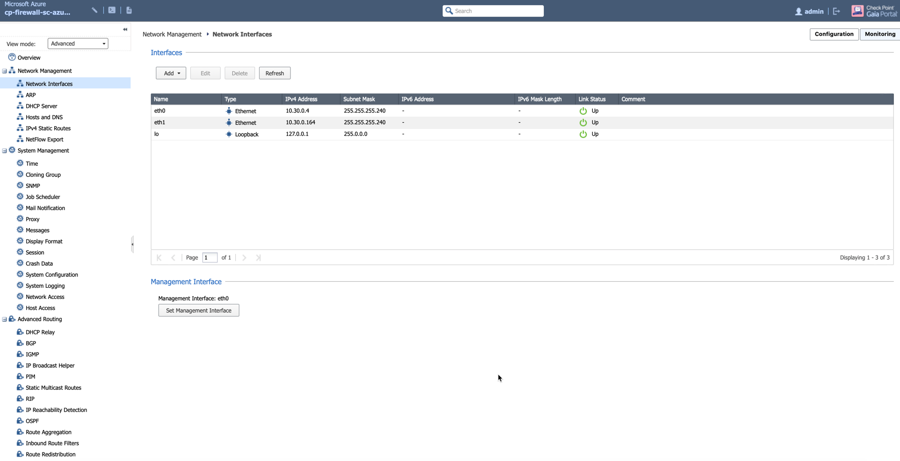
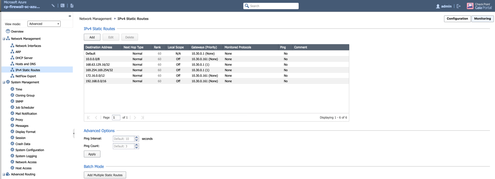
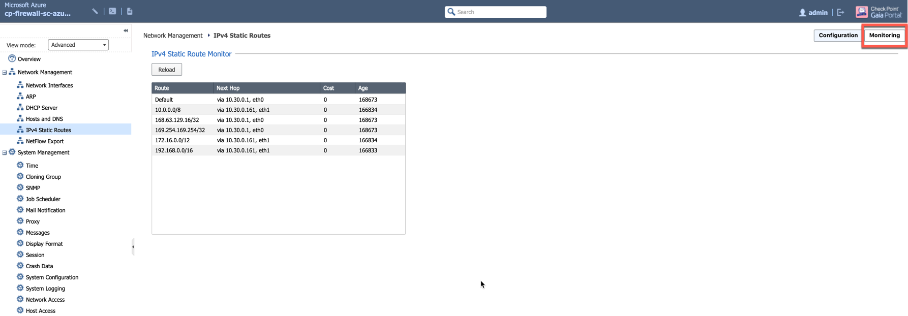
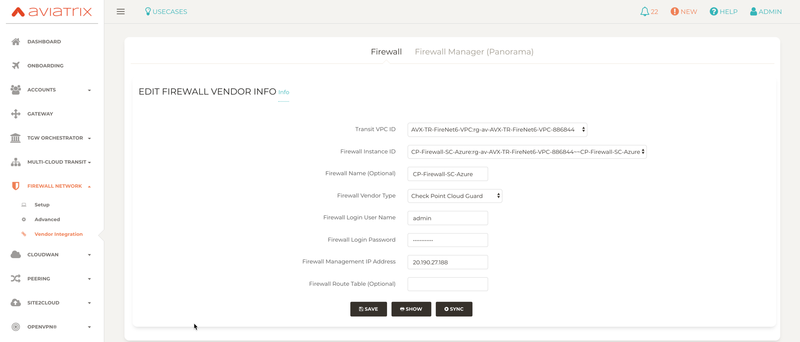
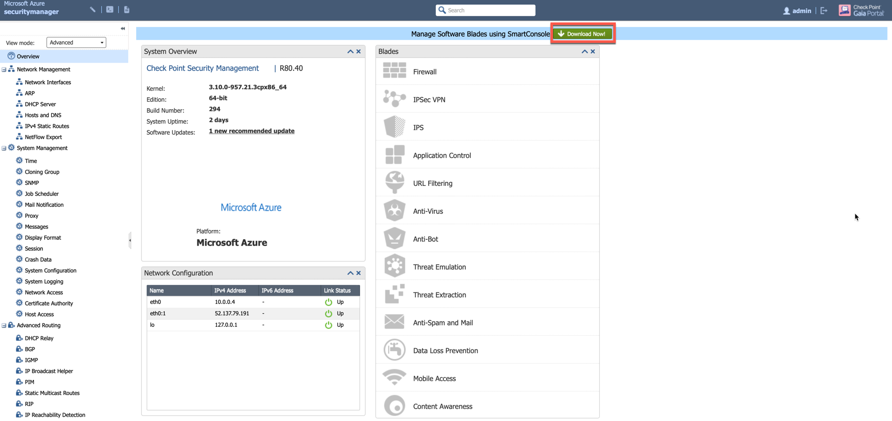
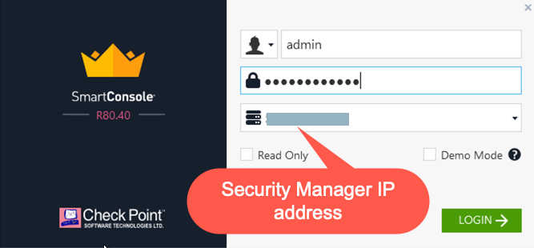
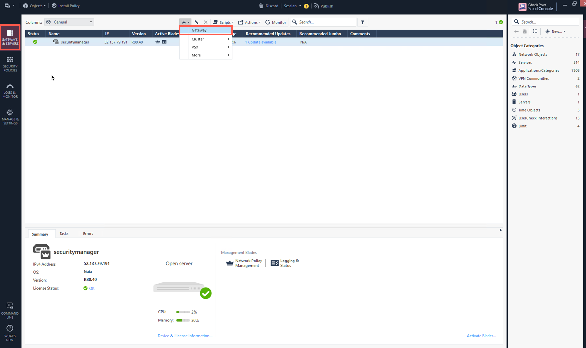
.. |cp_gw_creation_wizard| image:: config_Checkpoint_media/cp_gw_creation_wizard.png
   :scale: 40%
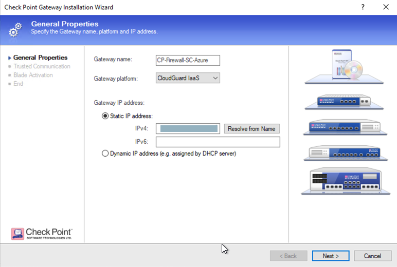
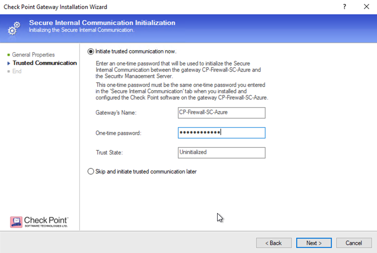
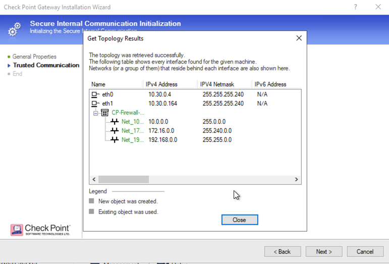
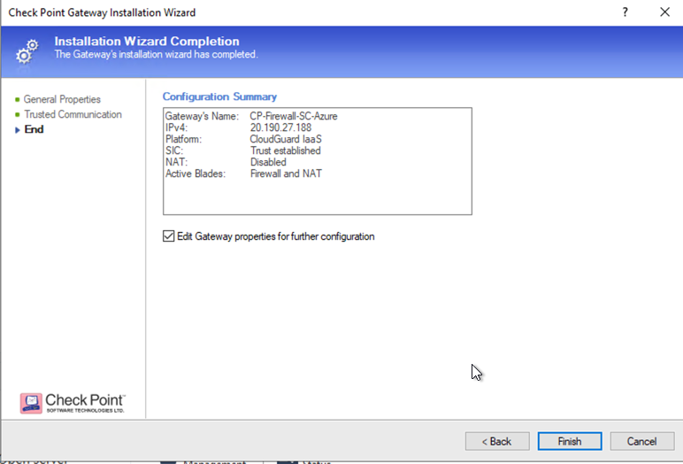
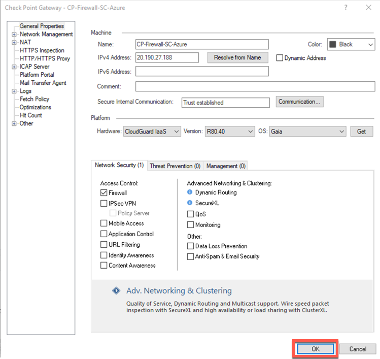
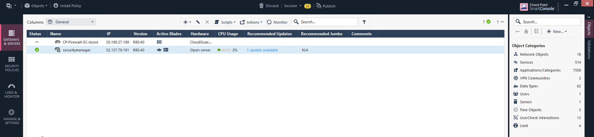
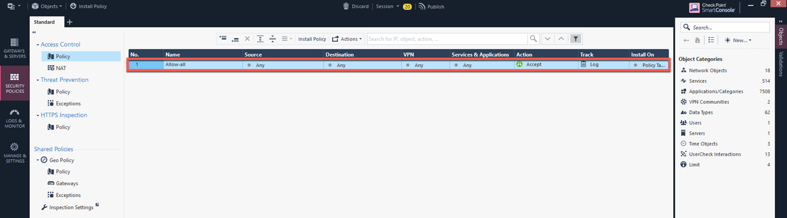
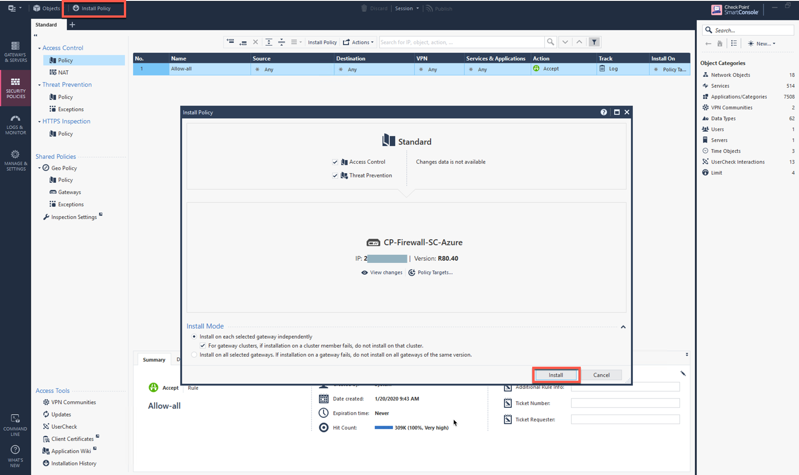
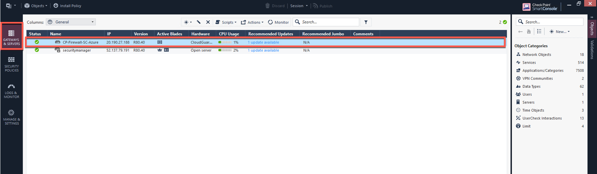
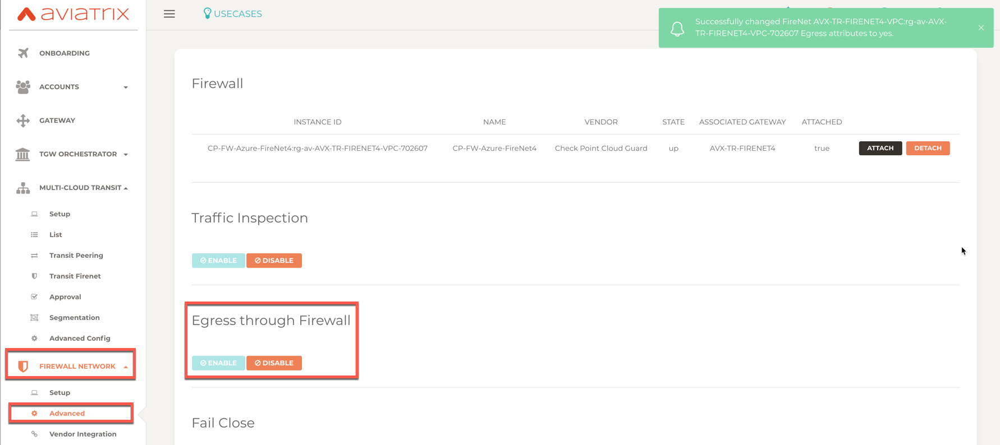
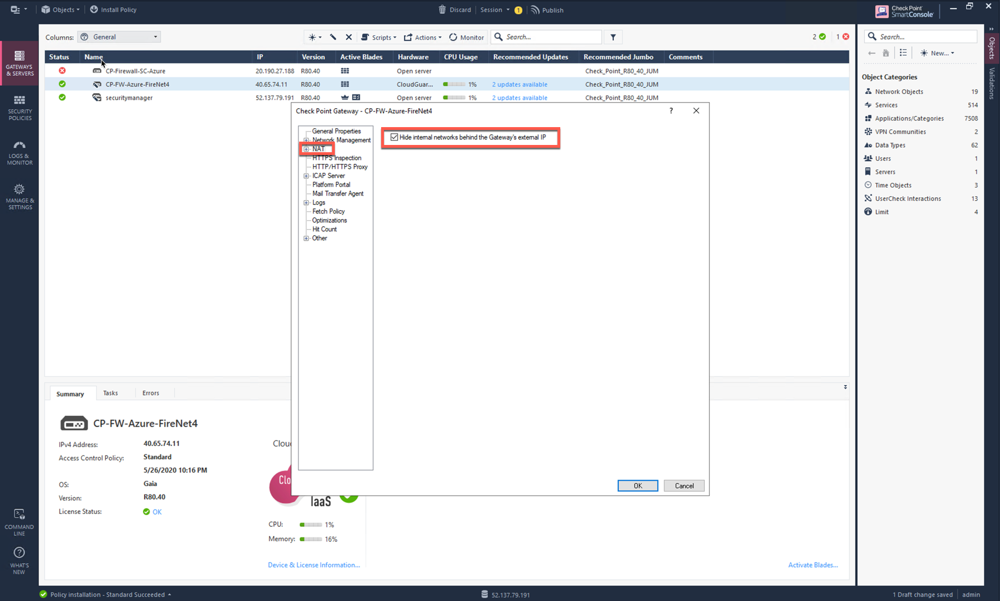
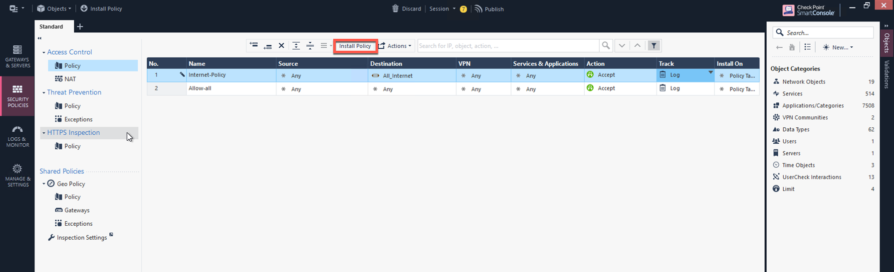
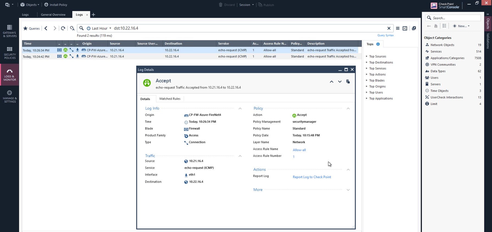
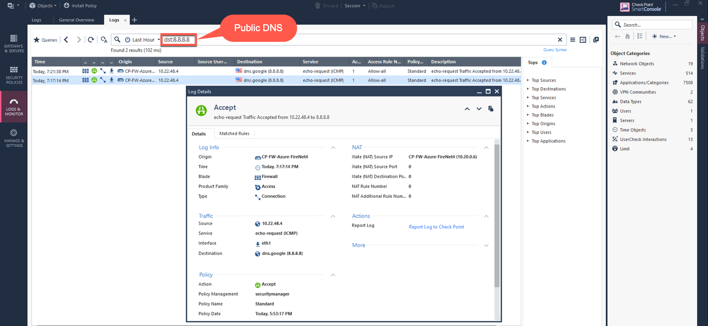
.. disqus::