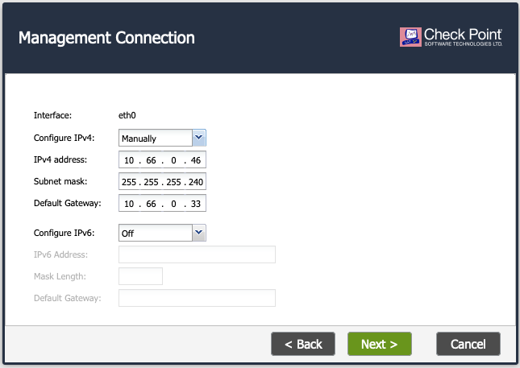
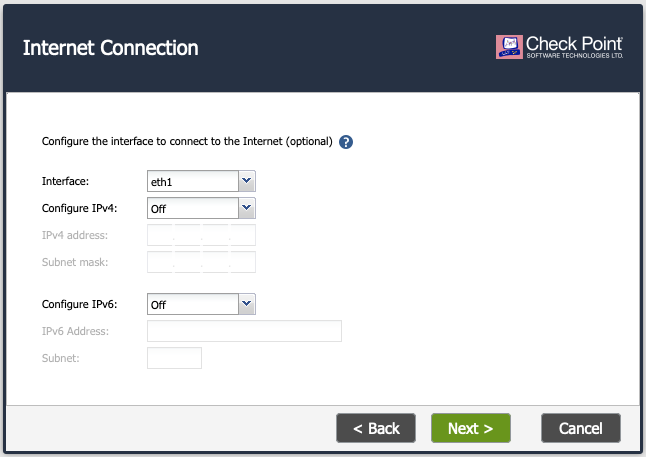
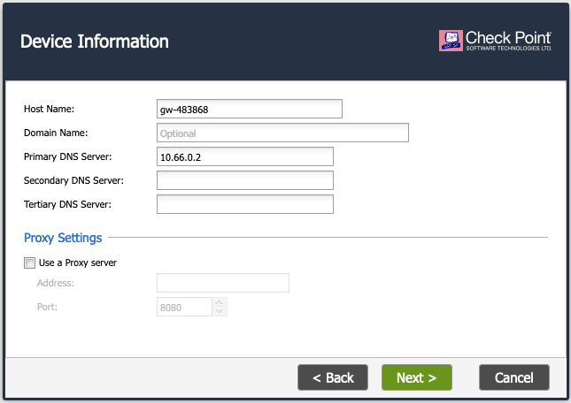
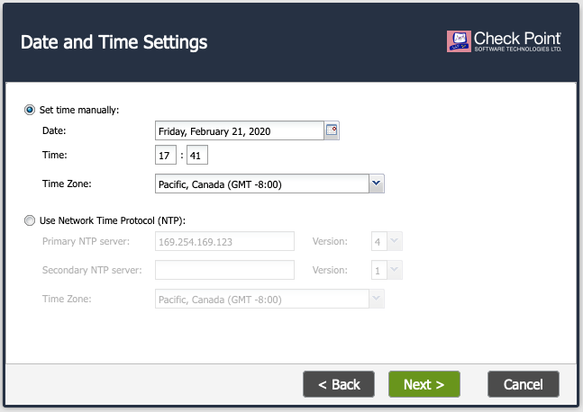
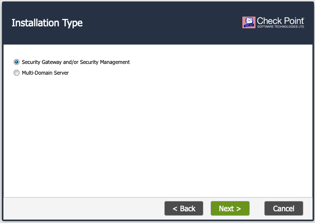
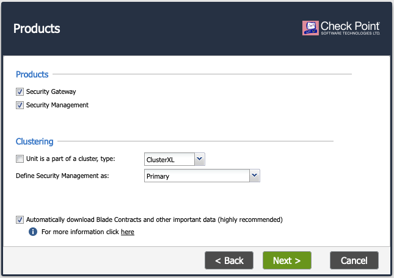
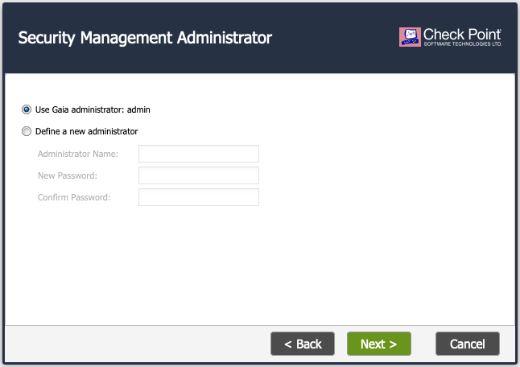
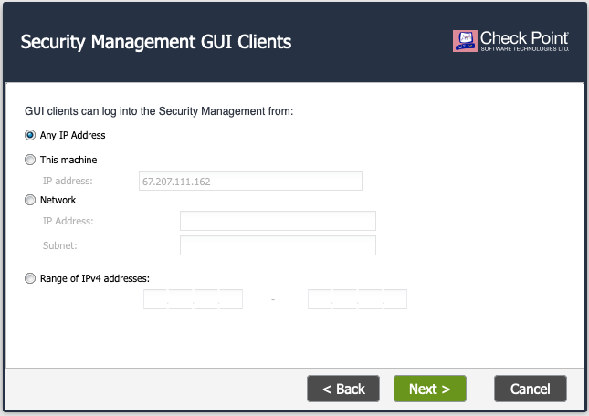

.. meta::
  :description: Firewall Network
  :keywords: AWS Transit Gateway, AWS TGW, TGW orchestrator, Aviatrix Transit network, Transit DMZ, Egress, Firewall

=========================================================
Example Config for CheckPoint VM in AWS 
=========================================================

In this document, we provide an example to set up the CheckPoint Firewall instance for you to validate that packets are indeed sent to the CheckPoint Firewall for VPC to VPC and from VPC to internet traffic inspection.

The Aviatrix Firewall Network (FireNet) workflow launches a CheckPoint Firewall instance at `Step 7a <https://docs.aviatrix.com/HowTos/firewall_network_workflow.html#a-launch-and-associate-firewall-instance>`_. 
After the launch is complete, the console displays the CheckPoint Firewall instance instance with its public IP address of management interface and allows you either to download the .pem file for SSH access to the instance or to access the CheckPoint web page.

.. note::

  CheckPoint Firewall instance has 2 interfaces as described below. Additionally, firewall instance eth1 is on the same subnet as FireNet gateway eth2 interface.

========================================================         ===============================          ================================
**CheckPoint VM instance interfaces**                             **Description**                          **Inbound Security Group Rule**
========================================================         ===============================          ================================
eth0 (on subnet -Public-FW-ingress-egress-AZ-a)                  Egress or Untrusted interface            Allow ALL 
eth1 (on subnet -gw-dmz-firewall)                                LAN or Trusted interface                 Allow ALL (Do not change)
========================================================         ===============================          ================================

Below are the steps for initial setup.

1. Download CheckPoint Firewall Access Key
----------------------------------

After `Step 7a <https://docs.aviatrix.com/HowTos/firewall_network_workflow.html#a-launch-and-associate-firewall-instance>`_ is completed, you'll see the Download button as below. Click the button to download the .pem file.

If you get a download error, usually it means the CheckPoint Firewall instance is not ready. Wait until it is ready, refresh the browser and then try again.

|v2_avx_pem_file_download|

2. Reset CheckPoint Firewall Password
----------------------------------

For Metered AMI, open a terminal and run the following command. 

.. tip ::

  Once you download the .pem file, change the file permission to 600. It usually takes up to 15 minutes for the CheckPoint Firewall to be ready. Wait and try again until the console prompts. Once SSH into the CheckPoint Firewall using the proper keys and the user “admin”. It takes only two commands to set a new password as below.

::

  ssh -i <private_key.pem> admin@<public-ip_address>
  set user admin password
  save config
  exit

|v2_CheckPoint_change_password|

Terminate the SSH session.

3. Login to CheckPoint Firewall Gaia Portal
----------------------------------

Go back to the Aviatrix Controller Console. 
Go to Firewall Network workflow, `Step 7a <https://docs.aviatrix.com/HowTos/firewall_network_workflow.html#a-launch-and-associate-firewall-instance>`_. Click on the `Management UI`. It takes you to the CheckPoint Firewall you just launched.

|v2_avx_management_UI|

.. note::

  Login with Username "admin" and the password you have just configured on the previous step.

4. Initialize CheckPoint Firewall via Gaia Portal
----------------------------------

Follow the Check Point First Time Configuration Wizard to initialize it as below:

|v2_CheckPoint_Gaia_Portal_Wizard_01|

|v2_CheckPoint_Gaia_Portal_Wizard_02|

|v2_CheckPoint_Gaia_Portal_Wizard_03_eth0|

.. note::
  
  Please ignore configuring interface eth1 at this Wizard page as we will configure it in the later section.

|v2_CheckPoint_Gaia_Portal_Wizard_04_eth1|

|v2_CheckPoint_Gaia_Portal_Wizard_05|

|v2_CheckPoint_Gaia_Portal_Wizard_06|

|v2_CheckPoint_Gaia_Portal_Wizard_07|

|v2_CheckPoint_Gaia_Portal_Wizard_08|

|v2_CheckPoint_Gaia_Portal_Wizard_09|

|v2_CheckPoint_Gaia_Portal_Wizard_10|

|v2_CheckPoint_Gaia_Portal_Overview.png|

5. Configure CheckPoint Firewall interface eth0 with WAN
-------------------------------------------------

Login Gaia Portal and go to the page "Network Management -> Network Interfaces" to configure interface eth0 as the following screenshot.

  - Select the interface eth0 and click on "Edit"
  - Enable the checkbox "Enable"
  - Enter "WAN" for the field "Comment"
  - Make sure the IPv4 address/Subnet mask info match to the eth0 of CheckPoint Firewall in AWS portal under the tab "IPv4"
  - Click on the button "OK"
  
|v2_CheckPoint_Gaia_Portal_Configuration_eth0_WAN|

6. Configure CheckPoint Firewall interface eth1 with LAN
-------------------------------------------------

Login Gaia Portal and go to the page "Network Management -> Network Interfaces" to configure interface eth1 as the following screenshot.

  - Select the interface eth1 and click on "Edit"
  - Enable the checkbox "Enable"
  - Enter "LAN" for the field "Comment"
  - Click on the radio "Obtain IPv4 address automatically" under tab "IPv4"
  - Click on the button "OK"

|v2_CheckPoint_Gaia_Portal_Configuration_eth1_LAN|

7. Create static routes for routing of traffic VPC to VPC
-------------------------------------------------

Packets to and from TGW VPCs, as well as on-premises, will be hairpinned off of the LAN interface. As such, we will need to configure appropriate route ranges that you expect traffic for packets that need to be forward back to TGW. 
For simplicity, you can configure the FW to send all RFC 1918 packets to LAN port, which sends the packets back to the TGW. 

In this example, we configure all traffic for RFC 1918 to be sent out of the LAN interface.

Go to tha page "Network Management -> IPv4 Static Routes" to create a Static Route as the following screenshot.

  - Click on the button "Add"
  - Enter the destination route in the "Destination" box and "Subnet Mask" box
 
   .. note::
    
    i.e. Configure 10.0.0.0 for Destination and 255.0.0.0 for Subnet mask
    
  - Select "Normal" for Next Hop Type
  - Enter comments as necessary.
  - Click the button "Add Gateway" and then select the button "IP Address" to add AWS default gateway IP
  
  .. note::
    
    i.e. subnet CIDR for -gw-dmz-firewall is 10.66.0.96/28, thus the AWS default gateway IP on this subnet is 10.66.0.97
  
  - Configure an appropriate admin distance if you expect overlapping routes that need to be prioritized
  - Repeat the above steps for RFC 1918 routes
    
|v2_CheckPoint_static_routes_01|

|v2_CheckPoint_static_routes_02|

Those static routes could be reviewed on the page "Network Management -> IPv4 Static Routes"

|v2_CheckPoint_static_routes_review_01|

It also can be reviewed by clicking the button "Monitoting" on the page "Network Management -> IPv4 Static Routes"

|v2_CheckPoint_static_routes_review_02|

8. Download and install the SmartConsole
-------------------------------------------------

First of all, please download the SmartConsole with version R80.10 on Windows-based computer

Option 1: click on the button "Download Now!" with message "Manage Software Blades using SmartConsole" on the Overview page as below. 

|v2_CheckPoint_Gaia_Portal_SmartConsole_DL|

Option 2: download it by using this link `R80.10 <https://supportcenter.checkpoint.com/supportcenter/portal?eventSubmit_doGoviewsolutiondetails=&solutionid=sk119612>`_

Secondly, install the SmartConsole and login into it

Last but not least, execute the function "Get Interfaces With Topology" to sync up the settings that we have configured via Gaia Portal.

- Click on the link "GATEWAYS&SERVERS" on the left side
- Double click on the CheckPoint Firewall
- Click on the link "Network Management" on left side
- Click on the button "Get Interfaces.." to expand options
- Click on the button "Get Interfaces With Topology"
- Click on the button "Yes"
- Review the "Get Topology Results" which should match to the settings that we have configured via Gaia Portal
- Click on the button "Accept"

|v2_CheckPoint_SmartConsole_syncup_01|

|v2_CheckPoint_SmartConsole_syncup_02|

9. Configure basic traffic policy to allow traffic VPC to VPC
-------------------------------------------------

In this step, we will configure a basic traffic security policy that allows traffic to pass through the firewall. Given that Aviatrix gateways will only forward traffic from the TGW to the LAN port of the Firewall, we can simply set our policy condition to match any packet that is going in/out of LAN interface.

Go to the page "SECURITY POLICIES -> Access Control -> Policy" and configure a policy by seleting the default rule "Cleanup rule" and clicking the button "Add rule above" as the following screenshot.

==================      ===============================================
**Field**               **Value**
==================      ===============================================
Name                    Configure any name for this policy (i.e. allow-all-LAN-to-LAN)
Source                  Select the object with interface eth1
Destination             Select the object with interface eth1
VPN                     Any
Service & Applicagtions Any
Action                  Accept
Track                   Log
==================      ===============================================

Click on the button "Install Policy" and then "Install" to commit the settings.

|v2_CheckPoint_policy_vpc_to_vpc|

|v2_CheckPoint_policy_vpc_to_vpc_install|

After validating that your TGW traffic is being routed through your firewall instances, you can customize the security policy to tailor to your requirements.

10. [Optional] Configure basic traffic policy to allow traffic VPC to Internet
-------------------------------------------------

In this step, we will configure a basic traffic security policy that allows internet traffic to pass through the firewall. Given that Aviatrix gateways will only forward traffic from the TGW to the LAN port of the Firewall, we can simply set our policy condition to match any packet that is going in of LAN interface and going out of WAN interface.

.. important::
  Enable `Egress inspection <https://docs.aviatrix.com/HowTos/firewall_network_faq.html#how-do-i-enable-egress-inspection-on-firenet>`_ feature on FireNet
  
First of all, go back to the Aviatrix Controller Console. Navigate to the page "Firewall Network -> Advanced". Click the skewer/three dot button. Scroll down to “Egress through Firewall” and click Enable. Verify the Egress status on the page "Firewall Network -> Advanced".

|v2_avx_egress_inspection|

Secondly, go back to the CheckPoint Firewall SmartConsole. Navigate to the page "GATEWAYS&SERVERS" and then double-click on the gateway itself to enable NAT function as the following screenshot.

- Click on the button "NAT"
- Enable the checkbox "Hide internal networks behind the Gateway's external IP"
- Click the button "OK"
- Click the button "Install Policy"

|v2_CheckPoint_policy_vpc_to_internet_nat_enabled|

.. important::

  NAT function needs to be enabled on the CheckPoint FW interface eth0 for this VPC to Internet policy. Please refer to `Check Point's NAT insturction <https://sc1.checkpoint.com/documents/R76/CP_R76_Firewall_WebAdmin/6724.htm>`_ for detail.

Furthermore, navigate to the page "SECURITY POLICIES -> Access Control -> Policy". Inject a new rule between the default rule "Cleanup rule" and the rule "allow-all-LAN-to-LAN" that we have created in the previous steps.

==================      ===============================================
**Field**               **Value**
==================      ===============================================
Name                    Configure any name for this policy (i.e. allow-all-LAN-to-WAN)
Source                  Select the object with interface eth1
Destination             Select the object with All_internet
VPN                     Any
Service & Applicagtions Any
Action                  Accept
Track                   Log
==================      ===============================================

Click on the button "Install Policy" and then "Install" to commit the settings.

|v2_CheckPoint_policy_vpc_to_internet|

After validating that your TGW traffic is being routed through your firewall instances, you can customize the security policy to tailor to your requirements.

11. Ready to go!
----------------

Now your firewall instance is ready to receive packets! 

The next step is to specify which Security Domain needs packet inspection by defining a connection policy that connects to
the firewall domain. This is done by `Step 8 <https://docs.aviatrix.com/HowTos/firewall_network_workflow.html#specify-security-domain-for-firewall-inspection>`_ in the Firewall Network workflow. 

For example, deploy Spoke-1 VPC in Security_Domain_1 and Spoke-2 VPC in Security_Domain_2. Build a connection policy between the two domains. Build a connection between Security_Domain_2 to Firewall Domain. 

For traffic VPC to VPC, launch one instance in Spoke-1 VPC and Spoke-2 VPC. From one instance, ping to the private IP of other instance. The ping should go through and be inspected on firewall.

For traffic VPC to Internet, launch one private instance in either Spoke-1 VPC or Spoke-2 VPC. From one private instance, ping to the Internet service. The ping should go through and be inspected on firewall.

10. View Traffic Log
----------------------

You can view if traffic is forwarded to the firewall instance by logging in to the CheckPoint Firewall SmartConsole. Go to the page "LOGS & MONITOR". Start ping packets from one Spoke VPC to another Spoke VPC where one or both of Security Domains are connected to Firewall Network Security Domain.

|v2_CheckPoint_view_traffic_log_vpc_to_vpc|

[Optional] Start ping packets from VPC to Internet to verify egress function if it is enabled.

|v2_CheckPoint_view_traffic_log_vpc_to_internet|

.. |v2_avx_pem_file_download| image:: config_Checkpoint_media/v2_pem_file_download.png
   :scale: 40%
.. |v2_avx_management_UI| image:: config_Checkpoint_media/v2_avx_management_UI.png
   :scale: 40%
.. |v2_CheckPoint_change_password| image:: config_Checkpoint_media/v2_CheckPoint_change_password.png
   :scale: 40%
.. |v2_CheckPoint_Gaia_Portal_Wizard_01| image:: config_Checkpoint_media/v2_CheckPoint_Gaia_Portal_Wizard_01.png
   :scale: 40% 
.. |v2_CheckPoint_Gaia_Portal_Wizard_02| image:: config_Checkpoint_media/v2_CheckPoint_Gaia_Portal_Wizard_02.png
   :scale: 40% 

.. |v2_CheckPoint_Gaia_Portal_Overview| image:: config_Checkpoint_media/v2_CheckPoint_Gaia_Portal_Overview.png
   :scale: 40% 
.. |v2_CheckPoint_Gaia_Portal_Configuration_eth0_WAN| image:: config_Checkpoint_media/v2_CheckPoint_Gaia_Portal_Configuration_eth0_WAN.png
   :scale: 40% 
.. |v2_CheckPoint_Gaia_Portal_Configuration_eth1_LAN| image:: config_Checkpoint_media/v2_CheckPoint_Gaia_Portal_Configuration_eth1_LAN.png
   :scale: 40% 
.. |v2_CheckPoint_static_routes_01| image:: config_Checkpoint_media/v2_CheckPoint_static_routes_01.png
   :scale: 40%
.. |v2_CheckPoint_static_routes_02| image:: config_Checkpoint_media/v2_CheckPoint_static_routes_02.png
   :scale: 40%
.. |v2_CheckPoint_static_routes_review_01| image:: config_Checkpoint_media/v2_CheckPoint_static_routes_review_01.png
   :scale: 40%
.. |v2_CheckPoint_static_routes_review_02| image:: config_Checkpoint_media/v2_CheckPoint_static_routes_review_02.png
   :scale: 40%
.. |v2_CheckPoint_Gaia_Portal_SmartConsole_DL| image:: config_Checkpoint_media/v2_CheckPoint_Gaia_Portal_SmartConsole_DL.png
   :scale: 40% 
.. |v2_CheckPoint_SmartConsole_syncup_01| image:: config_Checkpoint_media/v2_CheckPoint_SmartConsole_syncup_01.png
   :scale: 40%
.. |v2_CheckPoint_SmartConsole_syncup_02| image:: config_Checkpoint_media/v2_CheckPoint_SmartConsole_syncup_02.png
   :scale: 40%
.. |v2_CheckPoint_policy_vpc_to_vpc| image:: config_Checkpoint_media/v2_CheckPoint_policy_vpc_to_vpc.png
   :scale: 40%
.. |v2_CheckPoint_policy_vpc_to_vpc_install| image:: config_Checkpoint_media/v2_CheckPoint_policy_vpc_to_vpc_install.png
   :scale: 40%
.. |v2_avx_egress_inspection| image:: config_Checkpoint_media/v2_avx_egress_inspection.png
   :scale: 40%   
.. |v2_CheckPoint_policy_vpc_to_internet_nat_enabled| image:: config_Checkpoint_media/v2_CheckPoint_policy_vpc_to_internet_nat_enabled.png
   :scale: 40%
.. |v2_CheckPoint_policy_vpc_to_internet| image:: config_Checkpoint_media/v2_CheckPoint_policy_vpc_to_internet.png
   :scale: 40%
.. |v2_CheckPoint_view_traffic_log_vpc_to_vpc| image:: config_Checkpoint_media/v2_CheckPoint_view_traffic_log_vpc_to_vpc.png
   :scale: 40%
.. |v2_CheckPoint_view_traffic_log_vpc_to_internet| image:: config_Checkpoint_media/v2_CheckPoint_view_traffic_log_vpc_to_internet.png
   :scale: 40%
.. disqus::
