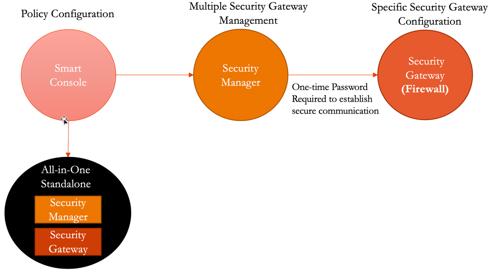

.. meta::
  :description: Firewall Network
  :keywords: AWS Transit Gateway, AWS TGW, TGW orchestrator, Aviatrix Transit network, Transit DMZ, Egress, Firewall

=========================================================
Example Config for Check Point VM in AWS 
=========================================================

In this document, we provide an example to set up the Check Point Security Gateway instance for you to validate that packets are indeed sent to the Check Point Security Gateway for VPC-to-VPC and from VPC to internet traffic inspection.

.. note::
    Firewall and Security Gateway word will be used interchangeably in this document. Both refers to Check Point Security Gateway product.

Prerequisites
----------------

Before you start, make sure you meet the basic requirements:

    - Basic Check Point Architecture Understanding
    - Check Point CloudGuard IaaS product is subscribed in AWS Marketplace

The following Check Point AMIs and software versions are supported.

==========================================================================             ==========
**Supported AMI Name**                                                                 **Software Version**
==========================================================================             ==========
CloudGuard IaaS Next-Gen Firewall with Threat Prevention & SandBlast BYOL              R80.40, R80.30
CloudGuard IaaS Next-Gen Firewall with Thread Prevention                               R80.40, R80.30
CloudGuard IaaS All-In-One R80.40                                                      R80.40 
==========================================================================             ==========

Basic Check Point architecture is shown below:

|cp_arch_reference|

In this document, we provide an example to set up the Check Point Firewall instance for you to validate that packets are indeed sent to the Check Point Firewall for VPC-to-VPC and from VPC to internet traffic inspection.

The Aviatrix Firewall Network (FireNet) workflow launches a Check Point Firewall instance at `this step <https://docs.aviatrix.com/HowTos/firewall_network_workflow.html#launching-and-associating-firewall-instance>`_. 

After the launch is complete, the console displays the Check Point Firewall instance with its public IP address of management/egress interface for you to log in to the console.

Here is the Firewall information in this example for your reference. Please adjust it depending on your requirements.

.. note::
    Firewall Image other then Check Point CloudGuard IaaS All-In-One requires a Check Point Security Management to manage firewall polices. See the `Check Point Azure Example <https://docs.aviatrix.com/HowTos/config_CheckPointAzure.html>`_ for more information.

==========================================      ==========
**Example setting**                             **Example value**
==========================================      ==========
Firewall Image                                  Check Point CloudGuard IaaS All-In-One R80.40
Firewall Image Version                          R80.40-294.581
Firewall Instance Size                          m5.large
Egress Interface Subnet                         Select the subnet whose name contains "FW-ingress-egress."
Key Pair Name (Optional)                        The .pem file name for SSH access to the firewall instance.
Attach                                          Check
==========================================      ==========

.. note::

  Check Point Firewall instance has 2 interfaces as described below. Additionally, firewall instance eth1 is on the same subnet as FireNet Gateway eth2 interface.

========================================================         ===============================          ================================
**Check Point VM instance interfaces**                             **Description**                          **Inbound Security Group Rule**
========================================================         ===============================          ================================
eth0 (on subnet -Public-FW-ingress-egress-AZ-a)                  Egress or Untrusted interface            Allow ALL 
eth1 (on subnet -dmz-firewall)                                   LAN or Trusted interface                 Allow ALL (Do not change)
========================================================         ===============================          ================================

Below are the steps for initial setup.

Downloading Check Point Firewall Access Key
-------------------------------------------------------

After `this step <https://docs.aviatrix.com/HowTos/firewall_network_workflow.html#launching-and-associating-firewall-instance>`_ in the FireNet workflow is completed, click **Download** to download the .pem file.

If you get a download error, usually it means the Check Point Firewall instance is not ready. Wait until it is ready, refresh the browser and then try again.

|v2_avx_pem_file_download|

Setting up Check Point Gateway (Firewall) SSH login Using Password
-----------------------------------------------------------------------------------

For Metered AMI, open a terminal and run the following command.

.. tip ::

  Once you download the .pem file, change the file permission to 600. It usually takes 5 to 10 minutes for the Check Point Gateway to be ready. Once SSH into the Check Point Gateway using the proper keys and the user “admin,” only few commands will be required to enable ssh for user "admin."

::

  ssh -i <private_key.pem> admin@<public-ip_address>
  set expert-password
  Enter new expert password:
  Enter new expert password (again):
  gw-358e82> expert
  Enter expert password:

  Warning! All configurations should be done through clish
  You are in expert mode now.

  [Expert@gw-358e82:0]# sed -i 's/PasswordAuthentication no/PasswordAuthentication yes/' /etc/ssh/sshd_config
  [Expert@gw-358e82:0]# sed -i 's/PermitRootLogin forced-commands-only/PermitRootLogin yes/' /etc/ssh/sshd_config
  [Expert@gw-358e82:0]# service sshd reload
  Reloading sshd:                                            [  OK  ]
  [Expert@gw-358e82:0]# exit

Terminate the SSH session.

Logging in to the Check Point Firewall Gaia Portal
-------------------------------------------------------------

After launch is completed, go back to the Controller, Firewall Network > Setup > `Step 2a <https://docs.aviatrix.com/HowTos/firewall_network_workflow.html#launching-and-associating-firewall-instance>`_ and click on the Management UI as shown below.

|v2_avx_management_UI|

The URL takes you to the Check Point Firewall Gaia Portal you just launched.

|v2_cp_login_UI|

.. note::

  For initial Check Point login information, go to `Credentials for Check Point Initial Login <https://aviatrix.zendesk.com/hc/en-us/articles/4417552852109>`_. You must be registered to access the Aviatrix Customer Support website. If you are not already registered, you can sign-up at https://support.aviatrix.com.

Starting from Release 5.4, launching Check Point firewall instances from the Aviatrix Controller automatically initiates its onboarding process. For initial login information, go to `Credentials for Check Point Initial Login <https://aviatrix.zendesk.com/hc/en-us/articles/4417552852109>`_. You must be registered to access the Aviatrix Customer Support website. If you are not already registered, you can sign-up at https://support.aviatrix.com. 

Initializing and Logging in to the Check Point Firewall via Gaia Portal
--------------------------------------------------------------------------------------

First time login shows the **"Check Point First Time Configuration Wizard"** screen as shown below.

|v2_CheckPoint_Gaia_Portal_Wizard_01|

Click **Next**, **Next** and continue until the **Finish** button, no need to configure anything in the configuration wizard.

|v2_CheckPoint_Gaia_Portal_Wizard_02|

|v2_CheckPoint_Gaia_Portal_Wizard_12|

.. important::
    Aviatrix Controller automatically configures the Check Point interfaces and RFC1918 static routes which is required for FireNet feature, so, initialize wizard configurations are no longer required but we need to click **Next** on each window to initialize the firewall properly.

After the initialization is completed, users will be navigated to the Check Point Firewall Gaia Portal Overview page as below.

|v2_CheckPoint_Gaia_Portal_Overview|

Go to the page Network Management > Network Interfaces to review eth0 (WAN) and eth1 (LAN) configuration as shown below.

|cp_firewall_interfaces_aws|

Review static routes RFC 1918 which is configured on LAN port, the purpose of those static route is to send the packets back to the Gateway (GW).

Those static routes could be reviewed on the page Network Management -> IPv4 Static Routes.

|cp_firewall_static_routes_aws|

Routes can also be reviewed by clicking **Monitoring** on the page Network Management > IPv4 Static Routes.

|cp_firewall_routes_monitoring_aws|

(Optional) Firewall Vendor Integration
-----------------------------------------------

Go to Aviatrix Controller > Firewall Network > Vendor Integration and complete the step as shown below:

|v2_vendor_integration_AWS|

Click **Save**, **Show** and **Sync** respectively.

This automatically set up  the non-RFC 1918 routes between Aviatrix Gateway and Vendor’s firewall instance in this case Check Point. This can also be done manually through Cloud Portal and/or Vendor’s Management tool.

Downloading and Installing the SmartConsole
--------------------------------------------------------

.. important::
    Check Point Single Gateway 'All-In-One' image is used in this example which do not require Check Point Security Manager. All other Gateway images require Check Point Security Manager. If you are not using 'All-In-One' image then skip this step and follow the `Step 4 & Step 5 <https://docs.aviatrix.com/HowTos/config_CheckPointAzure.html#download-and-install-the-smartconsole>`_ in a given link.

Downloading the Check Point SmartConsole
****************************************

Log in to the Check Point Gateway and download the SmartConsole with version R80.40 on Windows-based computer.

  Option 1: click **Download Now!** with the message "Manage Software Blades using SmartConsole" on the Overview page as shown below. 

|v2_CheckPoint_Gaia_Portal_SmartConsole_DL|

  Option 2: download it by using this link `R80.40 <https://supportcenter.checkpoint.com/supportcenter/portal?action=portlets.DCFileAction&eventSubmit_doGetdcdetails=&fileid=101086>`_.

Installing and Logging into the SmartConsole
****************************************

Install the SmartConsole and login into it with the Gaia Portal username, password and IP Address of Check Point Gateway.

|smart_console_login_aws|

|smartconsole_gateway_login_aws|

Moreover, execute the function "Get Interfaces With Topology" to sync up the settings that we have configured via Gaia Portal.

1. Select **Gateways & Servers** on the left.
2. Double-click on the Check Point Firewall.
3. Select **Network Management** on left.
4. Click **Get Interfaces** to expand options.
5. Click **Get Interfaces With Topology**.
6. Click **Yes**.
7. Review the Get Topology Results which should match to the settings that we have configured via Gaia Portal.
8. Click **Accept**.

|v2_CheckPoint_SmartConsole_syncup_01|

|v2_CheckPoint_SmartConsole_syncup_02|

Go to Security Policies > Access Control > Policy and click **Install Policy** and then **Install** to commit the settings.

|install_policy_aws|

Configuring the Basic Traffic Policy to Allow Traffic VPC-to-VPC
--------------------------------------------------------------------------------

In this step, we will configure a basic traffic security policy that allows traffic to pass through the firewall.

From Security Policies > Access Control > Policy, configure a policy by either modifying the default Cleanup rule or Add a new rule above the default rule.

=======================   ===============================================
**Field**                 **Value**
=======================   ===============================================
Name                      Configure any name for this policy (i.e. allow-all)
Source                    Any
Destination               Any
VPN                       Any
Service & Applications    Any
Action                    Accept
Track                     Log
=======================   ===============================================

|v2_CheckPoint_policy_vpc_to_vpc|

Click **Install Policy** and then **Install** to commit the settings.

|v2_CheckPoint_policy_vpc_to_vpc_install|

[Optional] Configuring the Basic Traffic Policy to Allow Traffic VPC to Internet
-----------------------------------------------------------------------------------------------

In this step, we will configure a basic traffic security policy that allows Internet traffic to pass through the firewall. Given that Aviatrix Gateways will only forward traffic from the TGW to the LAN port of the Firewall, we can simply set our policy condition to match any packet that is going in of LAN interface and going out of WAN interface.

.. important::
  Enable `Egress inspection <https://docs.aviatrix.com/HowTos/firewall_network_faq.html#how-do-i-enable-egress-inspection-on-firenet>`_ feature on FireNet.

1. First, go back to the Aviatrix Controller. Navigate to Firewall Network > Advanced. 
2. Click the skewer/three dot button. 
3. Scroll down to Egress through Firewall and click **Enable** button. 
4. Verify the Egress status on the page Firewall Network > Advanced.

|cp_egress_inspection_aws|

Second, go back to the Check Point Firewall SmartConsole. Navigate to the page "Gateways & Servers" and then double-click on the gateway itself to enable NAT function as the following screenshot.

5. Click **NAT**.
6. Mark the **Hide internal networks behind the Gateway's external IP** checkbox.
7. Click **OK**.
8. Click **Install Policy**.

|v2_CheckPoint_policy_vpc_to_internet_nat_enabled|

.. important::

  NAT function needs to be enabled on the Check Point FW interface eth0 for this VPC to Internet policy. Please refer to `Check Point's NAT instruction <https://sc1.checkpoint.com/documents/R76/CP_R76_Firewall_WebAdmin/6724.htm>`_ for detail.

**[Optional]** If you have default "Cleanup rule", then navigate to Security Policies > Access Control > Policy and inject a new rule for Internet Policy on top of the default Cleanup rule.

=======================   ===============================================
**Field**                 **Value**
=======================   ===============================================
Name                      Configure any name for this policy (i.e. Internet-Policy)
Source                    Any
Destination               Select the object with All_internet
VPN                       Any
Service & Applications    Any
Action                    Accept
Track                     Log
=======================   ===============================================

Click **Install Policy** and then **Install** to commit the settings.

|cp_policy_vpc_to_internet_aws|

After validating that your traffic is being routed through your firewall instances, you can customize the security policy to tailor to your requirements.

Ready to Go
--------------------

Now your firewall instance is configured and ready to receive packets.

Next step is to validate your configurations and polices using FlightPath and Diagnostic Tools (ping, traceroute etc.).

Viewing Traffic Log
------------------------------

You can view if traffic is forwarded to the firewall instance by logging in to the Check Point Firewall SmartConsole. Go to the Logs & Monitor page.

For VPC-to-VPC traffic:
***********************

Launch one instance in PROD Spoke VPC and DEV Spoke VPC. Start ping packets from a instance in DEV Spoke VPC to the private IP of another instance in PROD Spoke VPC. The ICMP traffic should go through the firewall and be inspected in firewall.

|v2_CheckPoint_view_traffic_log_vpc_to_vpc|

[Optional] For VPC to Internet traffic:
***************************************

Launch a private instance in the Spoke VPC (i.e. PROD Spoke VPC) and start ping packets from the private instance towards Internet (e.g 8.8.8.8) to verify the egress function. The ICMP traffic should go through, and get inspected on firewall.

|v2_CheckPoint_view_traffic_log_vpc_to_internet|

.. |cp_policy_vpc_to_internet_aws| image:: config_Checkpoint_media/cp_policy_vpc_to_internet_aws.png
   :scale: 30%
.. |cp_egress_inspection_aws| image:: config_Checkpoint_media/cp_egress_inspection_aws.png
   :scale: 40%
.. |policy_installed_aws| image:: config_Checkpoint_media/policy_installed_aws.png
   :scale: 40%
.. |smartconsole_gateway_login_aws| image:: config_Checkpoint_media/smartconsole_gateway_login_aws.png
   :scale: 30%
.. |install_policy_aws| image:: config_Checkpoint_media/install_policy_aws.png
   :scale: 30%
.. |smart_console_login_aws| image:: config_Checkpoint_media/smart_console_login_aws.png
   :scale: 40%
.. |v2_avx_pem_file_download| image:: config_Checkpoint_media/v2_avx_pem_file_download.png
   :scale: 20%
.. |v2_vendor_integration_AWS| image:: config_Checkpoint_media/v2_vendor_integration_AWS.png
   :scale: 30%
.. |v2_pem_file_download| image:: config_Checkpoint_media/v2_pem_file_download.png
   :scale: 40%
.. |v2_avx_management_UI| image:: config_Checkpoint_media/v2_avx_management_UI.png
   :scale: 30%
.. |v2_cp_login_UI| image:: config_Checkpoint_media/v2_cp_login_UI.png
   :scale: 40%
.. |v2_CheckPoint_change_password| image:: config_Checkpoint_media/v2_CheckPoint_change_password.png
   :scale: 60%
.. |v2_CheckPoint_Gaia_Portal_Wizard_01| image:: config_Checkpoint_media/v2_CheckPoint_Gaia_Portal_Wizard_01.png
   :scale: 40% 
.. |v2_CheckPoint_Gaia_Portal_Wizard_02| image:: config_Checkpoint_media/v2_CheckPoint_Gaia_Portal_Wizard_02.png
   :scale: 40% 
.. |cp_firewall_interfaces_aws| image:: config_Checkpoint_media/cp_firewall_interfaces_aws.png
   :scale: 40%   
.. |cp_firewall_static_routes_aws| image:: config_Checkpoint_media/cp_firewall_static_routes_aws.png
   :scale: 40% 
.. |cp_firewall_routes_monitoring_aws| image:: config_Checkpoint_media/cp_firewall_routes_monitoring_aws.png
   :scale: 40% 
.. |v2_CheckPoint_Gaia_Portal_Wizard_12| image:: config_Checkpoint_media/v2_CheckPoint_Gaia_Portal_Wizard_12.png
   :scale: 40% 
.. |v2_CheckPoint_Gaia_Portal_Overview| image:: config_Checkpoint_media/v2_CheckPoint_Gaia_Portal_Overview.png
   :scale: 40% 
.. |v2_CheckPoint_Gaia_Portal_Configuration_eth0_WAN| image:: config_Checkpoint_media/v2_CheckPoint_Gaia_Portal_Configuration_eth0_WAN.png
   :scale: 40% 
.. |v2_CheckPoint_Gaia_Portal_Configuration_eth1_LAN| image:: config_Checkpoint_media/v2_CheckPoint_Gaia_Portal_Configuration_eth1_LAN.png
   :scale: 40% 
.. |v2_CheckPoint_static_routes_01| image:: config_Checkpoint_media/v2_CheckPoint_static_routes_01.png
   :scale: 40%
.. |v2_CheckPoint_static_routes_02| image:: config_Checkpoint_media/v2_CheckPoint_static_routes_02.png
   :scale: 40%
.. |v2_CheckPoint_static_routes_review_01| image:: config_Checkpoint_media/v2_CheckPoint_static_routes_review_01.png
   :scale: 40%
.. |v2_CheckPoint_static_routes_review_02| image:: config_Checkpoint_media/v2_CheckPoint_static_routes_review_02.png
   :scale: 40%
.. |v2_CheckPoint_Gaia_Portal_SmartConsole_DL| image:: config_Checkpoint_media/v2_CheckPoint_Gaia_Portal_SmartConsole_DL.png
   :scale: 40% 
.. |v2_CheckPoint_Gaia_Portal_SmartConsole_install| image:: config_Checkpoint_media/v2_CheckPoint_Gaia_Portal_SmartConsole_install.png
   :scale: 40% 
.. |v2_CheckPoint_SmartConsole_syncup_01| image:: config_Checkpoint_media/v2_CheckPoint_SmartConsole_syncup_01.png
   :scale: 40%
.. |v2_CheckPoint_SmartConsole_syncup_02| image:: config_Checkpoint_media/v2_CheckPoint_SmartConsole_syncup_02.png
   :scale: 30%
.. |v2_CheckPoint_policy_vpc_to_vpc| image:: config_Checkpoint_media/v2_CheckPoint_policy_vpc_to_vpc.png
   :scale: 20%
.. |v2_CheckPoint_policy_vpc_to_vpc_install| image:: config_Checkpoint_media/v2_CheckPoint_policy_vpc_to_vpc_install.png
   :scale: 20%
.. |v2_avx_egress_inspection| image:: config_FortiGate_media/v2_avx_egress_inspection.png
   :scale: 20%
.. |v2_CheckPoint_policy_vpc_to_internet_nat_enabled| image:: config_Checkpoint_media/v2_CheckPoint_policy_vpc_to_internet_nat_enabled.png
   :scale: 30%
.. |v2_CheckPoint_policy_vpc_to_internet| image:: config_Checkpoint_media/v2_CheckPoint_policy_vpc_to_internet.png
   :scale: 20%
.. |v2_CheckPoint_view_traffic_log_vpc_to_vpc| image:: config_Checkpoint_media/v2_CheckPoint_view_traffic_log_vpc_to_vpc.png
   :scale: 30%
.. |v2_CheckPoint_view_traffic_log_vpc_to_internet| image:: config_Checkpoint_media/v2_CheckPoint_view_traffic_log_vpc_to_internet.png
   :scale: 30%

.. disqus::
