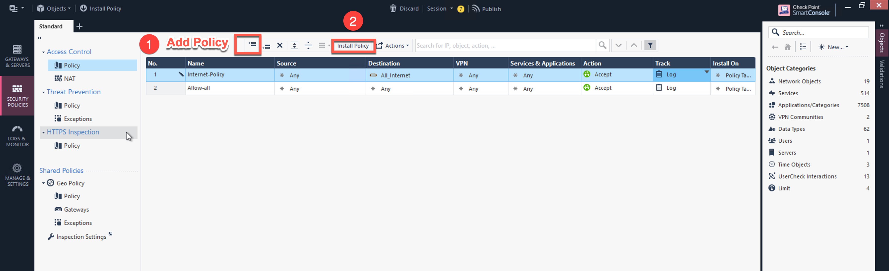
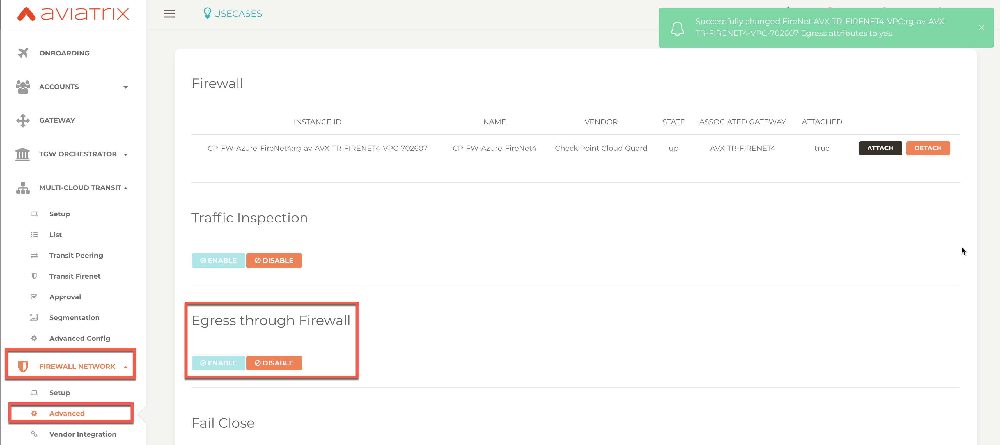
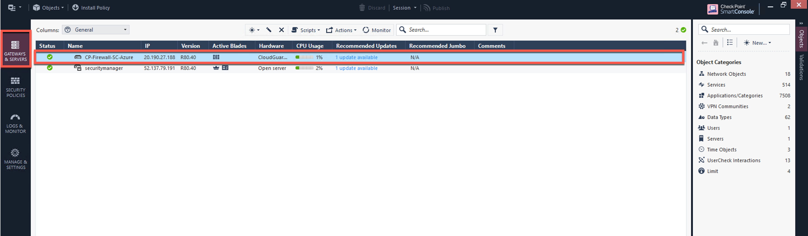
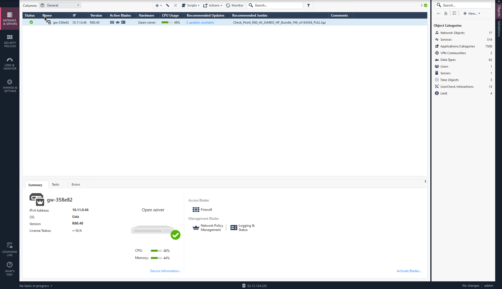
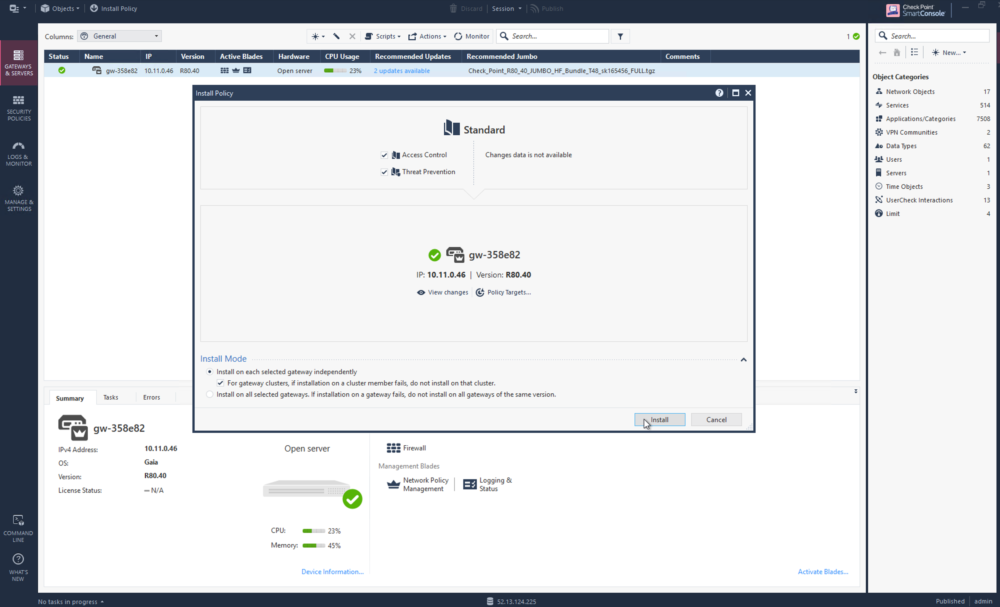
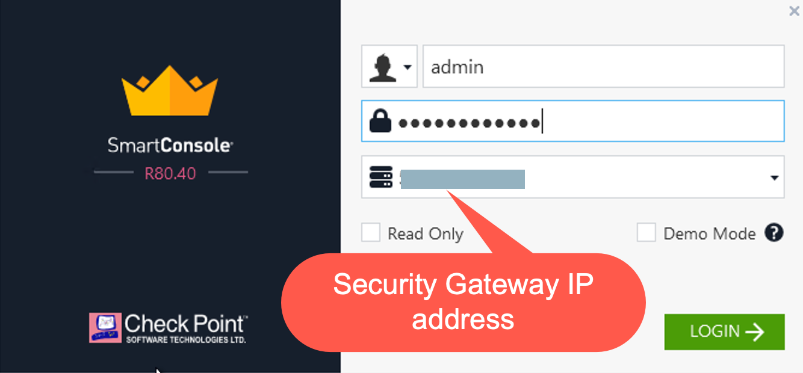
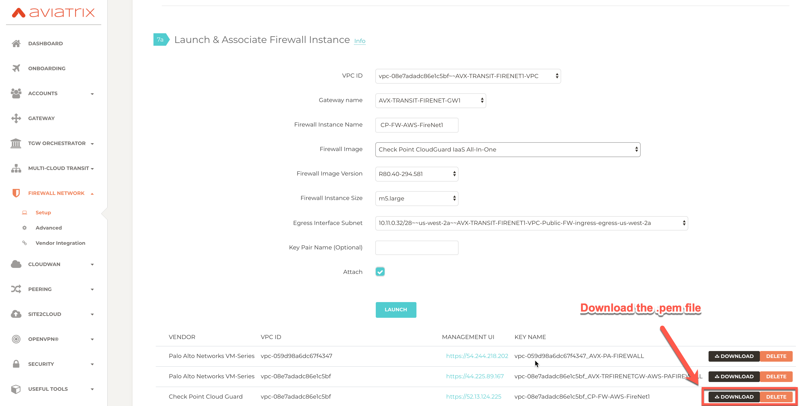

.. meta::
  :description: Firewall Network
  :keywords: AWS Transit Gateway, AWS TGW, TGW orchestrator, Aviatrix Transit network, Transit DMZ, Egress, Firewall

=========================================================
Example Config for CheckPoint VM in AWS 
=========================================================

The following CheckPoint AMIs and software versions are supported. 

==========================================================================             ==========
**Supported AMI Name**                                                                 **Software Version**
==========================================================================             ==========
CloudGuard IaaS Next-Gen Firewall with Threat Prevention & SandBlast BYOL              R80.40, R80.30
CloudGuard IaaS Next-Gen Firewall with Thread Prevention                               R80.40, R80.30
CloudGuard IaaS All-In-One R80.40                                                      R80.40 
==========================================================================             ==========

In this document, we provide an example to set up the CheckPoint Firewall instance for you to validate that packets are indeed sent to the CheckPoint Firewall for VPC to VPC and from VPC to internet traffic inspection.

The Aviatrix Firewall Network (FireNet) workflow launches a CheckPoint Firewall instance at `Step 7a <https://docs.aviatrix.com/HowTos/firewall_network_workflow.html#a-launch-and-associate-firewall-instance>`_. 

After the launch is complete, the console displays the CheckPoint Firewall instance with its public IP address of management/egress interface for you to login to the console.

Here is the Firewall information in this example for your reference. Please adjust it depending on your requirements.

.. note::
    Firewall Image other then CheckPoint CloudGuard IaaS All-In-One requires a Check Point Security Management to manage firewall polices. See CheckPoint Azure Example for more information.

==========================================      ==========
**Example setting**                             **Example value**
==========================================      ==========
Firewall Image                                  Check Point CloudGuard IaaS All-In-One R80.40
Firewall Image Version                          R80.40-294.581
Firewall Instance Size                          m5.large
Egress Interface Subnet                         Select the subnet whose name contains "FW-ingress-egress".
Key Pair Name (Optional)                        The .pem file name for SSH access to the firewall instance.
Attach                                          Check
==========================================      ==========

.. note::

  CheckPoint Firewall instance has 2 interfaces as described below. Additionally, firewall instance eth1 is on the same subnet as FireNet gateway eth2 interface.

========================================================         ===============================          ================================
**CheckPoint VM instance interfaces**                             **Description**                          **Inbound Security Group Rule**
========================================================         ===============================          ================================
eth0 (on subnet -Public-FW-ingress-egress-AZ-a)                  Egress or Untrusted interface            Allow ALL 
eth1 (on subnet -dmz-firewall)                                   LAN or Trusted interface                 Allow ALL (Do not change)
========================================================         ===============================          ================================

Below are the steps for initial setup.

1. Download CheckPoint Firewall Access Key
----------------------------------------------

After `Step 7a <https://docs.aviatrix.com/HowTos/firewall_network_workflow.html#a-launch-and-associate-firewall-instance>`_ is completed, you'll see the Download button as shown below. Click the button to download the .pem file.

If you get a download error, usually it means the CheckPoint Firewall instance is not ready. Wait until it is ready, refresh the browser and then try again.

|v2_avx_pem_file_download|

2. Setup CheckPoint Gateway (Firewall) SSH login using Password
---------------------------------------------------------------------------

For Metered AMI, open a terminal and run the following command.

.. tip ::

  Once you download the .pem file, change the file permission to 600. It usually takes 5 to 10 minutes for the Check Point Gateway to be ready. Once SSH into the Check Point Gateway using the proper keys and the user “admin”, only few commands will be required to enable ssh for user "admin".

::

  ssh -i <private_key.pem> admin@<public-ip_address>
  set expert-password
  Enter new expert password:
  Enter new expert password (again):
  gw-358e82> expert
  Enter expert password:

  Warning! All configurations should be done through clish
  You are in expert mode now.

  [Expert@gw-358e82:0]# sed -i 's/PasswordAuthentication no/PasswordAuthentication yes/' /etc/ssh/sshd_config
  [Expert@gw-358e82:0]# sed -i 's/PermitRootLogin forced-commands-only/PermitRootLogin yes/' /etc/ssh/sshd_config
  [Expert@gw-358e82:0]# service sshd reload
  Reloading sshd:                                            [  OK  ]
  [Expert@gw-358e82:0]# exit

Terminate the SSH session.

3. Login to CheckPoint Firewall Gaia Portal
----------------------------------------------

After launch is completed, go back to the Controller, Firewall Network -> Setup -> `Step 7a <https://docs.aviatrix.com/HowTos/firewall_network_workflow.html#a-launch-and-associate-firewall-instance>`_ and  Click on the `Management UI` as shown below.

|v2_avx_management_UI|

The URL takes you to the CheckPoint Firewall Gaia Portal you just launched.

|v2_cp_login_UI|

.. note::

  Login with Username **admin** and the password **Aviatrix123#**. Otherwise, ssh to firewall, configure the firewall password manually and then login via user-defined pasword.

4. Initialize and Login CheckPoint Firewall via Gaia Portal
-------------------------------------------------------------

First time login shows the **"Check Point First Time Configuration Wizard"** screen as shown below.

|v2_CheckPoint_Gaia_Portal_Wizard_01|

Click **"Next"**, **"Next"** and continue until the **"Finish"** button, no need to configure anything in the configuration wizard.

|v2_CheckPoint_Gaia_Portal_Wizard_02|

|v2_CheckPoint_Gaia_Portal_Wizard_12|

.. important::
    Aviatrix Controller automatically configures the Checkpoint interfaces and RFC1918 static routes which is required for FireNet feature, so, initialize wizard configurations are no longer required but we need to click Next on each window to initialize the firewall properly.

After the initialization is completed, users will be navigated to the CheckPoint Firewall Gaia Portal Overview page as below.

|v2_CheckPoint_Gaia_Portal_Overview|

Go to the page “Network Management -> Network Interfaces” to review eth0 (WAN) and eth1 (LAN) configuration as shown below.

|cp_firewall_interfaces_aws|

Review static routes RFC 1918 which is configured on LAN port, the purpose of those static route is to send the packets back to the Gateway (GW).

Those static routes could be reviewed on the page “Network Management -> IPv4 Static Routes”

|cp_firewall_static_routes_aws|

Routes can also be reviewed by clicking the button “Monitoring” on the page “Network Management -> IPv4 Static Routes”

|cp_firewall_routes_monitoring_aws|

5. (Optional) Firewall Vendor Integration
-------------------------------------------

Go to Aviatrix Controller –> Firewall Network –> Vendor Integration and complete the step as shown below:

|v2_vendor_integration_AWS|

Click **Save**, **Show** and **Sync** respectively.

This automatically set up  the non-RFC 1918 routes between Aviatrix Gateway and Vendor’s firewall instance in this case CheckPoint. This can also be done manually through Cloud Portal and/or Vendor’s Management tool.

6. Download and Install the SmartConsole
-------------------------------------------------

.. important::
    Check Point Single Gateway 'All-In-One' image is used in this example which do not require Check Point Security Manager. All other Gateway images require Check Point Security Manager. If you are not using 'All-In-One' image then skip this step and follow the `Step 4 & Step 5 <https://docs.aviatrix.com/HowTos/config_CheckPointAzure.html#download-and-install-the-smartconsole>`_ in a given link.

6.1 Download Check Point SmartConsole
****************************************

Login to the Check Point Gateway and download the SmartConsole with version R80.40 on Windows-based computer

  Option 1: click on the button "Download Now!" with message "Manage Software Blades using SmartConsole" on the Overview page as below. 

|v2_CheckPoint_Gaia_Portal_SmartConsole_DL|

  Option 2: download it by using this link `R80.40 <https://supportcenter.checkpoint.com/supportcenter/portal?action=portlets.DCFileAction&eventSubmit_doGetdcdetails=&fileid=101086>`_

6.2 Install and Login SmartConsole
****************************************

Install the SmartConsole and login into it with the Gaia Portal username, password and IP Address of Check Point Gateway.

|smart_console_login_aws|

|smartconsole_gateway_login_aws|

Moreover, execute the function "Get Interfaces With Topology" to sync up the settings that we have configured via Gaia Portal.

- Click on the link "GATEWAYS&SERVERS" on the left side
- Double click on the CheckPoint Firewall
- Click on the link "Network Management" on left side
- Click on the button "Get Interfaces.." to expand options
- Click on the button "Get Interfaces With Topology"
- Click on the button "Yes"
- Review the "Get Topology Results" which should match to the settings that we have configured via Gaia Portal
- Click on the button "Accept"

|v2_CheckPoint_SmartConsole_syncup_01|

|v2_CheckPoint_SmartConsole_syncup_02|

Click on the button "Install Policy" and then "Install" to commit the settings.

|install_policy_aws|

7. Configure basic traffic policy to allow traffic VPC to VPC
------------------------------------------------------------------

In this step, we will configure a basic traffic security policy that allows traffic to pass through the firewall.

Go to the page "SECURITY POLICIES -> Access Control -> Policy" and configure a policy by either modifying the default "Cleanup rule" or Add a new rule above the default rule.

=======================   ===============================================
**Field**                 **Value**
=======================   ===============================================
Name                      Configure any name for this policy (i.e. allow-all)
Source                    Any
Destination               Any
VPN                       Any
Service & Applications    Any
Action                    Accept
Track                     Log
=======================   ===============================================

|v2_CheckPoint_policy_vpc_to_vpc|

Click on the button "Install Policy" and then "Install" to commit the settings.

|v2_CheckPoint_policy_vpc_to_vpc_install|

8. [Optional] Configure basic traffic policy to allow traffic VPC to Internet
----------------------------------------------------------------------------------

In this step, we will configure a basic traffic security policy that allows internet traffic to pass through the firewall. Given that Aviatrix gateways will only forward traffic from the TGW to the LAN port of the Firewall, we can simply set our policy condition to match any packet that is going in of LAN interface and going out of WAN interface.

.. important::
  Enable `Egress inspection <https://docs.aviatrix.com/HowTos/firewall_network_faq.html#how-do-i-enable-egress-inspection-on-firenet>`_ feature on FireNet

First of all, go back to the Aviatrix Controller Console. Navigate to the page "Firewall Network -> Advanced". Click the skewer/three dot button. Scroll down to “Egress through Firewall” and click "Enable" button. Verify the Egress status on the page "Firewall Network -> Advanced".

|cp_egress_inspection_aws|

Secondly, go back to the CheckPoint Firewall SmartConsole. Navigate to the page "GATEWAYS&SERVERS" and then double-click on the gateway itself to enable NAT function as the following screenshot.

- Click on the button "NAT"
- Enable the checkbox "Hide internal networks behind the Gateway's external IP"
- Click the button "OK"
- Click the button "Install Policy"

|v2_CheckPoint_policy_vpc_to_internet_nat_enabled|

.. important::

  NAT function needs to be enabled on the CheckPoint FW interface eth0 for this VPC to Internet policy. Please refer to `Check Point's NAT instruction <https://sc1.checkpoint.com/documents/R76/CP_R76_Firewall_WebAdmin/6724.htm>`_ for detail.

**[Optional]** If you have default "Cleanup rule", then navigate to the page "SECURITY POLICIES -> Access Control -> Policy" and inject a new rule for Internet Policy on top of the default "Cleanup rule".

=======================   ===============================================
**Field**                 **Value**
=======================   ===============================================
Name                      Configure any name for this policy (i.e. Internet-Policy)
Source                    Any
Destination               Select the object with All_internet
VPN                       Any
Service & Applications    Any
Action                    Accept
Track                     Log
=======================   ===============================================

Click on the button "Install Policy" and then "Install" to commit the settings.

|cp_policy_vpc_to_internet_aws|

After validating that your traffic is being routed through your firewall instances, you can customize the security policy to tailor to your requirements.

9. Ready to go!
----------------

Now your firewall instance is configured and ready to receive packets!

Next step is to validate your configurations and polices using FlightPath and Diagnostic Tools (ping, traceroute etc.).

10. View Traffic Log
----------------------

You can view if traffic is forwarded to the firewall instance by logging in to the CheckPoint Firewall SmartConsole. Go to the page "LOGS & MONITOR". 

For VPC to VPC traffic:
***********************

Launch one instance in PROD Spoke VPC and DEV Spoke VPC. Start ping packets from a instance in DEV Spoke VPC to the private IP of another instance in PROD Spoke VPC. The ICMP traffic should go through the firewall and be inspected in firewall.

|v2_CheckPoint_view_traffic_log_vpc_to_vpc|

[Optional] For VPC to Internet traffic:
***************************************

Launch a private instance in the Spoke VPC (i.e. PROD Spoke VPC) and start ping packets from the private instance towards Internet (e.g 8.8.8.8) to verify the egress function. The ICMP traffic should go through, and get inspected on firewall.

|v2_CheckPoint_view_traffic_log_vpc_to_internet|

.. |v2_vendor_integration_AWS| image:: config_Checkpoint_media/v2_vendor_integration_AWS.png
   :scale: 40%
.. |v2_pem_file_download| image:: config_Checkpoint_media/v2_pem_file_download.png
   :scale: 40%
.. |v2_avx_management_UI| image:: config_Checkpoint_media/v2_avx_management_UI.png
   :scale: 40%
.. |v2_cp_login_UI| image:: config_Checkpoint_media/v2_cp_login_UI.png
   :scale: 40%
.. |v2_CheckPoint_change_password| image:: config_Checkpoint_media/v2_CheckPoint_change_password.png
   :scale: 60%
.. |v2_CheckPoint_Gaia_Portal_Wizard_01| image:: config_Checkpoint_media/v2_CheckPoint_Gaia_Portal_Wizard_01.png
   :scale: 40% 
.. |v2_CheckPoint_Gaia_Portal_Wizard_02| image:: config_Checkpoint_media/v2_CheckPoint_Gaia_Portal_Wizard_02.png
   :scale: 40% 
.. |cp_firewall_interfaces_aws| image:: config_Checkpoint_media/cp_firewall_interfaces_aws.png
   :scale: 40%   
.. |cp_firewall_static_routes_aws| image:: config_Checkpoint_media/cp_firewall_static_routes_aws.png
   :scale: 40% 
.. |cp_firewall_routes_monitoring_aws| image:: config_Checkpoint_media/cp_firewall_routes_monitoring_aws.png
   :scale: 40% 
.. |v2_CheckPoint_Gaia_Portal_Wizard_12| image:: config_Checkpoint_media/v2_CheckPoint_Gaia_Portal_Wizard_12.png
   :scale: 40% 
.. |v2_CheckPoint_Gaia_Portal_Overview| image:: config_Checkpoint_media/v2_CheckPoint_Gaia_Portal_Overview.png
   :scale: 40% 
.. |v2_CheckPoint_Gaia_Portal_Configuration_eth0_WAN| image:: config_Checkpoint_media/v2_CheckPoint_Gaia_Portal_Configuration_eth0_WAN.png
   :scale: 40% 
.. |v2_CheckPoint_Gaia_Portal_Configuration_eth1_LAN| image:: config_Checkpoint_media/v2_CheckPoint_Gaia_Portal_Configuration_eth1_LAN.png
   :scale: 40% 
.. |v2_CheckPoint_static_routes_01| image:: config_Checkpoint_media/v2_CheckPoint_static_routes_01.png
   :scale: 40%
.. |v2_CheckPoint_static_routes_02| image:: config_Checkpoint_media/v2_CheckPoint_static_routes_02.png
   :scale: 40%
.. |v2_CheckPoint_static_routes_review_01| image:: config_Checkpoint_media/v2_CheckPoint_static_routes_review_01.png
   :scale: 40%
.. |v2_CheckPoint_static_routes_review_02| image:: config_Checkpoint_media/v2_CheckPoint_static_routes_review_02.png
   :scale: 40%
.. |v2_CheckPoint_Gaia_Portal_SmartConsole_DL| image:: config_Checkpoint_media/v2_CheckPoint_Gaia_Portal_SmartConsole_DL.png
   :scale: 40% 
.. |v2_CheckPoint_Gaia_Portal_SmartConsole_install| image:: config_Checkpoint_media/v2_CheckPoint_Gaia_Portal_SmartConsole_install.png
   :scale: 40% 
.. |v2_CheckPoint_SmartConsole_syncup_01| image:: config_Checkpoint_media/v2_CheckPoint_SmartConsole_syncup_01.png
   :scale: 40%
.. |v2_CheckPoint_SmartConsole_syncup_02| image:: config_Checkpoint_media/v2_CheckPoint_SmartConsole_syncup_02.png
   :scale: 40%
.. |v2_CheckPoint_policy_vpc_to_vpc| image:: config_Checkpoint_media/v2_CheckPoint_policy_vpc_to_vpc.png
   :scale: 20%
.. |v2_CheckPoint_policy_vpc_to_vpc_install| image:: config_Checkpoint_media/v2_CheckPoint_policy_vpc_to_vpc_install.png
   :scale: 20%
.. |v2_avx_egress_inspection| image:: config_FortiGate_media/v2_avx_egress_inspection.png
   :scale: 20%
.. |v2_CheckPoint_policy_vpc_to_internet_nat_enabled| image:: config_Checkpoint_media/v2_CheckPoint_policy_vpc_to_internet_nat_enabled.png
   :scale: 20%
.. |v2_CheckPoint_policy_vpc_to_internet| image:: config_Checkpoint_media/v2_CheckPoint_policy_vpc_to_internet.png
   :scale: 20%
.. |v2_CheckPoint_view_traffic_log_vpc_to_vpc| image:: config_Checkpoint_media/v2_CheckPoint_view_traffic_log_vpc_to_vpc.png
   :scale: 20%
.. |v2_CheckPoint_view_traffic_log_vpc_to_internet| image:: config_Checkpoint_media/v2_CheckPoint_view_traffic_log_vpc_to_internet.png
   :scale: 20%
.. disqus::
