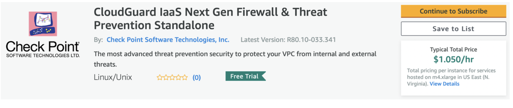
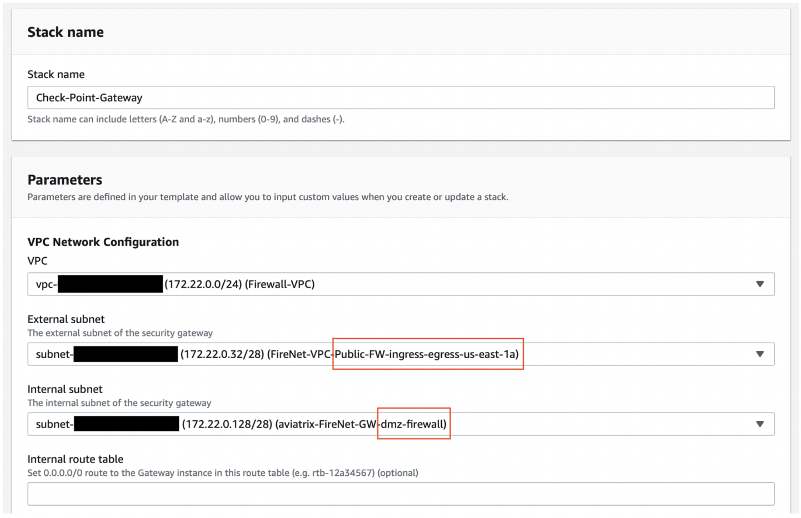
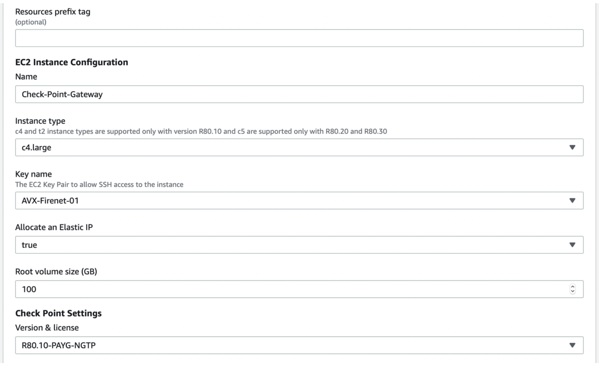
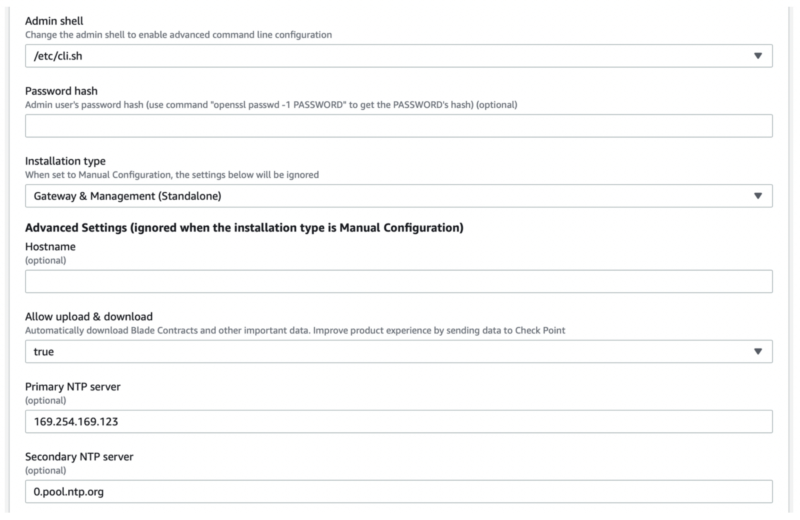
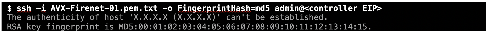
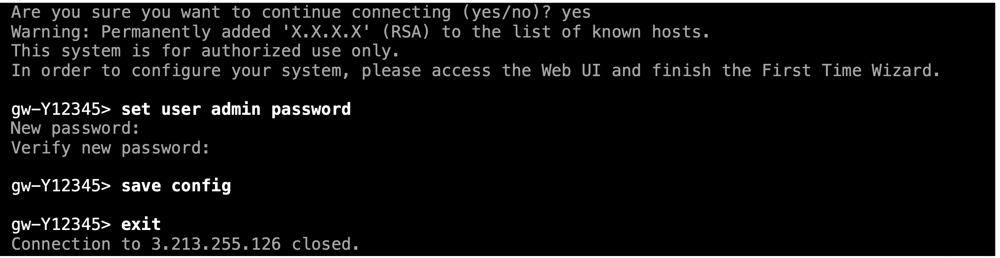
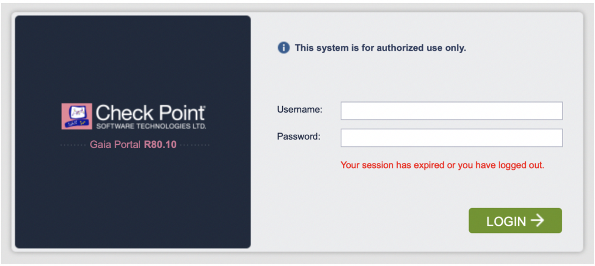
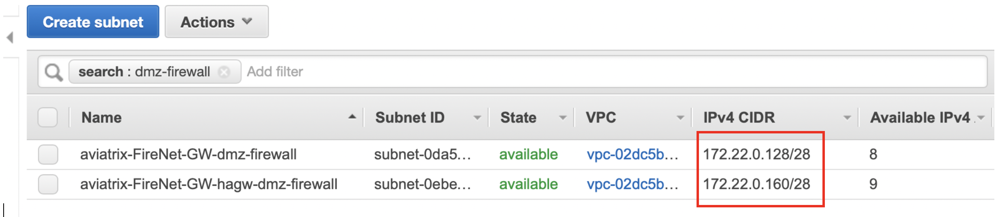
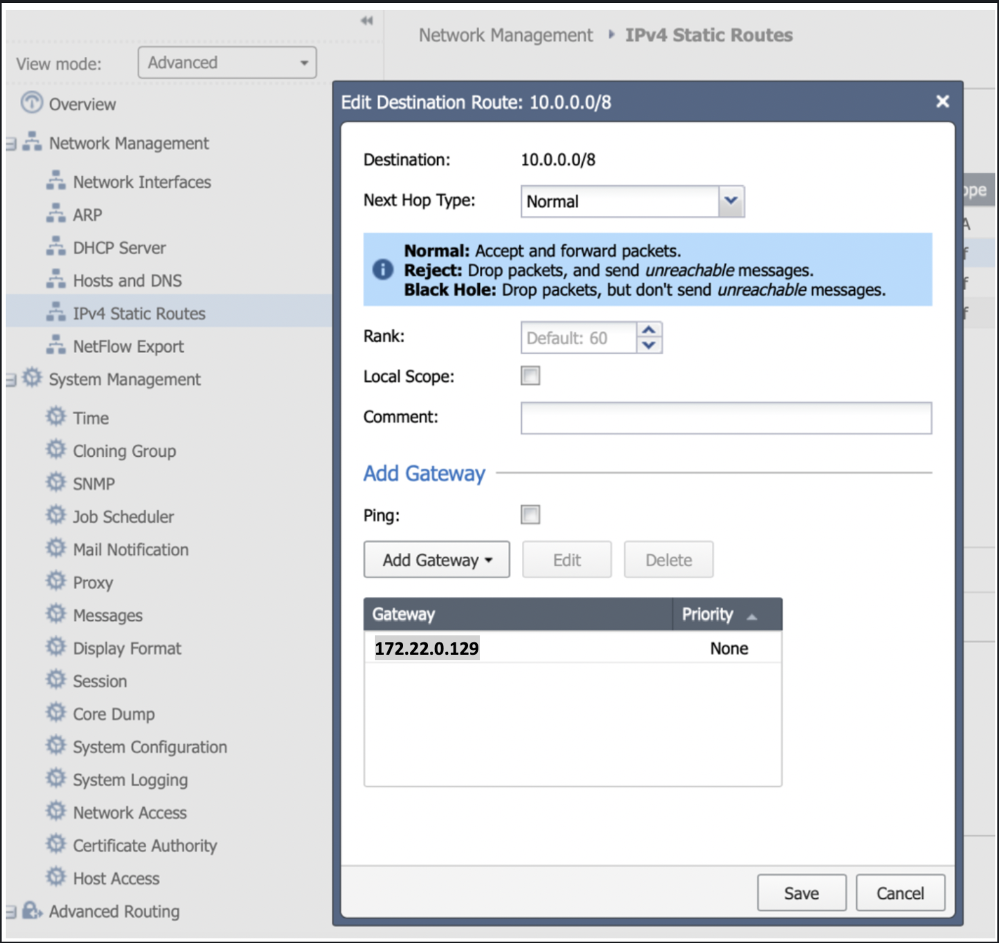

.. meta::
  :description: Firewall Network
  :keywords: AWS Transit Gateway, AWS TGW, TGW orchestrator, Aviatrix Transit network, Transit DMZ, Egress, Firewall

**A few important notes before we launch the instance:**

1. This document complements the existing deployment guide that was designed to help you to associate a Palo Alto VM-Series. We are going to assume that you have completed all the steps from 1 to 6 before launching this firewall instance. Step 7a is not necessary as it is Palo Alto VM-Series specific.

2. Currently we do not have a full integration between the Aviatrix dashboard and the CloudGuard, which means that you will not be able to update the firewall routing table via API, as it is currently possible with the Palo Alto VM-Series.

3. The Check Point CloudGuard has mainly two types of deployments – standalone or distributed – which basically means whether you are going to have both the Gateway and the Management Server on the same instance. Since we currently CANNOT configure the firewall policies without the management server, we need to configure a management server. Also, we need to consider that the Aviatrix gateways within the FireNet VPC will monitor whether the Check Point gateway instance is up or not. That being said, only versions R77.30 and R80.10 support standalone deployments, while another possibility is to have a single R80.20 Management Server inside the management subnet to control multiple CloudGuard instances (although this is not part of the scope. For more information, try this `link <https://supportcenter.checkpoint.com/supportcenter/portal/user/anon/page/default.psml/media-type/html?action=portlets.DCFileAction&eventSubmit_doGetdcdetails=&fileid=24831>`_.

4. For more information on the differences across the available models/versions we suggest the following `link <https://supportcenter.checkpoint.com/supportcenter/portal?eventSubmit_doGoviewsolutiondetails=&solutionid=sk95746>`_. Check Point has recommended the upgrade to R80 as part of their roadmap. For more information regarding such advisories, please check this `link <https://supportcenter.checkpoint.com/supportcenter/portal?eventSubmit_doGoviewsolutiondetails=&solutionid=sk110980>`_.

5. For the purpose of this installation guide, we are going to consider only version R80.10 in standalone mode using the latest CloudFormation template available at the time this document was written

=========================================================
Example Config for Checkpoint VM in AWS
=========================================================
7b.1  Pre-requisites:

•	You have completed all steps 1 through 6 from the Firewall network page

•	You have created and downloaded your pem keys to launch this/these instance(s)

•	You have chosen your subscription model (BYOL vs PAYG). For more information on this topic, please check page 11 of the Check Point `documentation <https://dl3.checkpoint.com/paid/eb/ebb444ce93242cf3f80f76637678906b/CP_R77.30_SecurityGateway_AmazonVPC_GettingStartedGuide.pdf?HashKey=1566934906_1431fda9758e9cd8af6f4fc7396025f8&xtn=.pdf>`_.

•	You have access to a Windows client so you can run the SmartConsole, which is provided by Check Point and is specific per version of CloudGuard being installed. You can use this link: `R80.10 <https://supportcenter.checkpoint.com/supportcenter/portal?eventSubmit_doGoviewsolutiondetails=&solutionid=sk119612>`_.
7b.2  Go to aws.amazon.com/marketplace and search for the chosen instance model/version in AWS Marketplace. Click “Continue to Subscribe”

|image1|

7b.3  On the next screen, accept the terms and you should be able to continue. If you have chosen any of the R80 versions, you should be able to launch it using one of the CloudFormation `templates <https://supportcenter.checkpoint.com/supportcenter/portal?eventSubmit_doGoviewsolutiondetails=&solutionid=sk111013>`_.. For the purpose of this guide, we are going to use template 15 (standalone into existing VPC). If you a Management Server deployed already you should use template 2 instead.

7b.4	This template will configure the first interface (eth0) as “external” and the second (eth1) as “internal”. For consistency purposes we suggest keeping eth0 as egress and management and eth1 for;

7b.5	The template should look like this (if you have selected existing VPC). Please make sure your interfaces are in the same AZ:

|image2|

7b.6	For the next part of the template, please make sure you have created/downloaded your pem key, as well as selected the proper instance size

        For information on the networking features of each instance type, we recommend the following `link <https://aws.amazon.com/ec2/instance-types/>`_.

|image3|
|image4|
|image5|

7b.7	After you click on “Create stack” you should go to CloudFormation to monitor the stack creation. Once the status is set to “CREATE_COMPLETE” you should be able to move on. Any different warning can be troubleshooted by checking the details in the “Outputs” tab are they are usually self-explanatory.

7b.8	Now go to the EC2 instances to monitor the status check – once they are done, you should be able to SSH into the instance
|image6|

7b.9	Now that the instance is up – open your preferred terminal and SSH into the instance using the proper keys and the user “admin”. It takes only two commands to set a new password:

|image7|
|image8|
7b.10	Please open a browser and go to https://management_eip/ to log into the Gaia Portal. You should be prompted with a screen like the one below. Just enter the user name as admin and the password you have just configured on the previous step.
|image9|

7b.11	Go to Network Management > Network Interfaces. You should simply double-check whether all interfaces are active and with a valid IP address;

7b.12	 The next step is to update the route table. For the purpose of this guide, we suggest adding three return routes, each for a RFC1918 address pointing back to the VPC router of the subnet aviatrix*dmz-firewall (or aviatrix*hagw-dmz-firewall if you are attaching the instance to the backup gateway instead).  Please go to the AWS console > VPC > Subnets and filter by “dmz-firewall” – that will allow you to determine the VPC router IP, which is the first host of each subnet
|image10|
7b.13	Once you have determined the IP of the next hop, just go to IPv4 Static Routes and click on “Add”. Repeat this step for all three RF1918 subnets
|image11|
7b.14	Great. Now please download and install the SmartConsole if you have not done it already (please refer to item 7b.1. On SmartConsole you need to define a security policy that will allow the traffic to be inspected/logged and update the topology

7b.15	In the SmartConsole go to via Security Policies and then Policy and change the default policy to ‘accept’ traffic and to ‘Log’ it as well. This can (and SHOULD) be customized to comply with your project requirements. Finally, install the policy on the gateway(s) in question. Your basic policy should look like this
|image12|
7b.16   As per the topology page, it can be reached via Gateways & Servers and a double-click on the gateway itself. Then click on Network Management > Get Interfaces.
|image13|

7b.17	The final step is to monitor your traffic to confirm that the inspection is being performed as configured. Go to Logs & Monitor:
|image14|

7b.18	You are now good to repeat this process to attach another CloudGuard instance to the backup Aviatrix gateway. The difference regarding the backup gateway attachment is that the subnets should be in a different AZ

7b.19   For more information on the Firewall network solution, please refer to this `link <https://docs.aviatrix.com/HowTos/firewall_network_faq.html>`_.

.. |image12| image:: ./config_Checkpoint_media/image12.png
    :width: 100%

