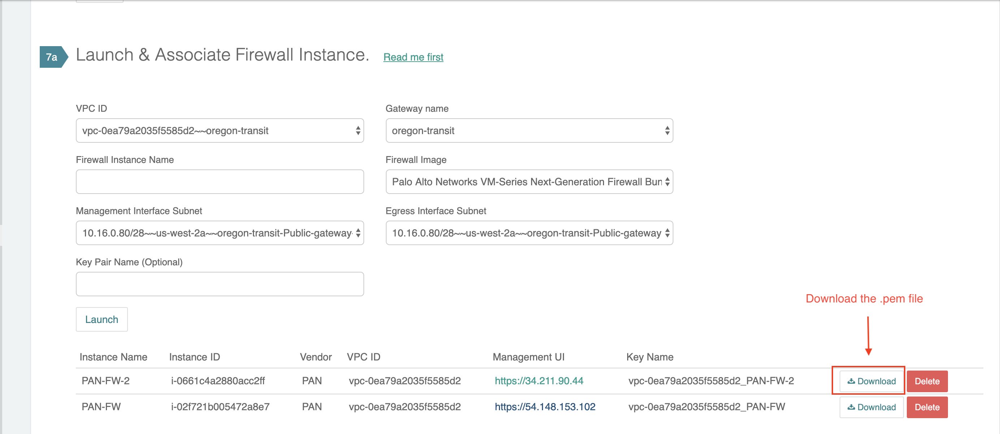

.. meta::
  :description: Firewall Network
  :keywords: AWS Transit Gateway, AWS TGW, TGW orchestrator, Aviatrix Transit network, Transit DMZ, Egress, Firewall

=========================================================
Example Config for FortiGate VM in AWS 
=========================================================

In this guide, we aim to provide configured needed for basic setup of Fortinet's Fortigate NGFW, in order to help validate integration with Aviaitrix FireNet
You will need to launch your Fortigate instance from AWS marketplace and enure the interfaces are placed in proper subnets per steps below.
These steps will setup your firewall with an "Allow ALL" policy that allows all traffic in your cloud to pass through the Fortigate instance.
The FW instance needs to be launched/configured with 3 interfaces. The role of each interface is: 
Eth0: Management
Eth1: FW traffic to and from the Internet
Eth2: Traffic from and to TGW

1. Deploy Fortigate Instance from AWS Marketplace
----------------------------------

Launch Fortigate from AWS Marketplace, with appropriate subscription level. The type of subscription and/or version does not affect the fucntionaly from Aviatrix
perspective. However, it may affect steps outline from FG's UI.

|access_key|

2. Reset VM-Series Password
--------------------------------

For Metered AMI, open a terminal and run the following command. 

::
  
 ssh-i <private_key.pem> admin@<public-ip_address>
 configure
 set mgt-config users admin password	 
 commit

For BYOL, open a terminal and run the following command.

::

 ssh-i <private_key.pem> admin@<public-ip_address>
 configure
 set mgt-config users admin password
 set deviceconfig system dns-setting servers primary <ip_address>
 commit

Terminate the SSH session.

3. Login to VM-Series
------------------------

Go back to the Aviatrix Controller Console. Go to Firewall Network workflow, Step 7a. Click on the Management UI that
takes you the VM-Series you just launched. 

Login with Username "admin". Password is the password you set at the previous step. 

4. Configure ### ethernet1/1 and WAN Zone
-------------------------------------------------

Once login, click Network tab, you should see a list of ethernet interfaces. Click ethernet1/1 and 
configure as the following screenshot. 

 - Click Network tab
 - Click ethernet1/1
 - Select "layer3" for Interface Type
 - Click Config tab in the pop up Ethernet Interface window.
 - Select default for Virtual Router at Config tab
 - Click New Zone for Security Zone to create a WAN zone. 
 - At the next pop up screen, name the new zone "WAN" and click OK 

|new_zone|

Continue, 

 - Select IPV4 tab in the pop up Ethernet Interface window.
 - Select DHCP Client
 - Uncheck "Automatically create default route pointing to default gateway provided by server, as shown below

|ipv4|

Click Commit. Once Commit is complete, you should see the Link State turn green at the Network page for ethernet1/1. 

5. Configure ### ethernet1/2 and LAN Zone
---------------------------------------------------

Repeat Step 4 for ethernet1/2. Name the new zone LAN

Click Commit. Once Commit is complete, you should see the Link State turn green at the Network page for ethernet1/2.

6. Configure Allow All Policies
---------------------------------

 - Click Policies tab.
 - Click +Add at the bottom left corner to create a new policy.
 - Click General tab. Name the policy Allow-all.
 - Click Source tab. Select Any for both panels.
 - Click Destination tab. Select Any for both panels.
 - Click Application tab. Select Any.
 - Click Commit to commit the Allow-all policy.

Now the VM-Series has its Allow All policy setup. 

7. Setup API access 
----------------------

#deleted

8. Ready to go!
---------------

Now your firewall instance is ready to receive packets! 

The next step is specify which Security Domain needs packet inspection by defining a connection policy that connects to
the firewall domain. This is done by `Step 8 <https://docs.aviatrix.com/HowTos/firewall_network_workflow.html#specify-security-domain-for-firewall-inspection>`_ in the Firewall Network workflow. 

For example, deploy Spoke-1 VPC in Security_Domain_1 and Spoke-2 VPC in Security_Domain_2. Build a connection policy between the two domains. Build a connection between Security_Domain_2 to Firewall Domain. 

Launch one instance in Spoke-1 VPC and Spoke-2 VPC. From one instance to ping the other instance. The ping should go through. . 

9. View Traffic Log
----------------------

You can view if traffic is forwarded to firewall instance by ________?

.. |new_zone| image:: config_paloaltoVM_media/new_zone.png
   :scale: 30%

.. |ipv4| image:: config_paloaltoVM_media/ipv4.png
   :scale: 30%

.. disqus::
