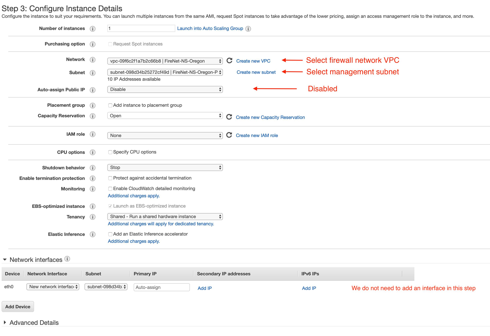
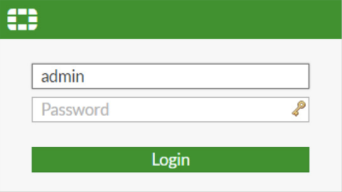
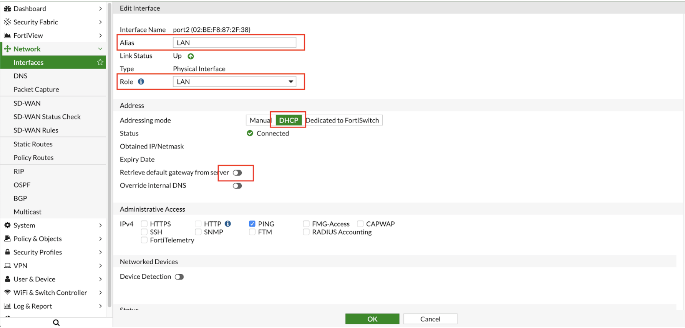
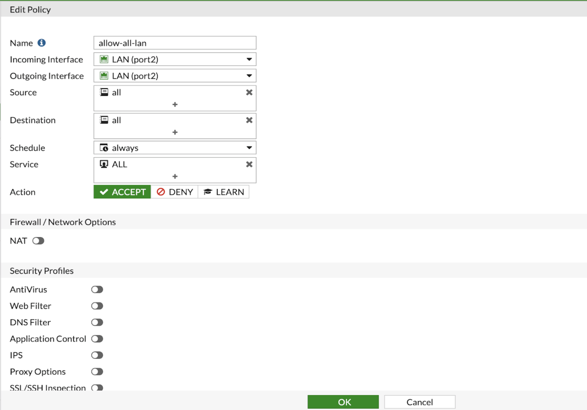
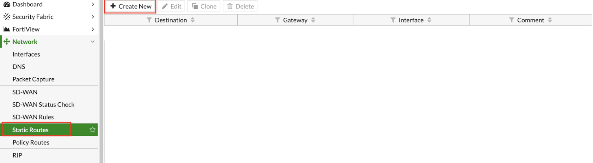
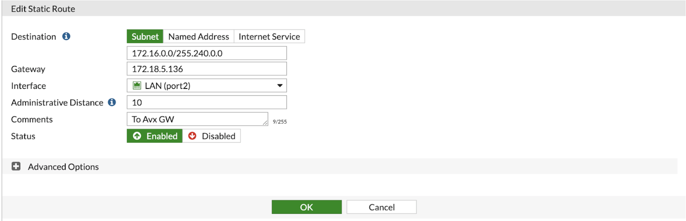
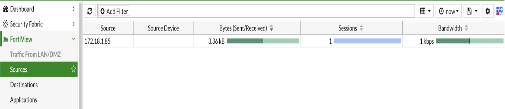

.. meta::
  :description: Firewall Network
  :keywords: AWS Transit Gateway, AWS TGW, TGW orchestrator, Aviatrix Transit network, Transit DMZ, Egress, Firewall

=========================================================
Example Config for FortiGate VM in AWS 
=========================================================

The goal of this document is to provide a step by step guide to launch and configure one or more Fortigate Next Generation Firewall instances to be integrated with Aviatrix Firewall Network. 
This setup will include basic “allow-all”  policies to serve as initial configuration to validate that intended traffic is passing through the firewall instance. 
Fortinet’s documentation should be consulted for the configuration of security policies and features.

Setup details
--------------
The instance will have to be launched in a Firewall Network VPC and appropriate subnets based on the availability zone. Each FW instance will have 3 interfaces that will have the following roles:

- Eth0 → Management Interface
- Eth1 → Transit Gateways traffic
- Eth2 → Internet ingress/egress traffic

1. Setup Firewall Network (FireNet)
---------------------------------------
Complete steps 1-5 of the Firewall Network Workflow in Aviatrix Controller to prepare your Firewall VPC (FireNet VPC). This will also set up the subnets that you will need for launching your Fortigate instance. 

2. Deploy Fortigate Instance from AWS Marketplace
----------------------------------------------------

Launch Fortigate from AWS Marketplace, with the appropriate subscription level. The type of subscription and/or version does not affect the functionality from an Aviatrix
perspective. However, it may affect the steps outline from FortiGate's UI.

- Step 1: Choose an appropriate image from Marketplace
- Step 2: Choose an Instance Type: Chose any appropriate instance type
- Step 3: Configure Instance Details. Below, you will find launch configuration details that will be needed for firewall network. All other options can be left on default or modified as required. 

|launch-step-2|

Note: Primary interface (Eth0): Assign this interface to a public subnet of the FireNet VPC that is designated for management. If you created this subnet using the Aviatrix VPC creator, the subnet is named in this format: 

    *<VPC Name>-Public-gateway-and-firewall-mgmt-<AvailabilityZone>*

- Step 4/5: Configure as appropriate
- Step 6: Configure Security Group for management interface

3. Configure Dataplane interfaces
------------------------------------------

- Using the AWS console, create two additional Network Interfaces in the AWS console with the following subnet association (Naming is optional):
 
 
 - “WAN” Port (Eth1)

  Subnet: Designated Egress Public Subnet. This interface will be used for Egress/Ingress to and from the internet. Therefore, it is either going to be talking to a load balancer or Internet gateway. If you created this subnet using the Aviatrix VPC creator, the subnet is named in this format: 

    *<VPC Name>-Public-FW-ingress-egress-<AvailabilityZone>*

  Security Groups: Allow inbound traffic to a supernet for your VPC and OnPrem CIDRs

 - “LAN” Port (Eth2)
 
  Subnet: This interface will be facing Aviatrix GW Eth2. This subnet is automatically created by Aviatrix Controller with following naming format: 

    *<Gateway Name>-dmz-firewall*
  
  Security Groups: Ensure we allow appropriate inbound traffic if Ingress is to be used.

  Note: If you need further clarification on FireNet subnets, please see this link:  `FireNet Subnets <https://www.lucidchart.com/publicSegments/view/f0bbe123-cbf7-4339-88df-a51eee2da631/image.pdf>`_ 

- Using the AWS console, assign an Elastic IP address to Management and WAN interfaces (Eth0 and Eth2) 

4. Login to Firewall and configure interfaces 
------------------------------------------------

- Using a web browser, connect to the management IP of the instance with HTTPS. You should see a login prompt as seen below, continue to login.

|login|

::

  At the time of this writing, default login for Fortigate is admin as username and instance ID as the password

- To configure both Port1 and Port2, go to "Interfaces" tab:

  - Select an interface and click on "Edit".  Enter the following details:
   
    - Enter an Alias (i.e: LAN/WAN) for the interface
    - Enable DHCP to ensure FW retrieve private IP information from AWS console
    - Disable “Retrieve default gateway from server" 
    - Specify appropriate role (LAN/WAN)

|editInterface|

5. Create static routes for routing of traffic VPC to VPC 
------------------------------------------------------------
Go to Network -> State Routes to create A Static Route -> click on "Create New"

|createStaticRoute|

Packets to and from TGW VPCs, as well as on-premises, will be hairpinned off of the LAN interface. As such, we will need to configure appropriate route ranges that you expect traffic for packets that need to be forward back to TGW. 
For simplicity, you can configure the FW to send all RFC 1918 packets to LAN port, which sends the packets back to the TGW. 

In this example, we configure all traffic for 172.16.0.0/12 to be sent out of the LAN interface.

Go to Network -> Static Routes -> Create new

In the Edit dialog, you need to enter the following:

- Enter the destination route in the "Destination" box.
- In the "Gateway" box, you will need to enter the IP address of the Eth2 interface of the Aviatrix gateway that this firewall will be attached to.
- Interface will be the LAN port.
- Configure an appropriate admin distance if you expect overlapping routes that need to be prioritized
- Enter comments as necessary.

|editStaticRoute|

6. Configure basic traffic policy to allow traffic
-----------------------------------------------------------

In this step, we will configure a basic traffic security policy that allows traffic to pass through the firewall. Given that Aviatrix gateways will only forward traffic from the TGW to the LAN port of the Firewall, 
we can simply set our policy condition to match any packet that is going in/out of LAN interface. 

 Go to Policy & Objects -> IPv4 Policy -> Create New / Edit
 
 In the Edit Policy dialogue, you need to enter the following:

- Name: Configure any name for this policy
- Incoming Interface: LAN
- Outgoing Interface: LAN
- Source: Click on the + sign and add all
- Destination: Click on the + sign and add all
- Schedule: always
- Service: ALL
- Action: Accept

After validating that your TGW traffic is being routed through your firewall instances, you can customize the security policy to tailor to your requirements. 

|editPolicy|

7. Ready to go!
---------------

Now your firewall instance is ready to receive packets! 

The next step is specifying which network domain needs packet inspection by defining a connection policy that connects to
the firewall domain. This is done by `Step 8 <https://docs.aviatrix.com/HowTos/firewall_network_workflow.html#specify-security-domain-for-firewall-inspection>`_ in the Firewall Network workflow. 

For example, deploy Spoke-1 VPC in Security_Domain_1 and Spoke-2 VPC in Security_Domain_2. Build a connection policy between the two domains. Build a connection between Security_Domain_2 to Firewall Domain. 

Launch one instance in Spoke-1 VPC and one in Spoke-2 VPC. From one instance, ping the other instance. The ping should go through.  

8. View Traffic Log
----------------------

You can view if traffic is forwarded to firewall instance by going to FortiView 

|showTraffic|

.. |Interfaces.png| image:: config_FortiGate_media/Interfaces.png.png
   :scale: 40%

.. disqus::
