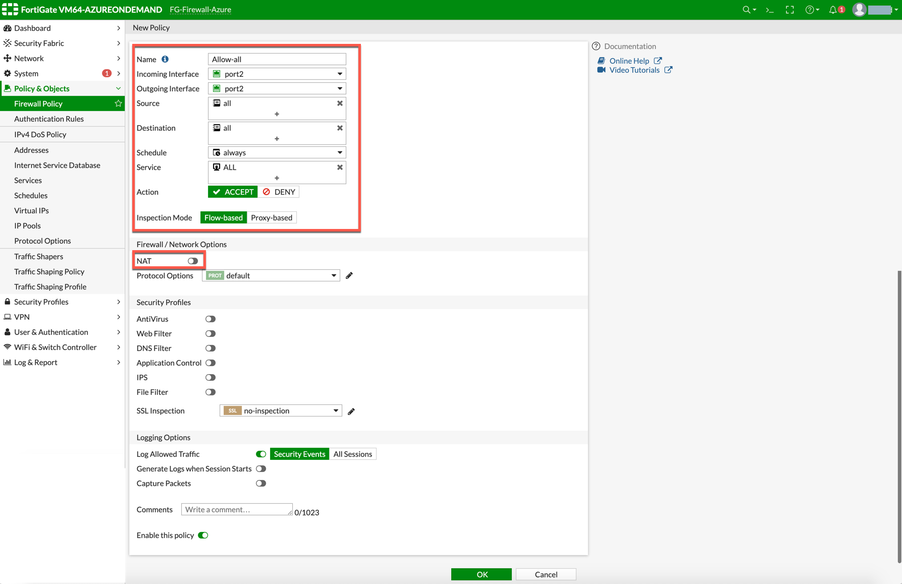

=========================================================
Example Config for FortiGate VM in Azure
=========================================================

In this document, we provide an example to set up the Fortigate Next Generation Firewall instance for you to validate that packets are indeed sent to the Fortigate Next Generation Firewall for VNet-to-VNet and from VNet to internet traffic inspection.

The Aviatrix Firewall Network (FireNet) workflow launches a Fortigate Next Generation Firewall instance at `this step <https://docs.aviatrix.com/HowTos/firewall_network_workflow.html#launching-and-associating-firewall-instance>`_.

After the launch is complete, the console displays the Fortigate Next Generation Firewall instance with its public IP address of management/egress interface and allows you to access the FortiGate web page.

Here is the Firewall information in this example used during launch (Aviatrix Controller, Firewall Network > Setup > Step 2a) for your reference. Please adjust it depending on your requirements.

==========================================      ==========
**Example setting**                             **Example value**
==========================================      ==========
Firewall Image                                  Fortinet FortiGate Next-Generation Firewall
Firewall Image Version                          6.4.1
Firewall Instance Size                          Standard_D3_v2
Egress Interface Subnet                         Select the subnet whose name contains "FW-ingress-egress."
Username                                        Any username except admin, sys and root
Authentication Method                           Select Password. Input a good password of your choice
Attach                                          Mark this checkbox
==========================================      ==========

.. note::

  Fortigate Next Generation Firewall instance has 2 interfaces as described below. Additionally, firewall instance eth1 is on the same subnet as FireNet gateway eth2 interface.

========================================================         ===============================          ================================
**Fortigate VM instance interfaces**                             **Description**                          **Inbound Security Group Rule**
========================================================         ===============================          ================================
eth0 (on subnet -Public-FW-ingress-egress)                        Egress or Untrusted interface            Allow ALL
eth1 (on subnet -dmz-firewall-lan)                                LAN or Trusted interface                 Allow ALL (Do not change)
========================================================         ===============================          ================================

Below are the steps for initial setup.

Logging in to Fortigate Next Generation Firewall
-----------------------------------------------------------

After `this step <https://docs.aviatrix.com/HowTos/firewall_network_workflow.html#launching-and-associating-firewall-instance>`_ of the FireNet workflow is completed, Go back to the Aviatrix Controller Console.

Go to Firewall Network workflow `Step 2a <https://docs.aviatrix.com/HowTos/firewall_network_workflow.html#launching-and-associating-firewall-instance>`_, click on the `Management UI`. It takes you to the Fortigate Next Generation Firewall you just launched as shown below.

|az_avx_management_UI|

.. note::

  Please try to use different browser (e.g. Firefox/Chrome) if the Management UI link is not able to open on your default browser.

Fortigate Next Generation Firewall Initial Setup
----------------------------------------------------------------

Once logged in with username and password provided during launch, it will ask you to do an initial setup as shown below:

|fg_first_login_1|

|fg_first_login_2|

|fg_first_login_3|

Go to Network > Interfaces and review the interface configuration before move forward. This interface configuration is done by Aviatrix Controller during the launch.

|review_fg_interfaces|

Create Static Routes for Routing of Traffic VNet to VNet
----------------------------------------------------------------------

For simplicity, in this example we configure the firewall to send all RFC 1918 packets to LAN port.

Go to Network > State Routes to create a Static Route as the following screenshot.

1. Click **Create New**.
2. Enter the destination route in the **Destination** box.
3. In the **Gateway Address** box, you will need to enter the Azure default gateway IP on subnet -dmz-firewall-lan
    i.e. subnet CIDR for -dmz-firewall-lan is 10.20.0.80/28, thus the Azure default gateway IP on this subnet is 10.20.0.81.

  .. note::
    dmz-firewall-lan subnet can be found in Aviatrix Controller. Go to Aviatrix Controller > Gateway > Select Gateway and click **Edit** > click **More details** to check all subnets.

4. Interface will be the LAN (port2)
5. Configure an appropriate admin distance if you expect overlapping routes that need to be prioritized
6. Enter comments as necessary.
7. Repeat the above steps for RFC 1918 routes.

|az_fortigate_static_routes|

.. important::
    Load Balancer static route 168.63.129.16/32 needs to be added manually pointing to the lan interface (port 2). 168.63.129.16/32 is the health probe source address.

8. Those static routes could also be reviewed on the page Dashboard > Network > Routing.

RFC 1918 routes are highlighted in red where as load balancer static route is highlighted in green.

|az_fortigate_static_routes_review|

(Optional) Firewall Vendor Integration
-------------------------------------------------

Integrating a FortiGate firewall with the Aviatrix controller enables the controller to make automatic route updates to the FortiGate routing tables. You may also manually enable the integration with your CSP management tools. FortiGate integration is supported in AWS, Azure, and GCP clouds.

Integrate the FortiGate firewall with the Aviatrix controller.

1. Generate a Firewall API Token from FortiGate. This token is required to integrate the FortiGate firewall with the Controller.
2. In the FortiGate GUI, go to System > Admin Profiles > Create New.
3. Enter the information to create the token. You must enable the Read/Write option for the network to router connection.  
4. Generate the token.
5. Go to Aviatrix Controller > Firewall Network > Vendor Integration.
6. Enter the vendor firewall information in the controller.
7. Click Save, then Show, then Sync to enable the Aviatrix Controller and FortiGate firewall integration. 

The Aviatrix Controller is now enabled to make automatic route updates to the FortiGate routing tables. 

Enabling Health Check Policy in Firewall
--------------------------------------------------------

Aviatrix Controller uses HTTPS (TCP 443 port) to check the health of the firewall every 5 seconds. User needs to enable this port in firewall as per given instruction.

Please follow the steps to allow HTTPS in FortiGate:

1. Login to FortiGate using your username and password.
#. Go to Network > Interfaces, select **port 2**, and click **Edit**.
#. Mark the HTTPS checkbox under Administrative access > IPv4 and click **OK**.

**Example Fortigate Port 2 Interface**

|health-check|

The health check probes can be verified in FortiGate by navigating to Log & Report > Local Traffic.

**Example Health-Check Logs in Fortigate**

|health-probe-logs|

Configuring Basic Traffic Policy to Allow Traffic VNet to VNet
-------------------------------------------------------------------------

In this step, we will configure a basic traffic security policy that allows traffic to pass through the firewall. Given that Aviatrix gateways will only forward traffic from the TGW to the LAN port of the Firewall, we can simply set our policy condition to match any packet that is going in/out of LAN interface.

Go to Policy & Objects > Firewall Policy > Create New / Edit to configure policy as the following screenshot.

==================  ===============================================
**Field**           **Value**
==================  ===============================================
Name                Configure any name for this policy
Incoming Interface  LAN (port2)
Outgoing Interface  LAN (port2)
Source              Click on the + sign and add all
Destination         Click on the + sign and add all
Schedule            always
Service             ALL
Action              ACCEPT
NAT                 Disabled
==================  ===============================================

|az_fortigate_policy_vpc_to_vpc|

After validating that your traffic is being routed through your firewall instances, you can customize the security policy to tailor to your requirements.

[Optional] Configuring Basic Traffic Policy to Allow Traffic VNet to Internet
-------------------------------------------------------------------------------------------

In this step, we will configure a basic traffic security policy that allows internet traffic to pass through the firewall. Given that Aviatrix Gateways will only forward traffic to the LAN port of the Firewall, we simply set our policy condition to match any packet that is going in of LAN interface and going out of WAN interface.

.. important::
  Enable `Egress inspection <https://docs.aviatrix.com/HowTos/firewall_network_faq.html#how-do-i-enable-egress-inspection-on-firenet>`_ feature on FireNet

First of all, go back to the Aviatrix Controller Console. 

1. Navigate to the page Firewall Network > Advanced. 
2. Click the skewer/three dot button. 
3. Scroll down to Egress through Firewall and click **Enable**. 
4. Verify the Egress status on the page Firewall Network > Advanced.

|az_avx_egress_inspection|

Secondly, go back to the Fortigate Next Generation Firewall console and navigate to Policy & Objects > IPv4 Policy > Create New / Edit to configure policy as the following screenshot.

==================  ===============================================
**Field**           **Value**
==================  ===============================================
Name                Configure any name for this policy
Incoming Interface  LAN (port2)
Outgoing Interface  WAN (port1)
Source              Click on the + sign and add all
Destination         Click on the + sign and add all
Schedule            always
Service             ALL
Action              ACCEPT
NAT                 Enable
==================  ===============================================

.. important::

  NAT function needs to be enabled on this VNET to Internet policy.

|az_fortigate_policy_vpc_to_internet|

After validating that your traffic is being routed through your firewall instances, you can customize the security policy to tailor to your requirements.

Ready to Go
-----------------------

Now your Security Gateway instance is configured and ready to receive packets.

Next step is to validate your configurations and polices using FlightPath and Diagnostic Tools (ping, traceroute etc.).

Viewing Traffic Log
-----------------------------

You can view if traffic is forwarded to the firewall instance by logging in to the Fortigate Next Generation Firewall console. Go to Dashboard > FortiView Sessions or FortiView Destinations. Traffic can also be viewed from Logs & Report.

.. note::
    To view Forward Traffic logs under Logs & Report, go to Policy & Objects > Firewall Policy > Select a Policy and click Edit > Logging Options > Select All Sessions for Log Allowed Traffic.

For VNet to VNet traffic:
*****************************

Launch one instance in PROD Spoke VNet and DEV Spoke VNet. Start ping packets from a instance in DEV Spoke VNet to the private IP of another instance in PROD Spoke VNet. The ICMP traffic should go through the firewall and be inspected in the firewall.

|az_fortigate_view_traffic_log_vpc_to_vpc|

|az_fortigate_view_traffic_log_vpc_to_vpc_2|

[Optional] For VNet to Internet traffic:
***********************************************

Launch a private instance in the Spoke VNet (i.e. PROD Spoke VNet) and start ping packets from the private instance towards Internet (e.g 8.8.8.8) to verify the egress function. The ICMP traffic should go through and get inspected on firewall.

.. important::
    The Egress Inspection is only applicable to all VNets that deploys non-public-facing applications. If you have any Spoke VNet that has public facing web services, you should not enable Egress Inspection. This is because Egress Inspection inserts a default route (0.0.0.0/0) towards Transit GW to send the Internet traffic towards firewall to get inspected. Azure's System Default Route pointing towards Internet will be overwritten by User-defined default route inserted by the Controller.

|az_fortigate_view_traffic_log_vpc_to_internet|

|az_fortigate_view_traffic_log_vpc_to_internet_2|

.. |review_fg_interfaces| image:: config_FortiGate_media/review_fg_interfaces.png
   :scale: 35%
.. |az_avx_management_UI| image:: config_FortiGate_media/az_avx_management_UI.png
   :scale: 30%
.. |fg_first_login_1| image:: config_FortiGate_media/fg_first_login_1.png
   :scale: 40%
.. |fg_first_login_2| image:: config_FortiGate_media/fg_first_login_2.png
   :scale: 40%
.. |fg_first_login_3| image:: config_FortiGate_media/fg_first_login_3.png
   :scale: 30%
.. |az_fortigate_static_routes| image:: config_FortiGate_media/az_fortigate_static_routes.png
   :scale: 35%
.. |az_fortigate_static_routes_review| image:: config_FortiGate_media/az_fortigate_static_routes_review.png
   :scale: 35%

.. |az_fortigate_policy_vpc_to_internet| image:: config_FortiGate_media/az_fortigate_policy_vpc_to_internet.png
   :scale: 30%
.. |az_avx_egress_inspection| image:: config_FortiGate_media/az_avx_egress_inspection.png
   :scale: 40%
.. |az_fortigate_view_traffic_log_vpc_to_vpc| image:: config_FortiGate_media/az_fortigate_view_traffic_log_vpc_to_vpc.png
   :scale: 30%
.. |az_fortigate_view_traffic_log_vpc_to_vpc_2| image:: config_FortiGate_media/az_fortigate_view_traffic_log_vpc_to_vpc_2.png
   :scale: 30%
.. |az_fortigate_view_traffic_log_vpc_to_internet| image:: config_FortiGate_media/az_fortigate_view_traffic_log_vpc_to_internet.png
   :scale: 40%
.. |az_fortigate_view_traffic_log_vpc_to_internet_2| image:: config_FortiGate_media/az_fortigate_view_traffic_log_vpc_to_internet_2.png
   :scale: 30%
.. |health-check| image:: config_FortiGate_media/health-check.png
   :scale: 30%
.. |health-probe-logs| image:: config_FortiGate_media/health-probe-logs.png
   :scale: 30%

.. disqus::
