.. meta::
  :description: Firewall Network
  :keywords: GCP, Aviatrix Transit network, Transit DMZ, Egress, Fortigate

=========================================================
Example Configuration for FortiGate VM in GCP
=========================================================

You can follow this example to set up the FortiGate Next Generation Firewall instance for GCP, to validate that packets are indeed sent to the FortiGate Next Generation Firewall for VPC to VPC and from VPC to internet traffic inspection. 

You must first complete steps 1-6 `here <https://docs.aviatrix.com/HowTos/transit_firenet_workflow_gcp.html>`_. Step 7a on that page (launching a FortiGate Next Generation Firewall instance) links to this example.

After the FireNet launch is complete, the Aviatrix Controller displays the FortiGate Next Generation Firewall instance with its public IP address for the management/egress interface. You can click the IP address link to access the FortiGate UI. 

Below are the settings and values used in this example to launch the firewall instance from the Aviatrix Controller (Firewall Network > Setup > Step 7a). You can adjust these depending on your requirements.

==========================================      ==========
**Example setting**                             **Example value**
==========================================      ==========
VPC ID					      
Gateway Name
Firewall Instance Name
Firewall Image                                  Fortinet FortiGate Next-Generation Firewall
Firewall Image Version                          7.05
Firewall Instance Size                          Standard_D3_v2
Egress Interface VPC ID
Egress Interface Subnet                         Select the desired subnet
Zone
Attach                                          Check
==========================================      ==========

Below are the steps for initial setup.

Logging on to the FortiGate Next Generation Firewall
-------------------------------------------------------

1. After completing the FireNet setup and deploying the FortiGate firewall instance in GCP at `<https://docs.aviatrix.com/HowTos/transit_firenet_workflow_gcp.html>`_, navigate to Firewall Network > List > Firewall in the Aviatrix Controller. 
#. Select the firewall in the list.
#. In the Actions menu, select Download key. This downloads the PEM file to your machine. Make note of the name and location of the PEM file (matches your firewall instance name).
#. Click on the link as shown.

|gcp_FortiGate_launch_instance|

.. note::

  Use a different browser (e.g. Firefox/Chrome) if the FortiGate UI link does not open in your default browser.

FortiGate Next Generation Firewall Initial Setup
---------------------------------------------------------

Use the default username and password to log in. You may have to SSH into the firewall instance and change the default password using CLI. Since this is the initial setup of this FortiGate UI, you may be prompted to specify your hostname; change your password; upgrade your firmware; and complete your dashboard setup. 

After completing those steps, go to Network > Interfaces in the FortiGate UI and review the interface configuration. This interface configuration was completed by the Aviatrix Controller during the firewall launch.

|review_fggcp_interfaces|

Configuring the LAN Interface 
-----------------------------

Before configuring the static routes you must configure the port 2 (LAN) interface as follows. The port 1 (WAN) interface does not need to be configured; it is the default management port and is configured during the deployment.

1. In the FortiGate UI, navigate to Interfaces > port2. Configure the interface as follows:

- Alias: LAN
- Administrative Access > IPv4: FortiGate requires administrative access to reply to health probes from a network load balancer (load balancers are created automatically in GCP when you set up your Transit FireNet connection). Select the HTTP, HTTPS, SSH and PING checkboxes. When you select HTTPS this opens TCP port 443 to check the health of the firewall. 

2. Click **OK**.
#. SSH into the firewall instance using the following command: ssh -I <firewallname>.pem 
#. Run these commands to disable the source check. This enables the firewall to forward packets received on that interface.

::

   config system interface
edit "port2"
set src-check disable
end

(Optional) Firewall Vendor Integration 
----------------------------------------

Integrating a FortiGate firewall with the Aviatrix Controller enables the Controller to make automatic RFC 1918 and non-RFC 1918 route updates to the FortiGate routing tables. You may also manually enable the integration with your CSP management tools. FortiGate integration is supported in AWS, Azure, and GCP clouds.

1. Generate a Firewall API Token from FortiGate. This token is required to integrate the FortiGate firewall with the Aviatrix Controller.

   i. In the FortiGate GUI, navigate to System > Administrators >  Create New > REST API Admin.
   ii. Provide a username and profile for this user. 

|fort_admin_profile|

  
   iii. Click OK to create the user with this profile. An API key is generated.
   iv. Copy the key string that displays. It is only displayed once.

2. Go to Aviatrix Controller > Firewall Network > Vendor Integration > Firewall.
#. Enter the vendor firewall information in the Controller.

   - Transit VPC ID: select the VPC ID for the CSP
   - Firewall Instance ID: automatically populated
   - Firewall Name: the name you gave your FortiGate firewall? 
   - Firewall Vendor Type: Fortinet FortiGate
   - Firewall API token: paste the API token string from step 1 here
   - Firewall Management IP Address: IP address of your firewall
   - Firewall Route Table (Optional): 

#. Click **Save**.
#. You can click **Show** or **Sync** to view the integration or sync with the firewall. 

|vendor_integration_fortgcp|

The Aviatrix Controller is now enabled to make automatic route updates to the FortiGate routing tables. 

.. note::

  If the necessary routes are not created via vendor integration, you must manually configure routes to the health probe IP ranges on each interface that receives traffic. This prevents the reverse path forwarding check from blocking the health probes. The 0.0.0.0/0 route on the external interface covers the ranges that the external network load balancer uses. 

Configuring a DNAT Policy for Health Check
------------------------------------------

A DNAT policy is required on the firewall to translate the destination of the health check packets to the firewall interface IP address. 

Before you begin, you require the TCP and UDP load balancer front end IP addresses from your GCP portal, along with the firewall instance nic0 internal IP address.

1. In the firewall UI, navigate to Policy & Objects > Virtual IPs and click Create New > Virtual IP.
#. In the New Virtual IP dialog, configure the following:

   - Name: ilb-vip (or an equivalent name of your choosing)
   - Interface: port2
   - Type: Static NAT
   - External IP address/range (TCP load balancer front end IP address)
   - Map to IPv4 address/range (firewall instance port2 IP address)

3. Click **OK**.
#. Repeat steps 1-3 for creating a UDP virtual IP. In this case the External IP address/range is the UDP load balancer front end IP address.

Configuring a Security Policy for Health Check 
----------------------------------------------

You now need to create a security policy granting health check access to the virtual IPs you just created.

1. Create two new GCP health check source IP address ranges: 

   a. In the firewall UI, navigate to Policy & Objects > Addresses and click **Create New > Address**.
   b. Enter a name for the address.
   c. In the IP/Netmask field, enter 130.211.0.0/22.
   d. Select the port2 interface.
   e. Click **OK**.
   f. You may need to create another IP address for 35.191.0.0/16.

2. In the firewall UI, navigate to Policy & Objects > Firewall Policy and click **Create New**.
#. In the Edit Policy dialog, configure the following for the TCP load balancer health check:

   - Name: a name of your choosing
   - Incoming Interface: port2
   - Outgoing Interface: port2
   - Source: select the 130.211.0.0/22 and 35.191.0.0/16 IP addresses you created in the previous step.
   - Destination: ilb-vip (or equivalent, as per what you configured in the previous section)
   - Schedule: always
   - Service: ALL
   - NAT: disabled

4. Click **OK**.
#. Repeat steps 1-4 (or 2-4?) to create the UDP load balancer health check?
#. Make sure these are added to the static routes (manually or via Vendor Integration).

Configuring Basic Policy to allow VPC to VPC Traffic
------------------------------------------------------

You can configure a basic traffic security policy that allows traffic to pass through the firewall. 

1. In the FortiGate UI, navigate to Policy & Objects > Firewall Policy and click **Create New** to configure the policy as per the following screenshot.
#. In the New Policy dialog, configure the following for the basic traffic security policy:

   - Name: configure any name
   - Incoming Interface: port2
   - Outgoing Interface: port2
   - Source: all
   - Destination: all
   - Schedule: always
   - Service: ALL
   - Action: ACCEPT
   - NAT: disabled

|gcp_fortigate_policy_vpc_to_vpc|

3. Click **OK**.

After validating that your traffic is being routed through your firewall instances, you can customize the security policy to your requirements.

[Optional] Configuring Basic Policy to Allow Traffic from VPC to Internet
------------------------------------------------------------------------------

You can configure a basic traffic security policy that allows internet traffic to pass through the firewall. Given that Aviatrix gateways will only forward traffic to the LAN port of the Firewall, you set your policy condition to match any packet that is going into the LAN interface and out of the WAN interface.

.. important::
  Enable `Egress inspection <https://docs.aviatrix.com/HowTos/firewall_network_faq.html#how-do-i-enable-egress-inspection-on-firenet>`_ feature on FireNet.

1. In the Aviatrix Controller, navigate to Firewall Network > List > Firenet. 
#. Select the GCP transit gateway and click **Details**.
#. On the next screen, under Egress Through Firewall, click **Enable**.

|gcp_fortigate_egress_internet|

#. In the FortiGate UI navigate to Policy & Objects > Firewall Policy and click **Create New**. 
#. In the New Policy dialog, configure the following:

   - Name: configure any name
   - Incoming Interface: port2 (LAN)
   - Outgoing Interface: port1 (WAN)
   - Source: Click on the + sign and add all
   - Destination: Click on the + sign and add all
   - Schedule: always
   - Service: ALL
   - Action: ACCEPT
   - NAT: Enable

.. important::

  NAT function needs to be enabled on this VPC to Internet policy.

|gcp_fortigate_NAT|

After validating that your traffic is being routed through your firewall instances, you can customize the security policy to your requirements.

Validating your Configuration 
-----------------------------

Now your Security Gateway instance is configured and ready to receive packets. The next step is to validate your configurations and polices using FlightPath and Diagnostic Tools (ping, traceroute etc.).

Viewing the Traffic Log
-----------------------

You can view if traffic is forwarded to the firewall instance by logging in to the Fortigate Next Generation Firewall console. Navigate to Dashboard > FortiView Sessions or FortiView Destinations. Traffic can also be viewed from Log & Report.

.. note::
    To view Forward Traffic logs under Logs & Report, navigate to Policy & Objects > Firewall Policy. Select a policy and click **Edit**. Under Logging Options, select **All Sessions** for Log Allowed Traffic.

Testing Traffic Flow
**********************

You can configure a packet capture in the FortiGate UI to test traffic flow.

|fortgcp_packetcapture|

In this example, the spoke10 instance (172.22.130.4) pings the spoke20 instance (172.22.140.4).

|fortgcp_packetcapture2|

You can also use CoPilot AppIQ to check traffic flow and troubleshoot any issues. For more information on CoPilot AppIQ click `here <https://docs.aviatrix.com/HowTos/copilot_reference_guide.html?highlight=AppIQ>`_.

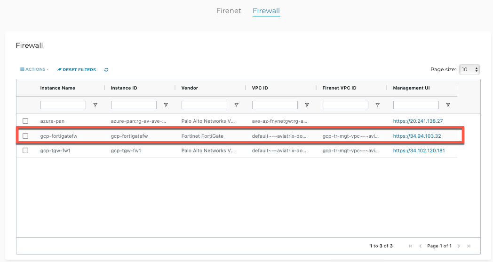
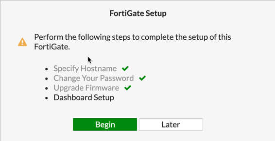
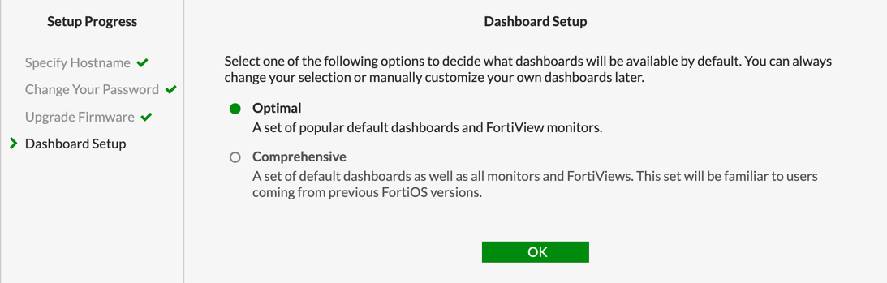
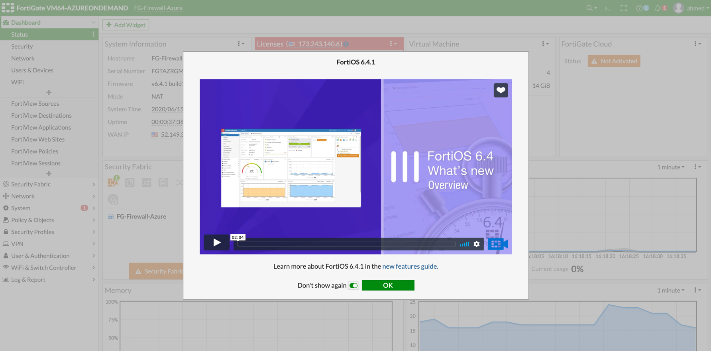
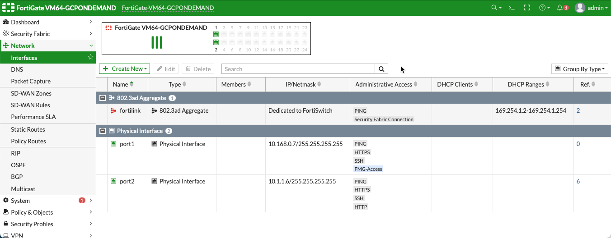
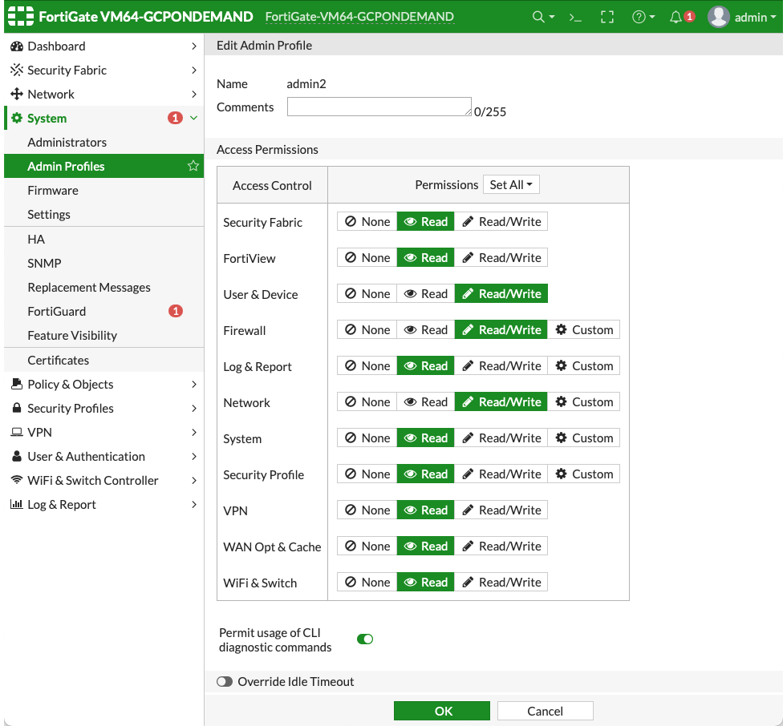
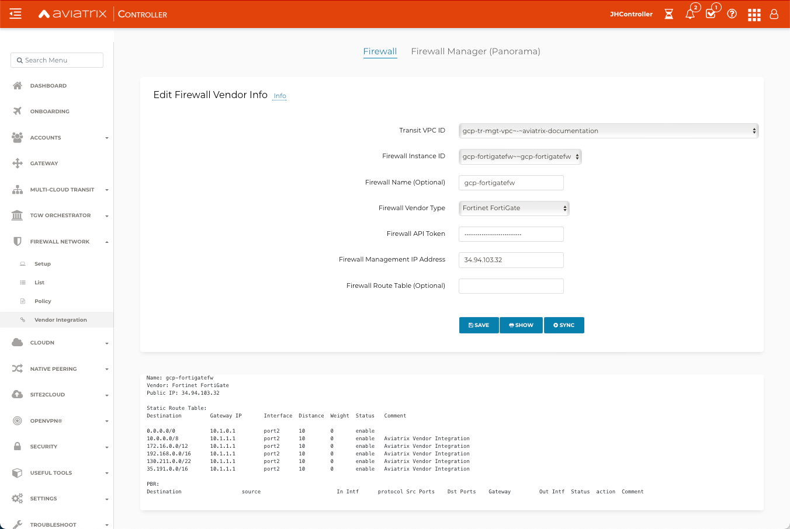
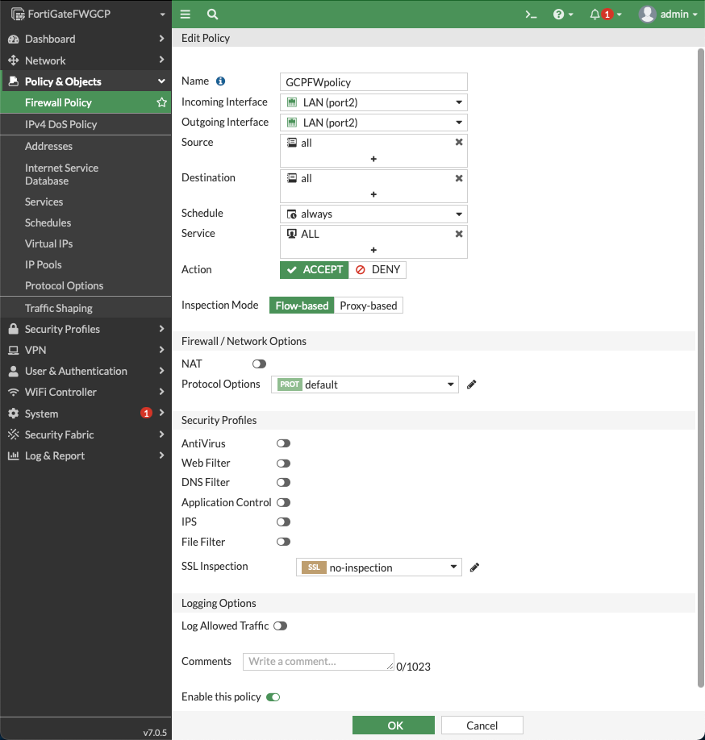
.. |health-check| image:: config_FortiGate_media/health-check.png
   :scale: 30%
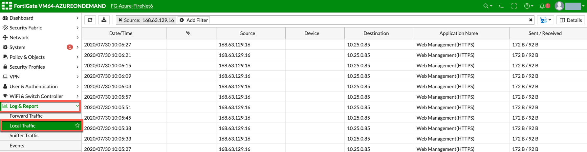
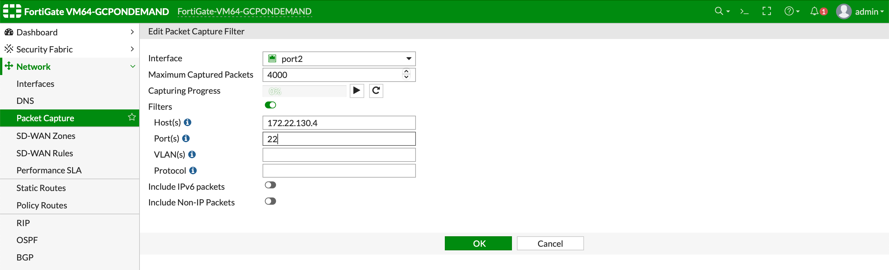
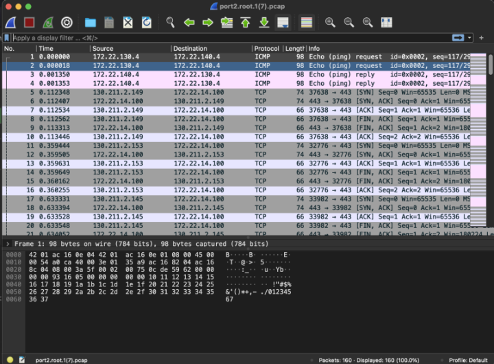

.. disqus::