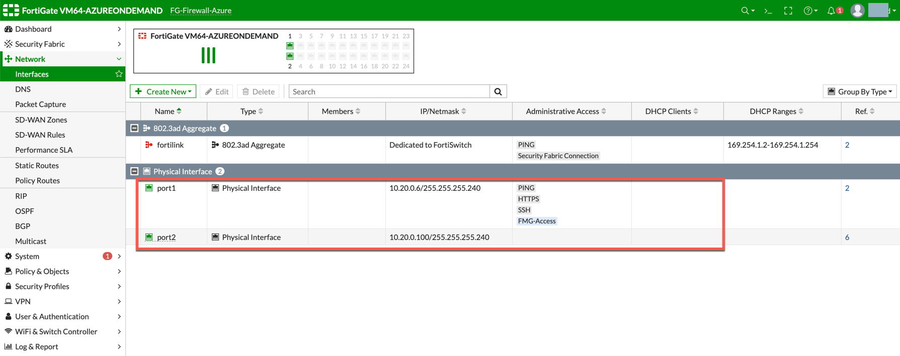
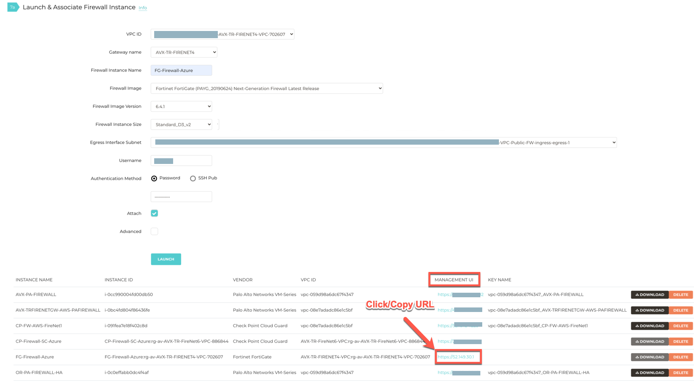
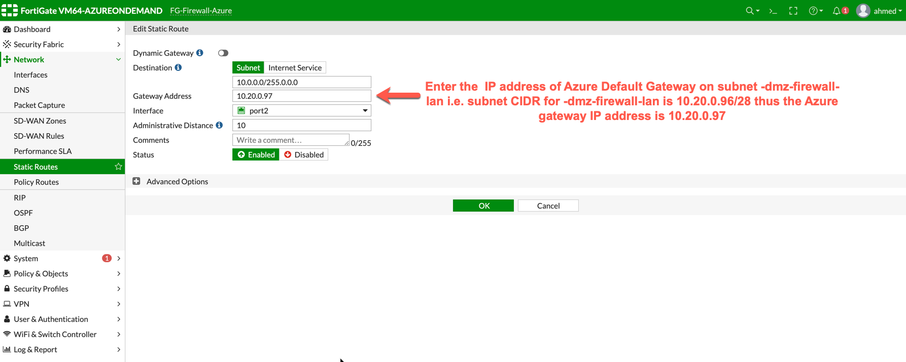
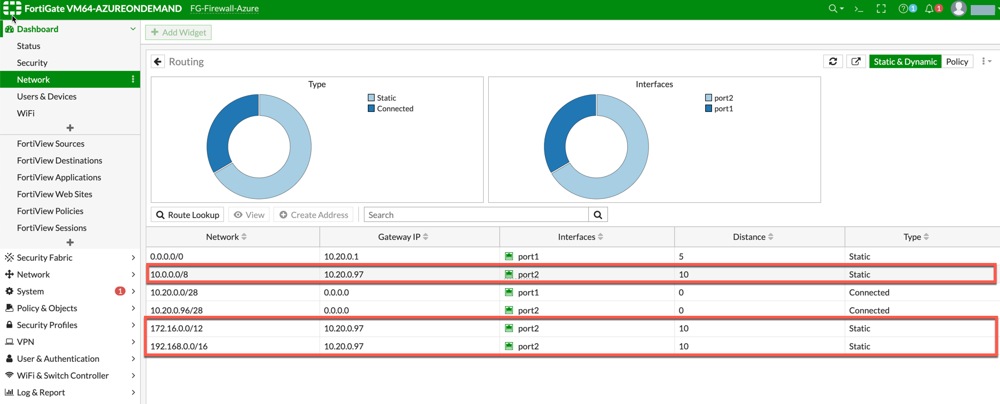
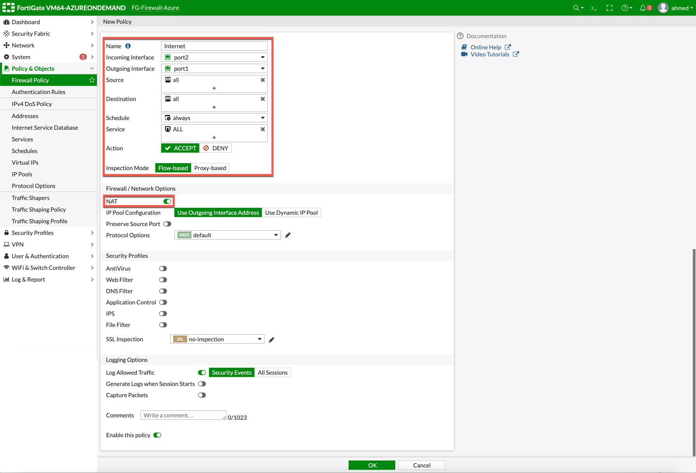
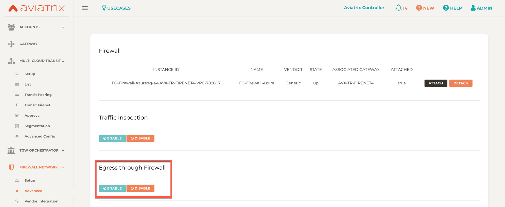
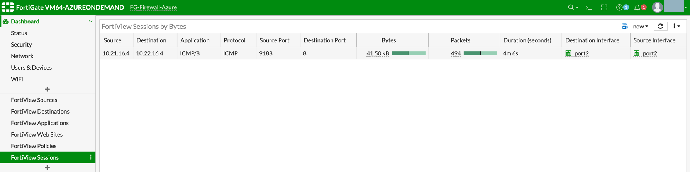
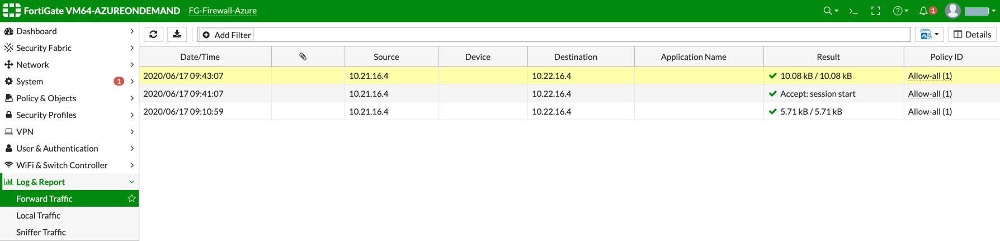
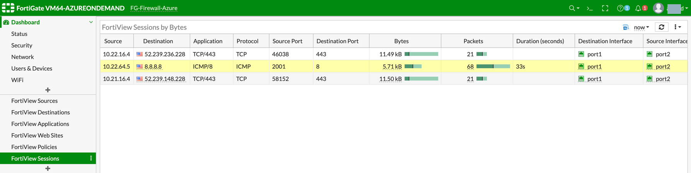
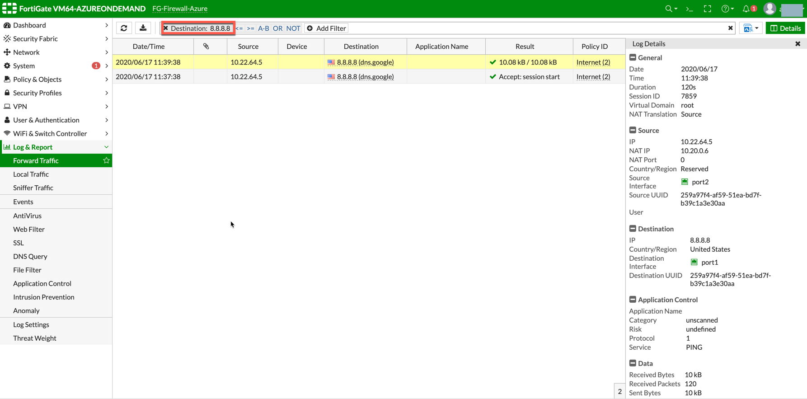

.. meta::
  :description: Firewall Network
  :keywords: GCP, TGW orchestrator, Aviatrix Transit network, Transit DMZ, Egress, Fortigate

=========================================================
Example Configuration for FortiGate VM in GCP
=========================================================

You can follow the example provided to set up the FortiGate Next Generation Firewall instance for GCP, to validate that packets are indeed sent to the FortiGate Next Generation Firewall for VNET to VNET and from VNET to internet traffic inspection. You must first have completed steps 1-6 at '<https://docs.aviatrix.com/HowTos/transit_firenet_workflow_gcp.html>`_. Step 7a on that page (launching a FortiGate Next Generation Firewall instance) links to this example.

After the FireNet launch is complete as per the "Transit FireNet Workflow for GCP" page, the Aviatrix Controller displays the FortiGate Next Generation Firewall instance with its public IP address for the management/egress interface. You can click the IP address link to access the FortiGate web page.

Below are the settings and values used in this example to launch the firewall instance from the Aviatrix Controller (Firewall Network > Setup > Step 7a). You can adjust these depending on your requirements.

==========================================      ==========
**Example setting**                             **Example value**
==========================================      ==========
Firewall Image                                  Fortinet FortiGate Next-Generation Firewall
Firewall Image Version                          7.05
Firewall Instance Size                          Standard_D3_v2
Egress Interface Subnet                         Select the subnet whose name contains "egress".
Username                                        Any username except admin, sys and root <was prompted to use admin>
Authentication Method                           Enter the default password, and then change it to a password of your choice
Attach                                          Check
==========================================      ==========

.. note::

  The FortiGate Next Generation Firewall instance has two interfaces as described below. Additionally, firewall instance eth1 is on the same subnet as FireNet gateway eth2 interface. <how is this info used/where do you find it?>

========================================================         ===============================          ================================
**Fortigate VM instance interfaces**                             **Description**                          **Inbound Security Group Rule**
========================================================         ===============================          ================================
eth0 (on subnet -Public-FW-ingress-egress)                        Egress or Untrusted interface            Allow ALL
eth1 (on subnet -dmz-firewall-lan)                                LAN or Trusted interface                 Allow ALL (Do not change)
========================================================         ===============================          ================================

Below are the steps for initial setup.

1. Logging on to the FortiGate Next Generation Firewall
-------------------------------------------------

After completing steps 1-6 of the FireNet setup at `<https://docs.aviatrix.com/HowTos/transit_firenet_workflow_gcp.html>`_, navigate to the Firewall Network workflow in the Aviatrix Controller. Click on the link as shown.

|gcp_FortiGate_launch_instance|

.. note::

  Use a different browser (e.g. Firefox/Chrome) if the Management UI link is not able to open in your default browser.

2. FortiGate Next Generation Firewall Initial Setup
---------------------------------------------------------

After you are logged in with the username and password provided during launch, you are asked to complete an initial setup as shown below:

|fg_first_login_1|

|fg_first_login_2|

|fg_first_login_3|

In the FortiGate UI, go to **Network > Interfaces** and review the interface configuration. This interface configuration was completed by the Aviatrix Controller during the launch.

|review_fg_interfaces|

3. Creating Static Routes for Routing of Traffic VNET to VNET
-----------------------------------------------------------------

Before beginning, you need the IP address of the GCP Transit Gateway (?) on subnet xx <what did I mean by this?>. You can obtain this information from the GCP portal.

For simplicity, in this example we configure the firewall to send all RFC 1918 packets to the LAN port.

In the FortiGate UI, navigate to **Network > State Routes** to create a Static Route.

  - Click **Create New**.
  - Enter the destination route in the **Destination** box. <what is the destination route?>
  - In the **Gateway Address** box, enter the GCP default gateway IP for the LAN VPC.
    i.e. <need a good example>

  .. note::
    The firewall LAN subnet (or transit gateway? Just seeing transit gateway here and spoke gateway??) can be found in the Aviatrix Controller. On the Gateway tab, select the gateway and click Edit. click Gateway Detail to check all subnets. <is this right? Not seeing the port number here.>

  - Interface will be the LAN (port2)
  - Configure an appropriate admin distance if you expect overlapping routes that need to be prioritized
  - Enter comments as necessary.
  - Repeat the above steps for RFC 1918 routes

|az_fortigate_static_routes| <will need to update screenshot after I figure out static route info>

.. important::
    Load Balancer static route 168.63.129.16/32 needs to be added manually in the FortiGate UI and point to the lan interface (port 2). 168.63.129.16/32 is the health probe source address. <this should be a step not a note; I think I'm right that this is done in the FW UI/is this info correct for GCP?>

Those static routes can also be reviewed in the FortiGate UI at **Dashboard > Network > Routing**.

RFC 1918 routes are highlighted in RED; the load balancer static route is highlighted in GREEN. <how did most of the static routes get added? I didn't add them.>

|gcp_fortigate_static_routes_review|

(Optional) Firewall Vendor Integration
-------------------------------------------------

Integrating a FortiGate firewall with the Aviatrix Controller enables the Controller to make automatic route updates to the FortiGate routing tables. You may also manually enable the integration with your CSP management tools. FortiGate integration is supported in AWS, Azure, and GCP clouds.

- Generate a Firewall API Token from FortiGate. This token is required to integrate the FortiGate firewall with the Aviatrix Controller.

  - In the FortiGate GUI, go to **System > Admin Profiles > Create New**.

  - Enter the information to create the token. You must enable the Read/Write option for the 'network to router' connection.
  
  - Generate the token.

- Go to **Aviatrix Controller > Firewall Network > Vendor Integration**.

- Enter the vendor firewall information in the controller.

- Click Save, then Show, then Sync to enable the Aviatrix Controller and FortiGate firewall integration. 

The Aviatrix Controller is now enabled to make automatic route updates to the FortiGate routing tables. 

4. Enable Health Check Policy in Firewall
------------------------------------------------

Aviatrix Controller uses HTTPS (TCP 443 port) to check the health of the firewall every five seconds. You must enable this port in the firewall as per below.

    1. Login to FortiGate UI using username and password.
    #. Go to **Network > Interfaces**, select **port 2** and click **Edit**.
    #. Under **Administrative Access** select **HTTPS** and click **OK**.

**Example Fortigate Port 2 Interface**

|health-check| <will have to update or ask someone else to provide>

The health check probes can be verified in FortiGate by navigating to **Log & Report > Local Traffic**.

**Example Health-Check Logs in Fortigate**

|health-probe-logs| <seems like it might be okay to leave here but have to check>

5. Configure basic traffic policy to allow traffic VNET to VNET
-------------------------------------------------------------------------

You can configure a basic traffic security policy that allows traffic to pass through the firewall. Given that Aviatrix gateways will only forward traffic from the TGW to the LAN port of the firewall, you can set your policy condition to match any packet that is going in/out of the LAN interface.

In the FortiGate UI, navigate to **Policy & Objects > Firewall Policy > Create New / Edit** to configure the policy as per the following screenshot.

==================  ===============================================
**Field**           **Value**
==================  ===============================================
Name                Configure any name for this policy
Incoming Interface  LAN (port2)
Outgoing Interface  LAN (port2)
Source              Click on the + sign and add all
Destination         Click on the + sign and add all
Schedule            always
Service             ALL
Action              ACCEPT
NAT                 Disabled
==================  ===============================================

|gcp_fortigate_policy_vpc_to_vpc|

After validating that your traffic is being routed through your firewall instances, you can customize the security policy to your requirements.

6. [Optional] Configuring Basic Traffic policy to Allow Traffic VNET to Internet
----------------------------------------------------------------------------------

You can configure a basic traffic security policy that allows internet traffic to pass through the firewall. Given that Aviatrix gateways will only forward traffic to the LAN port of the Firewall, you set your policy condition to match any packet that is going into the LAN interface and out of the WAN interface.

.. important::
  Enable `Egress inspection <https://docs.aviatrix.com/HowTos/firewall_network_faq.html#how-do-i-enable-egress-inspection-on-firenet>`_ feature on FireNet.

1. In the Aviatrix Controller, navigate to **Firewall Network > Advanced**. Click |vertical_ellipsis| next to the firewall name. Scroll down to **Egress through Firewall** and click **Enable**. Verify the Egress status by navigating to **Firewall Network > Advanced**.

|gcp_fortigate_egress_internet|

#. In the FortiGate UI navigate to **Policy & Objects -> IPv4 Policy -> Create New / Edit** to configure policy as the following screenshot.

==================  ===============================================
**Field**           **Value**
==================  ===============================================
Name                Configure any name for this policy
Incoming Interface  LAN (port2)
Outgoing Interface  WAN (port1)
Source              Click on the + sign and add all
Destination         Click on the + sign and add all
Schedule            always
Service             ALL
Action              ACCEPT
NAT                 Enable
==================  ===============================================

.. important::

  NAT function needs to be enabled on this VNET to Internet policy.

|gcp_fortigate_NAT|

After validating that your traffic is being routed through your firewall instances, you can customize the security policy to your requirements.

7. Ready to go!
----------------

Now your Security Gateway instance is configured and ready to receive packets. The next step is to validate your configurations and polices using FlightPath and Diagnostic Tools (ping, traceroute etc.).

8. View Traffic Log
----------------------

You can view if traffic is forwarded to the firewall instance by logging in to the Fortigate Next Generation Firewall console. Go to the page **Dashboard -> FortiView Sessions or FortiView Destinations**. Traffic can also be viewed from **Log & Report**.

.. note::
    To view Forward Traffic logs under Logs & Report, go to **Policy & Objects > Firewall Policy**. Select a policy and click Edit. Under **Logging Options**, select **All Sessions** for **Log Allowed Traffic**.

For VNET to VNET traffic:
*****************************

Launch one instance in PROD Spoke VNET and one in DEV Spoke VNET. Start pinging packets from an instance in DEV Spoke VNET to the private IP of another instance in PROD Spoke VNET. The ICMP traffic should go through the firewall and be inspected.

|gcp_fortigate_view_traffic_log_vpc_to_vpc| <either ask someone to provide or edit a screenshot>

|az_fortigate_view_traffic_log_vpc_to_vpc_2| <same>

[Optional] For VNET to Internet traffic:
***********************************************

Launch a private instance in the Spoke VNET (i.e. PROD Spoke VNET) and start pingin packets from the private instance towards the internet (e.g 8.8.8.8) to verify the egress function. The ICMP traffic should go through the firewall and be inspected.

.. important::
    The Egress Inspection is only applicable to VNets that deploys non public facing applications. If you have any Spoke VNets that have public facing web services, you should not enable Egress Inspection. This is because Egress Inspection inserts a default route (0.0.0.0/0) towards Transit GW to send the Internet traffic towards the firewall to get inspected. GCP's System Default Route pointing towards the internet will be overwritten by the user-defined default route inserted by the Aviatrix Controller.

|az_fortigate_view_traffic_log_vpc_to_internet| <either ask someone to provide or edit a screenshot>

|az_fortigate_view_traffic_log_vpc_to_internet_2| <same>

.. |fg_first_login_1| image:: config_FortiGate_media/fg_first_login_1.png
   :scale: 40%
.. |fg_first_login_2| image:: config_FortiGate_media/fg_first_login_2.png
   :scale: 40%
.. |fg_first_login_3| image:: config_FortiGate_media/fg_first_login_3.png
   :scale: 30%

.. |az_fortigate_policy_vpc_to_vpc| image:: config_FortiGateGCP_media/gcp_fortigate_policy_vpc_to_vpc.png
   :scale: 30%

.. |health-check| image:: config_FortiGate_media/health-check.png
   :scale: 30%
.. |health-probe-logs| image:: config_FortiGate_media/health-probe-logs.png
   :scale: 30%

.. disqus::
