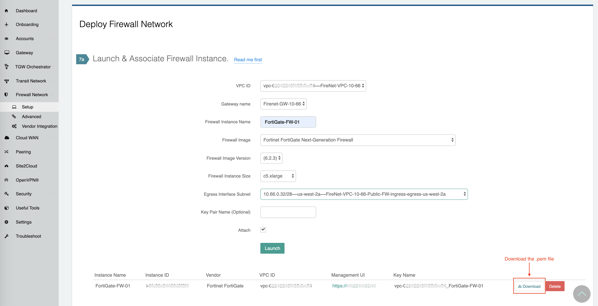
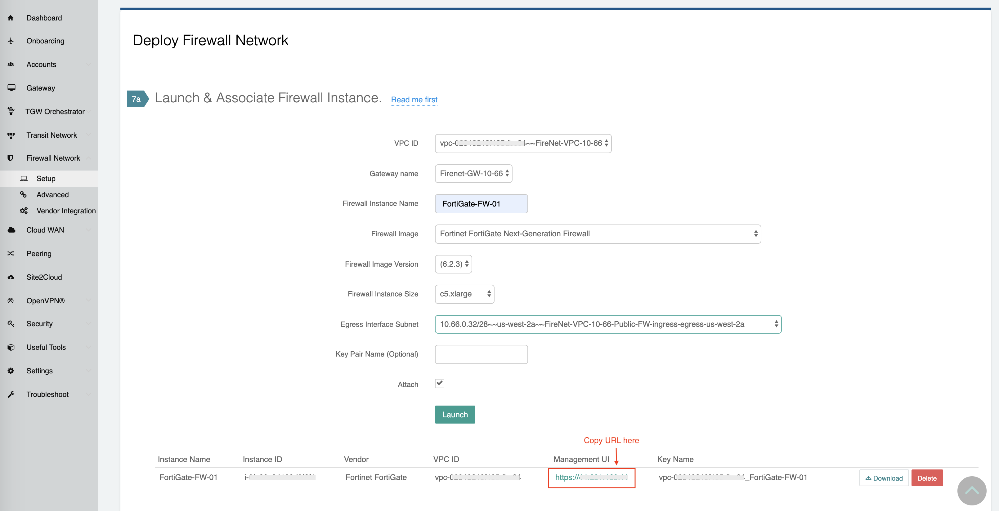
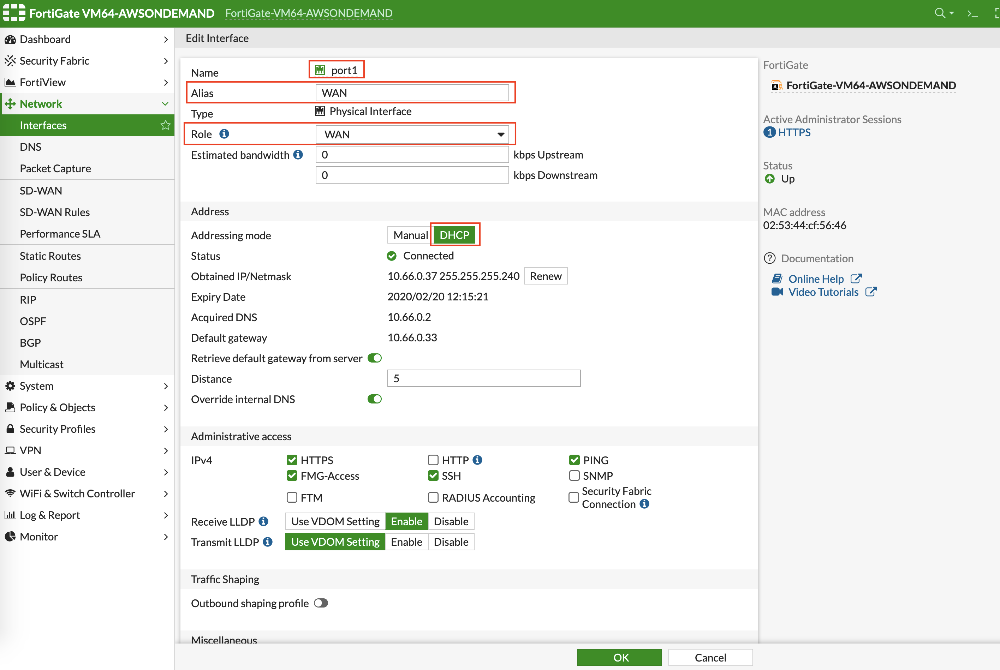
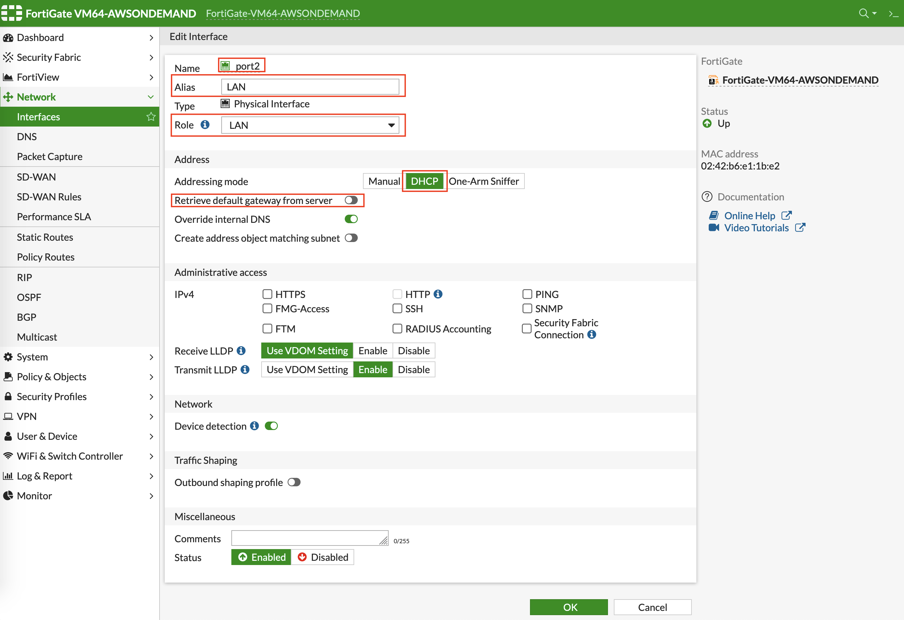
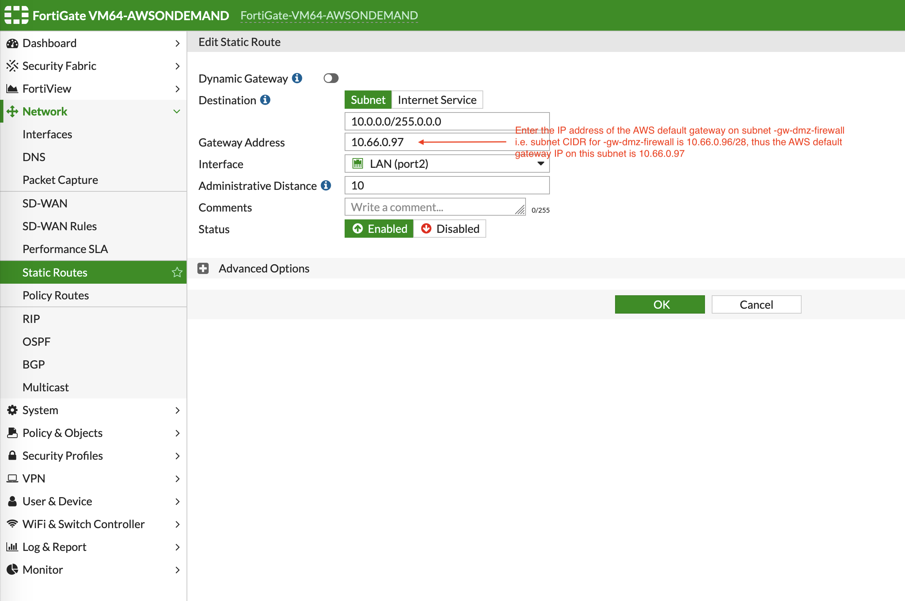
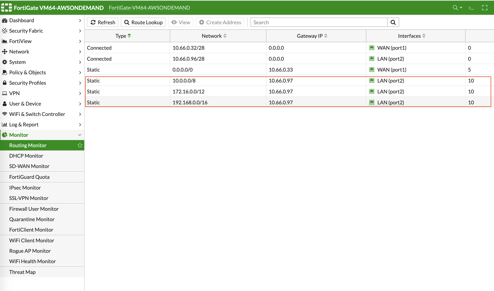
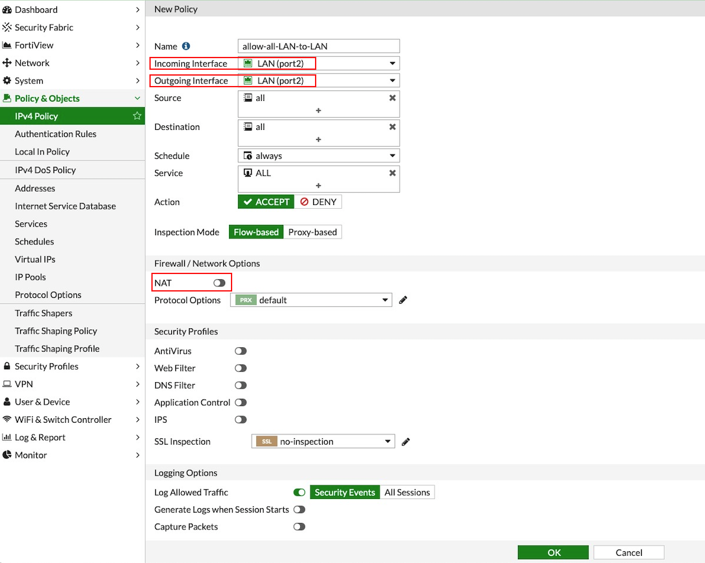
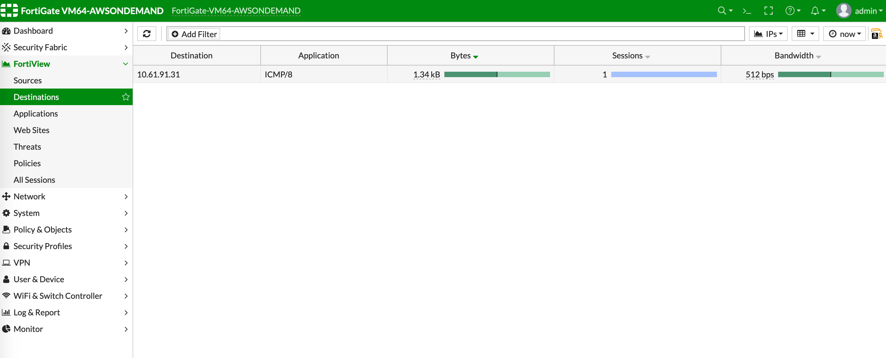
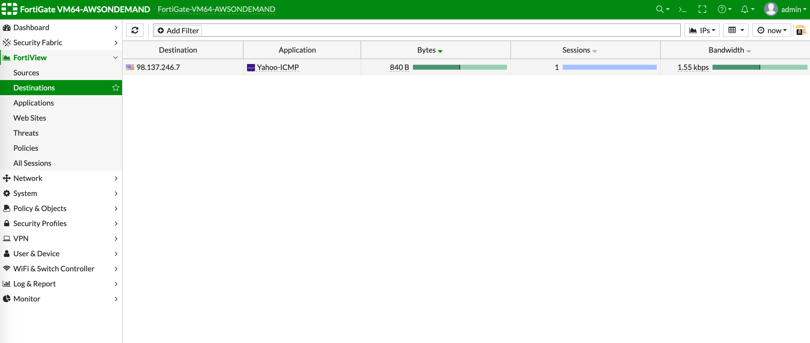



=========================================================
Example Config for FortiGate VM in AWS 
=========================================================

In this document, we provide an example to set up the Fortigate Next Generation Firewall instance for you to validate that packets are indeed sent to the Fortigate Next Generation Firewall for VPC-to-VPC and from VPC to Internet traffic inspection.

The Aviatrix Firewall Network (FireNet) workflow launches a Fortigate Next Generation Firewall instance at `this step <https://docs.aviatrix.com/HowTos/firewall_network_workflow.html#launching-and-associating-firewall-instance>`_. 
After the launch is complete, the console displays the Fortigate Next Generation Firewall instance with its public IP address of management/egress interface and allows you either to download the .pem file for SSH access to the instance or to access the FortiGate web page.

Here is the Firewall information in this example for your reference. Please adjust it depending on your requirements.

==========================================      ==========
**Example setting**                             **Example value**
==========================================      ==========
Firewall Image                                  Fortinet FortiGate Next-Generation Firewall
Firewall Image Version                          6.2.3
Firewall Instance Size                          c5.xlarge
Egress Interface Subnet                         Select the subnet whose name contains "FW-ingress-egress."
Key Pair Name (Optional)                        The .pem file name for SSH access to the firewall instance.
Attach                                          Check
==========================================      ==========

.. note::

  Fortigate Next Generation Firewall instance has 2 interfaces as described below. Additionally, firewall instance eth1 is on the same subnet as FireNet gateway eth2 interface.

========================================================         ===============================          ================================
**Fortigate VM instance interfaces**                             **Description**                          **Inbound Security Group Rule**
========================================================         ===============================          ================================
eth0 (on subnet -Public-FW-ingress-egress-AZ-a)                  Egress or Untrusted interface            Allow ALL 
eth1 (on subnet -dmz-firewall)                                   LAN or Trusted interface                 Allow ALL (Do not change)
========================================================         ===============================          ================================

Below are the steps for initial setup.

Downloading Fortigate Next Generation Firewall Access Key
------------------------------------------------------------------------------

After `this step <https://docs.aviatrix.com/HowTos/firewall_network_workflow.html#launching-and-associating-firewall-instance>`_ in the workflow is completed, click **Download** to download the .pem file.

If you get a download error, usually it means the Fortigate Next Generation Firewall instance is not ready. Wait until it is ready, refresh the browser and then try again.

|v2_avx_pem_file_download|

Logging in to the Fortigate Next Generation Firewall
--------------------------------------------------------------------

1. Go back to the Aviatrix Controller. 
2. Go to `this step <https://docs.aviatrix.com/HowTos/firewall_network_workflow.html#launching-and-associating-firewall-instance>`_ of the Firewall Network workflow. Click on the Management UI. It takes you to the Fortigate Next Generation Firewall you just launched.

|v2_avx_management_UI|

.. note::

  Please try to use browser Firefox if the Management UI link is not able to open on your default browser.

Resetting Fortigate Next Generation Firewall Password
---------------------------------------------------------------------

Once logged in with the default password, it will ask you to set a new password.

.. note::

  Log in with Username "admin." The default password is the instance-id.

Configuring Fortigate Next Generation Firewall port1 with WAN
---------------------------------------------------------------------------------

After logging in with the new password, go to the page "Network -> Interfaces" to configure Physical Interface port1 as the following screenshot.

1. Select the interface with port 1 and click **Edit**.
2. Enter an Alias (i.e.: WAN) for the interface.
3. Specify appropriate role (WAN).
4. Enable DHCP to ensure FW retrieve private IP information from the AWS console.
5. Enable **Retrieve default gateway from server**.
  
|v2_fortigate_interface_wan|

Configure Fortigate Next Generation Firewall port2 with LAN
-------------------------------------------------------------------------------

Go to the page Network > Interfaces to configure Physical Interface port2 as the following screenshot.

1. Select the interface with port 2 and click **Edit**.
2. Enter an Alias (i.e.: LAN) for the interface.
3. Specify appropriate role (LAN).
4. Enable DHCP to ensure FW retrieve private IP information from AWS console.
5. Enable Administrative Access: IPv4 > HTTPS.
6. Disable **Retrieve default gateway from server**. 
  
|v2_fortigate_interface_lan|

Creating Static Routes for Routing of Traffic VPC to VPC
--------------------------------------------------------------------

Packets to and from TGW VPCs, as well as on-premises, will be hairpinned off of the LAN interface. As such, we will need to configure appropriate route ranges that you expect traffic for packets that need to be forward back to TGW. 
For simplicity, you can configure the FW to send all RFC 1918 packets to LAN port, which sends the packets back to the TGW. 

In this example, we configure all traffic for RFC 1918 to be sent out of the LAN interface.

Go to **Network -> Static Routes** to create a Static Route as the following screenshot.

1. Click **Create New**.
2. Enter the destination route in **Destination**.
3. In **Gateway Address**, you will need to enter the AWS default gateway IP on subnet -dmz-firewall.
  
  .. note::
    
    i.e. The subnet CIDR for -dmz-firewall is 10.66.0.96/28, thus the AWS default gateway IP on this subnet is 10.66.0.97.
  
4. The interface will be the LAN (port2).
5. Configure an appropriate admin distance if you expect overlapping routes that need to be prioritized.
6. Enter comments as necessary.
7. Repeat the steps above for RFC 1918 routes.
    
|v2_fortigate_static_routes|

Those static routes also could be reviewed by navigating to Monitor > Routing Monitor.

|v2_fortigate_static_routes_review|

(Optional) Firewall Vendor Integration
------------------------------------------------------

Integrating a FortiGate firewall with the Aviatrix Controller enables the controller to make automatic route updates to the FortiGate routing tables. You may also manually enable the integration with your CSP management tools. FortiGate integration is supported in AWS, Azure, and GCP clouds.

Integrate the FortiGate firewall with the Aviatrix Controller.

1. Generate a Firewall API Token from FortiGate. This token is required to integrate the FortiGate firewall with the Controller.
2. In the FortiGate GUI, go to System > Admin Profiles > Create New.
3. Enable the Read/Write option for Network and click **OK**.
4. Navigate to System > Administrators > Create New > REST API Admin.
5. Supply a Username and choose the Admin Profile from the previous step, and press **OK**.
6. Copy the generated token. It will only be displayed once.
7. Go to Aviatrix Controller > Firewall Network > Vendor Integration.
8. Enter the vendor firewall information into the Controller.
9. Click **Save**, then **Show**, then **Sync** to enable the Aviatrix Controller and FortiGate firewall integration. 

The Aviatrix Controller is now enabled to make automatic route updates to the FortiGate routing tables.

Configuring Basic Traffic Policy to Allow Traffic VPC-to-VPC
----------------------------------------------------------------------------

In this step, we will configure a basic traffic security policy that allows traffic to pass through the firewall. Given that Aviatrix Gateways will only forward traffic from the TGW to the LAN port of the Firewall, we can simply set our policy condition to match any packet that is going in/out of LAN interface.

Navigate to Policy & Objects > IPv4 Policy > Create New / Edit to configure the policy as shown in the following screenshot.

==================  ===============================================
**Field**           **Value**
==================  ===============================================
Name                Configure any name for this policy
Incoming Interface  LAN (port2)
Outgoing Interface  LAN (port2)
Source              Click on the + sign and add all
Destination         Click on the + sign and add all
Schedule            always
Service             ALL
Action              ACCEPT
NAT                 Disabled
==================  ===============================================

|v2_fortigate_policy_vpc_to_vpc|

After validating that your TGW traffic is being routed through your firewall instances, you can customize the security policy to tailor to your requirements.

[Optional] Configuring Basic Traffic Policy to Allow Traffic VPC to Internet
---------------------------------------------------------------------------------------------

In this step, we will configure a basic traffic security policy that allows Internet traffic to pass through the firewall. Given that Aviatrix Gateways will only forward traffic from the TGW to the LAN port of the Firewall, we can simply set our policy condition to match any packet that is going in of LAN interface and going out of WAN interface.

.. important::
  Enable `Egress inspection <https://docs.aviatrix.com/HowTos/firewall_network_faq.html#how-do-i-enable-egress-inspection-on-firenet>`_ feature on FireNet
  
First, go back to the Aviatrix Controller. 

1. Navigate to Firewall Network > Advanced. 
2. Click the skewer/three dot button. 
3. Scroll down to Egress through Firewall and click **Enable**. 
4. Verify the Egress status on the page Firewall Network > Advanced.

|v2_avx_egress_inspection|

Second, go back to the Fortigate Next Generation Firewall console and navigate to Policy & Objects > IPv4 Policy > Create New / Edit to configure policy as the following screenshot.

==================  ===============================================
**Field**           **Value**
==================  ===============================================
Name                Configure any name for this policy
Incoming Interface  LAN (port2)
Outgoing Interface  WAN (port1)
Source              Click on the + sign and add all
Destination         Click on the + sign and add all
Schedule            always
Service             ALL
Action              ACCEPT
NAT                 Enable
==================  ===============================================

.. important::

  NAT function needs to be enabled on this VPC to Internet policy.

|v2_fortigate_policy_vpc_to_internet|

After validating that your TGW traffic is being routed through your firewall instances, you can customize the security policy to tailor to your requirements.

Ready to Go
---------------------

Now your firewall instance is ready to receive packets.

The next step is to specify which Security Domain needs packet inspection by defining a connection policy that connects to
the firewall domain. This operation is done by `this step <https://docs.aviatrix.com/HowTos/firewall_network_workflow.html#specify-security-domain-for-firewall-inspection>`_ in the Firewall Network workflow. In addition, attach VPC to TGW by `Step 1 <https://docs.aviatrix.com/HowTos/tgw_build.html#aws-transit-gateway-orchestrator-build>`_ in the TGW Orchestrator Build workflow.

For example, deploy Spoke-1 VPC in Security_Domain_1 and Spoke-2 VPC in Security_Domain_2. Build a connection policy between the two domains. Build a connection between Security_Domain_2 to Firewall Domain. 

Viewing the Traffic Log
------------------------------------

You can view if traffic is forwarded to the firewall instance by logging in to the Fortigate Next Generation Firewall console. Go to FortiView > Destinations. 

For VPC-to-VPC traffic:
***********************

Launch one instance in Spoke-1 VPC and Spoke-2 VPC. Start ping packets from a instance in Spoke-1 VPC to the private IP of another instance in Spoke-2 VPC where one or both of Security Domains are connected to Firewall Network Security Domain. The ICMP traffic should go through and be inspected on firewall.

|v2_fortigate_view_traffic_log_vpc_to_vpc|

[Optional] For VPC to Internet traffic:
***************************************

Launch a private instance in the Spoke VPC (i.e. Spoke-2 VPC) where the Security Domain (i.e. Security_Domain_2) is connected to Firewall Network Security Domain. Start ping packets from the private instance to Internet service to verify egress function. The ICMP traffic should go through and be inspected on firewall.  

|v2_fortigate_view_traffic_log_vpc_to_internet|

.. |v2_fortigate_policy_vpc_to_internet| image:: config_FortiGate_media/v2_fortigate_policy_vpc_to_internet.png
   :scale: 40%
.. |v2_avx_egress_inspection| image:: config_FortiGate_media/v2_avx_egress_inspection.png
   :scale: 40%

.. disqus::
