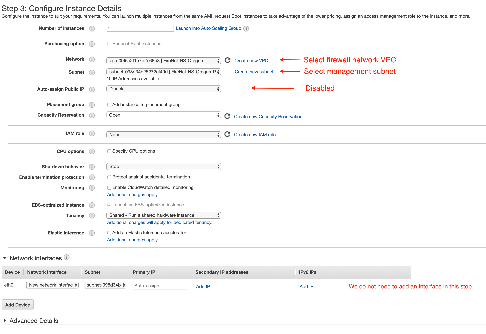
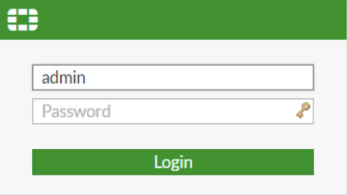
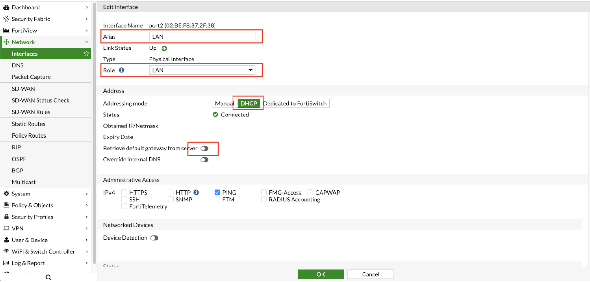
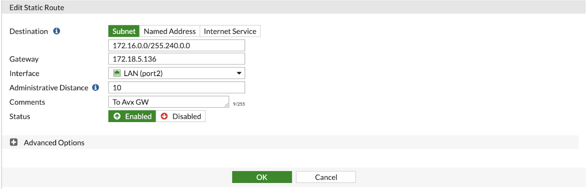

.. meta::
  :description: Firewall Network
  :keywords: AWS Transit Gateway, AWS TGW, TGW orchestrator, Aviatrix Transit network, Transit DMZ, Egress, Firewall

=========================================================
Example Config for FortiGate VM in AWS 
=========================================================

In this document, we provide an example to set up the Fortigate Next Generation Firewall instance for you to validate that packets are indeed sent to the Fortigate Next Generation Firewall for VPC to VPC and from VPC to internet traffic inspection.

The Aviatrix Firewall Network (FireNet) workflow launches a Fortigate Next Generation Firewall instance at Step 7a. 
After the launch is complete, the console displays the Fortigate Next Generation Firewall instance instance with its public IP address of management interface and allows you either to download the .pem file for SSH access to the instance or to access the FortiGate web page.

Note that Fortigate Next Generation Firewall instance has 2 interfaces as described below.

========================================================         ===============================          ================================
**Fortigate VM instance interfaces**                             **Description**                          **Inbound Security Group Rule**
========================================================         ===============================          ================================
eth0 (on subnet -Public-FW-ingress-egress-AZ-a)                  Egress or Untrusted interface            Allow ALL 
eth1 (on subnet -gw-dmz-firewall)                                LAN or Trusted interface                 Allow ALL (Do not change)
========================================================         ===============================          ================================

Note that firewall instance eth1 is on the same subnet as FireNet gateway eth2 interface.

Below are the steps for initial setup.

1. Download Fortigate Next Generation Firewall Access Key
----------------------------------

After `Step 7a <https://docs.aviatrix.com/HowTos/firewall_network_workflow.html#a-launch-and-associate-firewall-instance>`_ is completed, you'll see the Download button as below. Click the button to download the .pem file.

If you get a download error, usually it means the Fortigate Next Generation Firewall instance is not ready. Wait until it is ready, refresh the browser and then try again.

|access_key|

2. Login to Fortigate Next Generation Firewall
----------------------------------

Go back to the Aviatrix Controller Console. 
Go to Firewall Network workflow, Step 7a. Click on the `Management UI`. It takes you the Fortigate Next Generation Firewall you just launched. 

Login with Username "admin". Default password is the instance-id.

3. Reset Fortigate Next Generation Firewall Password
--------------------------------

Copy the URL from Aviatrix to access Fortigate Next Generation Firewall web page.

4. Configure Fortigate Next Generation Firewall port1 with WAN
-------------------------------------------------

Once logged in, go to the page "Network -> Interfaces" to configure Physical Interface port1 as the following screenshot.

  - Select the interface with port 1 and click on "Edit"
  - Specify appropriate role (WAN)
  - Enter an Alias (i.e: WAN) for the interface
  - Enable DHCP to ensure FW retrieve private IP information from AWS console
  - Enable “Retrieve default gateway from server" 

5. Configure Fortigate Next Generation Firewall port2 with LAN
-------------------------------------------------

Go to the page "Network -> Interfaces" to configure Physical Interface port2 as the following screenshot.

  - Select the interface with port 2 and click on "Edit"
  - Specify appropriate role (LAN)
  - Enter an Alias (i.e: LAN) for the interface
  - Enable DHCP to ensure FW retrieve private IP information from AWS console
  - Disable “Retrieve default gateway from server" 

6. Create static routes for routing of traffic VPC to VPC
-------------------------------------------------

Packets to and from TGW VPCs, as well as on-premises, will be hairpinned off of the LAN interface. As such, we will need to configure appropriate route ranges that you expect traffic for packets that need to be forward back to TGW. 
For simplicity, you can configure the FW to send all RFC 1918 packets to LAN port, which sends the packets back to the TGW. 

In this example, we configure all traffic for RFC 1918 to be sent out of the LAN interface.

Go to tha page "Network -> State Routes" to create a Static Route as the following screenshot.

  - Click on the button "Create New"
  - Enter the destination route in the "Destination" box.
  - In the "Gateway" box, you will need to enter the IP address of the 
  
  
  
  Eth2 interface of the Aviatrix gateway that this firewall will be attached to.

- Interface will be the LAN port.
- Configure an appropriate admin distance if you expect overlapping routes that need to be prioritized
- Enter comments as necessary.

-> click on “Create New”

7. Configure basic traffic policy to allow traffic VPC to VPC
-------------------------------------------------

8. Configure basic traffic policy to allow traffic VPC to Internet
-------------------------------------------------

9. Ready to go!
----------------

Now your firewall instance is ready to receive packets! 

The next step is to specify which Security Domain needs packet inspection by defining a connection policy that connects to
the firewall domain. This is done by `Step 8 <https://docs.aviatrix.com/HowTos/firewall_network_workflow.html#specify-security-domain-for-firewall-inspection>`_ in the Firewall Network workflow. 

For example, deploy Spoke-1 VPC in Security_Domain_1 and Spoke-2 VPC in Security_Domain_2. Build a connection policy between the two domains. Build a connection between Security_Domain_2 to Firewall Domain. 

Launch one instance in Spoke-1 VPC and Spoke-2 VPC. From one instance, ping the other instance. The ping should go through.  

10. View Traffic Log
----------------------

You can view if traffic is forwarded to the firewall instance by logging in to the VM-Series console. Click Monitor. Start ping packets from one Spoke VPC to another Spoke VPC where one or both of Security Domains are connected to Firewall Network Security Domain

.. |Interfaces.png| image:: config_FortiGate_media/Interfaces.png.png
   :scale: 40%

.. |editPolicy| image:: config_FortiGate_media/editPolicy.png
   :scale: 40%
.. |createStaticRoute| image:: config_FortiGate_media/createStaticRoute.png
   :scale: 40%

.. |showTraffic| image:: config_FortiGate_media/showTraffic.png
   :scale: 40%
.. disqus::
