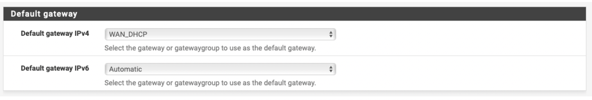

**A few important notes before we launch the instance:**

1. This document complements the existing deployment guide that was designed to help you to associate a Palo Alto VM-Series. We are going to assume that you have completed all steps up to `launching and associating a firewall instance <https://docs.aviatrix.com/HowTos/firewall_network_workflow.html#launching-and-associating-firewall-instance>`_  before launching this firewall instance. Launching and associating a firewall instance is not necessary as it is Palo Alto VM-Series specific.
2. Currently we do not have a full integration between the Aviatrix dashboard and the Netgate pfSense, which means that you will not be able to dynamically update the firewall routing table, as it is currently possible with the Palo Alto VM-Series.

=========================================================
Setting up Firewall Network (FireNet) for Netgate PFSense
=========================================================

Complete the first six steps (up to `Launching and Associating a Firewall Instance <https://docs.aviatrix.com/HowTos/firewall_network_workflow.html#launching-and-associating-firewall-instance>`_) of the Firewall Network Workflow in Aviatrix Controller to prepare your Firewall VPC (FireNet VPC). This will also set up the subnets that you will need for launching your PFsense instance.

==============================================
Deploying a PFsense Instance from the AWS Marketplace
==============================================

1. Go to aws.amazon.com/marketplace and search for the pfSense AMI in AWS Marketplace. Continue to **Subscribe**.

|image1|

2. On the next screen, accept the terms, and you should be able to continue.
3. On the next page, choose **Amazon Machine Image** as fulfillment option, choose the proper region and click **Launch**.
4. On the next page, Choose Action should be set to Launch through EC2 and then click **Launch**.  You might want to use the pfSense docs `page <https://docs.netgate.com/pfsense/en/latest/solutions/aws-vpn-appliance/launching-an-instance.html>`_ as reference as well.
5. Now, choose your instance size. For this deployment we are going to need 2 network interfaces: management/egress and LAN. A 3-interface deployment is possible (separating management from egress) but not required, as it will also require a larger instance (due to the extra ENI).
6. You can start with a t3.large for example, although for better network performance you might want to select a different instance type (m5, c5 or c5n) and a larger instance size. For more information on this subject, see this AWS `document <https://aws.amazon.com/ec2/instance-types/ >`_ and the pfSense docs `page <https://docs.netgate.com/pfsense/en/latest/solutions/aws-vpn-appliance/launching-an-instance.html>`_ as well.
7. On the instance details page, the most relevant setting for any deployment is the subnet selection for the ENIs eth0 and eth1. If you have followed all the steps on the Firewall page, then your subnet selection should follow this logic:

• Eth0 for both management and egress and it should be placed in the subnet FireNet-vpc-Public-FW-ingress-egress.
• Eth1 as the LAN interface should be placed in the subnet aviatrix-FW-GW-dmz-firewall (same AZ as eth0).

|image2|

8. At the bottom of this page, click **Add device** to create eth1 and select the proper subnet.

|image3|

9. Then click **Next: Add storage** – the default setting should be fine.
10. Then click **Next: Add Tags** – if you use tags in your environment, this is the time.
11. Then click **Next: Configure Security Group** – by default you are going to see pfSense default rules for HTTP, HTTPS, SSH and OpenVPN. You can then click **Review and Launch** or you should isolate the instance public interfaces with the following three rules.

• All inbound traffic allowed for your own public IP (you will have to SSH to the instance)
• All inbound traffic allowed for the Controller IP (even though only TCP port 443 and ICMP will be used)
• All inbound traffic allowed for RFC 1918 addresses (this should cover your spoke CIDRs and allow you to perform IDS/IPS)

12. Please note that as soon as you attach an EIP to any instance, it will start receiving random hits from the Internet and you should guarantee that unwanted traffic is simply being dropped, so you don’t pay for “rejects/resets” being sent from of your firewall/VPC.
13. The next page will be a summary containing all of your previous choices, as well as any relevant AWS warning on how you can improve your deployment (e.g: open security groups, AMI usage tier consideration, etc).
14. Once you click **Launch** you will be prompted to choose the .pem key – please download the key now if you have not done it already and archive it in a secure location, as you are going to use it to SSH into the instance to enable GUI/web interface access.
15. If you would like to, you can monitor the instance until it is up via the AWS console (see the screenshot below). Once the instance passes all the health checks, please open a terminal and SSH into the instance using the proper keys and the user “admin,” so can grep the auto-generated password.

|image4|

16. The pfSense console allows you to assign the interfaces and its IPs using options 1 and 2, but you can also do that via the web interface.

|image5|
|image6|

17. Please open a browser and go to https://the_instance_EIP. You will have to accept the self-assigned certificate and then will be prompted with a screen like the one below. Just enter the username as admin and the password you have just saved on the previous step.

|image7|

18. The Setup Wizard will take you through some basic steps, which will allow you to configure:

• On step 2:  Hostname and domain for the instance, primary and secondary DNS servers and whether DHCP should be able to override it – if you want to use AWS VPC DNS, leave the checkbox marked.
• On step 3: The timezone and NTP server – please remember that the AWS NTP server can be reached at 169.254.169.123.
• On step 6: You can change your password.
• And step 7 reloads the configuration.

19. Once you are done with the Setup Wizard, you should double-check your interfaces assignments (xn0/WAN and xn1/LAN) and set xn1 to DHCP. Also, don’t forget to disable **Source/dest Check** for the eth1 interface in the AWS Console as explained `here <https://docs.aws.amazon.com/AWSEC2/latest/UserGuide/using-eni.html#change_source_dest_check>`_.

|image8|
|image9|

20. The next step is to update the route table. For the purpose of this guide, we suggest adding three routes, each for a RFC1918 address pointing to the private IP of the eth2/ENI of the Aviatrix Gateway in question (whether you are attaching the instance to the main or to the backup gateway).
21. Please make sure that the gateway of the xn0/WAN interface has been selected as default, so your egress traffic can be routed to the VPC IGW.

|image10|

22. The next step is to configure the Aviatrix Gateway that the instance will be attached to (either the main or the backup) as an object. Please go to System > Routing > Gateway and click **+ Add**. The IP address of the eth2 interface of the Aviatrix Gateway selected can be found in the AWS: EC2 > Network Interfaces.

|image11|

23. One you have configured the Aviatrix Gateway, you can use it as next hop. Just go to System > Routing > Static Routes and click **+ Add**. Repeat this step for all three RF1918 subnets:

|image12|

24. Great. Let’s configure the NAT policy. By default, pfSense will perform automatic outbound NAT for both interfaces, which we cannot have for the xn1/LAN interface. So please go to Firewall > NAT > Outbound and create an exception mapping like the one below – to not NAT anything exiting via xn1:

|image13|

25. Now the next step is to change the default selection of NAT to be the second option: “Hybrid Outbound NAT rule generation (Automatic Outbound NAT + rules below)” – then click **Save** and then **Apply Changes**.
26. Now we need to double-check the firewall rules are according to your project. If you have already enforced the WAN inbound control at the Security Group level while launching the instance, all you need to confirm is that you are not being more restrictive at the firewall level, so please make sure you are allowing everything at the LAN level.

|image14|

27. The final step is to monitor your traffic to confirm that the inspection is being performed as configured. Please go to Status > System Logs > Firewall > Dynamic View. Use the funnel icon to filter your logs accordingly. In this example we have ICMP traffic being inspected in an East-West flow (192.168.240.22 > 10.10.10.10), as well as egress pings to disney.com from the same host.

|image15|

Great. You are now good to repeat this process to add more instances to talk to the main gateway and also to the backup gateway. The difference regarding the backup gateway attachment is that the subnets will be in a different AZ.

For more information on the Firewall network solution, please refer to this `link <https://docs.aviatrix.com/HowTos/firewall_network_faq.html>`_.

