.. meta::
  :description: Firewall Network
  :keywords: Azure Transit Gateway, Azure, Aviatrix Transit network, Transit DMZ, Egress, Firewall, VM Series, Palo Alto

===============================================================
Example Configuration for Palo Alto Networks VM-Series in Azure
===============================================================

The example on this page walks through how to deploy the Palo Alto Networks (PAN) VM-Series firewalls in the Transit VNet, and how to inspect traffic between the two Spoke VNETs using firewall policies. 

Aviatrix FireNet deploys and manages firewall instances in the cloud. It greatly simplifies virtual firewall deployment and allows the firewall to inspect East-West and/or North-South traffic.

FireNet allows you to scale firewall deployment to multiple Availability Zones and multiple instances/VMs in a maximum throughput Active/Active state without SNAT.

|pan-gcp-azure|

See `here <https://docs.aviatrix.com/HowTos/pan_bootstrap_example_azure.html>`_ for using a bootstrap configuration to set up your Palo Alto Firewall in Azure.

For Palo Alto example configurations in other CSPs, see:

- `Palo Alto Networks VM-Series in AWS <https://docs.aviatrix.com/HowTos/config_paloaltoVM.html>`_
- `Palo Alto Networks VM-Series in GCP <https://docs.aviatrix.com/HowTos/config_paloaltoGCP.html>`_
- `Palo Alto Networks VM-Series in OCI <https://docs.aviatrix.com/HowTos/transit_firenet_workflow_oci.html>`_

Prerequisites 
-------------

Before deploying the PAN VM-Series firewall as described below, you must follow the steps `here <https://docs.aviatrix.com/HowTos/transit_firenet_workflow_azure.html>`_ (up to but not including deploying the firewall instance) to create the necessary Spoke and Transit gateways. 

As per this example you would need: 

- Two spoke gateways in Azure (created in us-west) named azure-us-west-spoke1 and azure-us-west-spoke2
- A transit gateway in Azure (created in us-west) named azure-us-west-transit
- Enable Transit FireNet for azure-us-west-transit

Deploying the PAN VM-Series Firewall
------------------------------------
After completing the above prerequisites, you use the steps below to deploy a PAN firewall from the Aviatrix Controller. The specific image name to deploy is “Palo Alto Networks VM-Series Next-Generation Firewall Bundle 1”. Aviatrix has already completed the subscription to this firewall image in the Azure Marketplace. 

1. In the Aviatrix Controller, navigate to Firewall Network > Setup> Firewall > 2a) Launch & Associate Firewall Instance. As per the example above, use the following criteria:

==========================================      ==================
**Example setting**                             **Example value**
==========================================      ==================
VPC ID                                          azure-us-west-transit
Gateway Name                                    azure-us-west-transit-agw
Firewall Instance Name                          azure-us-west-pan
Firewall Image                                  Palo Alto Networks VM-Series Next-Generation Firewall Bundle 1
Firewall Image Version                          9.1.0
Firewall Instance Size                          Standard_D3-v2
Management Interface Subnet                     azure-us-west-transit-Public-gateway-and-firewall-mgmt-1
					      Do not select a subnet that begins with az-1, az-2, or az-3.
Egress Interface Subnet                         azure-us-west-transit-Public-FW-ingress-egress-1
					      Do not select a subnet that begins with az-1, az-2, or az-3.
Username 			              use name of your choice
Password					      enter/choose complex password
Authentication Method                           Password
Attach                                          Select this checkbox
Advanced                                        Do not select this checkbox
==========================================      =================

2. Click Launch.

|PAN_FW_Azure_Controller| 

.. Note::
	Firewall deployment can take up to ten minutes. After the firewall deploys successfully the following confirmation message displays in the Controller:

|firewall_launch|

3. In the Aviatrix Controller, navigate to Firewall Network > List > Firewall. This list shows all created firewalls and their management UI IP addresses. 
#. Click the management UI link for the Palo Alto Networks firewall you just created in Azure.
#. Log in using the username and password you configured in step 1.

Configuring the Palo Alto Firewall
----------------------------------

When you access the firewall, you may see an “invalid certificate” warning. Navigate past this warning and log in to the firewall using the username and password you entered when you launched your firewall instance.

All of the following steps are performed in the Palo Alto firewall UI.

WAN Interface Setup
-------------------

1. After logging in, navigate to Network> Interfaces> Ethernet and click ethernet1/1, which is the WAN interface. 
2. In the Comment field, enter ‘WAN’.
3. Change the Interface Type to ‘Layer3’. This displays a new set of tabs, including Config and IPv4.
4. On the Config tab, configure the following:

	- Virtual Router: default
	- Security Zone: New Zone

5. In the Zone dialog, enter WAN as the new zone name and click OK.

|pan_wan_azure|

6. On the IPv4 tab, select DHCP Client and clear the **Automatically create default route pointing to default gateway provided by the server** check box.

LAN Interface Setup
-------------------

1. From Network> Interfaces> Ethernet, click ethernet1/2, which is the LAN interface.
#. In the Comment field, enter ‘LAN’.
#. Change the Interface Type to ‘Layer3’. This displays a new set of tabs, including Advanced.
#. On the Other Info sub-tab, under Advanced tab, enter Management as the Management Profile name.
#. Select **HTTPS** as the Administrative Management Service. This is how the Azure Internal Load Balancer (ILB) probe communicates with the firewall.
# Under the Config tab for the LAN interface, configure the following:

	- Virtual Router: default
	- Security Zone: New Zone

7. In the Zone dialog, enter ‘LAN’ as the new zone name and click OK.

|pan_lan_azure|

8. On the IPv4 tab, select DHCP Client and clear the **Automatically create default route pointing to default gateway provided by the server** check box. 
#. Click OK.

Setting up Policies 
-------------------

On the Policies tab, do the following for intrazone-default and interzone-default:

1. Click Override at the bottom of the window.
#. In the resulting Security Policy Rule dialog, click the Actions tab and enable Log at Session End.
#. Click OK.

Virtual Router
--------------

1. On the Network > Virtual Routers tab, ensure that the default virtual router has the ethernet1/1 and ethernet1/2 interfaces selected on the Router Settings > General tab.
#. Click OK.

Committing Changes 
------------------

It is important to commit your changes before creating the necessary static routes in the next section.

1. Click Commit in the top right corner of the webpage. In the resulting dialog, click Commit if your dialog looks like the following:

|PAN_policy_commit|

#. After committing, a dialog displays indicating that the configuration was successful. Keep the firewall HTTPS session open for further configuration.

Pushing RFC 1918 Routes to Firewall 
-----------------------------------

1. In the Aviatrix Controller, navigate to Controller > Firewall Network > Vendor Integration and configure the fields as follows:

	- Transit VPC ID: azure-us-west-transit
	- Firewall Instance ID: azure-us-west-pan
	- Firewall Name: azure-us-west-pan
	- Firewall Vendor Type: Palo Alto Networks VM-Series
	- Firewall Login Username: the username you created at the beginning of this document
	- Firewall Login Password: the password you created at the beginning of this document
	- Firewall Management IP Address: Auto populated

|vendor_integration_example|

2. Click Save to save the credentials.
3. Click Show to see the RFC 1918 routes that the Controller automatically programmed on the firewall. Each route has an AVX prefix to indicate this.

Configuring the FireNet Policy 
------------------------------

1. In the Aviatrix Controller, navigate to Firewall Network > Policy.
2. Select each Azure Spoke gateway and click Add. You can only add one gateway at a time.

|azure_paloalto_policy|

The traffic entering and exiting these Spoke gateways will now be inspected.

Verifying the Installed Firewall Routes
---------------------------------------

You now need to verify that the RFC 1918 routes exist on the firewall.

1. In the Palo Alto firewall UI, navigate to Network > Virtual Routers and click default.
#. Click the Static Routes tab. You will see the same RFC 1918 routes with AVX prefixes that were created by the Aviatrix Controller.

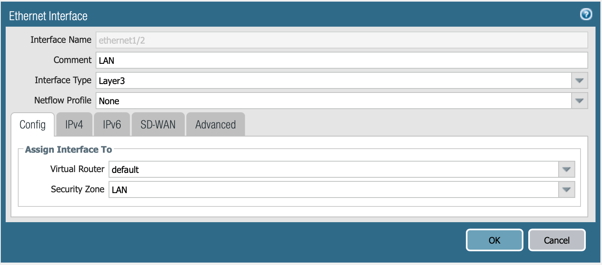

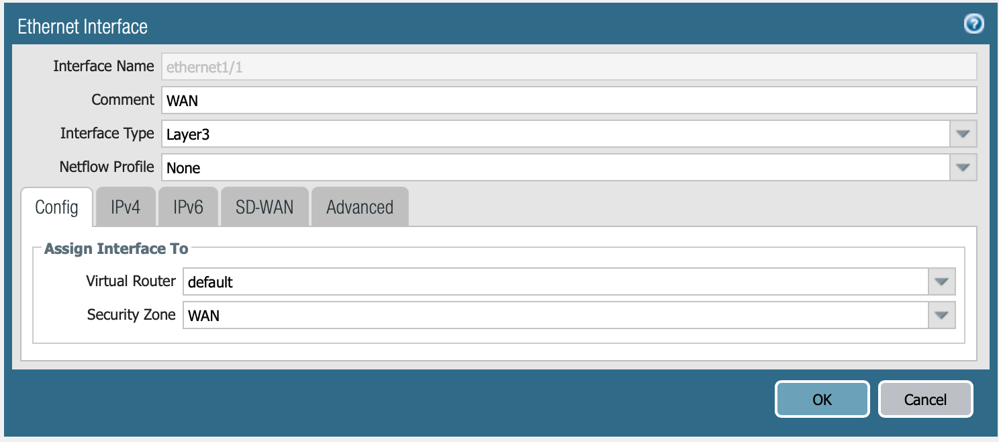

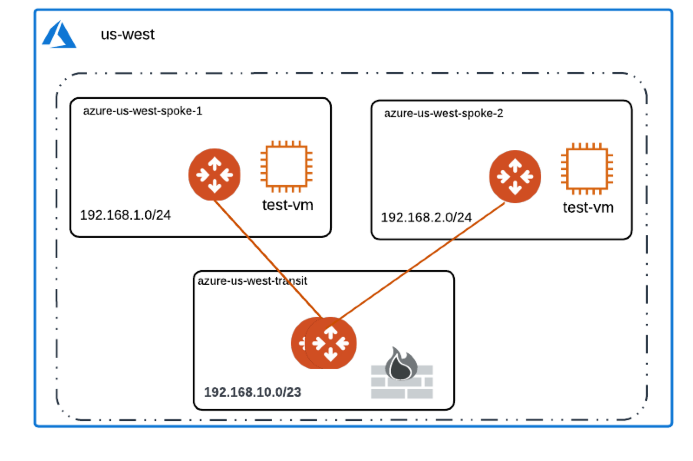

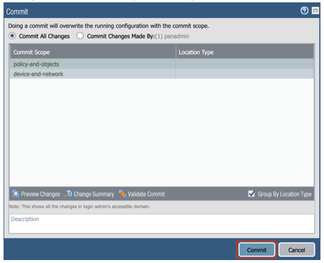

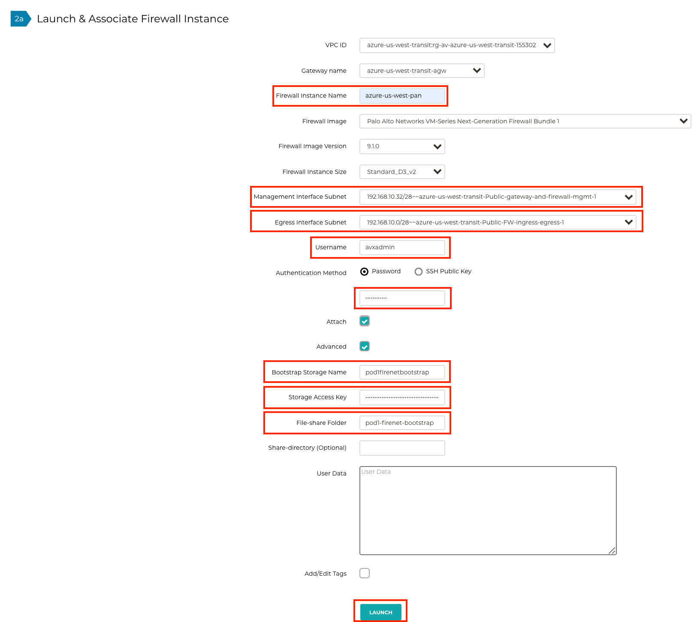

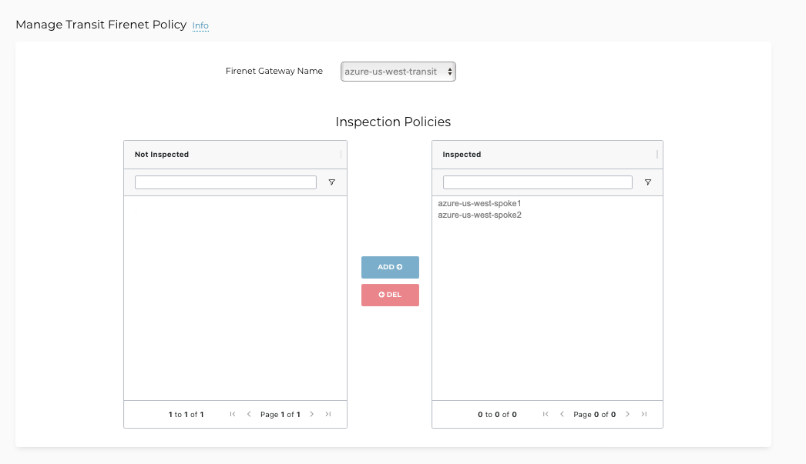

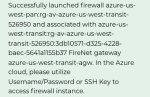

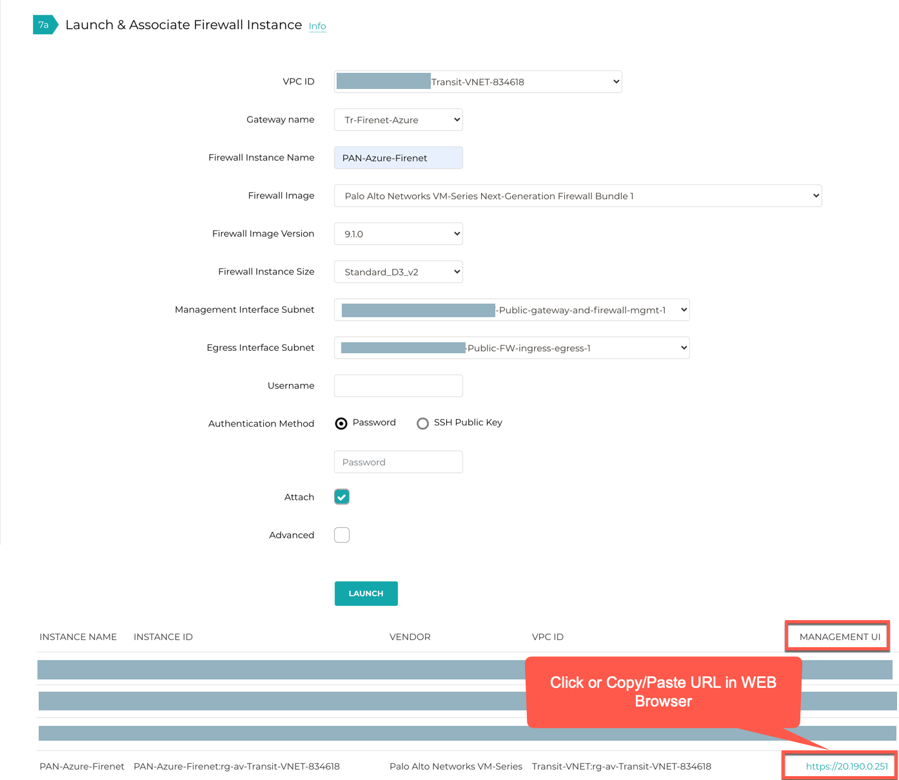

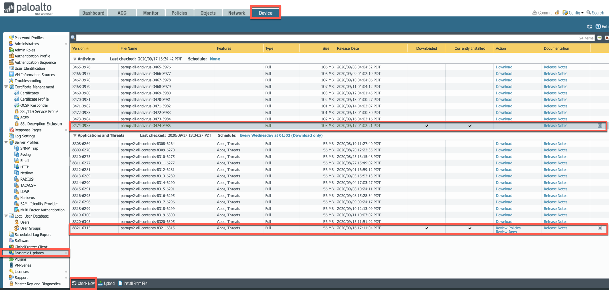

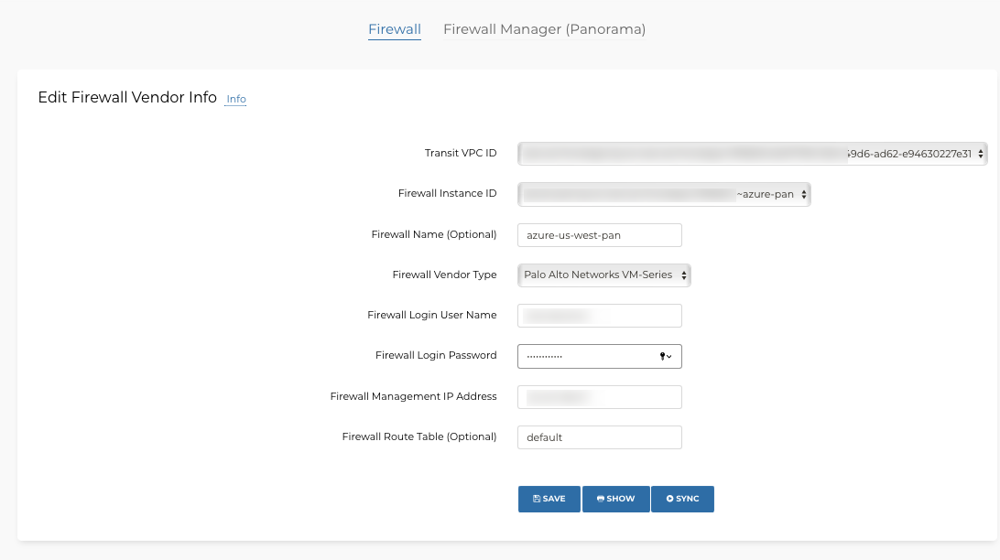

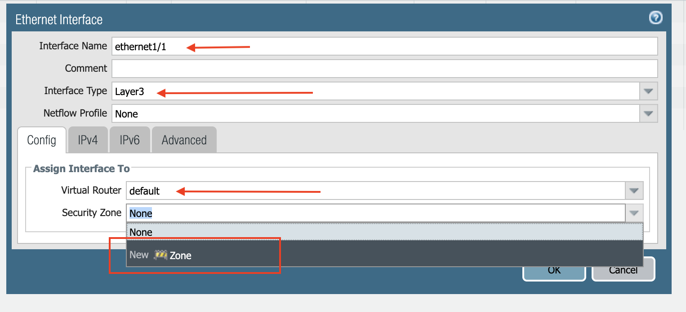

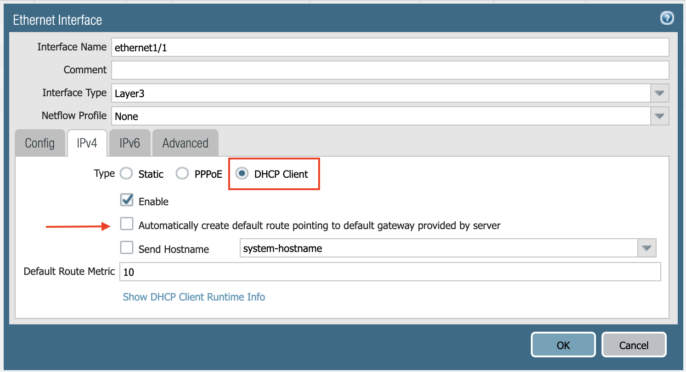

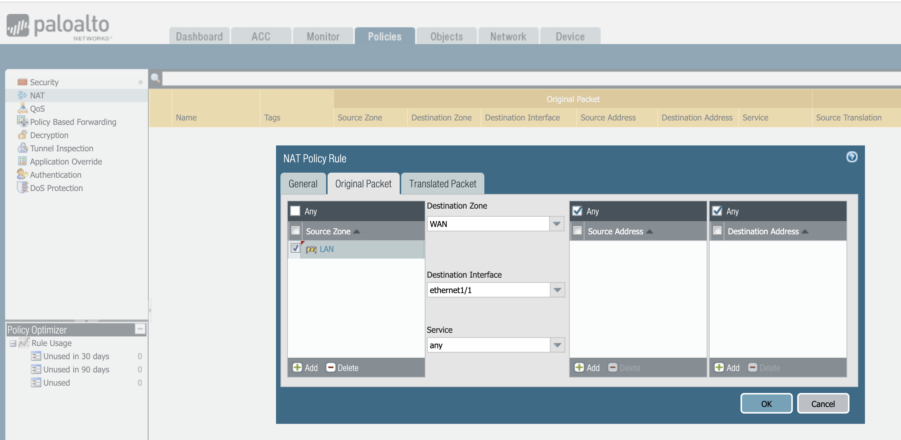

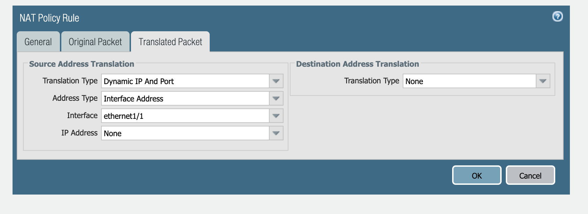

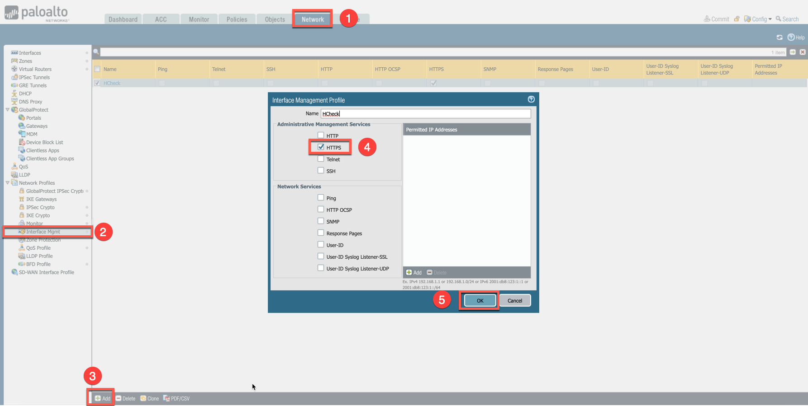

.. |health-probe-logs| image:: transit_firenet_workflow_media/transit_firenet_Azure_workflow_media/health-probe-logs.png
   :scale: 40%

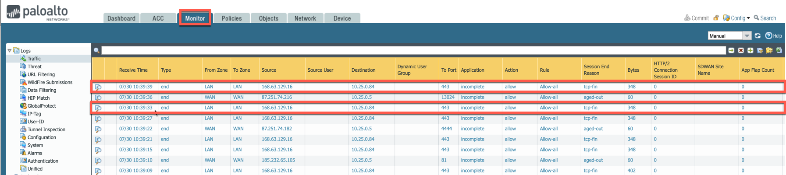

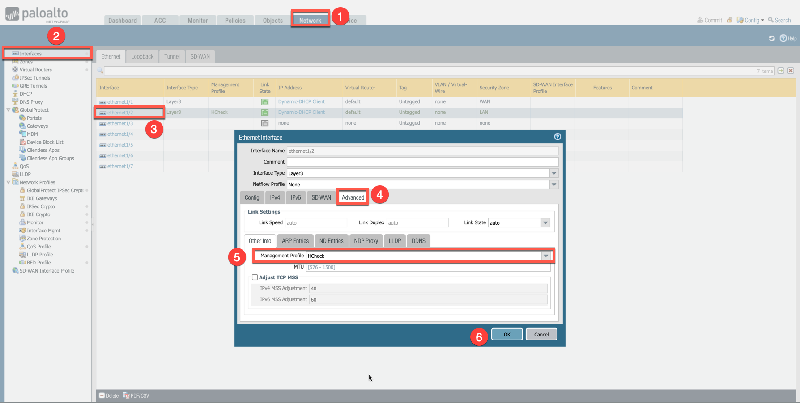

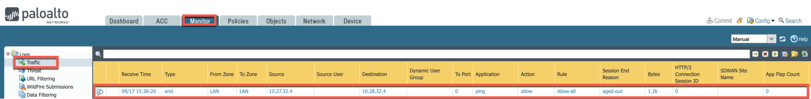

.. disqus::
