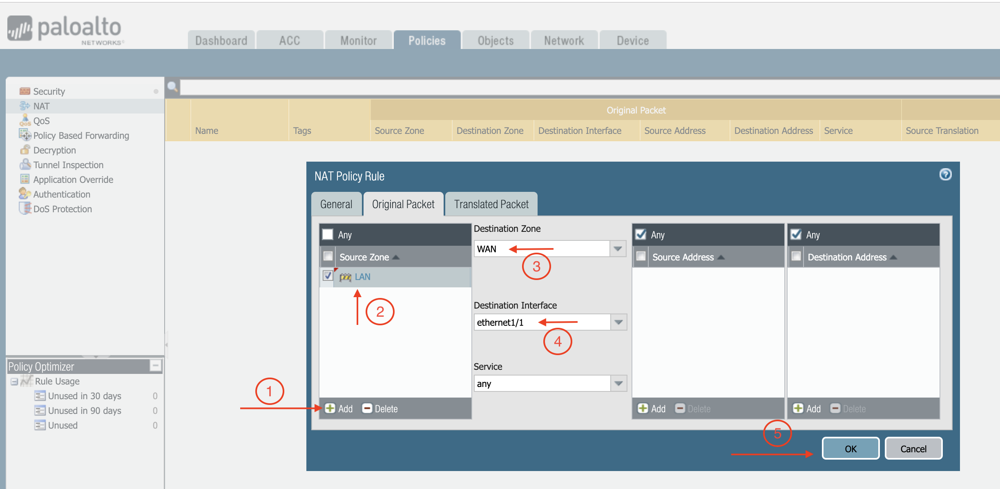

.. meta::
  :description: Firewall Network
  :keywords: AWS Transit Gateway, AWS TGW, TGW orchestrator, Aviatrix Transit network, Transit DMZ, Egress, Firewall, VM Series

=========================================================
Example Config for Palo Alto Networks VM-Series in Azure
=========================================================

In this document, we provide an example to set up the VM-Series for you to validate that packets are indeed
sent to the VM-Series for VNet to VNet and from VNet to internet traffic inspection.

Please follow the below steps to launch and configure Palo Alto Networks VM-Series in Azure.

If you are looking to deploy VM-Series in AWS environment, your starting point is `here <https://docs.aviatrix.com/HowTos/config_paloaltoVM.html#example-config-for-palo-alto-network-vm-series>`_.

Launching Palo Alto Networks Firewall from Aviatrix Controller
--------------------------------------------------------------------------

The Aviatrix Firewall Network (FireNet) workflow launches a VM-Series at `this step <https://docs.aviatrix.com/HowTos/firewall_network_workflow.html#launching-and-associating-firewall-instance>`_ in the workflow. After the launch is complete, the console displays the VM-Series instance with its public IP address of management interface.

Go to your Aviatrix Controller > Firewall Network > Setup > Firewall > Step 2a. Here is the VM-Series information in this example for your reference. Please adjust it depending on your requirements.

==========================================      ==========
**Example setting**                             **Example value**
==========================================      ==========
VPC ID                                          Select VPC (e.g. TR-Firenet-VNET)
Gateway Name                                    Select correct Transit FireNet Gateway
Firewall Instance Name                          Give any Good Name (e.g. PAN-Azure-Firenet)
Firewall Image                                  Palo Alto Networks VM-Series Next-Generation Firewall Bundle 1
Firewall Image Version                          9.1.0
Firewall Instance Size                          Standard_D3_v2
Management Interface Subnet                     Select the subnet whose name contains "Public-gateway-and-firewall-mgmt".
Egress Interface Subnet                         Select the subnet whose name contains "Public-FW-ingress-egress".
Username 			                            Any Good Name (e.g. panadmin). Note that 'admin' is not allowed. Please refer to https://docs.microsoft.com/en-us/azure/virtual-machines/linux/faq for the requirements for setting this name
Authentication Method                           Password or SSH Public Key
Password                                        Input a good password of your choice
Attach                                          Mark this checkbox
Advanced                                        Unmark this checkbox
==========================================      ==========

Palo Alto Networks VM-Series instance has three interfaces as described below.

========================================================         ===============================          ================================
**Palo Alto VM interfaces**                                      **Description**                          **Inbound Security Group Rule**
========================================================         ===============================          ================================
eth0 (on subnet -Public-gateway-and-firewall-mgmt)               Management interface                     Allow SSH, HTTPS, ICMP, TCP 3978
eth1 (on subnet -Public-FW-ingress-egress)                       Egress or Untrusted interface            Allow ALL
eth2 (on subnet -dmz-firewall_lan)                               LAN or Trusted interface                 Allow ALL (Do not change)
========================================================         ===============================          ================================

Note that firewall instance eth2 is on the same subnet as FireNet gateway eth2 interface.

Logging in to VM-Series
-------------------------------

1. Go back to your Aviatrix Controller.
2. Go to Firewall Network workflow, Step 2a. Click on the **Management UI**. It takes you the VM-Series you just launched.
3. Log in with Username "panadmin". Password is the password you set at the previous step.

|avx-firewall-step7a_UI|

Activating VM License
------------------------------

Dynamic updates
------------------------

#. Go to Device > Dynamic Updates > Click on **Check Now**.
#. Download and Install latest versions of Applications and Threats.
#. Wildfire updates > Click on "Check Now" again > download and then install latest version of Antivirus.

|pan_dynamic_updates|

Configuring VM-Series ethernet1/1 with WAN Zone
-------------------------------------------------------------------

After logging in, select the **Network** tab and you should see a list of ethernet interfaces. Click ethernet1/1 and
configure as the following screenshot.

1. Select the **Network** tab.
2. Click **ethernet1/1**.
3. Select **layer3** for Interface Type
4. Click **Config** tab in the popup Ethernet Interface window.
5. Select default for Virtual Router at Config tab.
6. Click **New Zone for Security Zone** to create a WAN zone.
7. At the next popup window, name the new zone "WAN" and click **OK**.

|new_zone|

Continue:

8. Select **IPV4** tab in the popup Ethernet Interface window.
9. Select **DHCP Client**.
10. Unmark the **Automatically create default route pointing to default gateway provided by server** checkbox as shown below.

|ipv4|

11. Click **Commit**. Once Commit is complete, you should see the Link State turn green at the Network page for ethernet1/1.

Configuring VM-Series ethernet1/2 with LAN Zone
-----------------------------------------------------------------

Repeat the steps in the "Configuring VM-Series ethernet1/1 with WAN Zone" section above for ethernet1/2. Name the new zone LAN.

Click **Commit**. Once Commit is complete, you should see the Link State turn green at the Network page for ethernet1/2.

Vendor Firewall Integration
--------------------------------------

This step automatically configures the RFC 1918 and non-RFC 1918 routes between Aviatrix Gateway and Vendor’s firewall instance in this case Palo Alto Networks VM-Series. This can also be done manually through Cloud Portal and/or Vendor’s Management tool.

1. Go to Firewall Network > Vendor Integration > Select Firewall, fill in the details of your Firewall instance.
2. Click **Save,** **Show** and **Sync**.

|vendor_integration_example|

Enabling VM-Series Health Check Policy
----------------------------------------------------

By default, VM-Series do not allow HTTPS or TCP 443 port. Please use the following steps to enable it:

1. Go to Network > Interface Mgmt under Network Profiles and click "**Add**.
2. Give any name in Interface Management Profile, mark the **HTTPS** checkbox under Administrative Management Service, and click **OK**.
3. Attach Profile with LAN interface. Network > Interfaces > Select LAN Ethernet Interface > Advanced -> Management Profile > Select appropriate profile.

|PAN-health-check|

See an example screenshot below how to attach profile to an interface.

|pan_hcheck_attach|

Firewall health check probes can be verified in Monitor > Traffic.

|pan-health-probe|

Configuring Basic Traffic Policy to Allow Traffic VNet to VNet
----------------------------------------------------------------------------

In this step, we will configure a basic traffic security policy that allows traffic to pass through the VM-Series firewall.

1. Select the **Policies** tab.
#. Click **+Add** at the bottom left corner to create a new policy.
#. Select the **General** tab. Name the policy "Allow-all."
#. Select the **Source tab. Select **Any** for both panels.
#. Select the **Destination tab. Select **Any** for both panels.
#. Select the **Application** tab. Select **Any**.
#. Click **OK**.
#. Click **Commit** to commit the Allow-all policy.

[Optional] Configuring Basic Traffic Policy to Allow Traffic VNet to Internet
-----------------------------------------------------------------------------------------

If you would also like to enable NAT to test egress, follow these steps.

1. Policies > NAT > Click **Add**.
2. Select the **General** tab, give it a name > Click **Original Packet**. 
3. At Source Zone, click **Add**, and select **LAN**. 
4. At Destination Zone, select **WAN**. At Destination Interface, select **Ethernet1/1**, as shown below.

 |nat_original_packet|

4. Click **Translated Packet**. At Translation Type, select **Dynamic IP And Port**. 
5. At Address Type, select **Interface Address**. 
6. At Interface, select **ethernet1/1**, as shown below.

 |nat_translated_packet|

Ready to Go
--------------------

Now your firewall instance is ready to receive packets!

Next step is to validate your configurations and polices using FlightPath and Diagnostic Tools (ping, traceroute etc.).

Viewing Traffic Log
---------------------------

You can view if traffic is forwarded to the firewall instance by logging in to the VM-Series console. Go to Monitor > Traffic.

VNet to VNet traffic:
~~~~~~~~~~~~~~~~~~~~~~~~~

Launch one instance in Spoke VNet-1 and one in Spoke VNet-2. Start ping packets from a instance in Spoke VNet-1 to the private IP of another instance in Spoke VNet-2. The ICMP traffic should go through the firewall and can be inspected in firewall.

|traffic_log_vnet_to_vnet|

[Optional] For VNet to Internet traffic:
~~~~~~~~~~~~~~~~~~~~~~~~~~~~~~~~~~~~~~~~

Similarly, VNet to internet traffic can be also inspected by launching a private instance in the Spoke VNet and start ping packets from the private instance towards Internet (e.g 8.8.8.8) to verify the egress function.

.. important::
    The Egress Inspection is only applicable to all VNets that deploys non-public facing applications. If you have any Spoke VNet that has public facing web services, you should not enable Egress Inspection. This is because Egress Inspection inserts a default route (0.0.0.0/0) towards Transit GW to send the Internet traffic towards firewall to get inspected. Azure's System Default Route pointing towards Internet will be overwritten by User-defined default route inserted by the Controller.

.. |avx-firewall-step7a_UI| image:: config_paloaltoVM_media/avx-firewall-step7a_UI.png
   :scale: 35%

.. |pan_dynamic_updates| image:: config_paloaltoVM_media/pan_dynamic_updates.png
   :scale: 35%

.. |vendor_integration_example| image:: config_paloaltoVM_media/vendor_integration_example.png
   :scale: 35%

.. |new_zone| image:: config_paloaltoVM_media/new_zone.png
   :scale: 30%

.. |ipv4| image:: config_paloaltoVM_media/ipv4.png
   :scale: 30%

.. |nat_translated_packet| image:: config_paloaltoVM_media/nat_translated_packet.png
   :scale: 30%

.. |PAN-health-check| image:: transit_firenet_workflow_media/transit_firenet_Azure_workflow_media/PAN-health-check.png
   :scale: 35%

.. |health-probe-logs| image:: transit_firenet_workflow_media/transit_firenet_Azure_workflow_media/health-probe-logs.png
   :scale: 40%

.. |pan-health-probe| image:: transit_firenet_workflow_media/transit_firenet_Azure_workflow_media/pan-health-probe.png
   :scale: 40%

.. |pan_hcheck_attach| image:: transit_firenet_workflow_media/transit_firenet_Azure_workflow_media/pan_hcheck_attach.png
   :scale: 40%

.. |traffic_log_vnet_to_vnet| image:: config_paloaltoVM_media/traffic_log_vnet_to_vnet.png
   :scale: 40%

.. disqus::
