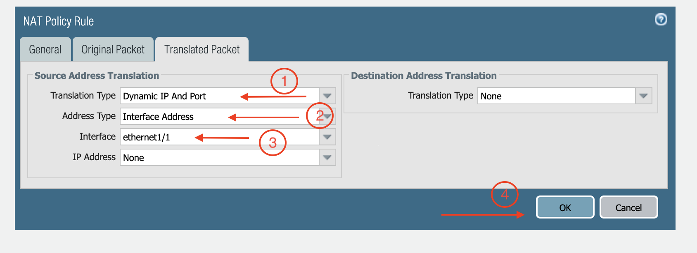

=========================================================
Example Config for Palo Alto Network VM-Series in GCP
=========================================================

In this document, we provide an example to set up the VM-Series for you to validate that packets are indeed sent to the VM-Series for VPC-to-VPC and from VPC to internet traffic inspection.

For using bootstrap method to set up the VM-Series, follow `this document <https://docs.aviatrix.com/HowTos/bootstrap_example.html>`_.

VM-Series in AWS can be set up using the guide `Palo Alto Networks VM-Series AWS Example <https://docs.aviatrix.com/HowTos/config_paloaltoVM.html#example-config-for-palo-alto-network-vm-series>`_.

VM-Series in Azure can be set up using the guide `Palo Alto Networks VM-Series Azure Example <https://docs.aviatrix.com/HowTos/config_PaloAltoAzure.html#example-config-for-palo-alto-networks-vm-series-in-azure>`_.

The Aviatrix Firewall Network (FireNet) workflow launches a VM-Series at `this step <https://docs.aviatrix.com/HowTos/firewall_network_workflow.html#launching-and-associating-firewall-instance>`_. After the launch is complete, the console displays the
VM-Series instance with its public IP address of management interface and allows you to download the .pem file for SSH access to the instance.

Below are the steps for initial setup.

Downloading VM-Series Access Key
--------------------------------------------------

After `this step <https://docs.aviatrix.com/HowTos/firewall_network_workflow.html#launching-and-associating-firewall-instance>`_ in the workflow is completed, click **Download** to download the .pem file.

If you get a download error, usually it means the VM-Series is not ready. Wait until it is ready, refresh the browser and then try again.

|access_key|

Resetting VM-Series Password
------------------------------------------

For Metered AMI, open a terminal and run the following command.

.. tip ::

 Once you download the .pem file, change the file permission to 400. If you are asked to enter a password during the login, the VM-Series is still not ready. Wait and try again. It usually takes up to 15 minutes for the VM-Series to be ready. When the VM-Series is ready, you will not be asked for a password anymore.

::

 ssh -i <private_key.pem> admin@<public-ip_address>
 configure
 set mgt-config users admin password
 commit

For BYOL, open a terminal and run the following command.

::

 ssh -i <private_key.pem> admin@<public-ip_address>
 configure
 set mgt-config users admin password
 set deviceconfig system dns-setting servers primary <ip_address>
 commit

Terminate the SSH session.

Logging in to the VM-Series
--------------------------------------

1. Go back to the Aviatrix Controller.
2. Go to Firewall Network workflow, Step 2a. Click on the Management UI. It takes you the VM-Series you just launched.
3. Login with Username "admin". Password is the password you set at the previous step.

Activating VM License
--------------------------------

Dynamic Updates
------------------------------

1. From Device > Dynamic Updates > Click on **Check Now** > download and then install latest versions of a. Applications and Threats b. Wildfire updates.
2. Click on **Check Now** again > download and then install latest version of Antivirus.

Configuring VM-Series ethernet1/1 with WAN Zone
----------------------------------------------------------------------

After logging in, select the **Network** tab and you should see a list of ethernet interfaces. Click ethernet1/1 and configure as the following screenshot.

1. Select the **Network** tab.
2. Click **ethernet1/1**.
3. Select **layer3** for Interface Type.
4. Select the **Config** tab in the popup Ethernet Interface window.
5. Select the default for Virtual Router at the Config tab.
6. Click **New Zone for Security Zone** to create a WAN zone.
7. At the next popup screen, name the new zone "WAN" and click **OK**.

|new_zone|

Continue:

8. Select **IPV4** tab in the popup Ethernet Interface window.
9. Select **DHCP Client**.
10. Unmark the **Automatically create default route pointing to default gateway provided by server**, as shown below.

|ipv4|

11. Click **Commit**. Once Commit is complete, you should see the Link State turn green at the Network page for ethernet1/1.

Configuring VM-Series ethernet1/2 with LAN Zone
--------------------------------------------------------------------

1. Repeat the steps in the "Configuring VM-Series ethernet1/1 with WAN Zone" section above for ethernet1/2. Name the new zone LAN.
2. Click **Commit**. Once Commit is complete, you should see the Link State turn green at the Network page for ethernet1/2.

GCP VM-Series Health Check
-------------------------------------------

First, configure DNAT rule for Health Check is a mandatory required in GCP. Go to Polices > NAT > Add NAT. See example below for NAT configurations.

|health_check_dnat|

Also, follow `VM-Series Health Check Steps <https://docs.aviatrix.com/HowTos/config_PaloAltoAzure.html#enable-vm-series-health-check-policy>`_ to allow Google Load Balancer to check firewall instance health at regular intervals.

Configure Basic Allow-all Policy
--------------------------------------------------

In this step, we will configure a basic traffic security policy that allows traffic to pass through the VM-Series firewall.

1. Select the **Policies** tab.
#. Select the **+Add** at the bottom-left corner to create a new policy.
#. Select the **General** tab. Name the policy Allow-all.
#. Select the **Source** tab. Select **Any** for both panels.
#. Select the **Destination** tab. Select **Any** for both panels.
#. Select the **Application** tab. Select **Any**.
#. Click **OK**.
#. Click **Commit** to install the Allow-all policy.

Configuring NAT for Egress
--------------------------------------

If you would also like to enable NAT to test egress, follow these steps.

1. Policies > NAT > Click **Add** > Select the **General** tab, give it a name > Click Original Packet. 
2. At Source Zone, click **Add**, select "LAN". 
3. At Destination Zone, select WAN. 
4. At Destination Interface, select Ethernet1/1, as shown below.

 |nat_original_packet|

5. Click **Translated Packet**. At Translation Type, select **Dynamic IP And Port**. At Address Type, select **Interface Address**. 
6. At Interface, select **ethernet1/1**, as shown below.

 |nat_translated_packet|

Ready to Go
--------------------------

Now your firewall instance is ready to receive packets.

Next step is to validate your configurations and polices using FlightPath and Diagnostic Tools (ping, traceroute etc.).

12. View Traffic Log
-----------------------------

You can view if traffic is forwarded to the firewall instance by logging in to the VM-Series console. 

1. Click **Monitor**. 
2. Start ping packets from one Spoke VPC to another Spoke VPC where one or both of Security Domains are connected to Firewall Network Security Domain

.. |new_zone| image:: config_paloaltoVM_media/new_zone.png
   :scale: 30%

.. |ipv4| image:: config_paloaltoVM_media/ipv4.png
   :scale: 30%

.. |nat_original_packet| image:: config_paloaltoVM_media/nat_original_packet.png
   :scale: 30%

.. disqus::
