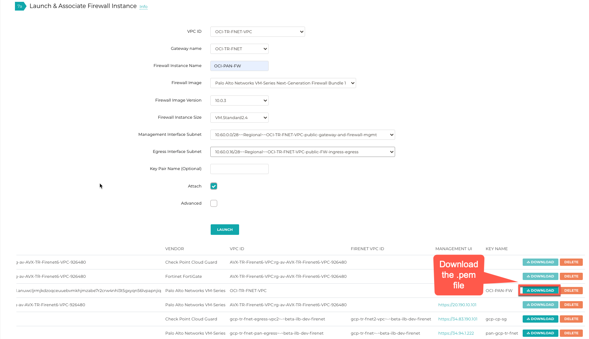
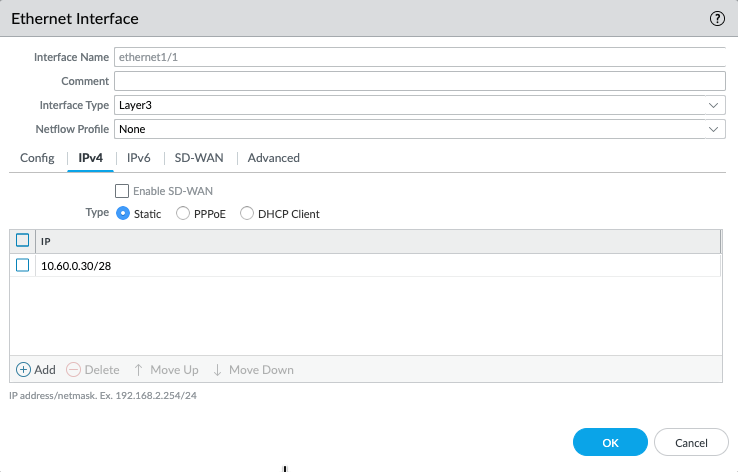
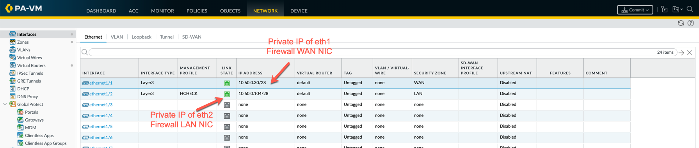
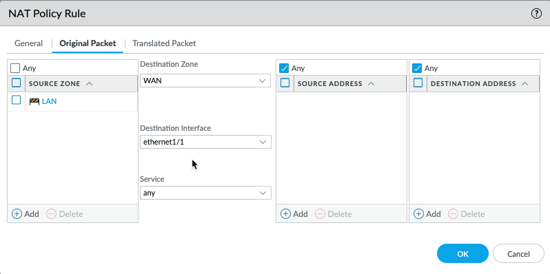
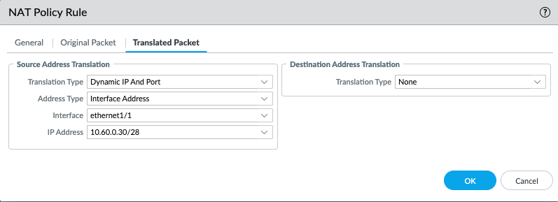

.. meta::
  :description: Firewall Network
  :keywords: OCI Transit Gateway, Aviatrix Transit network, Transit DMZ, Egress, Firewall, OCI Palo Alto, VM-Series

=========================================================
Example Config for Palo Alto Network VM-Series in OCI
=========================================================

In this document, we provide an example to set up the VM-Series for you to validate that packets are indeed
sent to the VM-Series for VCN to VCN and from VCN to internet traffic inspection.

VM-Series in AWS can be setup using the guide `Palo Alto Networks VM-Series AWS Example <https://docs.aviatrix.com/HowTos/config_paloaltoVM.html#example-config-for-palo-alto-network-vm-series>`_.

VM-Series in Azure can be setup using the guide `Palo Alto Networks VM-Series Azure Example <https://docs.aviatrix.com/HowTos/config_PaloAltoAzure.html#example-config-for-palo-alto-networks-vm-series-in-azure>`_.

The Aviatrix Firewall Network (FireNet) workflow launches a VM-Series at `Step 7a. <https://docs.aviatrix.com/HowTos/firewall_network_workflow.html#a-launch-and-associate-firewall-instance>`_ After the launch is complete, the console displays the
VM-Series instance with its public IP address of management interface and allows you to download the .pem file
for SSH access to the instance.

Below are the steps for initial setup.

1. Download VM-Series Access Key
----------------------------------

After `Step 7a <https://docs.aviatrix.com/HowTos/firewall_network_workflow.html#a-launch-and-associate-firewall-instance>`_ is completed, you'll see the Download button as below. Click the button to download the .pem file.

If you get a download error, usually it means the VM-Series is not ready. Wait until it is ready, refresh the browser and then try again.

|access_key|

2. Reset VM-Series Password
--------------------------------

For Metered AMI, open a terminal and run the following command.

.. tip ::

 Once you download the .pem file, change the file permission to 600. If you are asked to enter a password during the login, the VM-Series is still not ready. Wait and try again. It usually takes up to 15 minutes for the VM-Series to be ready. When the VM-Series is ready, you will not be asked for a password anymore.

::

 ssh -i <private_key.pem> admin@<public-ip_address>
 configure
 set mgt-config users admin password
 commit

For BYOL, open a terminal and run the following command.

::

 ssh -i <private_key.pem> admin@<public-ip_address>
 configure
 set mgt-config users admin password
 set deviceconfig system dns-setting servers primary <ip_address>
 commit

Terminate the SSH session.

3. Login to VM-Series
------------------------

Go back to the Aviatrix Controller Console.
Go to Firewall Network workflow, Step 7a. Click on the `Management UI`. It takes you the VM-Series you just launched.

Login with Username "admin". Password is the password you set at the previous step.

4. Activate VM license
------------------------

5. Dynamic updates
------------------------

From Device > Dynamic Updates > Click on "Check Now" > download and then install latest versions of a. Applications and Threats b. Wildfire updates > Click on "Check Now" again > download and then install latest version of Antivirus

6. Configure VM-Series ethernet1/1 with WAN Zone
-------------------------------------------------

Once logged in, click on the Network tab and you should see a list of ethernet interfaces. Click ethernet1/1 and
configure as the following screenshot.

 - Click Network tab
 - Click ethernet1/1
 - Select "layer3" for Interface Type
 - Click Config tab in the pop up Ethernet Interface window.
 - Select default for Virtual Router at Config tab
 - Click New Zone for Security Zone to create a WAN zone.
 - At the next pop up screen, name the new zone "WAN" and click OK

|new_zone|

Continue,

 - Select IPV4 tab in the pop up Ethernet Interface window.
 - Select Static
 - Add Private IP of eth1 firewall WAN NIC, as shown below.

|ipv4|

Click Commit. Once Commit is complete, you should see the Link State turn green at the Network page for ethernet1/1.

7. Configure VM-Series ethernet1/2 with LAN Zone
---------------------------------------------------

Repeat Step 6 for ethernet1/2. Name the new zone LAN. Also, allow ICMP on LAN interface for health check, as shown below.

    1. Go to Network -> Interface Mgmt under Network Profiles and click "Add".
    #. Give any name in "Interface Management Profile", check Ping or ICMP checkbox under Administrative Management Service and click "OK".
    #. Attach Profile with LAN interface. Network -> Interfaces -> Select LAN Ethernet Interface -> Advanced -> Management Profile -> Select appropriate profile.

|ipv4_2|

Click Commit. Once Commit is complete, you should see the Link State turn green at the Network page for ethernet1/2.

8. Configure Allow All Policies
---------------------------------

Policies > Security > Click "Add"

    1. Name the policy -> Allow-All
    #. Source tab -> Any
    #. Destination tab -> Any
    #. Applicatio tab -> Any
    #. Click "OK"

9. Configure NAT for egress
------------------------------

If you would also like to enable NAT to test egress, follow these steps.

Policies > NAT > Click "Add" > Click General tab, give it a name > Click Original Packet. At Source Zone, click Add, select "LAN". At Destination Zone, select WAN. At Destination Interface, select Ethernet1/1, as shown below.

 |nat_original_packet|

 Click Translated Packet. At Translation Type, select "Dynamic IP And Port". At Address Type, select "Interface Address". At Interface, select "ethernet1/1", as shown below.

 |nat_translated_packet|

11. Setup API access
----------------------

In order for the Aviatrix Controller to automatically update firewall instance route tables, monitor the firewall instance health and manage instance failover, you need to setup API access permissions.

Follow `the instructions here <https://docs.aviatrix.com/HowTos/paloalto_API_setup.html>`_ to enable API access.

12. Ready to go!
-------------------

Now your firewall instance is ready to receive packets!

For example, launch one instance in Spoke-1 VCN and Spoke-2 VCN. From one instance, ping the other instance. The ping should go through.

13. View Traffic Log
----------------------

You can view if traffic is forwarded to the firewall instance by logging in to the VM-Series console. Click Monitor. Start ping packets from one Spoke VCN to another Spoke VCN.

.. |new_zone| image:: config_paloaltoVM_media/new_zone.png
   :scale: 30%

.. disqus::
