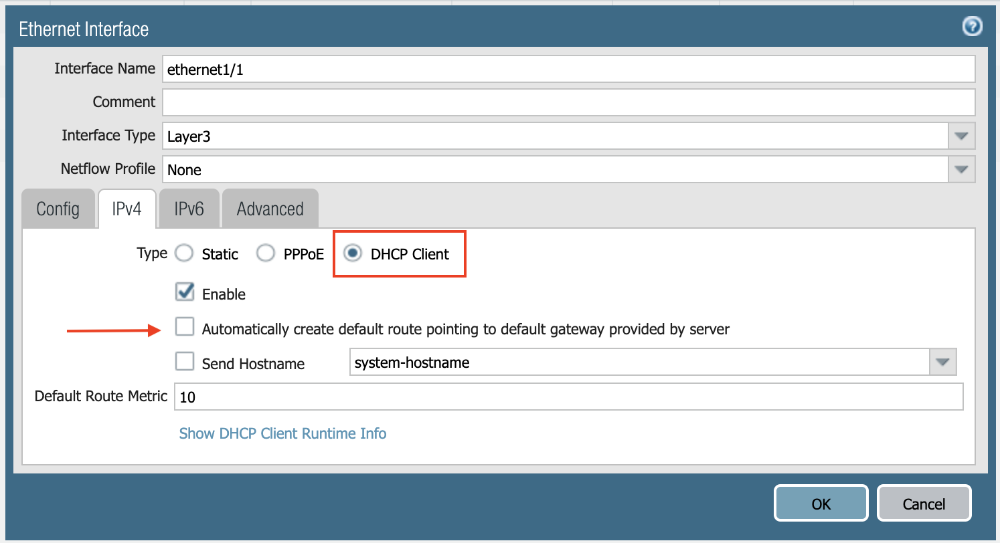

.. meta::
  :description: Firewall Network
  :keywords: AWS Transit Gateway, AWS TGW, TGW orchestrator, Aviatrix Transit network, Transit DMZ, Egress, Firewall

=========================================================
Example Config for Palo Alto Network VM-Series in AWS
=========================================================

In this document, we provide an example to set up the VM-Series for you to validate that packets are indeed
sent to the VM-Series for VPC-to-VPC and from VPC to internet traffic inspection.

For using bootstrap method to setup the VM-Series, follow `this document <https://docs.aviatrix.com/HowTos/bootstrap_example.html>`_.

VM-Series in Azure can be set up using the guide `Palo Alto Networks VM-Series Azure Example <https://docs.aviatrix.com/HowTos/config_PaloAltoAzure.html#example-config-for-palo-alto-networks-vm-series-in-azure>`_.

The Aviatrix Firewall Network (FireNet) workflow launches a VM-Series at `this step <https://docs.aviatrix.com/HowTos/firewall_network_workflow.html#launching-and-associating-firewall-instance>`_ in the process. After the launch is complete, the console displays the VM-Series instance with its public IP address of management interface and allows you to download the .pem file for SSH access to the instance. 

Below are the steps for initial setup. 

Downloading VM-Series Access Key
--------------------------------------------

After `this step <https://docs.aviatrix.com/HowTos/firewall_network_workflow.html#launching-and-associating-firewall-instance>`_ is completed, click **Download** to download the .pem file.

If you get a download error, usually it means the VM-Series is not ready. Wait until it is ready, refresh the browser, and then try again.

|access_key|

Resetting VM-Series Password
------------------------------------------

For Metered AMI, open a terminal and run the following command. 

.. tip ::

 Once you download the .pem file, change the file permission to 600. If you are asked to enter a password during the login, the VM-Series is still not ready. Wait and try again. It usually takes up to 15 minutes for the VM-Series to be ready. When the VM-Series is ready, you will not be asked for a password anymore.  

::
  
 ssh -i <private_key.pem> admin@<public-ip_address>
 configure
 set mgt-config users admin password	 
 commit

For BYOL, open a terminal and run the following command.

::

 ssh -i <private_key.pem> admin@<public-ip_address>
 configure
 set mgt-config users admin password
 set deviceconfig system dns-setting servers primary <ip_address>
 commit

Terminate the SSH session.

Logging in to VM-Series
---------------------------------

Go back to the Aviatrix Controller. 
Go to `this step <https://docs.aviatrix.com/HowTos/firewall_network_workflow.html#launching-and-associating-firewall-instance>`_ of the Firewall Network workflow. Click **Management UI**. It takes you the VM-Series you just launched. 

Login with Username "admin". The password is the password you set at the previous step. 

Activating VM license
-----------------------------

Dynamic updates
-----------------------------

From Device > Dynamic Updates > Click **Check Now** > download and then install latest versions of a. Applications and Threats b. Wildfire updates > Click **Check Now** again > download and then install latest version of Antivirus.

Configuring VM-Series ethernet1/1 with WAN Zone
-------------------------------------------------------------------

Once logged in, click on the Network tab and you should see a list of ethernet interfaces. Click **ethernet1/1** and 
configure as the following screenshot. 

1. Select the **Network** tab.
2. Click **ethernet1/1**.
3. Select **layer3** for Interface Type.
4. Select the **Config** tab in the popup Ethernet Interface window.
5. Select **default** for Virtual Router at the Config tab.
6. Click **New Zone for Security Zone** to create a WAN zone. 
7. At the next popup screen, name the new zone **WAN** and click **OK**.

|new_zone|

Continue:

8. Select the **IPV4** tab in the popup Ethernet Interface window.
9. Select **DHCP Client**.
10. Unmark the **Automatically create default route pointing to default gateway provided by server** checkbox as shown below.

|ipv4|

11. Click **Commit**. Once Commit is complete, you should see the Link State turn green at the Network page for ethernet1/1. 

Configuring VM-Series ethernet1/2 with LAN Zone
------------------------------------------------------------------

Repeat the steps in the "Configuring VM-Series ethernet1/1 with WAN Zone" section above for ethernet1/2. Name the new zone LAN.

Click **Commit**. Once Commit is complete, you should see the Link State turn green at the Network page for ethernet1/2.

.. tip ::

If Keepalive via Firewall LAN Interface is enabled in Firewall Network > Advanced, ensure that ping is allowed in the Firewall LAN interface configuration:
https://docs.aviatrix.com/HowTos/firewall_advanced.html?#keep-alive-via-firewall-lan-interface

::

Configuring Allow Outbound Policies
------------------------------------------------

1. Navigate to Policies > Security > Click **Add**.
2. Name the policy "Outbound," then select the **Source** tab. 
3. Select LAN zone >  Destination tab. 
4. Select WAN zone > Click **OK**.

Configuring NAT for Egress
-------------------------------------

If you would also like to enable NAT to test egress, use the following steps:

1. Navigate to Policies > NAT > Click **Add**.
2. Select the General tab, give it a name, and click **Original Packet**. 
3. At Source Zone, click **Add**, and select **LAN**. 
4. At Destination Zone, select **WAN**. 
5. At Destination Interface, select **Ethernet1/1**, as shown below.

 |nat_original_packet| 

6. Click **Translated Packet**. At Translation Type, select **Dynamic IP And Port**. 
7. At Address Type, select **Interface Address**. 
8. At Interface, select **ethernet1/1**, as shown below. 

 |nat_translated_packet|

Setting up API Access 
----------------------------

In order for the Aviatrix Controller to automatically update firewall instance route tables, monitor the firewall instance health and manage instance failover, you need to set up API access permissions. 

Follow `the instructions here <https://docs.aviatrix.com/HowTos/paloalto_API_setup.html>`_ to enable API access. 

Ready to Go
-------------------

Now your firewall instance is ready to receive packets! 

The next step is to specify which network domain needs packet inspection by defining a connection policy that connects to
the firewall domain. This is done by Configuring Allow Outbound Policies (see the section above) in the Firewall Network workflow. 

For example, deploy Spoke-1 VPC in Security_Domain_1 and Spoke-2 VPC in Security_Domain_2. Build a connection policy between the two domains. Build a connection between Security_Domain_2 to Firewall Domain. 

Launch one instance in Spoke-1 VPC and Spoke-2 VPC. From one instance, ping the other instance. The ping should go through.  

View Traffic Log
----------------------

You can view if traffic is forwarded to the firewall instance by logging in to the VM-Series console. 

1. Click **Monitor**. 
2. Start ping packets from one Spoke VPC to another Spoke VPC where one or both of network domains are connected to Firewall Network domain.

.. |access_key| image:: config_paloaltoVM_media/access_key.png
   :scale: 30%

.. |new_zone| image:: config_paloaltoVM_media/new_zone.png
   :scale: 30%

.. |nat_original_packet| image:: config_paloaltoVM_media/nat_original_packet.png
   :scale: 30%

.. |nat_translated_packet| image:: config_paloaltoVM_media/nat_translated_packet.png
   :scale: 30%

.. disqus::
