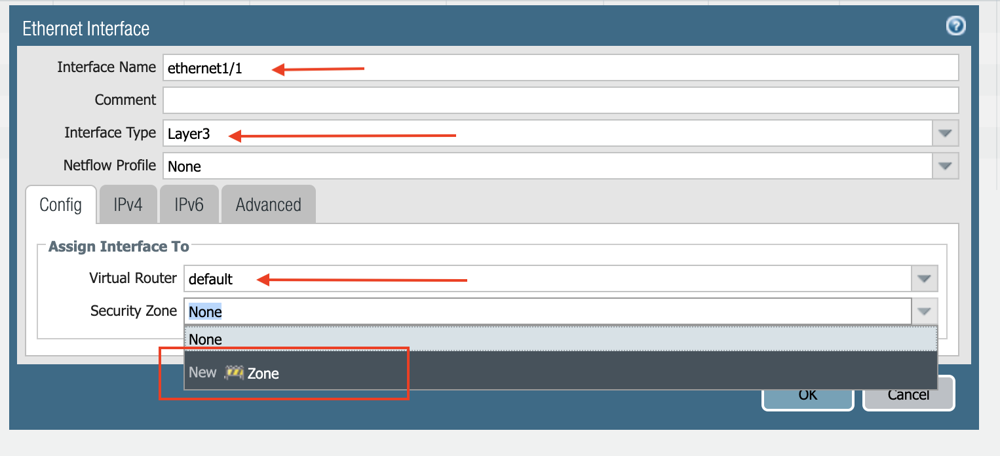

.. meta::
  :description: Firewall Network
  :keywords: AWS Transit Gateway, AWS TGW, TGW orchestrator, Aviatrix Transit network, Transit DMZ, Egress, Firewall

=========================================================
Example Config for Palo Alto VM-Series
=========================================================

In this document, we provide an example to setup the VM-Series for you to validate that packets are indeed
sent to the VM-Series for VPC to VPC traffic inspection.

Aviatrix Firewall Network (FireNet) workflow launches VM-Series at `Step 7a. <https://docs.aviatrix.com/HowTos/firewall_network_workflow.html#a-launch-and-associate-firewall-instance>`_ After the launch complete, the console displays the
VM-Series instance with its public IP address of management interface and allows you to download the .pem file 
for SSH access to the instance. 

Below are the steps to setup an "Allow ALL" policy. 

1. Download VM-Series Access Key
----------------------------------

After `Step 7a <https://docs.aviatrix.com/HowTos/firewall_network_workflow.html#a-launch-and-associate-firewall-instance>`_ is completed, you'll see the Download button as below. Click the button to download the .pem file.

If you get a download error, usually it means the VM-Series is not ready. Wait until it is ready and try again.

|access_key|

2. Reset VM-Series Password
--------------------------------

For Metered AMI, open a terminal and run the following command. 

.. tip ::

 Once you download the .pem file, change the file permission to 600. If you are asked to enter Password during the login, the VM-Series is still not ready. Wait and try again. It usually takes up to 15 minutes for VM-Series to be ready. When VM-Series is ready, you will not be asked for Password any more.  

::
  
 ssh -i <private_key.pem> admin@<public-ip_address>
 configure
 set mgt-config users admin password	 
 commit

For BYOL, open a terminal and run the following command.

::

 ssh -i <private_key.pem> admin@<public-ip_address>
 configure
 set mgt-config users admin password
 set deviceconfig system dns-setting servers primary <ip_address>
 commit

Terminate the SSH session.

3. Login to VM-Series
------------------------

Go back to the Aviatrix Controller Console. 
Go to Firewall Network workflow, Step 7a. Click on the `Management UI`. It takes you the VM-Series you just launched. 

Login with Username "admin". Password is the password you set at the previous step. 

4. Configure VM-Series ethernet1/1 and WAN Zone
-------------------------------------------------

Once login, click Network tab, you should see a list of ethernet interfaces. Click ethernet1/1 and 
configure as the following screenshot. 

 - Click Network tab
 - Click ethernet1/1
 - Select "layer3" for Interface Type
 - Click Config tab in the pop up Ethernet Interface window.
 - Select default for Virtual Router at Config tab
 - Click New Zone for Security Zone to create a WAN zone. 
 - At the next pop up screen, name the new zone "WAN" and click OK 

|new_zone|

Continue, 

 - Select IPV4 tab in the pop up Ethernet Interface window.
 - Select DHCP Client
 - Uncheck "Automatically create default route pointing to default gateway provided by server, as shown below.

|ipv4|

Click Commit. Once Commit is complete, you should see the Link State turn green at the Network page for ethernet1/1. 

5. Configure VM-Series ethernet1/2 and LAN Zone
---------------------------------------------------

Repeat Step 4 for ethernet1/2. Name the new zone LAN.

Click Commit. Once Commit is complete, you should see the Link State turn green at the Network page for ethernet1/2.

6. Configure Allow All Policies
---------------------------------

 - Click Policies tab.
 - Click +Add at the bottom left corner to create a new policy.
 - Click General tab. Name the policy Allow-all.
 - Click Source tab. Select Any for both panels.
 - Click Destination tab. Select Any for both panels.
 - Click Application tab. Select Any.
 - Click Commit to commit the Allow-all policy.

Now the VM-Series has its Allow All policy setup. 

7. Setup API access 
----------------------

In order for Aviatrix Controller to automatically update firewall instance route tables, monitor firewall instance health and manage instance failover, you need to setup API access permissions. 

Follow `the instructions here <https://docs.aviatrix.com/HowTos/paloalto_API_setup.html>`_ to enable API access. 

8. Read to go!
---------------

Now your firewall instance is ready to receive packets! 

The next step is specify which Security Domain needs packet inspection by defining a connection policy that connects to
the firewall domain. This is done by `Step 8 <https://docs.aviatrix.com/HowTos/firewall_network_workflow.html#specify-security-domain-for-firewall-inspection>`_ in the Firewall Network workflow. 

For example, deploy Spoke-1 VPC in Security_Domain_1 and Spoke-2 VPC in Security_Domain_2. Build a connection policy between the two domains. Build a connection between Security_Domain_2 to Firewall Domain. 

Launch one instance in Spoke-1 VPC and Spoke-2 VPC. From one instance to ping the other instance. The ping should go through. . 

9. View Traffic Log
----------------------

You can view if traffic is forwarded to firewall instance by login to VM-Series console. Click Monitor. Start ping packets from one Spoke VPC to another Spoke VPC where the Security Domains 

.. |access_key| image:: config_paloaltoVM_media/access_key.png
   :scale: 30%

.. |ipv4| image:: config_paloaltoVM_media/ipv4.png
   :scale: 30%

.. disqus::
