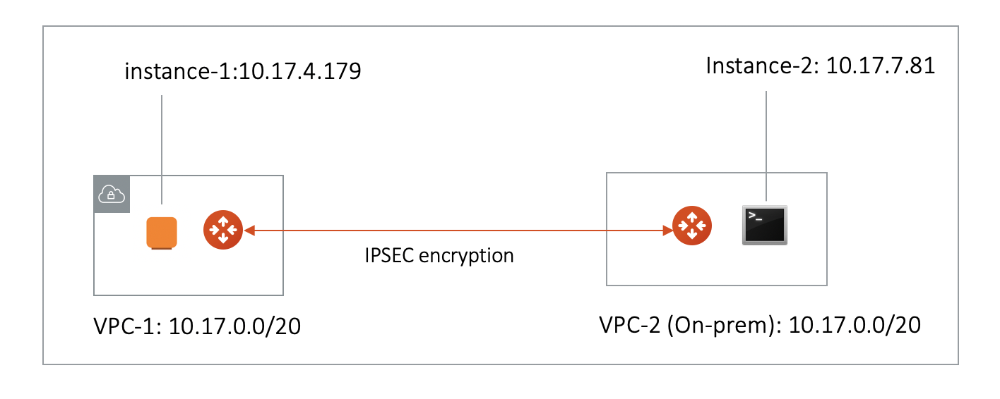
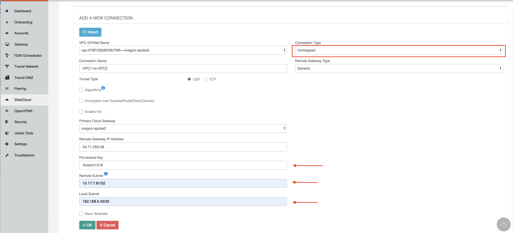
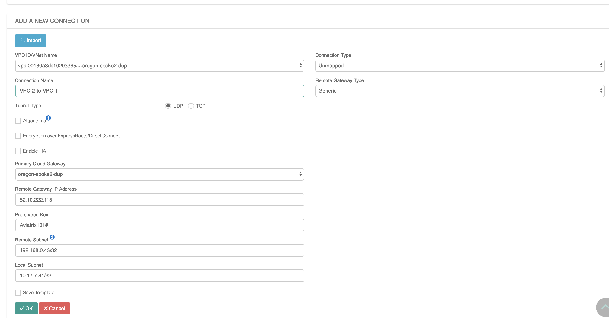
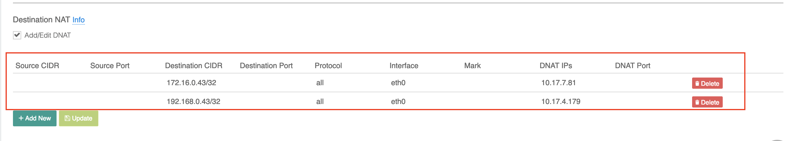
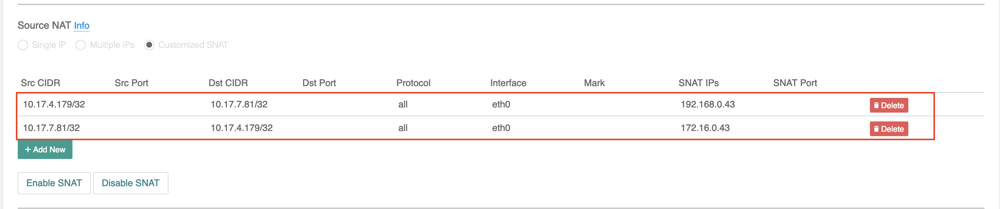

.. meta::
   :description: Create site2cloud connection with overlap network address ranges
   :keywords: site2cloud, VGW, SNAT, DNAT, Overlap Network CIDR, overlap CIDRs

===========================================================================================
Connect Networks With Overlap CIDRs
===========================================================================================

The Scenario
------------------

This tech note illustrates an example solution to a specific use case. In this use case, a customer needs to connect certain 
on-prem hosts to certain virtual machine (EC2/GCE) instances in a VPC/VNet over an IPsec tunnel over the Internet, but 
the on-prem network range overlaps with
the VPC/VNet CIDR range, and the requirement from the customer is that no NAT function will be performed on the customer side. In addition, traffic can be
initiated from either side. 

Note that this solution works for specific hosts and virtual machine instances on each side. 

The scenario is described in the following diagram, where VPC/VNet-2 represents an on-prem environment.

|overlap|

::

  VPC/VNet-1 CIDR =  10.17.0.0/20, instance-1 in VPC/VNet-1 has an IP address 10.17.4.179.
  VPC/VNet-2 CIDR = 10.17.0.0/20, instance-2 in VPC/VNet-2 has an IP address 10.17.7.81.

The Solution
------------------

The solution is to build a Site2Cloud IPsec tunnel between VPC/VNet-1 and VPC/VNet-2 and apply both source NAT (SNAT) and destination NAT (DNAT) on VPC/VNet-1 gateway. The packet flow is demonstrated as below: 

 1. instance-1 sends a packet to instance-2 with a virtual destination IP address, for example 172.16.0.43. From instance-1's point of view, the destination instance is a virtual address - 172.16.0.43.
 #. When the packet arrives at the VPC/VNet-1 gateway, the gateway does DNAT on the packet to translate the virtual destination IP address to 10.17.7.81 which is the instance-2 physical IP address.
 #. The gateway at VPC/VNet-1 then translates the packet source IP address (10.17.4.179) to a virtual source IP address, say it is 192.168.0.43.
 #. The packet then arrives at VPC/VNet-2 with destination IP address 10.17.7.81 and source IP address 192.168.0.43. From instance-2's point of view, instance-1's address is a virtual IP address - 192.168.0.43.
 #. When instance-2 sends a packet to instance-1, the destination is the virtual IP address 192.168.0.43. 
 #.  When the packet arrives at the VPC/VNet-1 gateway over the IPsec tunnel, the VPC/VNet-1 gateway translates its destination IP address from virtual address 192.168.0.43 to 10.17.4.179. 
 #. The VPC/VNet-1 gateway then translates the source IP address of the packet from 10.17.7.81 to virtual address 172.16.0.43.

The Configuration Steps
----------------------------

Following the Site2Cloud Workflow to Launch Gateways 
~~~~~~~~~~~~~~~~~~~~~~~~~~~~~~~~~~~~~~~~~~~~~~~~~~~~~~~~~~~~~~~

Log in to your Aviatrix Controller and select **Site2Cloud** on the left sidebar. Follow step 1 to launch a gateway in the VPC/VNet-1.  

(You can follow the `gateway launch instructions in this <http://docs.aviatrix.com/HowTos/gateway.html>`_. Leave optional parameters unchecked.) 

For the above example, we also launch a gateway in VPC/VNet-2 to emulate an on-prem environment.

Creating a Site2Cloud Tunnel
~~~~~~~~~~~~~~~~~~~~~~~~~~~~~~~~~~~~~~~~~~~~~~~~~~~~~~~~~~~~~~~~~~~~~~~

Go to Controller > Site2Cloud. 

Click **+Add New**. Fill the form and click **OK**. Select **Unmapped** for the Connection Type field.

VPC/VNet-1 gateway-1 side
#########################

For the VPC/VNet-1 gateway side, the Local Subnet field should be 192.168.0.43/32, and the Remote Subnet field should be 10.17.7.81/32, as shown below.

|vpc1_to_vpc2_ipsec|

VPC/VNet-2 gateway-2 side
##########################

On the VPC/VNet gateway-2 side, the IPsec is a standard configuration.

For the VPC/VNet-2 gateway side, the Local Subnet field should be 10.17.7.81/32, and the Remote Subnet field should be 192.168.0.43/32, as shown below.

|vpc2_to_vpc1_ipsec|

Wait for the tunnel to come up. 

Normally you'll need to download the configuration, but in this example, since both ends of the network are on the VPC/VNet, you can simply configure each Site2Cloud tunnel. Make sure the pre-shared Keys are the same for both ends. In the above example, we used "Aviatrix101#" as our pre-shared key.

Configuring DNAT on Gateway-1
~~~~~~~~~~~~~~~~~~~~~~~~~~~~~~~~~~~~~

This step is to configures the gateway to translate the destination IP address 172.16.0.43 to the real private IP address 10.17.7.81, before routing happens.

At the main navigation bar, click **Gateway**. Highlight the gateway, in this case, the VPC/VNet-1 gateway, and click **Edit**. 

Scroll down to Destination NAT. Follow the instructions `here <https://docs.aviatrix.com/HowTos/gateway.html#destination-nat>`_ to configure, as shown below. 

|dnat|

Configuring SNAT on Gateway-1
~~~~~~~~~~~~~~~~~~~~~~~~~~~~~~~~~~~~~~~~

This step is to translate the packet source IP address after routing happens. In this example, 
the address is translated from 10.17.7.81 to 172.16.0.43 for packets going from on-prem (VPC/VNet-2) to VPC/VNet-1, 
and 10.17.4.179 to 192.168.4.43 for packets going from VPC/VNet-1 to on-prem (VPC/VNet-2).

For the same VPC/VNet-1 gateway, configure SNAT as shown below. Notice we entered "Dst CIDR" as qualifier to reduce the scope of the rule as a good practice. The reason that 
the address is 10.17.7.81/32 is that the destination has already been translated after the DNAT 
rule before routing happens.

|snat|

Testing Site2Cloud Connection
---------------------------------------------------------

Make sure your instance's Security Groups inbound rules are configured properly.

From instance-1, you should be able to ping instance-2 by "ping 172.16.0.43".
From instance-2, you should be able to ping instance-1 by "ping 192.168.0.43"

   

.. disqus::    
