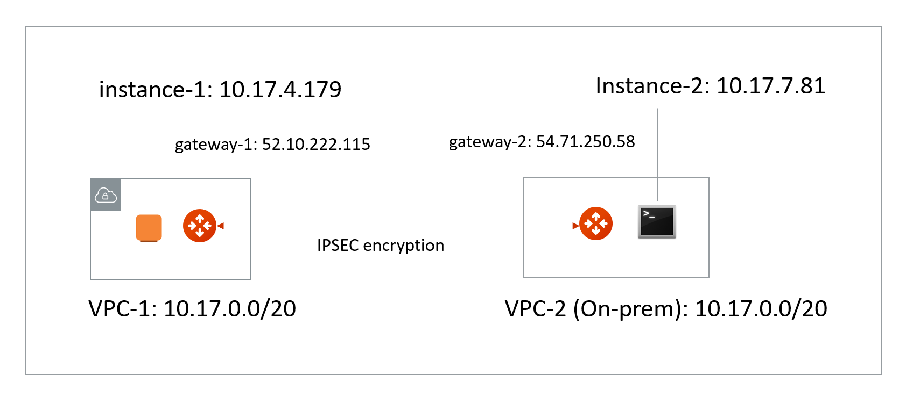

.. meta::
   :description: Create site2cloud connection with overlap network address ranges 
   :keywords: site2cloud, VGW, SNAT, DNAT, Overlap Network CIDR, overlap CIDRs

===========================================================================================
Connect Networks With Overlap CIDRs 
===========================================================================================

The Scenario
------------------

This tech note illustrates an example solution to a specific use case. In this use case, customer needs to connect certain 
on-prem hosts (or subnets) to some EC2 instances in a VPC over an IPSEC tunnel over Internet, but 
the on-prem network range overlaps with
the VPC CIDR range, and the requirement from the customer is that no NAT function will be performed on the customer side. 

The scenario is described in the following diagram, where VPC-2 represents a on-prem environment.

|overlap|

::

  VPC-1 CIDR =  10.17.0.0/20, instance-1 in VPC-1 has an IP address 10.17.4.179.
  VPC-2 CIDR = 10.17.0.0/20, instance-2 in VPC-2 has an IP address 10.17.7.81.

The Solution
------------------

The solution is to build a site2cloud IPSEC tunnel between VPC-1 and VPC-2 and apply both source NAT (SNAT) and destination NAT (DNAT) on VPC-1 gateway. The packet flow is demonstrated as below: 

 1. instance-1 sends a packet to instance-2 with virtual destination IP address, say it is 172.16.0.43. From instance-1's point of view, the destination instance is 172.16.0.43.
 #. When the packet arrives at the VPC-1 gateway, the gateway does DNAT on the packet to translate the virtual destination IP address to 10.17.7.81 which is the instance-2 IP address.
 #. The gateway at VPC-1 then translates the packet source IP address (10.17.4.179) to a virtual source IP address, say it is 192.168.0.43.
 #. The packet then arrives at VPC-2 with destination IP address 10.17.7.81 and source IP address 192.168.0.43. From instance-2's point of view, instance-1's address is 192.168.0.43.
 #. When instance-2 sends a packet to instance-1, the destination is 192.168.0.43. 
 #.  When the packet arrives at the VPC-1 gateway over the IPSEC tunnel, VPC-1 gateway translates its destination IP address from 192.168.0.43 to 10.17.4.179. 
 #. The VPC-1 gateway then translates the source IP address of the packet from 10.17.7.81 to 172.16.0.43.

The Configuration Steps
----------------------------

Step 1: Follow the Site2Cloud workflow to launch gateways 
~~~~~~~~~~~~~~~~~~~~~~~~~~~~~~~~~~~~~~~~~~~~~~~~~~~~~~~~~~~~~~~

Login to the Controller console, go to Site2Cloud. Follow step 1 to launch a gateway in the VPC-1.  

(You can follow the `gateway launch instructions in this <http://docs.aviatrix.com/HowTos/gateway.html>`_. Leave optional parameters unchecked.) 

For the above example, we also launch a gateway in the VPC-2 to emulate an on-prem environment.

Step 2: Create a Site2Cloud tunnel
~~~~~~~~~~~~~~~~~~~~~~~~~~~~~~~~~~~~~~~~~~~~~~~~~~~~~~~~~~~~~~~~~~~~~~~

Go to Controller Console -> Site2Cloud. 

Click "+Add New". Fill the form and click OK. Select "Unmapped" for Connection Type field.

2.1 VPC-1 gateway-1 side
#########################

For VPC-1 gateway side, the Local Subnet field should be 192.168.0.43/32, and the Remote Subnet field should be 10.17.7.81/32, as shown below.

|vpc1_to_vpc2_ipsec|

2.2 VPC-2 gateway-2 side
##########################

on the VPC gateway-2 side, the IPSEC is a standard configuration.

For VPC-2 gateway side, the Local Subnet field should be 10.17.7.81/32, and the Remote Subnet field should be 192.168.0.43/32, as shown below.

|vpc2_to_vpc1_ipsec|

Wait for the tunnel to come up. 

Normally you'll need to download configuration, but in this example since both ends of the network are on VPC, you can simply configure each site2cloud tunnel. Make sure the Pre-shared Keys are the same for both ends. In the above example, we used "Aviatrix101#" as our pre-shared key.

Step 3: Configure DNAT on gateway-1
~~~~~~~~~~~~~~~~~~~~~~~~~~~~~~~~~~~~~

This step is to configure the gateway to translate the destination IP address 172.16.0.43 to the real private IP address 10.17.7.81, before routing happens.

At the main navigation bar, click Gateway. Highlight the gateway, in this case, the VPC-1 gateway, click Edit. 

Scroll down to Destination NAT. Follow the instructions `here <https://docs.aviatrix.com/HowTos/gateway.html#destination-nat>`_ to configure, as shown below. 

|dnat|

Step 4: Configure SNAT on gateway-1
~~~~~~~~~~~~~~~~~~~~~~~~~~~~~~~~~~~~~~~~

This step is to translate the packet source IP address after routing happens. In this example, 
the address is translated from 10.17.7.81 to 172.16.0.43 for packets going from on-prem (VPC-2) to VPC-1, 
and 10.17.4.179 to 192.168.4.43 for packets going from VPC-1 to on-prem (VPC-2).

For the same VPC-1 gateway, configure SNAT as shown below. Notice we entered "Dst CIDR" as qualifier to reduce the scope of the rule as a good practice. And the reason that 
the address is 10.17.7.81/32 is that the destination has already been translated after the DNAT 
rule before routing happens.

|snat|

Step 5. Test site2cloud Connection
---------------------------------------------------------

Make sure your instances Security Groups inbound rules are configured properly.

From instance-1, you should be able to ping instance-2 by "ping 172.16.0.43".
From instance-2, you should be able to ping instance-1 by "ping 192.168.0.43"

Done.

.. |vpc1_to_vpc2_ipsec| image:: connect_overlap_cidrs_media/vpc1_to_vpc2_ipsec.png
   :scale: 30%
   
.. |vpc2_to_vpc1_ipsec| image:: connect_overlap_cidrs_media/vpc2_to_vpc1_ipsec.png
   :scale: 30%

.. |dnat| image:: connect_overlap_cidrs_media/dnat.png
   :scale: 30%

.. |snat| image:: connect_overlap_cidrs_media/snat.png
   :scale: 30%

.. disqus::    
