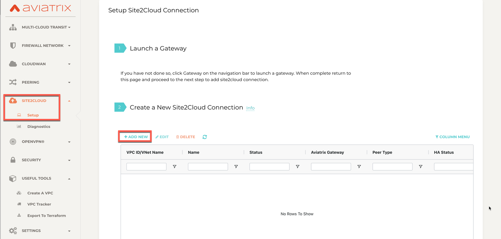
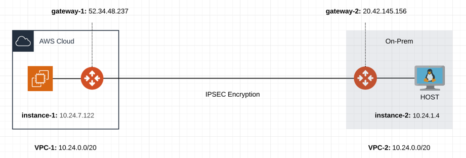
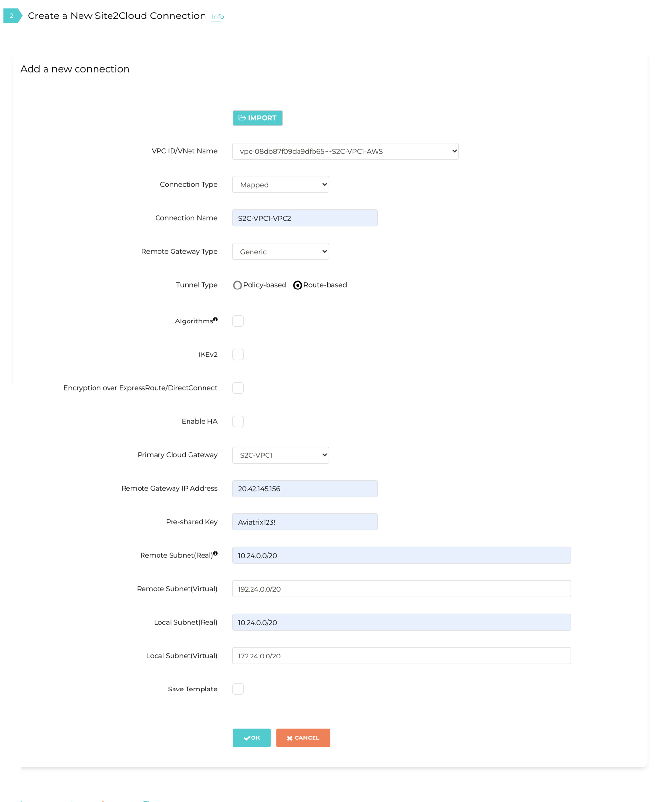
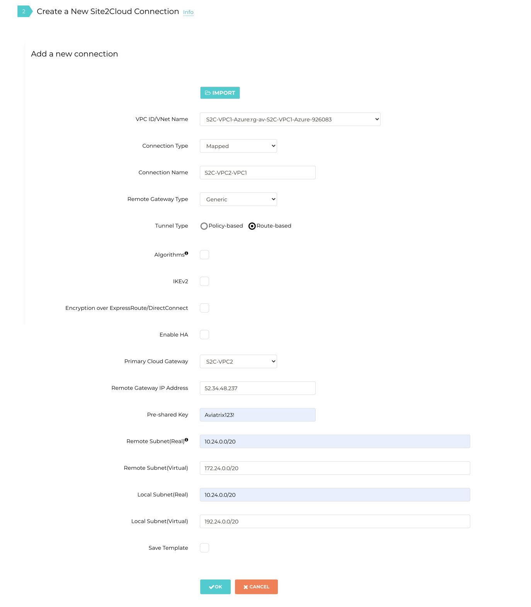

.. meta::
   :description: Create site2cloud connection with overlap network address ranges
   :keywords: site2cloud, VGW, SNAT, DNAT, Overlap Network CIDR, overlap CIDRs, Route Based IPSec

===========================================================================================
Solving Overlapping Networks with Network Mapped IPSec 
===========================================================================================

The Scenario
------------------

This tech note illustrates an example solution to a specific use case. In this use case, a customer needs to connect certain
on-prem hosts to certain EC2 instances in a VPC over an IPSEC tunnel over the Internet, but the on-prem network range overlaps with the VPC CIDR range, and the requirement from the customer is that no NAT function will be performed on the customer side. In addition, traffic can be initiated from either side.

The scenario is described in the following diagram, where VPC-2 represents an on-prem environment.

|overlap_rbi|

::

  VPC-1 CIDR = 10.20.0.0/20, instance-1 in VPC-1 has an IP address 10.24.7.122.
  VPC-2 CIDR = 10.20.0.0/20, instance-2 in VPC-2 has an IP address 10.24.1.4.

The traditional solution is to build IPSEC tunnel between the two networks and use SNAT/DNAT rules to translate each addresses, as
demonstrated in this `example. <https://docs.aviatrix.com/HowTos/connect_overlap_cidrs.html>`_. Such solution requires a potentially
large number of SNAT/DNAT rules which is difficult to configure and maintain.

The Solution
------------------

The new solutions uses a new "network mapped" feature in Site2Cloud that removes the need to configure individual SNAT/DNAT rules. 

The solution is to build a site2cloud route-based IPSEC tunnel using Virtual Tunnel Interface (VTI) between VPC-1 and VPC-2. The packet flow is demonstrated as below:

 1. instance-1 sends a packet to instance-2 with a virtual destination IP address, for example 192.24.1.4. From instance-1's point of view, the destination instance is a virtual address - 192.24.1.4.
 #. When the packet arrives at the VPC-1 gateway, the gateway does DNAT on the packet to translate the virtual destination IP address to 10.24.1.4 which is the instance-2 physical IP address.
 #. The gateway at VPC-1 then translates the packet source IP address (10.24.7.122) to a virtual source IP address, say it is 192.24.1.4.
 #. The packet then arrives at VPC-2 with destination IP address 10.24.1.4 and source IP address 172.24.7.122. From instance-2's point of view, instance-1's address is a virtual IP address - 172.24.7.122.
 #. When instance-2 sends a packet to instance-1, the destination is the virtual IP address 192.24.1.4.
 #.  When the packet arrives at the VPC-1 gateway over the IPSEC tunnel, the VPC-1 gateway translates its destination IP address from virtual address 172.24.7.122 to 10.24.7.122.
 #. The VPC-1 gateway then translates the source IP address of the packet from 10.24.1.4 to virtual address 192.24.1.4.

The Configuration Steps
----------------------------

Step 1: Follow the Site2Cloud workflow to launch gateways
~~~~~~~~~~~~~~~~~~~~~~~~~~~~~~~~~~~~~~~~~~~~~~~~~~~~~~~~~~~~~~~

Log in to the Controller console, go to Site2Cloud. Follow step 1 to launch a gateway in the VPC-1.

(You can follow the `gateway launch instructions in this <http://docs.aviatrix.com/HowTos/gateway.html>`_. Leave optional parameters unchecked.)

For the above example, we also launch a gateway in VPC-2 to emulate an on-prem environment.

Step 2: Create a Site2Cloud tunnel
~~~~~~~~~~~~~~~~~~~~~~~~~~~~~~~~~~~~~~~~~~~~~~~~~~~~~~~~~~~~~~~~~~~~~~~

Go to Controller Console -> Site2Cloud.

Click "+Add New". Fill the form and click OK. Select "Mapped" for the Connection Type field.

|s2c_connection|

2.1 VPC-1 gateway-1 side
#########################

For the VPC-1 gateway side, the Local Subnet field should be the subnet of VPC-1 (e.g. 10.24.0.0/20), and the Remote Subnet field should be the subnet of VPC-2 (e.g. 10.24.0.4/32), as shown below.

|vpc1_to_vpc2_rbipsec|

.. important::
    Local & Remote Subnet (virtual) IP range could be anything but subnet should be same as Physical/Real subnet.

2.2 VPC-2 gateway-2 side
##########################

On the VPC gateway-2 side, the IPSEC is a standard configuration.

For the VPC-2 gateway side, the Local Subnet field should be 10.24.0.0/20, and the Remote Subnet field should be 192.168.0.43/32, as shown below.

|vpc2_to_vpc1_rbipsec|

Wait for the tunnel to come up.

.. note::

    Normally you'll need to download the configuration, but in this example, since both ends of the network are on the VPC, you can simply configure each Site2Cloud tunnel. Make sure the pre-shared Keys are the same for both ends. In the above example, we used "Aviatrix123!" as our pre-shared key.

Step 3. Test site2cloud Connection
---------------------------------------------------------

Make sure your instance's Security Groups inbound rules are configured properly.

From instance-1, you should be able to ping instance-2 by "ping 192.24.1.4".
From instance-2, you should be able to ping instance-1 by "ping 172.24.7.122"

Done.

.. disqus::
