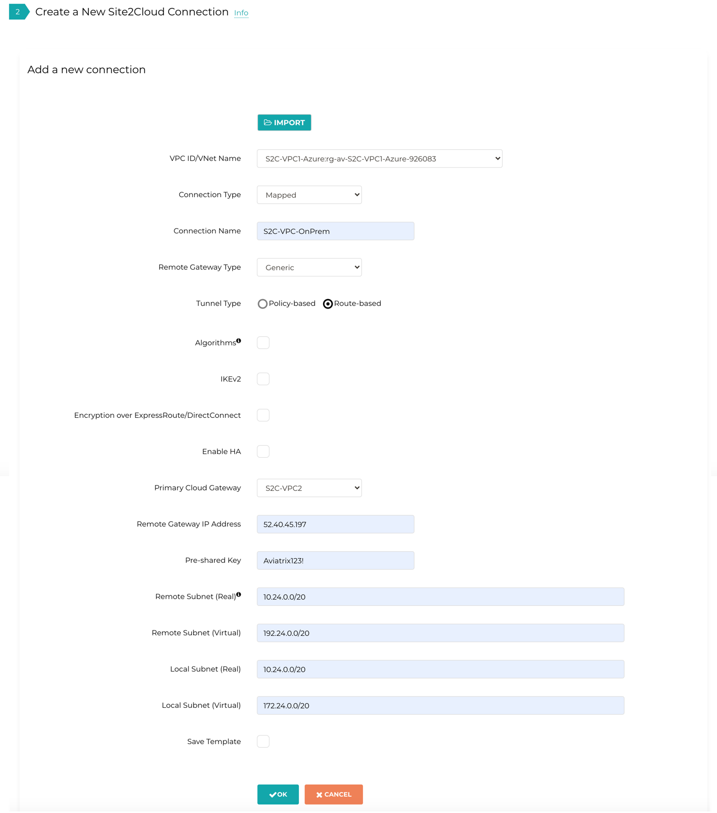
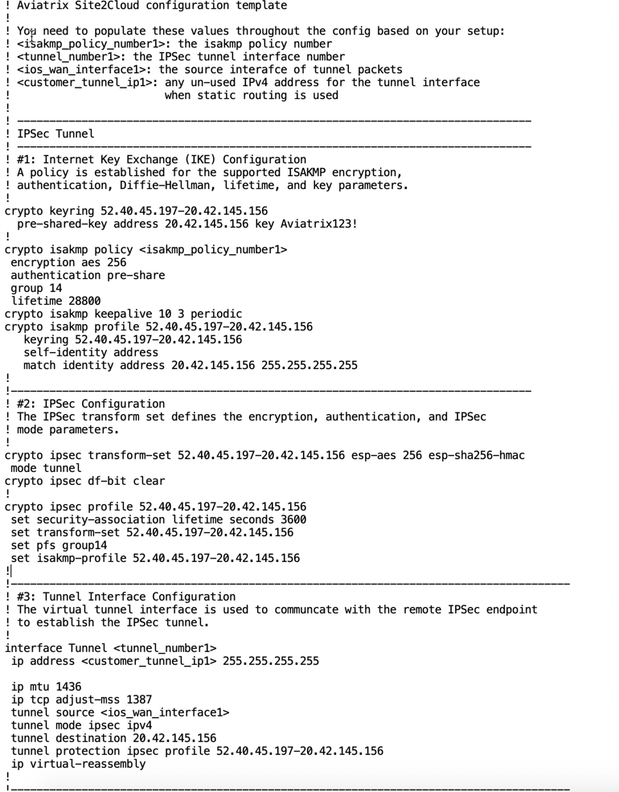

.. meta::
   :description: Create site2cloud connection with overlap network address ranges
   :keywords: site2cloud, VGW, SNAT, DNAT, Overlap Network CIDR, overlap CIDRs, Route Based IPSec

===========================================================================================
Solving Overlapping Networks with Network Mapped IPSec 
===========================================================================================

The Scenario
------------------

This tech note illustrates an example solution to a specific use case. In this use case, a customer needs to connect certain
on-prem hosts to certain EC2 instances in a VPC over an IPSEC tunnel over the Internet, but the on-prem network range overlaps with the VPC CIDR range, and the requirement from the customer is that no NAT function will be performed on the customer side. In addition, traffic can be initiated from either side.

The scenario is described in the following diagram:

|overlap_rbi|

::

  VPC       CIDR = 10.20.0.0/20, instance-1 in VPC-1 has an IP address 10.24.1.4.
  On-Prem   CIDR = 10.20.0.0/20, host-1 in On-Prem has an IP address 10.24.7.101.

The traditional solution is to build IPSEC tunnel between the two networks and use SNAT/DNAT rules to translate each addresses, as
demonstrated in this `example. <https://docs.aviatrix.com/HowTos/connect_overlap_cidrs.html>`_. Such solution requires a potentially
large number of SNAT/DNAT rules which is difficult to configure and maintain.

The Solution
------------------

The new solutions uses a new "network mapped" feature in Site2Cloud that removes the need to configure individual SNAT/DNAT rules. 

This solution uses a site2cloud route-based IPSEC tunnel using Virtual Tunnel Interface (VTI) between VPC and On-Prem Router. The packet flow is demonstrated as below:

 1. instance-1 sends a packet to host-1 with a virtual destination IP address, for example 192.24.7.101. From instance-1's point of view, the destination instance is a virtual address - 192.24.7.101.
 #. When the packet arrives at the VPC-1 gateway, the gateway does DNAT on the packet to translate the virtual destination IP address to 10.24.7.101 which is the host-1 physical IP address.
 #. The gateway at VPC then translates the packet source IP address (10.24.1.4) to a virtual source IP address, say it is 172.24.1.4.
 #. The packet then arrives at On-Prem Cisco IOS Router with destination IP address 10.24.7.101 and source IP address 172.24.1.4. From host-1's point of view, instance-1's address is a virtual IP address - 172.24.1.4.
 #. When host-1 sends a packet to instance-1, the destination is the virtual IP address 172.24.1.4.
 #.  When the packet arrives at the VPC-1 gateway over the IPSEC tunnel, the VPC gateway translates its destination IP address from virtual address 172.24.1.4 to 10.24.1.4.
 #. The VPC gateway then translates the source IP address of the packet from 10.24.7.101 to virtual address 192.24.7.101.

The Configuration Steps
----------------------------

Step 1: Follow the Site2Cloud workflow to launch gateways
~~~~~~~~~~~~~~~~~~~~~~~~~~~~~~~~~~~~~~~~~~~~~~~~~~~~~~~~~~~~~~~

Log in to the Controller console, go to Site2Cloud. Follow step 1 to launch a gateway in the VPC.

(You can follow the `gateway launch instructions in this <http://docs.aviatrix.com/HowTos/gateway.html>`_. Leave optional parameters unchecked.)

Step 2: Create a Site2Cloud tunnel
~~~~~~~~~~~~~~~~~~~~~~~~~~~~~~~~~~~~~~~~~~~~~~~~~~~~~~~~~~~~~~~~~~~~~~~

Go to Controller Console -> Site2Cloud.

Click "+Add New". Fill the form and click OK. Select "Mapped" for the Connection Type field.

|s2c_connection|

2.1 VPC-1 gateway-1 side
#########################

For the VPC gateway side, the Local Subnet field should be the subnet of VPC-1 (e.g. 10.24.0.0/20), and the Remote Subnet field should be the subnet of OnPrem Router (e.g. 10.24.0.0/20), as shown below.

==================================================                =======================================================================
  **Field**                                                         **Value**
==================================================                =======================================================================
  VPC ID/VNet Name                                                  Choose VPC ID
  Connection Type                                                   Mapped
  Connection Name                                                   Arbitrary (e.g. S2C-VPC-OnPrem)
  Remote Gateway Type                                               Generic
  Tunnel Type                                                       Route-based
  Algorithms                                                        Uncheck this box
  Encryption over ExpressRoute/DirectConnect                        Uncheck this box
  Enable HA                                                         Check this box if HA is required
  Primary Cloud Gateway                                             Select the Aviatrix Gateway created above
  Remote Gateway IP Address                                         Public IP of IOS Router WAN port (52.40.45.197 in this example)
  Pre-shared Key                                                    Optional (auto-generated if not entered)
  Remote Subnet (Real)                                              10.24.0.0/20 (On-Prem Network CIDR)
  Remote Subnet (Virtual)                                           Any/20 (On-Prem Network Virtual CIDR)
  Local Subnet  (Real)                                              10.24.0.0/20 (VPC-Cloud Network CIDR)
  Local Subnet  (Virtual)                                           Any/20 (VPC-Cloud Network Virtual CIDR)
==================================================                =======================================================================

|vpc_to_onprem_rbipsec|

.. important::
    Local & Remote Subnet (virtual) IP range could be anything but subnet should be same as Physical/Real subnet.

2.2 Configure On-Prem Cisco Router
###################################

Go to the **Site2Cloud** page. From the Site2Cloud connection table, select the connection created above (e.g. S2C-VPC-OnPrem) and click "Edit".
     - Select **Cisco** from **Vendor** drop down list, select **ISR, ASR, or CSR** from **Platform** drop down list and select **IOS(XE)** from **Software** drop down list.
     - Click the **Download Configuration** button to download the **Cisco IOS** Site2Cloud configuration
     - Save the configuration file as a reference for configuring your Cisco IOS router

The following is a sample configuration based on the Site2Cloud configuration above.

|ios_config_template|

Either ssh into the Cisco router or connect to it directly through its console port.

Apply the following IOS configuration to your router:

::

    ! Aviatrix Site2Cloud configuration template
    !
    ! You need to populate these values throughout the config based on your setup:
    ! <isakmp_policy_number1>: the isakmp policy number
    ! <tunnel_number1>: the IPSec tunnel interface number
    ! <ios_wan_interface1>: the source interafce of tunnel packets
    ! <customer_tunnel_ip1>: any un-used IPv4 address for the tunnel interface
    !                        when static routing is used
    !
    ! --------------------------------------------------------------------------------
    ! IPSec Tunnel
    ! --------------------------------------------------------------------------------
    ! #1: Internet Key Exchange (IKE) Configuration
    ! A policy is established for the supported ISAKMP encryption,
    ! authentication, Diffie-Hellman, lifetime, and key parameters.
    !
    crypto keyring 52.40.45.197-20.42.145.156
      pre-shared-key address 20.42.145.156 key <key>
    !
    crypto isakmp policy 1
     encryption aes 256
     hash sha256
     authentication pre-share
     group 14
     lifetime 28800
    crypto isakmp keepalive 10 3 periodic
    crypto isakmp profile 52.40.45.197-20.42.145.156
       keyring 52.40.45.197-20.42.145.156
       self-identity address
       match identity address 20.42.145.156 255.255.255.255
    !
    !---------------------------------------------------------------------------------
    ! #2: IPSec Configuration
    ! The IPSec transform set defines the encryption, authentication, and IPSec
    ! mode parameters.
    !
    crypto ipsec transform-set 52.40.45.197-20.42.145.156 esp-aes 256 esp-sha256-hmac
     mode tunnel
    crypto ipsec df-bit clear
    !
    crypto ipsec profile 52.40.45.197-20.42.145.156
     set security-association lifetime seconds 3600
     set transform-set 52.40.45.197-20.42.145.156
     set pfs group14
     set isakmp-profile 52.40.45.197-20.42.145.156
    !
    !---------------------------------------------------------------------------------------
    ! #3: Tunnel Interface Configuration
    ! The virtual tunnel interface is used to communicate with the remote IPSec endpoint
    ! to establish the IPSec tunnel.
    !
    interface Tunnel1
     ip address 10.10.10.10 255.255.255.255
     ip mtu 1436
     ip tcp adjust-mss 1387
     tunnel source GigabitEthernet1
     tunnel mode ipsec ipv4
     tunnel destination 20.42.145.156
     tunnel protection ipsec profile 52.40.45.197-20.42.145.156
     ip virtual-reassembly
    !
    !---------------------------------------------------------------------------------------
    ! #4: Static Routing Configuration
    ! The static route directs the traffic to the Aviatrix remote subnets via the tunnel
    ! interface.
    !
    ip route 172.24.0.0 255.255.240.0 Tunnel1
    !---------------------------------------------------------------------------------------

Wait for the tunnel to come up.

Step 3. Test site2cloud Connection
---------------------------------------------------------

Make sure your instance's Security Groups inbound rules are configured properly.

From instance-1, you should be able to ping host-1 by "ping 192.24.7.101".
From host-1, you should be able to ping instance-1 by "ping 172.24.1.4"

Done.

.. |s2c_connection| image:: connect_overlap_cidrs_media/s2c_connection.png
   :scale: 35%

.. |overlap_rbi| image:: connect_overlap_cidrs_media/overlap_rbi.png
   :scale: 40%

.. disqus::
