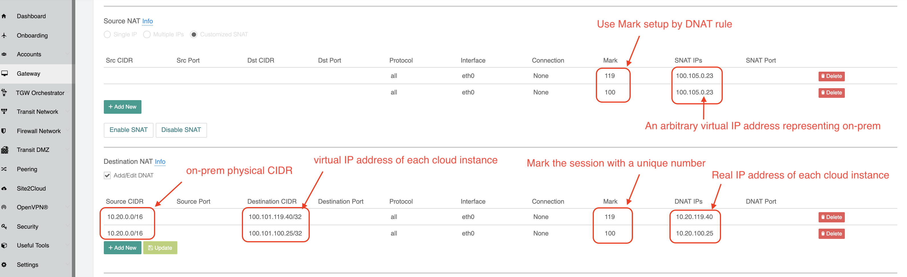

===========================================================================================
Connect Overlapping VPC/VNet to On-prem  
===========================================================================================

The Problem 
------------------

Organizations usually plan out their cloud network address ranges. But there are times where a VPC/VNet CIDR
overlaps with an on-prem network address range, yet still requires connectivity to on-prem.

In this document, the scenario is such that traffic is always initiated from on-prem to VPC/VNet. The constraint is that 
there should be no source NAT nor destination NAT performed in the on-prem network.

As shown in the diagram below, the on-prem network address range is 10.20.0.0/16. All other VPCs connect 
to on-prem via Aviatrix Transit solution. However, there is one VPC named spoke-vpc with an identical CIDR of 10.20.0.0/16.

|overlap_cidr|

The Solution
-------------------

Since the on-prem network does not perform any NAT functions, NAT must be performed in the cloud network.

The key solution steps are:  

 1. Allocate two 1-1 mapped corresponding virtual address spaces for the on-prem network and spoke-vpc/vnet. For example, allocate the virtual network 100.105.0.0/16 for the on-prem network, and 100.101.0.0/16 for the spoke-vpc/vnet virtual VPC/VNet CIDR. These two virtual address spaces must not overlap with any on-prem or cloud address spaces. 
 #. Launch an Aviatrix Gateway in the spoke-vpc/vnet.
 #. Build an IPsec tunnel between spoke-vpc/vnet and the VPN Gateway (VGW/VPN Connect): 
        a. Go to the CSP Console (AWS, Azure, GCP, or OCI) for the VPC/VNet service. Use the same VGW that is used for the Aviatrix Transit solution to create an IPsec tunnel to spoke-vpc/vnet with static routes 100.101.0.0/16 configured, as shown below. Then download the VPN configuration file.

   |vgw_config| 

	b. On the spoke-vpc/vnet side, go to your Aviatrix Controller, click **Site2Cloud** on the left sidebar, and click **Add New**. Make sure the remote subnet list includes 10.20.0.0/16 and 100.105.0.0/16. The local subnet is 100.101.0.0/16, the virtual address of the spoke-vpc/vnet, as shown in the screenshot below.

   |site2cloud|

 4. Perform both SNAT and DNAT functions on the Aviatrix Gateway: 
        a. Go to your Aviatrix Controller and click Gateway. Select the Aviatrix Gateway for spoke-vpc/vnet. Click **Edit** and scroll down to find Destination NAT .
	b. Translate the cloud virtual destination address to its real address for each instance in the VPC/VNet.
        c. Mark the session with a number that is easy to remember. In this example, it is 119.
        d. Scroll up to find Source NAT. Translate the marked session to any on-prem virtual source address, as shown in the screenshot below. 
 
     |nat_config| 

       e. Repeat the NAT configuration for each cloud instance. 

Since the VPN Gateway (VGW/VPN Connect) runs a BGP session to on-prem for normal a Transit Network, the spoke-vpc/vnet virtual CIDR 100.101.0.0/16 should be propagated to on-prem. From on-prem, the destination IP address takes the range 100.101.0.0/16.

.. |vgw_config| image:: connect_overlap_vpc_via_VGW_medium/vgw_config.png
   :scale: 30%

   
.. |site2cloud| image:: connect_overlap_vpc_via_VGW_medium/site2cloud.png
   :scale: 30%

.. disqus::    
