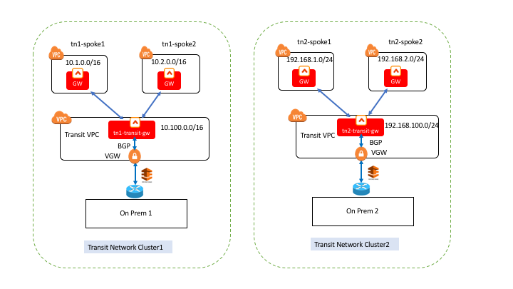
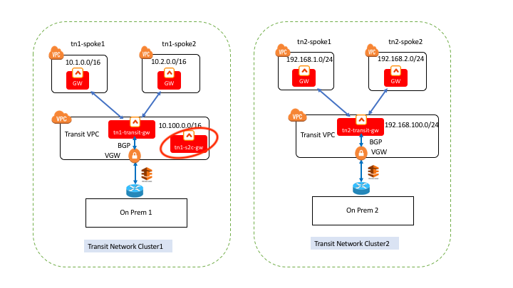
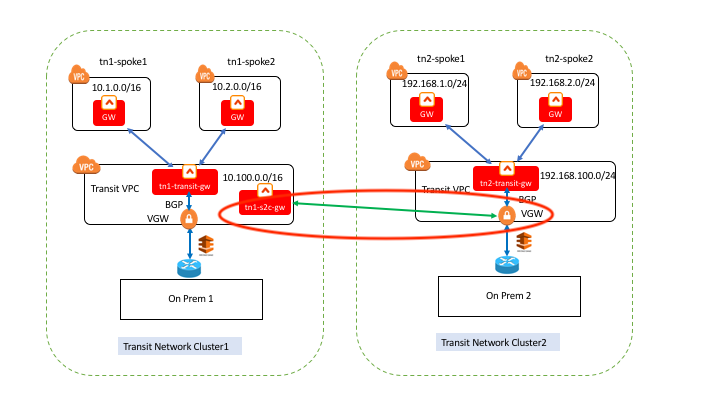
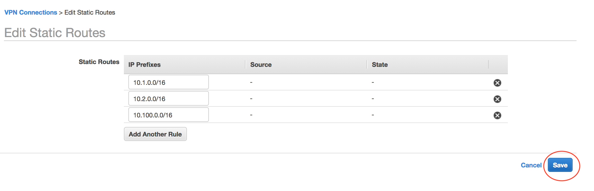
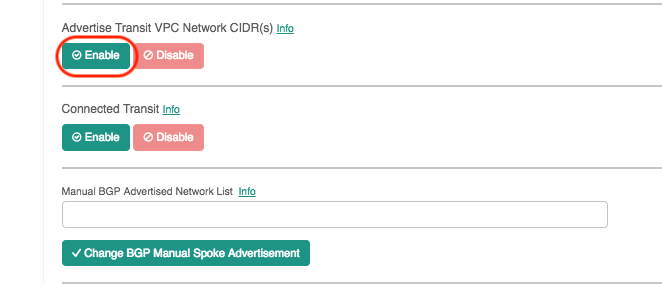
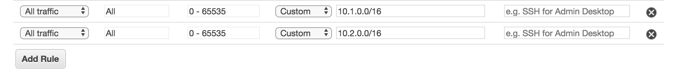
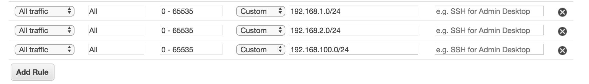

.. meta::
   :description: Connecting Two Aviatrix Transit Network Clusters
   :keywords: site2cloud, VGW, AWS Global Transit Network, Aviatrix Transit Network, Multi-region Transit

===========================================================================================
Connecting Two Aviatrix Transit Clusters
===========================================================================================

This tech note demonstrates how to connect two Aviatrix Transit Network clusters by using an additional Aviatrix gateway
in one Transit Network cluster and creating a site2cloud connection between that Aviatrix gateway and
the VGW in the other Transit Network cluster.

|

Environment Requirements
---------------------------------------------------------

There are two Transit Network clusters as illustrated in the diagram below.

|image1|

Transit Network Cluster1 on the left side includes:

- Two spokes VPCs: The CIDRs are tn1-spoke1-cidr(10.1.0.0/16), tn1-spoke2-cidr(10.2.0.0/16)
- One transit VPC: The CIDR is tn1-transit-cidr(10.100.0.0/16)
- BGP site2cloud connection between transit gateway and VGW: tn1-transit-s2c
- On-Prem 1

Transit Network Cluster2 on the right side includes:

- Two spokes VPCs: The CIDRs are tn2-spoke1-cidr(192.168.1.0/24), tn2-spoke2-cidr(192.168.2.0/24)
- One Transit VPC: The CIDR is tn2-transit-cidr(192.168.100.0/24)
- BGP site2cloud connection between transit gateway and VGW: tn2-transit-s2c
- On-Prem 2

|

The following steps create a full mesh network among all spoke VPCs and the Transit VPCs as described in the above diagram.

Steps to Connect Two Aviatrix Transit Network Clusters
---------------------------------------------------------

+ **Step 1: Launch a regular Aviatrix gateway (tn1-s2c-gw) in Transit Network Cluster1’s transit VPC**

Launch Aviatrix Gateway by following instructions in this `document <http://docs.aviatrix.com/HowTos/gateway.html>`__

|image2|

+ **Step 2: Create a static site2cloud connection between tn1-s2c-gw and VGW of Transit Network Cluster2.**

|image3|

.. Note:: In the Aviatrix terminology, Site2Cloud is the name of the feature that enables connections from one site (or datacenter) to other sites (including cloud environments).

..

Please follow instructions in this `document <http://docs.aviatrix.com/HowTos/site2cloud_awsvgw.html>`__ to create the site2cloud connection.

The Remote Subnet(s) should include all the VPC CIDRs of Transit Network Cluster2(tn2-spoke1-cidr, tn2-spoke2-cidr and tn2-transit-cidr). The Local Subnet(s) should include all the VPC CIDRs of Transit Network Cluster1(tn1-spoke1-cidr, tn1-spoke2-cidr and tn1-transit-cidr).

================   ==================================================
  **Field**          **Value**
================   ==================================================
Remote Subnet(s)     192.168.1.0/24,192.168.2.0/24,192.168.100.0/24
Local Subnets(s)     10.1.0.0/16,10.2.0.0/16,10.100.0.0/16
================   ==================================================

+ **Step 3: Edit AWS VGW to tn1-s2c-gw VPN connection in Transit Network Cluster2**

From AWS console, add static routes for all the CIDRs in Transit Network Cluster1.

|image4|

+ **Step 4: Enable “Advertise Transit VPC Network CIDR(s)” for both transit network BGP site2cloud connections:tn1-transit-s2c and tn2-transit-s2c.**

|image5|

This will allows instances in Transit VPC talk to instances in Spoke VPCs

+ **Step 5: Enable “Connected Transit” for both transit network BGP site2cloud connections:tn1-transit-s2c and tn2-transit-s2c**

|image6|

This will allows instances in Spoke VPCs can talk to each other

+ **Step 6: Open up Security Group for site2cloud gateway tn1-s2c-gw in Transit Network Cluster1’s transit VPC.**

From AWS console, edit SG Inbound rule: Add allow All Traffic for all Transit Network Cluster1 Spoke CIDRs: in this case, tn1-spoke1-cidr and tn1-spoke2-cidr.

|image7|

+ **Step 7: Open up Security Group for transit gateway tn1-transit-gw in Transit Network Cluster1’s transit VPC.**

From AWS console, edit SG Inbound rule: Add allow All Traffic for all Transit Network Cluster2 CIDRs: in this case, tn2-spoke1-cidr, tn2-spoke2-cidr and tn2-transit-cidr.

|image8|

Test Connections between Transit Network Clusters
---------------------------------------------------------

Ping from any Ubuntu VM in any VPC of Transit Network Cluster1 to another Ubuntu VM in Transit Network Cluster2.

.. |image6| image:: connect_transit_network_clusters_media/enable_connected_transit.png
   :scale: 100%

.. disqus::
