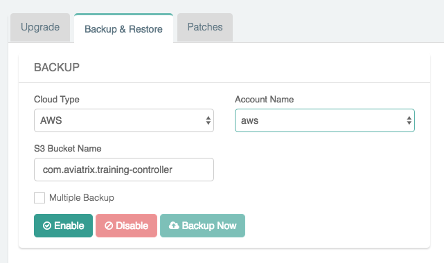

.. meta::
   :description: controller HA
   :keywords: controller high availability, controller HA, AWS VPC peering

###################################
Controller Backup and Restore
###################################

When deployed in a cloud environment, the Aviatrix Controller is not in the data path as packet processing and encryption is done by the Aviatrix gateways.

When the Controller is down or out of service, your network will continue to be operational and encrypted tunnels and OpenVPN® users stay connected and are not affected. Since most of the data logs are forwarded from the gateways directly, the loss of log information from the Controller is minimal. The only impact is that you cannot build new tunnels or add new OpenVPN® users.

This loosely coupled relationship between the Controller and gateways reduces the impact of the availability of the Controller and simplifies your infrastructure. Since the Controller stores configuration data, it should be periodically backed up to the appropriate AWS/Azure/Google account. If a replacement Controller is launched, you can restore the configuration data from your backup. 

     .. note::

	Note: If you have the Controller HA cloud formation stack running, please make sure you delete the stack prior to stopping the existing Controller, to avoid complications and failures in this restore operation.

How to backup configuration 
---------------------------

Aviatrix stores the Controller backup in an AWS S3 bucket or an Azure Container. Before you begin, determine where you would like to store the backup and create either the S3 bucket or Azure Container.

  #. Log in to the Controller.
  #. Click on the `Settings` navigation item.
  #. Click on the `Maintenance` sub item.
  #. Click on the `Backup & Restore` tab.
  #. Under the `BACKUP` section:

     - Select the appropriate `Cloud Type` and `Account Name`.
     - Populate the `S3 Bucket Name` for AWS or `Region`, `Storage Name`, and `Container Name` for Azure.

     .. note::

        By default, only the latest configuration data is stored. Each time the configuration is backed up, it overwrites the previous one.
        If you would like to keep every copy, check the box `Multiple Backup`.

  #. Click `Enable`

     |imageBackupAWS|
  
The first time you enable this feature, the configuration will backed up to your specified location. After this, the configuration data is automatically backed up daily at 12am.

Selecting the "Multiple Backup" checkbox enables the Controller to backup up to a maximum of 3 rotating backups. Each backup filename will contain the date and time of when the backup is made. Additionally, the backup without any date and time in the filename contains a copy of the latest backup.

If you want to force an immediate backup (e.g. for a configuration change) you can accomplish this by clicking on the "Backup Now" button. If multiple backups are not enabled, each time the configuration is backed up, the backup up file will be overwritten. Otherwise, the oldest backed up will be overwritten.

.. note::

   Selecting the 'Multiple Backup' option is recommended. If the backup is already 'Enabled', go ahead and 'Disable' it, turn on the 'Multiple Backup' option and then 'Enable' the backup again.

.. note::
	You should enable cross-region replication in AWS when creating your S3 buckets. This ensures that an S3 bucket remains accessible if there is a regional CSP failure. The replacement Controller can retrieve and restore its backup file.

How to restore configuration
--------------------------------

.. note::
	If in Private Mode, restoration can only be done in the same VPC as the previous Controller. You cannot restore a Controller that has been created in a different VPC.

If you are starting from a new Controller, follow these steps to get started:

#. Log in to the Controller with the `admin` username and the default password.
#. Follow the initial steps to get the Controller up and running.

   #. Shut down the older Controller.
   #. Transfer the IP address to the new Controller.
   #. Proceed to configure the new Controller by entering an email address.
   #. Change your admin password.
   #. Enter or skip the proxy configuration.
   #. Allow the upgrade to run.

Once you are past the initial configuration steps:

#. Login to the Controller

   #. Click on the `Settings` navigation item.
   #. Click on the `Maintenance` sub item.
   #. Click on the `Backup & Restore` tab.
   #. Under the `RESTORE` section:
  
     - Select the `Cloud Type`
     - For AWS

       - If you would like to use an existing account, please make sure you create one Access Account only with the EXACT Access Account Name that was used in your previous Controller. Check the box `Use Cloud Account Name` and select the account.  Otherwise, enter an `Access Key` and `Secret Key`
       - Enter the `Bucket Name` and `File Name` of the file to restore.

     - For Azure

       - Enter the `Subscription ID` and `Certificate Path`.
       - Enter the `Storage Name`, `Container Name`, and `File Name` of the file to restore.

  #. Click Restore

|imageRestoreAWS|

  If Aviatrix Managed CloudN exists in the backup Controller, after the restore operation on the new Controller, you must navigate to the Aviatrix Managed CloudN UI and follow steps of 2.2 and 2.5 in https://docs.aviatrix.com/HowTos/CloudN_workflow.html?highlight=managed%20CloudN by entering the new FQDN or IP of the new Controller to complete the restore.  You must repeat 2.2 and 2.5 on other Aviatrix Managed CloudN devices if you have more than one.
  

How to backup configuration with AWS encrypted storage
------------------------------------------------------

AWS S3 allows uploaded backup files to be encrypted in the server side for more secure storage. The encryption is all done in the AWS S3 server side. This server side secure storage is in addition to the already encrypted Aviatrix Controller backups.

1. Create AWS S3 bucket
^^^^^^^^^^^^^^^^^^^^^^^

|S3Create|

2. Configure bucket server side encryption in S3 bucket properties.
^^^^^^^^^^^^^^^^^^^^^^^^^^^^^^^^^^^^^^^^^^^^^^^^^^^^^^^^^^^^^^^^^^^

|S3Properties|

3. Select either None, AES-256, AWS-KMS AWS/S3, or AWS-KMS Custom KMS ARN.
^^^^^^^^^^^^^^^^^^^^^^^^^^^^^^^^^^^^^^^^^^^^^^^^^^^^^^^^^^^^^^^^^^^^^^^^^^

    |S3SelectDefaultEncryption|

        |S3SelectEncryption|

4. If AWS-KMS with Custom KMS ARN is selected, additional configuration will be needed:
^^^^^^^^^^^^^^^^^^^^^^^^^^^^^^^^^^^^^^^^^^^^^^^^^^^^^^^^^^^^^^^^^^^^^^^^^^^^^^^^^^^^^^^
    a. Create a Custom Encryption Key by going to IAM->Encryption Keys->Create Key

    |KMSKeyCreate|

    b. Copy the custom Key KMS ARN to the S3 encryption property configuration.

    .. note::

        Make sure that the custom encryption key and the S3 bucket are in the same region.

    c. If IAM user is used for onboarding authentication, add user "aviatrix-role-app" into the key.

    |KMSKeyAddUser|

How to backup Controller configuration privately with Azure Private Link
------------------------------------------------------------------------

Azure Private Link enables you to access Azure PaaS Services (for example, Azure Storage and SQL Database) and Azure hosted customer-owned/partner services over a private endpoint in your virtual network. Traffic between your virtual network and the service travels the Microsoft backbone network. Exposing your service to the public internet is no longer necessary.

By leveraging Azure private link, the Controller backups will happen privately from your VNET so that your blob storage account does not need to be exposed to the outside world.

1. Create an Azure Storage Account
^^^^^^^^^^^^^^^^^^^^^^^^^^^^^^^^^^

    |AzureStorage|

2. Setup the Storage Account for Private Link
^^^^^^^^^^^^^^^^^^^^^^^^^^^^^^^^^^^^^^^^^^^^^
    a. On the 'Networking' tab for the storage account creation, select Private endpoint for the connectivity method.

    b. Add a new private endpoint with the target of the blob storage resource and enable DNS Integration.

    |AzurePrivateEndpoint|

.. note::

   If you currently have existing private endpoints deployed, you may need to leverage an existing private zone in another subscription. This must be completed through the dedicated private endpoint creation workflow. For additional assistance with this setup please reach out to an Aviatrix Solution Engineer.

3. Verify Backup through Controller
^^^^^^^^^^^^^^^^^^^^^^^^^^^^^^^^^^^
Once successful, backing up traffic from the Controller will be performed privately across private link so that associated storage account does not need to be accessible publicly.

OpenVPN is a registered trademark of OpenVPN Inc.

.. |imageRestoreAWS| image::  controller_backup_media/backup_restore_restore_aws.png

.. |S3Create| image:: controller_backup_media/S3Create.png
    :scale: 30%
.. |S3Properties| image:: controller_backup_media/S3Properties.png
    :scale: 30%
.. |S3SelectDefaultEncryption| image:: controller_backup_media/S3SelectDefaultEncryption.png
      :scale: 25%
.. |S3SelectEncryption| image:: controller_backup_media/S3SelectEncryption.png
      :scale: 25%
.. |KMSKeyCreate| image:: controller_backup_media/KMSKeyCreate.png
      :scale: 30%
      :align: middle
.. |KMSKeyAddUser| image:: controller_backup_media/KMSKeyAddUser.png
      :scale: 30%
      :align: middle
.. |AzureStorage| image: controller_backup_media/AzureStorage.png
      :scale: 30%
      :align: middle
.. |AzurePrivateEndpoint| image: controller_backup_media/AzurePrivateEndpoint.png
      :scale: 30%
      :align: middle

.. disqus::
	  
