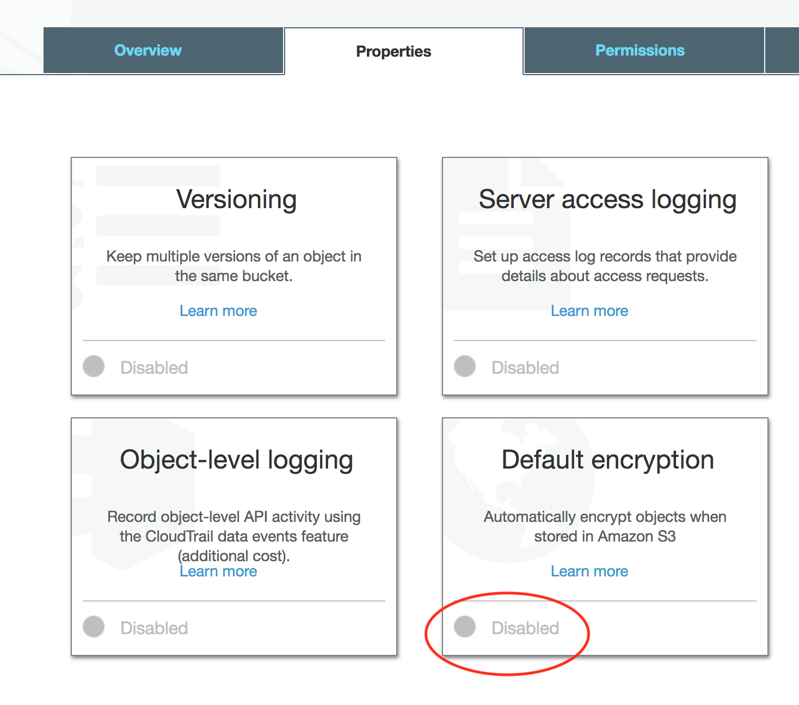

.. meta::
   :description: controller HA
   :keywords: controller high availability, controller HA, AWS VPC peering

###################################
Controller Backup and Restore
###################################

When deployed in a cloud environment, the Aviatrix controller, is not in the data path as packet processing and encryption is done by the Aviatrix gateways.

When the controller is down or out of service, your network will continue to be operational and encrypted tunnels and OpenVPN® users stay connected and are not affected. Since most of the data logs are forwarded from the gateways directly, the loss of log information from the controller is minimal. The only impact is that you cannot build new tunnels or add new OpenVPN® users.

This loosely coupled relationship between the controller and gateways reduces the impact of the availability of the controller and simplifies your infrastructure. Since the controller stores configuration data, it should be periodically backed up to the appropriate AWS/Azure/Google account. If a replacement controller is launched, you can restore the configuration data from your backup.

How to backup configuration 
---------------------------

Aviatrix stores the Controller backup in an AWS S3 bucket or an Azure Container.  Before you begin, determine where you would like to store the backup and create either the S3 bucket or Azure Container.

  #. Login to the Controller
  #. Click on the `Settings` navigation item
  #. Click on the `Maintenance` sub item
  #. Click on the `Backup & Restore` tab
  #. Under the `BACKUP` section:

     - Select the appropriate `Cloud Type` and `Account Name`
     - Populate the `S3 Bucket Name` for AWS or `Region`, `Storage Name`, and `Container Name` for Azure

     .. note::

        By default, only the latest configuration data is stored. Each time the configuration is backed up, it overwrites the previous one.
        If you would like to keep every copy, check the box `Multiple Backup`

  #. Click `Enable`

     |imageBackupAWS|
  
The first time you enable this feature, the configuration will backed up to your specified location. After this, the configuration data is automatically backed up daily at 12am.

Selecting "Multiple Backup" checkbox, will enable the controller to backup up to a maximum 3 rotating backups. Each backup filename will contain date and time of when the backup is made. Additionally, the backup without any date and time in the filename contains a copy of the latest backup.

If you want to force an immediate backup (e.g. for a configuration change) you can accomplish this by clicking on the "Backup Now" button. If multiple backups are not enabled, each time the configuration is backed up, the backup up file will be overwritten. Otherwise, the oldest backed up will be overwritten.

How to restore configuration
--------------------------------

If you are starting from a new Controller, follow these steps to get started:

#. Login to the Controller with the `admin` username and the default password
#. Follow the initial steps to get the Controller up and running.

   #. Enter an email address
   #. Change your admin password
   #. Enter or skip the proxy configuration
   #. Allow the upgrade to run

Once you are past the initial configuration steps:

#. Login to the Controller

   #. Click on the `Settings` navigation item
   #. Click on the `Maintenance` sub item
   #. Click on the `Backup & Restore` tab
   #. Under the `RESTORE` section:
  
     - Select the `Cloud Type`
     - For AWS

       - If you would like to use an existing account, check the box `Use Cloud Account Name` and select the account.  Otherwise, enter an `Access Key` and `Secret Key`
       - Enter the `Bucket Name` and `File Name` of the file to restore.

     - For Azure

       - Enter the `Subscription ID` and `Certificate Path`
       - Enter the `Storage Name`, `Container Name`, and `File Name` of the file to restore.

  #. Click Restore

|imageRestoreAWS|

How to backup configuration with AWS encrypted storage
------------------------------------------------------

AWS S3 allows uploaded backup files to be encrypted in the server side for more secure storage. The encryption is all done in the AWS S3 server side. This server side secure storage is in addition to the already encrypted Aviatrix controller backups.

1. Create AWS S3 bucket
^^^^^^^^^^^^^^^^^^^^^^^

|S3Create|

2. Configure bucket server side encryption in S3 bucket properties.
^^^^^^^^^^^^^^^^^^^^^^^^^^^^^^^^^^^^^^^^^^^^^^^^^^^^^^^^^^^^^^^^^^^

|S3Properties|

3. Select either None, AES-256, AWS-KMS AWS/S3, or AWS-KMS Custom KMS ARN.
^^^^^^^^^^^^^^^^^^^^^^^^^^^^^^^^^^^^^^^^^^^^^^^^^^^^^^^^^^^^^^^^^^^^^^^^^^

    |S3SelectDefaultEncryption|

        |S3SelectEncryption|

4. If AWS-KMS with Custom KMS ARN is selected, additional configuration will be needed:
^^^^^^^^^^^^^^^^^^^^^^^^^^^^^^^^^^^^^^^^^^^^^^^^^^^^^^^^^^^^^^^^^^^^^^^^^^^^^^^^^^^^^^^
    a. Create Custom Encryption Key by going to IAM->Encryption Keys->Create Key

    |KMSKeyCreate|

    b. copy the custom Key KMS ARN to the S3 encryption property configuration

    .. note::

        Make sure that the custom encryption key and the S3 bucket are in the same region

    c. If IAM user is used for onboarding authentication, add user "aviatrix-role-app" into the key

    |KMSKeyAddUser|

OpenVPN is a registered trademark of OpenVPN Inc.

.. |imageBackupAWS| image::  controller_backup_media/backup_restore_backup_aws.png

.. |imageRestoreAWS| image::  controller_backup_media/backup_restore_restore_aws.png

.. |S3Create| image:: controller_backup_media/S3Create.png
    :scale: 30%
.. |S3Properties| image:: controller_backup_media/S3Properties.png
    :scale: 30%

.. |S3SelectEncryption| image:: controller_backup_media/S3SelectEncryption.png
      :scale: 25%
.. |KMSKeyCreate| image:: controller_backup_media/KMSKeyCreate.png
      :scale: 30%
      :align: middle
.. |KMSKeyAddUser| image:: controller_backup_media/KMSKeyAddUser.png
      :scale: 30%
      :align: middle

.. disqus::
	  