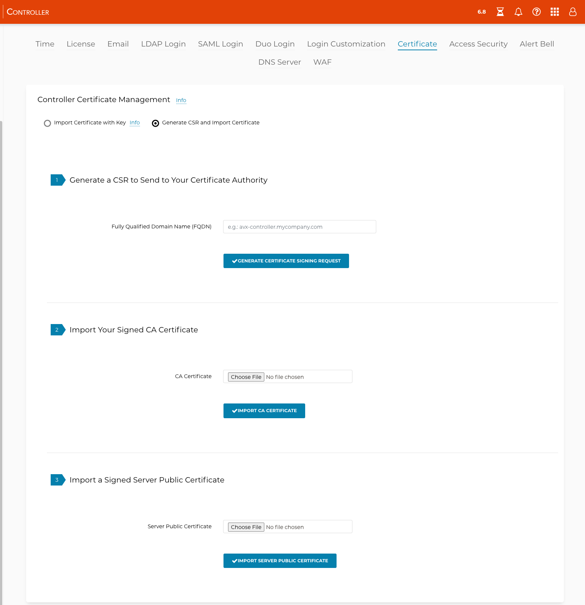

###################################
Certificate Management Overview
###################################

You can use the Aviatrix certificate created at the time of installation for the Controller and gateway, or you can customize the Aviatrix Controller and gateway certificate to use an organization-specific certificate. Both types are certificates are issued locally through the Controller's automated processes. All keys and certificates are in PEM format. To customize the Controller or gateway certificate, see below. 

.. note:: 
	Please make sure there are no special characters (including space) in the file name.

###################################
Controller Certificate Management
###################################

The Aviatrix Controller uses a self-signed certificate by default. That is why you see "Not Secure" in the browser. You can make the Controller more secure by importing a signed certificate. 

There are two methods to accomplish this: 

 - Import a Certificate with Key: this is the preferred approach and is described `here <https://docs.aviatrix.com/HowTos/import_cert_with_key.html>`_. In this method, the private key file server.key must match the server.crt.  
 - Generate CSR and Import a Certificate: these steps are provided below. 

Generate CSR and Import Certificate
-------------------------------------

In this approach, you generate a .csr file, ensure it is signed, and then import it to the Aviatrix Controller. 

Generate the CSR File
^^^^^^^^^^^^^^^^^^^^^

1. In the left pane of the Aviatrix Controller, select Settings > Controller, and then click the Certificate tab. 
#. Under Controller Certificate Management, select the **Generate CSR and Import Certificate** option.

|gen_csr|

3. Enter the Fully Qualified Domain Name (FQDN) of the Controller.
#. Click **Generate Certificate Signing Request**. The CSR is downloaded to your local host. 
#. After ensuring that the CSR is signed by a Sign Authority, you receive two files: a CA certificate and a Server certificate. 
#. In the CA Certificate field, select the signed CA certificate and click **Import CA Certificate**.
#. In the Server Public Certificate field, select the Server certificate from step 3.
#. Click **Import Server Public Certificate**.

Import CA Certificate and Server Certificate 
^^^^^^^^^^^^^^^^^^^^^^^^^^^^^^^^^^^^^^^^^^^^^

After you obtain the CA certificate and Server Public Certificate, click the **Import Certificate with Key** option to import/upload the files to the Controller. 

|ca.crt|

###################################
Gateway Certificate Management
###################################

.. note:: 
	Setting up your custom gateway certificate only works in versions 6.0 or higher. Earlier versions will cause the custom certificate deployment to fail. You must update all existing gateways to at least version 6.0 before applying a custom certificate. Also, if any of your GCP gateways are version 14.04, using a custom gateway certificate is not supported.

The gateway certificate is created when each gateway is launched via the Aviatrix Controller. At the time of gateway launch, an Aviatrix self-signed certificate is issued to the gateway to make sure all data transmission to and from the gateway is authenticated. If you don't customize the certificate, your gateway will continue to operate with the default certificate. If you choose to customize the certificate with your organization credentials, you must apply the below steps to customize all existing and new gateways. 

In addition, you can confirm and monitor each gateway certificate type in the Aviatrix Controller Console > Gateway > reference column Cert Type. 

Setting up the Custom Gateway Certificate
-----------------------------------------

Make sure that all gateways are green/running before you proceed.

1. In the left pane of the Aviatrix Controller, select Settings > Advanced and click the Gateway tab.
#. Under Gateway Certificate Management, the **Import CA Certificate with Key** option is selected by default. Click **Choose File** and navigate to the locations of the CA Certificate and the CA Private Key.
#. Click **OK**. 

Step 3. Check the Gateway Certificate Type to Confirm Deployment
^^^^^^^^^^^^^^^^^^^^^^^^^^^^^^^^^^^^^^^^^^^^^^^^^^^^^^^^^^^^^^^^
When the deployment completes, go to your Gateway list and display the column name Cert Type. Check to make sure each of the Cert Types is Custom. 

|gateway_cert|

.. |ca.crt| image::  controller_certificate_media/ca.crt.png
    :scale: 30%

.. |server_crt| image::  controller_certificate_media/server_crt.png
    :scale: 30%

.. |imageRestoreAWS| image::  controller_backup_media/backup_restore_restore_aws.png

.. |S3SelectDefaultEncryption| image:: controller_backup_media/S3SelectDefaultEncryption.png
      :scale: 25%
.. |S3SelectEncryption| image:: controller_backup_media/S3SelectEncryption.png
      :scale: 25%
.. |KMSKeyCreate| image:: controller_backup_media/KMSKeyCreate.png
      :scale: 30%
      :align: middle
.. |KMSKeyAddUser| image:: controller_backup_media/KMSKeyAddUser.png
      :scale: 30%
      :align: middle

.. disqus::
	  
