.. meta::
   :description: controller Migration
   :keywords: controller high availability, controller HA, auto scaling, Azure, GCP, OCI

=========================================================
Controller Migration in Azure, GCP, and OCI
=========================================================

Introduction
^^^^^^^^^^^^^^^

You may need to migrate your Aviatrix Controller in the following situations:

  * If your Controller uses an old machine image and you are trying to upgrade to a new software version that requires the latest image. 
  * If you need to transition to a newer machine image for your Controller based on a recommendation from Aviatrix Support.

.. note::

  A machine image is named a "VM image" (Virtual Machine Image) in Azure, a "machine image" in GCP, and a "custom image" in OCI.

The Controller Migration process involves three main steps:

* Fulfill the prerequisites, including backing up your old Controller.
* Delete your old Controller in the CSP Account from which you originally launched it: Azure, GCP, or OCI.
* Launch a new Controller from the relevant CSP marketplace.
* Restore the data from your old Controller to your new Controller.

.. important::

  The **Migrate** button under Settings > Maintenance > Migration tab only migrates Controllers that were launched from AWS. Controllers launched from Azure, GCP, or OCI need to be migrated manually, as shown below. To migrate a Controller that was launched from AWS, please see `this document <https://docs.aviatrix.com/HowTos/Migration_From_Marketplace.html>`_.

Prerequisites
^^^^^^^^^^^^^^^^^

* Run an audit on the Controller’s primary access account and all the remaining secondary accounts to make sure that the IAM roles and policies are set up as suggested. In your Controller, go to Accounts > Access Accounts > select an account > click **Audit**. Repeat these steps for all access accounts for the CSP where your Controller instance is located (AWS, Azure, GCP, or OCI).
* Enable a `Controller backup <https://docs.aviatrix.com/HowTos/controller_backup.html>`_ using the access account for the CSP from which you launched the Controller (Azure, GCP, or OCI). 

.. note::

  In case of a Disaster Recovery (DR) scenario, considering keeping current backups in separate regions of each CSP.

* Back up your existing Controller. In your Controller, go to Settings  >  Maintenance  > Backup & Restore  >  Backup. Click **Backup now**.
* Schedule the migration during a maintenance window and a walk through the `pre-op checklist <https://docs.aviatrix.com/Support/support_center_operations.html#pre-op-procedures>`_.
* `Upgrade <https://docs.aviatrix.com/HowTos/inline_upgrade.html>`_ to the latest build of your current release.
* `Disable <https://docs.aviatrix.com/HowTos/controller_ha.html#steps-to-disable-controller-ha>`_ your Controller's HA configuration if HA is set up. You can `reenable <https://docs.aviatrix.com/HowTos/controller_ha.html>`_ HA on the new Controller once migration is complete.
* If you are using SAML login for either the Controller login (Settings/Controller/SAMLLogin) and/or for openvpn authentication (OpenVPN/Advanced/SAML), please make sure that the endpoints configured on the Controller and the SAML applications in the IdP match exactly.

.. note::

  Do not add any new configurations to your old Controller before migrating, as those updates may be lost in the migration process.

.. important::

  `Disabling <https://docs.aviatrix.com/HowTos/controller_ha.html#steps-to-disable-controller-ha>`_ HA configuration is critical.

Migrate
^^^^^^^^^^^^^^

.. note::

  A temporary EIP is created for business continuity during migration.  A new private IP will be created on the new Controller.

.. tip::

  In a Disaster Recovery (DR) situation in which you cannot access the old Controller, please see the Controller Migration During Disaster Recovery section below.

Controller Migration in Azure
##################################

Before migrating your Azure Controller, note the following details so that you can replicate them in your new Controller:

* The instance's location, Subscription ID, Size, Public IP address, Virtual network (VNet)/subnet, and Private IP address. In your Azure account, go to Virtual machines > select the Controller instance.

|azure_account_details_1|

* The instance's Display name, Application (client) ID, and Directory (tenant) ID.

|azure_account_details_2|

* The instance's `secret value <https://docs.aviatrix.com/HowTos/Aviatrix_Account_Azure.html#creating-a-secret-identifier>`_, which could only be accessed directly after the instance is created.

2. Locate your `Customer ID <https://docs.aviatrix.com/HowTos/onboarding_faq.html?highlight=customer%20id#what-is-an-aviatrix-customer-id>`_.

3. Make a Controller backup in a storage container and make a note of Subscription ID, Directory ID, Application Client ID, Application Client Secret, Storage Name, Container Name, File Name.

4. Launch new Controller Instance. Please refer to the `Azure Startup Guide <https://docs.aviatrix.com/StartUpGuides/azure-aviatrix-cloud-controller-startup-guide.html>`_.
5. Shut down the old Controller instance. Go to your Azure account > Virtual machines and select the old Controller instance. Click **Stop**.

|azure_stop_old_controller|

6. Dissociate the Public IP address from the old Controller. In your Azure account, go to Network interfaces > select the Network Interface > Select the public IP > click **Dissociate**.

|azure_click_dissociate|

Click **Yes** to confirm the dissociation.

7. Associate this Public IP address to the new Controller instance. On the Public IP address page, click **Associate**.

|azure_click_associate|

* Under Resource type, select **Network interface**. 
* Under Network interface, select your new Controller instance. 

|azure_IP_details|

8. Set up your `Aviatrix Customer ID <https://docs.aviatrix.com/HowTos/onboarding_faq.html?highlight=%22customer%20id%22#what-is-an-aviatrix-customer-id>`_. Open your new Aviatrix Controller and go to Onboarding > Azure > enter your Aviatrix Customer ID.

Controller Migration in GCP
##################################

.. note::

  GCP Controller image in 5.4 versions and higher versions of the Controller image are based on the 18.04 ubuntu distribution.

1. In your GCP account, make a list of the old Controller’s region, availability zone, instance size, and any specific subnets so that you can use the same parameters to launch the new Controller. To find this information, log into your GCP account > click on the menu in the top left and scroll down to Compute Engine > hover over Compute Engine and select VM instances. On the VM Instances page, find your Controller instance, click on the three dots on the right side of its row in the table, and select **View network details**.

(Optional) Find and save your old Controller's Customer ID. In your Aviatrix Controller, go to Settings > Controller > License > Setup Aviatrix Customer ID.

2. If you do not have a bucket for data storage, create a new one. In your GCP account, go to Cloud Storage > Browser.

|gcp_cloud_storage_browser|

3. Click **Create Bucket**. Add the necessary information and click **Create**.
4. If you have not reserved a static IP for the old Controller and want to do so, go to your GCP account > VPC Network > IP Addresses. Select **Reserve External Static Address**. 

|gcp_reserve_external_static_address|

5. Enter the details of the IP address and click **Reserve**.
6. Before stopping this old instance, disassociate the reserved IP address. Click **Change**. Then, click on the Attach to dropdown menu and select **None**.

|gcp_attach_to_none|

7. Shut down the old Controller instance. 

|gcp_stop_instance|

8. Launch a new Controller instance in the same region and VPC, of the same size as your old Controller. Review the details you saved from your old Controller to ensure they match. To launch the new instance, go to your GCP account > Marketplace > search for "Aviatrix" > choose your required Aviatrix platform > click **Launch**. Make sure to replicate the same region, subnet (if required), and size of the old Controller. See the `Google Startup Guide <https://docs.aviatrix.com/StartUpGuides/google-aviatrix-cloud-controller-startup-guide.html>`_ for thorough instructions.
9. Once the new Controller launches, associate the reserved static IP address to this new instance. In your GCP account, go to VPC Network > IP Addresses > select the IP address > change > select the newly launched Controller.

Controller Migration in OCI
#############################################

1. Before terminating the old Controller instance, document the following information from your OCI account:

* The instance's region, availability domain, and fault domain
* The instance's display name
* Assigned VCN details
* All private IP addresses, names, subnets and private DNS name (if any)
* Any public IP addresses assigned from a reserved public pool
* Any tags on the instance or attached resources

|oci_account_details|

.. important::

  Make sure that the **Permanently delete the attached boot volume** checkbox is *unmarked* while terminating. This step saves the old Controller image to use for the new Controller.

  |oci_permanently_delete_unchecked|

2. Terminate the old Controller instance. In your OCI account, go to  Compute > Instances > Controller Instance > More actions > Terminate. Click **Terminate instance**.

|oci_terminate|

3. Create a new Controller instance. Go to OCI Console > Menu > Compute > Instances > click **Create instance**. Refer to `these instructions <https://docs.aviatrix.com/StartUpGuides/google-aviatrix-cloud-controller-startup-guide.html>`_.
4. The Launching instance page opens. Enter the details of the Controller as per the old Controller instance.
5. Add the appropriate ssh public key file and click **Create** to launch the instance.
6. Move the Controller's public IP address. Follow the steps below.

Move your OCI Controller's Public IP Address
--------------------------------------------------------

1. Assign the IP from reserved pool to the new Controller instance. Go to your OCI account > Compute > Instance > Controller Instance > Resources > Attached VNICs. Select **Primary VNIC**.

|oci_select_primary_vnic|

2. Under VNIC details > Resources > IPV4 Addresses > select the three dots icon > click **Edit**.

|oci_click_edit|

3. Go to Public IP type > Select reserved IP address > Select the **Reserved public IP** radio button. Under Reserved IP Address in *Compartment_Name*, click on the dropdown menu and select the Public IP address reserved for your Controller. Then, click **Update**.

|oci_click_update|

Post Migration Tasks
---------------------------

After testing to ensure that the Controller migration is complete and successful, you can delete the old Controller. It can be left in "Stopped" status for a while, but it should never be started. If it is started, this old Controller will reach out to the gateways and the network could have issues with two Controllers trying to monitor/modify the gateways. 

Setting up Your New Controller
^^^^^^^^^^^^^^^^^^^^^^^^^^^^^^^^^^^^^^^^^^^^^^^^^^^^

1. Log into the newly launched Controller instance. 

* Username  - admin
* Password  - the private IP of the newly launched instance

2. Set a new password and upgrade this Controller to the same version as your old Controller instance. This might take up to 5 minutes.
3. Log into the new Controller and onboard your primary access account (the CSP account). Make sure to have your CSP credentials available, as you will need them to onboard your CSP account. In your Controller, go to Accounts > Access Accounts > *CSP* (Azure, GCP, or OCI).
4. Onboard your Aviatrix Customer ID. Use your old Controller's Customer ID.
5. Once everything is set up and ready, restore the backup from the bucket. In your Controller, go to > Settings > Maintenance > Backup & Restore > Restore > fill in the appropriate details > click **Restore**.

It will take a few minutes for the backup to be restored. You can verify the dashboard to see if all the configuration from the old Controller has been restored. 

Migrating the Controller IP Address
^^^^^^^^^^^^^^^^^^^^^^^^^^^^^^^^^^^^^^^^^^^^^^^^^^^^

After migrating to a new Controller, make sure you have migrated your public IP address as well. 

1. In Azure, GCP, or OCI, disassociate the Static Public IP or Elastic IP address from your old Controller and associate it with your new Controller.
2. In your new Controller, in the left sidebar, go to Troubleshoot > Diagnostics > scroll down to the Controller IP Address Migration section. If two IPs display under Controller Public IP, click **Migrate**.

Before Controller IP migration :

|gcp_before_migrating_ip|

After Controller IP migration :

|gcp_after_migrating_ip|

Controller Migration During Disaster Recovery
===================================================================

In a Disaster Recovery (DR) situation in which an entire CSP region is unavailable, you may not be able to access your old Controller to follow the steps above. In this situation, use the steps below to migrate your Controller.

1. Deploy a new Controller in a **different** region from the old Controller.
2. `Upgrade <https://docs.aviatrix.com/HowTos/selective_upgrade.html>`_ this new Controller to the current production version.
3. If possible, `restore your backup <https://docs.aviatrix.com/HowTos/controller_backup.html#how-to-restore-configuration>`_. A best practice is to keep a current backup in a separate region from the region in which you deployed the Controller. 
4. In your new Controller, go to Settings > Maintenance > Migration and click **Migrate**.
5.  Run a connectivity and performance test to ensure everything is working correctly.
6. `Deploy <https://docs.aviatrix.com/HowTos/copilot_getting_started.html>`_ CoPilot from the new Controller.
7. When your old Controller becomes available again, keep that instance stopped until you can ensure that all operations are working with the new Controller. Then, you can delete that instance.

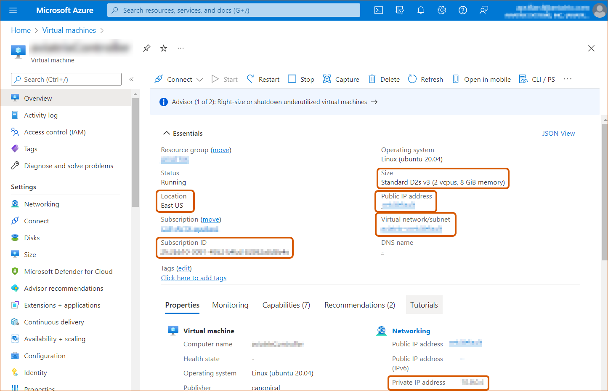

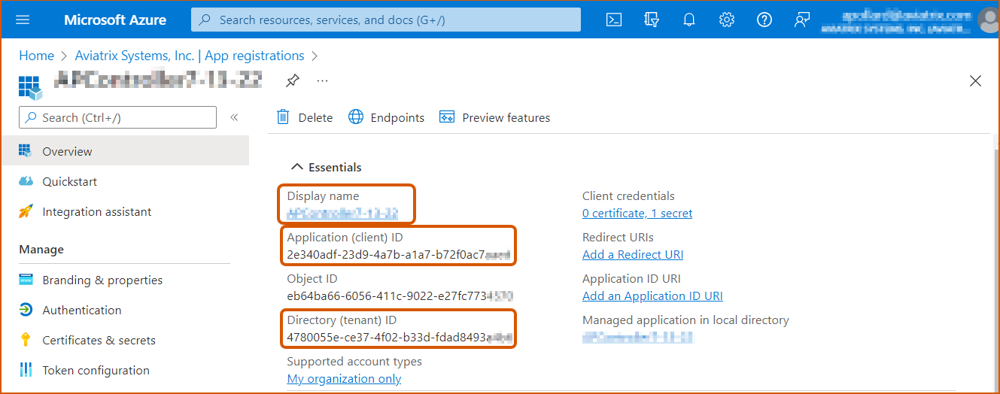

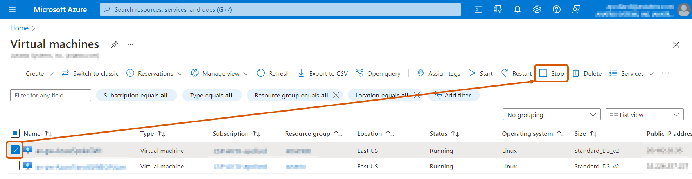

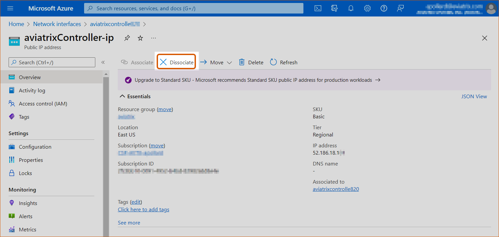

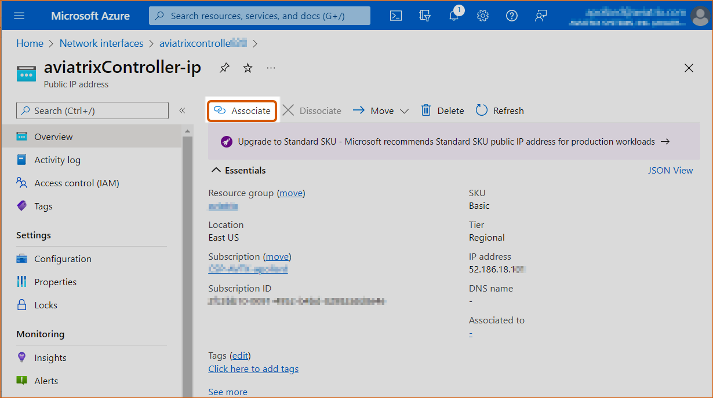

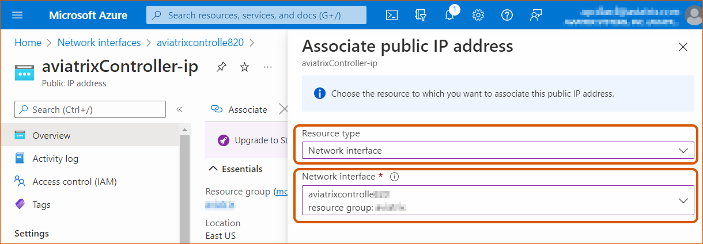

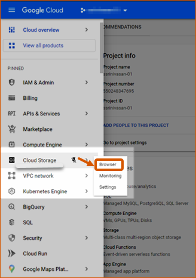

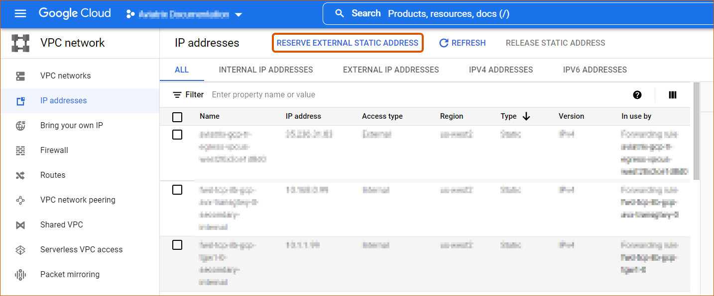

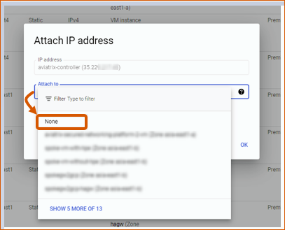

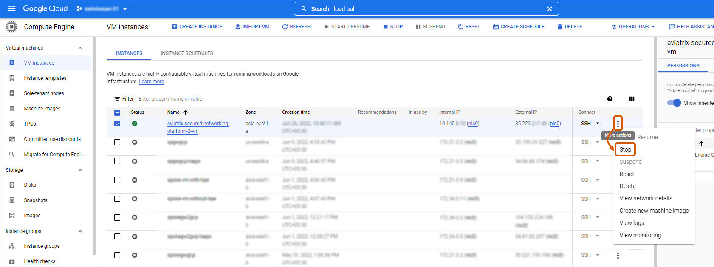

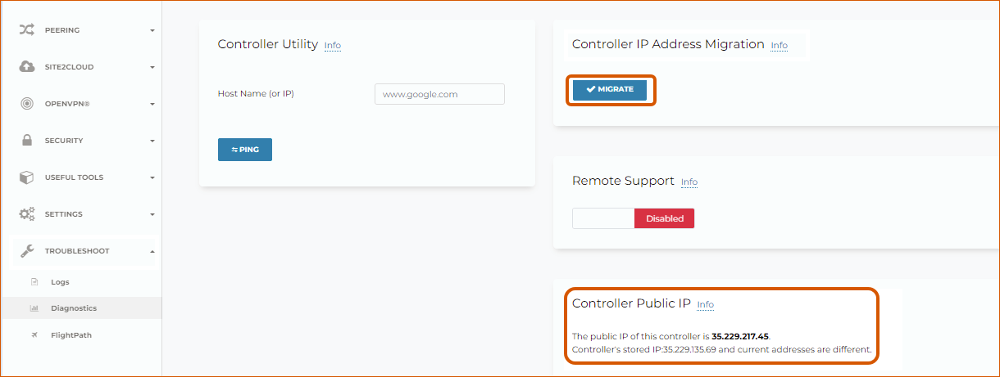

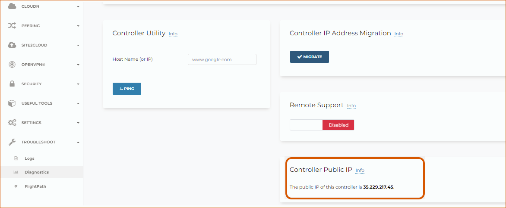

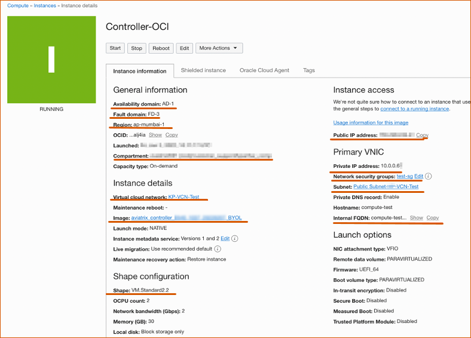

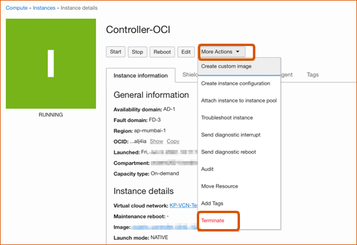

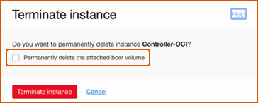

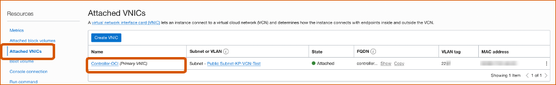

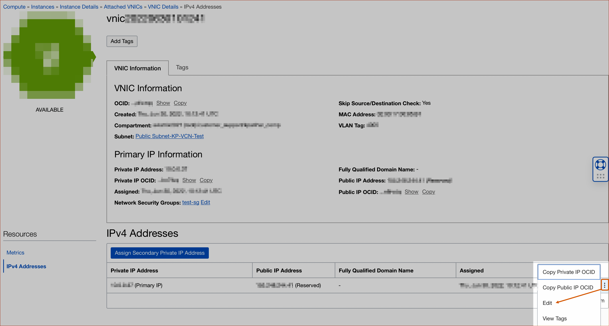

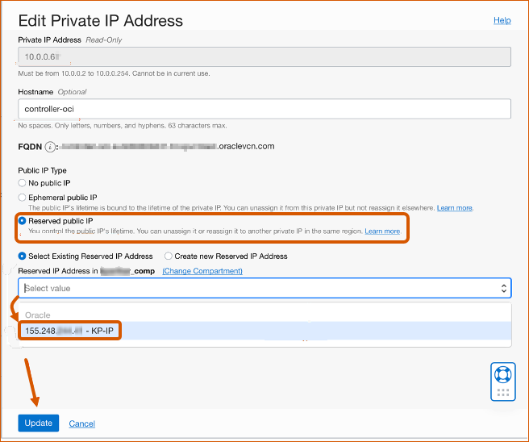

.. disqus::
