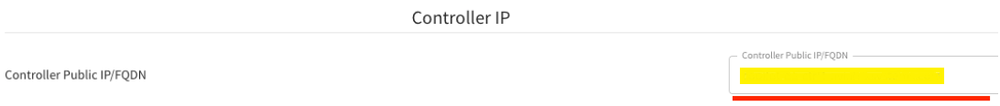

.. meta::
  :description: Aviatrix Getting Started
  :keywords: CoPilot,visibility

============================================================
Aviatrix CoPilot Deployment Guide
============================================================

Launch CoPilot
==================

Aviatrix CoPilot is available as an all-in-one virtual appliance that is hosted in a user's own IaaS cloud environment. 
It can be launched as an EC2 instance in AWS, a virtual machine in Azure, or a VM instance in GCP and OCI. 

Typically, you can apply the default configurations for resources settings that are recommended by marketplaces during launch. Take note of the `Minimum Instance (VM) System Requirements for CoPilot`_. 

You can deploy CoPilot using different methods. See `CoPilot Deployment Methods`_. 

Please note that you will need an Aviatrix Controller to use CoPilot. CoPilot works in tandem with Aviatrix Controller. Each one requires a separate license. See `CoPilot Customer IDs and Licensing`_.

Aviatrix Controller and CoPilot are not required to be collocated. It is possible to run them in separate VPCs/VNets or separate cloud providers (in multi-cloud environments). Typically, Aviatrix Controller and Aviatrix CoPilot are run in the same VPC/VNet.

After launching CoPilot, you must configure integration points for CoPilot to connect and communicate with other components in the Aviatrix platform. See `Instance (VM) Configuration Details for CoPilot`_.

If you are launching a new instance of CoPilot and need to migrate CoPilot data from an existing (source) CoPilot to a newly launched (destination) CoPilot, see `About Migrating CoPilot Data`_.

CoPilot Deployment Methods
===========================

You can deploy Aviatrix CoPilot directly from any supported cloud service provider (CSP) marketplace, by using Terraform scripts, or by using the Aviatrix Controller user interface (available for AWS from Controller release 6.7.1185). 

Deploying from the CSP marketplace takes only a few clicks to provision and launch the instance. Since you must subscribe to a CoPilot offer at a marketplace as a first step for all deployment methods, this method is commonly used right after subscribing. This deploy method is often used for a CoPilot simple (single instance) deployment. See `Subscribe to a CoPilot Offer`_. 

If your Controller is in AWS, you can also conveniently launch a CoPilot simple or fault tolerant (clustered) deployment from the Aviatrix Controller user interface. See `CoPilot instance launch using Controller UI (AWS Only)`_ and `CoPilot cluster launch using Controller UI (AWS Only)`_. 

If you are knowledgeable in deploying infrastructure-as-code using Terraform, you might find it convenient to launch CoPilot by using Terraform scripts. You can launch a simple or clustered deployment using Terraform scripts. At this time only AWS is supported for launching a CoPilot clustered deployment using Terraform. A summary of steps for launching a single instance using Terraform is provided at `(Terraform) CoPilot instance launch using Terraform`_.  Please refer to the Aviatrix Terraform Module for CoPilot for the most current instructions and samples on GitHub here: https://github.com/AviatrixSystems/terraform-modules-copilot.

Instance (VM) Configuration Details for CoPilot
================================================
After launching CoPilot, you must configure integration points for CoPilot to connect and communicate with other components in the Aviatrix platform.

.. tip::
  Starting from Controller 6.8, you can enable the "CoPilot Security Group Management" option in Aviatrix Controller to help automate opening CoPilot access to the below ports (in Controller > Settings > CoPilot > CoPilot Security Group Management). See `CoPilot Security Group Management <https://docs.aviatrix.com/HowTos/Settings_CoPilot.html>`_.

- Open your CoPilot access (security group) for: 

  - TCP port 443 from anywhere user access (to reach CoPilot via HTTPS connection using web browser)

  - UDP port 5000 (default) — Enable Syslog for CoPilot Egress FQDN & Audit Data (from each gateway). Gateways send remote syslog to CoPilot.

  - TCP port 5000 (default) — **For private mode**, enable Syslog for CoPilot Egress FQDN & Audit Data (from each gateway). Gateways send remote syslog to CoPilot.

  - UDP port 31283 (default, port is configurable) — Enable Netflow for CoPilot FlowIQ Data (from each gateway). Gateways send Netflow to CoPilot. 

Each CoPilot instance must be launched in a *subnet (availability zone)* that has outbound Internet access. In a clustered (fault tolerant) deployment, you must select a subnet with outbound Internet access for the server instance as well as for each data instance in the cluster. This is true if you are using private mode as well.

If you need to manually add IPs for gateways in your access control lists (security groups), you can view the IP addresses of all your gateways from the Gateways page in Aviatrix Controller. 

Minimum Instance (VM) System Requirements for CoPilot
=======================================================
The configuration of the virtual machine that you provision for your CoPilot deployment depends on the scale and the kind of networking infrastructure you have planned according to your business requirements. Work with your Aviatrix Sales representative to determine your sizing requirements. While this section provides minimum requirements and guidelines for minimum sizing based on a number of gateways, it is strongly recommended to reach out to your Aviatrix Sales representative to discuss your specific sizing needs. 

- For the instance/VM size, CoPilot requires a minimum of:

  - 32 GB of RAM (or more)

  - 1 attached disk/volume for storage — See `CoPilot Disk (Volume) Management`_.

  - 8 vCPUs (or more)

Examples: 

Amazon EC2 instance type: m5n.2xlarge

Googld Cloud: n2-standard-8

Oracle Cloud Infrastructure: VM.Standard3.Flex (8core x 32G mem)

If you are deploying CoPilot for the first time (new launch) and have existing gateways, below are general guidelines for a minimum VM size *based on the number of existing gateways* in an infrastructure. 

The information is intended as a general guide only. After you deploy CoPilot, you will be able to monitor the indexing of data for traffic in your specific environment and tune configuration settings, such as index retention periods, that will help determine the best instance size for your business needs.

For infrastructures with **< 500 GWs**, the minimum instance/VM size guideline:

  - 32 GB of RAM (or more)

  - 8 vCPUs (or more)

Examples:

Amazon EC2 instance type: 			m5n.2xlarge

Googld Cloud: 			                n2-standard-8

Oracle Cloud Infrastructure: 			VM.Standard3.Flex (8core x 32G mem)

Microsoft Azure virtual machine:                Standard_D8_v4

For infrastructures with **> 500 but < 1000 GWs**, the minimum instance/VM size guideline:

  - 64 GB of RAM (or more)

  - 16 vCPUs (or more)

Example:

Amazon EC2 instance type: 			m5n.4xlarge

For infrastructures with **>=1000 GWs**, the minimum instance/VM size guideline:

  - 128 GB of RAM (or more)

  - 32 vCPUs (or more)

Example:

Amazon EC2 instance type: 			m5n.8xlarge

**Note the following points**:

- (AWS) For CoPilot ARM-based images, Amazon EC2 A1 instances are currently not supported.

- For a simple deployment, the single instance (VM) must meet the minimum requirements. 

- For a fault tolerant (clustered) deployment, each instance (VM) in the cluster must meet the minimum requirements. In addition, each cluster instance must use the same instance sizing. In a cluster, the data instances will have a disk/volume attached for storage in the size you specify during your launch process. Data volume sizes must be the same across all data instances. 

- If you already have a CoPilot simple deployment (single instance) and you are planning on migrating your data from the simple deployment to a new clustered deployment, the size of the disk volume you specify for each data instance should be the same size or larger than the storage used in your old single copilot. See `CoPilot Disk (Volume) Management`_ in Aviatrix CoPilot Deployment Guide for more information and CoPilot storage.

CoPilot Customer IDs and Licensing
====================================

This section discusses Aviatrix CoPilot customer IDs and licensing.

**NOTE:** The CoPilot customer ID is separate from the Aviatrix Controller customer ID.

CoPilot is offered with a Bring Your Own License (BYOL) license model. If you are interested in a trial of CoPilot, contact us through the Aviatrix chat window of our doc website, or contact your Aviatrix Sales representative.

With a BYOL license model, you need to have a customer ID provided by Aviatrix to be able to use the product. Your Aviatrix Sales representative will provide you with a customer ID. Customer IDs for CoPilot contain the letters `-cplt-`.

When you perform the initial setup of CoPilot, you will be prompted to enter your customer ID and CoPilot will allocate a license to you based on your customer ID. Your customer ID can be associated with more than one license. The license key has the quantity or *allocation count* for the number of CoPilot instances that can use the license at a given time (the default count is 2). If the license key is greater than one, the key can be used by more than one instance. You can see when the license will expire and see the used and total allocation count of your license in CoPilot Settings > Licensing.

If you plan to launch a CoPilot clustered deployment, your Aviatrix Sales representative will provide an ID associated with the number of licenses you require for each cluster instance.  

When your customer ID expires, you can ask for a license extension from your Sales representative. In this case, you must reset your customer ID for the extension by navigating to CoPilot Settings > Licensing and clicking the **RESET** button. 

If you need to terminate your current instance of CoPilot and deploy a new instance using the same license associated with your customer ID, first release the CoPilot license of the current instance by navigating to CoPilot Settings > Licensing and clicking the **RESET** button. After you deploy the new instance of CoPilot, you will be prompted to enter the customer ID during initial setup. Re-enter the same customer ID. 

Subscribe to a CoPilot Offer
============================

Subscribe to an Aviatrix CoPilot offer in a cloud provider marketplace and provision and launch your CoPilot instance.

For licensing and trials, CoPilot is offered with a BYOL model. Before subscribing to CoPilot in a cloud marketplace, obtain a license key for CoPilot by contacting your Aviatrix Sales representative. Since CoPilot works in tandem with Aviatrix Controller to provide visibility into your cloud resources managed by the controller, it is assumed that you already have a controller.

To subscribe to a CoPilot offer:

1.  Log in to the marketplace of your chosen cloud provider using your provider user account credentials. CoPilot is available in the marketplaces for:

    -   Amazon Web Services (AWS)
    -   Google Cloud Platform
    -   Microsoft Azure Marketplace
    -   Oracle Cloud Infrastructure (OCI)

2.  Locate the Aviatrix CoPilot software offer you want to subscribe to and click **Subscribe**.

    It is recommended to use the latest image release version. For information about Aviatrix CoPilot image versions, see `Aviatrix CoPilot Image Release Notes <https://docs.aviatrix.com/HowTos/copilot_release_notes_images.html>`_.

3.  When prompted, review the subscription pricing information and accept the terms and conditions. You may be prompted to confirm your subscription before moving on to configuration.

    -   If you want to deploy CoPilot via the Controller UI or via Terraform scripts, you can stop here and refer to the instructions for each deploy method. If you want to deploy CoPilot from your CSP marketplace, you can continue with the rest of the steps.

4.  Each marketplace will prompt you to configure and launch the CoPilot software. For CoPilot instance (VM) configurations and launch requirements, note the following:

    -   (VM Sizing)

        -   For the minimum supported instance/VM size for CoPilot, see `Minimum Instance (VM) System Requirements for CoPilot`_.

    -   (Storage)

        -   You must attach at least one data disk (data volume) to your CoPilot instance to be used for expandable storage; this is a secondary data storage separate from the root disk that comes with CoPilot. For more information, see `CoPilot Disk (Volume) Management`_. You can choose the disk type (volume type) that meets your business needs given the size of your environment.

    -   (Static Public IP Address)

        -   CoPilot requires a static public IP address (for example, an Elastic IP address in AWS). The only exception is if you are using private mode.

    -   (Service Ports)

        - Copilot requires the following service ports:

        - TCP port 443 from anywhere user access (to reach CoPilot via HTTPS connection using web browser)
        - UDP port 5000 (default) — Enable Syslog for CoPilot Egress FQDN & Audit Data (from each gateway). Gateways send remote syslog to CoPilot.
        - TCP port 5000 (default) — **For private mode**, enable Syslog for CoPilot Egress FQDN & Audit Data (from each gateway). Gateways send remote syslog to CoPilot.
        - UDP port 31283 (default, port is configurable) — Enable Netflow for CoPilot FlowIQ Data (from each gateway). Gateways send Netflow to CoPilot. 

    -   (Internet Access)

        - CoPilot requires Internet access. You must select a *subnet* (availability zone) with outbound Internet access when specifying the subnet for each CoPilot instance. This is also true if you are using *private mode*.
        
5.  (Pre-6.8 Controller releases only) 

    -   If your Controller is a pre-6.8 release version: In your cloud console, in the security group page of your CoPilot VM/instance, add entries FOR EACH of your Aviatrix gateways:

    -   For the UDP ports, change the default inbound rule of 0.0.0.0/0 to the IP addresses of your Aviatrix gateways: 
          -   Open your CoPilot Security Group for UDP 31283 from all of your Aviatrix gateways.
          -   Open your CoPilot Security Group for UDP 5000 from all of your Aviatrix gateways.
          -   For port 443, you can allow only your and other trusted user's IP addresses.
    .. note::
        Each time you launch a new gateway from your controller, you must also add a CIDR entry for it here. 

    .. tip::
        Starting from Controller 6.8, you can enable the CoPilot Security Group Management feature to allow your Controller to open CoPilot access to the above ports for all of your Aviatrix gateways. You enable the feature in Controller > Settings > CoPilot > CoPilot Security Group Management. See `CoPilot Security Group Management <https://docs.aviatrix.com/HowTos/Settings_CoPilot.html>`_.
       
6.  After specifying all values for the marketplace configuration prompts, deploy/launch the CoPilot instance/virtual machine.

    For example, in AWS, you select the region and click **Continue to Launch**.

    You should receive a message from the cloud provider stating that the instance of CoPilot software is deployed/launched.

7.  Assign a static public IP address to the CoPilot software instance/virtual machine. For example, in the AWS EC2 console, you would go to the Elastic IP section, allocate a new EIP, and then associate it with your CoPilot instance.

    Take note of the public IP address to use later during initial setup.

8.  Start the CoPilot instance/virtual machine.

    For example, in the AWS EC2 Dashboard, check the instance checkbox and from the Actions menu, choose Start Instance.

    You are now ready to launch CoPilot in a web browser or from the Aviatrix Controller homepage and perform initial setup. See `Initial Setup of CoPilot`_.

Initial Setup of CoPilot
========================

Perform initial setup of CoPilot after you have launched the instance/virtual machine in the cloud provider environment.

For initial setup of CoPilot, have the following information available:

-   The static public IP address of your recently deployed CoPilot software instance/virtual machine (obtained from the cloud provider portal).
-   The static IP address for your Aviatrix Controller.
-   The login credentials of your Aviatrix Controller user account.
-   The login credentials for the user account to be used as the CoPilot service account. If you plan to use the ThreatGuard feature, the CoPilot service account must have a minimum of `all_firewall_write` permissions.
-   The CoPilot customer ID obtained from your Aviatrix Sales representative. See .

**NOTE:** This procedure assumes your Aviatrix Controller is up and running and the controller instance's inbound rules have port 443 open to the public static IP address of the CoPilot instance (so that CoPilot can reach your controller). If you launched your CoPilot instance from the Aviatrix Controller user interface, the controller instance's inbound rules will have port 443 open to the public static IP address of the CoPilot instance. This procedure also assumes your CoPilot software instance/virtual machine is up and running.

To perform an initial setup of CoPilot:

1.  Launch CoPilot in your web browser:

    `https://<copilot static public ip address>/`

    where `<copilot static public ip address>` is the static public IP address of your newly deployed CoPilot software instance/virtual machine.

    Alternatively, you can launch CoPilot in your web browser directly from Aviatrix Controller as described in the next step.

2.  (Optional) To launch CoPilot in your web browser directly from Aviatrix Controller:

    a.  In Aviatrix Controller, under Settings, select CoPilot.

    b.  For the CoPilot Association, set the status to **Enabled**. 

    c.  In the **IP Address/Hostname field**, enter the static IP address for your running CoPilot instance/virtual machine. This can be the private or public IP address of your CoPilot instance/virtual machine. The IP address specified here is used for connectivity between the controller and CoPilot for intra-platform communication (such as API message exchanges). If CoPilot is located in the same VPC/VNet as your controller, specifying a private IP can increase operational bandwidth and potentially save on cost. If you enter the private IP address here, then go to the next step to specify the public IP address.

    d.  If you specified the private IP address of your CoPilot instance in “IP Address/Hostname”, enter the public IP address of your CoPilot instance in the **Public IP (Optional)** field. This enables you to open CoPilot in your web browser directly from your Controller.

    e.  In the action bar of your Controller homepage, click on the application icon, and then select **CoPilot**. 

3.  When prompted, enter the username and password of a valid Aviatrix Controller user account and click Login. Enter the static IP address of your controller and click Login.

    |copilot_login_user_account|

4.  When prompted for a **CoPilot Service Account**, enter the login credentials for a valid user account in Aviatrix Controller to be used as the CoPilot service account.

    See `About CoPilot User Accounts <https://docs.aviatrix.com/HowTos/copilot_getting_started.html#about-copilot-user-accounts>`_. 

    |copilot_login_service_account|

5.  When prompted for **CoPilot Customer ID**, enter the CoPilot customer ID provided by your Aviatrix Sales representative. See `CoPilot Customer IDs and Licensing`_.

    |copilot_login_customer_id|

6.  If a Data Disk Setup dialog does not appear, skip to step 8 to verify connectivity with your controller.

7.  In Data Disk Setup, select the disk/volume you created for CoPilot storage and click START. When the process is complete, click FINISH.

    Note that when you launch CoPilot at first your version number will be based on the version of the image release. Within an hour, the CoPilot version will be updated to the latest software release.

8.  (Controller 6.8 or later) In Controller, enable the CoPilot Security Group Management feature in Controller > Settings > CoPilot > CoPilot Security Group Management). With this feature enabled, the Controller sends NetFlow and Syslog data to CoPilot (can be verified by steps 9 and 10 below) and the CoPilot virtual machine ports 31283 and 5000 will be open to each IP of your existing gateways (and **not** open to any IP (0.0.0.0/0)). If you have a pre-6.8 Controller release version, perform steps 10 and 11 manually. 

9.  (Verify connectivity with your controller) To verify Copilot has connected successfully to your controller, from the CoPilot dashboard, confirm that you can see the inventory of all resources across all clouds in your multi-cloud network that are managed by Aviatrix Controller. Confirm that the inventory tiles show the number and status of each of your managed resources and the global location of your managed VPCs/VPNs/VNETs are represented on the geographic map.

10.  (For FlowIQ feature) To use the FlowIQ feature in CoPilot, ensure that the controller is configured to forward NetFlow logs to CoPilot.

    a.  Log in to Aviatrix Controller.

    b.  Go to Settings -> Logging -> NetFlow Agent.

    c.  Use the static IP address of CoPilot as the Netflow server IP and UDP port 31283 (default, port is configurable).

    d.  Use version 9.

    e.  Tick the Advanced check box. In Gateways, verify all of your Aviatrix gateways are in the Include List.

    .. note::
        If you launch new gateways from your controller later, you must transfer the newly launched gateways to the Include List here. In addition, in your native cloud console, you must open your CoPilot security group for UDP 31283 from each newly launched gateway.  

    f.  Click **Enable**.

    You should start seeing NetFlow in CoPilot after a few minutes.

11. (For Security audit page feature) Remote syslog index 9 is used for the CoPilot > Security audit page. Ensure the controller is configured to specify CoPilot as the loghost server.

    a.  Log in to Aviatrix Controller.

    b.  Go to Settings -> Logging -> Remote Syslog.

    c.  Choose Profile Index 9. Do not use a different index number. Index 9 is reserved for CoPilot.

    d.  In Enable Remote Syslog, enter the profile name you want to use, the static IP address of CoPilot as the server, and UDP port 5000 (default).

    e.  Tick the Advanced check box. In Gateways, verify all of your Aviatrix gateways are in the Include List.

    .. note::
        If you launch new gateways from your Controller later, you must transfer the newly launched gateways to the Include List here. In addition, in your native cloud console, you must open your CoPilot security group for UDP 5000 from each newly launched gateway.  

    f.  Click **Enable**.

About CoPilot User Accounts
=============================================

This section describes user accounts for CoPilot and permissions required for some features.

You can use any valid user account defined on the controller to log in to CoPilot.

During initial setup of CoPilot, you specify a user account defined on the controller to be used as the CoPilot service account. The CoPilot service account is used to run CoPilot services, such as alerts, topology replay, and ThreatGuard (without any user logged in). If you plan to use the ThreatGuard feature, the CoPilot service account must have a minimum of `all_firewall_write` permissions.

For a user to enable ThreatGuard alerts or ThreatGuard blocking in CoPilot, they must log in to CoPilot with a user account that has `all_write` or `all_security_write` permissions.

Users who will not enable ThreatGuard alerts or blocking can log in to CoPilot with an account that has `read_only` permissions and use all of its other features.

Users should be granted only the permissions needed to perform their work. Review user privileges on a routine basis to confirm they are appropriate for current work tasks.

Configure Controller's access for CoPilot
=============================================

- Assign a static public IP address to CoPilot. For example, in EC2 console, you go to the Elastic IP section and assign an EIP to the CoPilot instance. 

- On Controller security groups, ensure 443 is open to the public IP of the CoPilot instance.

- Configure a dedicated user account on Aviatrix Controller for CoPilot if desired. 

.. note::
  If you are using RBAC, as of 1.1.5 CoPilot requires read-only access + access to ping and traceroute functions for diagnostic capabilities.

Enable Syslog for CoPilot Security Audit Data
==============================================

To use audit data of the Security feature in CoPilot, configure syslog to be sent to CoPilot: 

1.  Log in to Aviatrix Controller.

2.  Go to Settings -> Logging -> Remote Syslog.

3.  Choose Profile Index 9. Do not choose another index number. Index 9 is reserved for CoPilot.

4.  In Enable Remote Syslog, enter the profile name you want to use, the static IP address of CoPilot as the server, and UDP port 5000 (default).

5.  Tick the Advanced check box. In Gateways, verify all of your Aviatrix gateways are in the Include List.

    .. note::
        If you launch new gateways from your controller later, you must transfer the newly launched gateways to the Include List also. In addition, in your native cloud console, you must open your CoPilot security group for UDP 5000 from each newly launched gateway. 

6.  Click **Enable**.

Enable Netflow for CoPilot FlowIQ Data
=======================================

To use the FlowIQ feature in CoPilot, ensure that the controller is configured to forward NetFlow logs to CoPilot: 

1.  Log in to Aviatrix Controller.

2.  Go to Settings -> Logging -> NetFlow Agent.

3.  Use the static IP address of CoPilot as the Netflow server IP and UDP port 31283 (default, port is configurable).

4.  Use version 9.

5.  Tick the Advanced check box. In Gateways, verify all of your Aviatrix gateways are in the Include List.

    .. note::
        If you launch new gateways from your controller later, you must transfer the newly launched gateways to the Include List also. In addition, in your native cloud console, you must open your CoPilot security group for UDP 31283 from each newly launched gateway. 

6.  Click **Enable**.

    You should start seeing NetFlow in CoPilot after a few minutes.

CoPilot Disk (Volume) Management 
================================

Allocate data disks (volumes) to your Aviatrix CoPilot deployment to be used for expandable storage.

When you initially provision CoPilot (from your cloud service provider), you must add a disk (volume) to be used for CoPilot storage. You are required to add at least one disk (volume) that is an additional disk (on the side) from the 25GB root disk that already comes with CoPilot. You create the data disk (volume) in your CSP account and attach it to your CoPilot instance. During instance provisioning, there is no minimum requirement for the disk/volume you add. You can choose the disk type (volume type) you want. You will be able to add more storage after deployment.

When you newly launch the CoPilot instance, the initial setup process automatically detects the disk/volume you attached during instance provisioning. An add-disk process prompts you to confirm the disk/volume to use and then formats and attaches your disk(s). A logical disk/volume is created from all physical disks (volumes) you added during provisioning. For example, if you launch Copilot and you added two physical disks that are 8G each, CoPilot will form a 16G volume.

The storage you need for CoPilot can increase based on several factors including the number of Aviatrix gateways launched and the type and volume of traffic in your network. When you need more storage, you can add additional disks (volumes) by using the CoPilot > Settings > Resources page (Add Additional Disks). For instructions, see `Add a Disk (Volume) for CoPilot Storage after Deployment <https://docs.aviatrix.com/HowTos/copilot_getting_started.html#id5>`_. Adding additional disks applies to simple deployments (not clustered deployments).

After you allocate new disks (volumes), you can only increase storage (you cannot decrease storage). 

For data disks you already allocated to your CoPilot deployment, you can increase their size. For instructions, see Expand a Disk (Volume) for CoPilot Storage. This applies only to simple deployments (not clustered deployments).

Disk (volume) management for expandable storage became available with the release of Aviatrix CoPilot image version 1.5.1. Prior to CoPilot image version 1.5.1, images required a static disk of 2 TB. To use the expandable storage feature and leverage additional disks/volumes, you must launch a new CoPilot instance from the marketplace based on CoPilot image version 1.5.1.

Add a Disk (Volume) for CoPilot Storage after Deployment
========================================================

Add a data disk (volume) to your Aviatrix CoPilot deployment to be used for expandable storage. For information about expandable storage, see `CoPilot Disk (Volume) Management`_. Adding additional disks applies to simple deployments (not clustered deployments).

This procedure assumes you have a running CoPilot and want to add more storage (add a data disk/volume) above and beyond the storage you added when you first provisioned the CoPilot instance (from your CSP).

To add a data disk (volume) for CoPilot expandable storage after deployment:

1.  Log in to your CSP account and create the disk (volume) you want to add. Choose the disk type (volume type) that meets your business needs given the size of your environment and performance requirements.

2.  Attach the disk (volume) to your CoPilot instance. Do *not* reboot the instance (a disk can be dynamically added to an instance on any CSP without rebooting).

3.  After you receive confirmation from the CSP that the disk is attached, log in to CoPilot.

4.  Go to CoPilot > Settings > Resources and click Add Additional Disk. If you do not see the disk (volume) you created in the list, press the refresh icon.

5.  Select the disk/volume you created and click START.

6.  When the process is complete, click FINISH.

Expand a Disk (Volume) for CoPilot Storage
==========================================

For data disks you already allocated to your CoPilot deployment, increase their size. Increasing the disk size applies to simple deployments (not clustered deployments).

To expand a disk (volume) that is allocated to your CoPilot deployment:

1.  Log in to your CSP account and locate the disk (volume) attached to your CoPilot instance that you want to expand for CoPilot storage.

2.  Increase the size of the disk (volume).

3.  After you receive confirmation from the CSP that the disk is resized, log in to CoPilot.

4.  Go to CoPilot > Settings > Resources.

5.  In the Disk Usage table, expand the tree-pane icon (shown) for the physical volume associated with your resized data disk.

    |tree_pane_icon_disk_usage_table|

6.  Click the enabled RESIZE button. CoPilot resizes the physical volume to match the size of your expanded disk.

CoPilot Auto-Scaling Memory Support  
===================================

CoPilot supports automatic memory sizing for the ETL and datastore based on the physical memory of the instance at boot. Base images default to the automatic settings. 

Auto-scaling memory support became available with the release of Aviatrix CoPilot image version 1.5.1. 

Prior to CoPilot image version 1.5.1, CoPilot required a minimum of 8 vCPUs and 32 GB Memory. Existing deployments will keep their current configuration unless updated. 

Memory settings are located in CoPilot under Settings > Configuration > Options.

CoPilot Login via SAML  
===================================

If you use an identity provider (IdP) to allow your organization's team members to log in to Aviatrix Controller via SAML, they can log in to Aviatrix CoPilot via SAML authentication also provided the following setup is in place.  

1.  (Pre-requisite) Set up SAML login for Aviatrix Controller. This procedure assumes you have already set up your IdP configuration in the IdP application and associated the configuration in your Controller. In your IdP application, take note of the value specified for the **Single sign on URL** SAML setting to see if the SSO URL contains your Controller's public IP address or your Controller's FQDN (either one can be used but this value must match the value set in a later step).  

    |samlsso|

2.  In Aviatrix CoPilot > Settings > Configuration locate the **Controller Public IP/FQDN** field.

    |samlsso2|

3.  Verify the value of the **Controller Public IP/FQDN** field matches the value of the public IP address or the FQDN of your Controller — depending on which one is set in the SSO URL in the SAML settings (these values must match). If needed, update the field and click **Save**. 

4.  Verify your Controller is associated with your CoPilot. In Controller > Settings > CoPilot > CoPilot Association, verify the slider is set to **Enabled** and the correct IP address of the CoPilot instance is specified.

    -   IP Address/Hostname field

        Enter the static IP address for your running CoPilot instance/virtual machine. This can be the private or public IP address of your CoPilot instance/virtual machine. 

        The IP address specified here is used for connectivity between Controller and CoPilot for intra-platform communication (such as API message exchanges). If CoPilot is located in the same VPC/VNet as your Controller, specifying a private IP can increase operational bandwidth and potentially save on cost. 

        If you enter the private IP address here, and you want to be able to open CoPilot in your web browser directly from your Controller, then specify the public IP address in the **Public IP (Optional)** field.

    -   Public IP (Optional) field

        If you specified the private IP address of your CoPilot instance in the “IP Address/Hostname” field, enter the public IP address of your CoPilot instance here if you want to be able to open CoPilot in your web browser directly from your Controller.

System Design Considerations 
==================================

- For production, it is best practice to inspect your gateways sizing and load prior to enabling flow logging. 
- You have the option of selecting which gateways generate flows should you want to enable visibility in subsections of the network (configured in the controller).

Example - Deploy CoPilot in Microsoft Azure
===========================================

To deploy CoPilot in Azure:

1.  Log in to your Azure account with your Azure account credentials so that you enter your Azure Portal (portal.azure.com).

2.  Go to the Azure Marketplace at https://azuremarketplace.microsoft.com, and in the search field, search for "Aviatrix CoPilot".

3.  For the **Aviatrix CoPilot** Bring your own license offer, click **Get it now**.

    |cplt_azr_get_now|

4.  If prompted, enter the email address you use for acquiring apps on Azure Marketplace.

    |cplt_azr_email|

5.  In the "Create this app in Azure" dialog, click **Continue**.

    |cplt_azr_create_app|

6.  In the Aviatrix CoPilot page, click the blue **Create** button. If you want to view Azure recommended size choices, click "Start with a pre-set configuration". Do not choose the "Deploy programmatically" option.

    |cplt_azr_create|

7.  In Create a virtual machine, complete the provisioning steps for the Basics section by specifying the subscription, resource group, VM name, and size values and other values as needed for the Project details, Instance details, and Administrator account details sections. Take note of the `Minimum Instance (VM) System Requirements for CoPilot`_. Click **Next: Disks**.

8.  You must attach at least one data disk to your CoPilot VM to be used for expandable storage. This is in addition to the 25GB root disk that comes with CoPilot. Click **Create and attach a new disk** or **Attach an existing disk** to add and attach an additional disk.

    |cplt_azr_attach_disk|

9.  Specify the disk options you want or click **OK** to accept the default disk options.

10. Click **Next: Networking** and specify the network interface details. For Public IP, click **Create new**. In the Create public IP address dialog, for Assignment, select Static and click **OK**.

11. Complete the rest of the provisioning steps for the Management, Advanced, and Tags sections. 

12. Click **Next: Review + create**. If blank, type your phone number in the Preferred phone number field. If the validation passed, review your settings and click **Create**.

    Verify that your instance is up and running in the Azure console.

13. After the instance is created, and you receive a message that your deployment is complete, click on **Go to resource**. Select the copilot instance name and take note of its External IP address.

14. You are ready to launch CoPilot in your web browser and perform initial setup. See `Initial Setup of CoPilot <https://docs.aviatrix.com/HowTos/copilot_getting_started.html#initial-setup-of-copilot>`_.

Example - Deploy CoPilot in Google Cloud Platform
=================================================

This example shows a CoPilot offer in the GCP marketplace. It is recommended to deploy CoPilot based on the latest CoPilot image release. For information about Aviatrix CoPilot image releases, see `Aviatrix CoPilot Image Release Notes <https://docs.aviatrix.com/HowTos/copilot_release_notes_images.html>`_.

- Go to GCP marketplace.

- Find the product "Aviatrix CoPilot - BYOL".

- Click the button "LAUNCH".

|gcp_copilot_1|

If deploying the Aviatrix CoPilot 1.5.1 image release:

- For Machine type, take note of the `Minimum Instance (VM) System Requirements for CoPilot`_.

- You must attach at least one data disk (data volume) to your CoPilot instance to be used for expandable storage; this is a secondary data storage separate from the root disk that comes with CoPilot. For more information, see `CoPilot Disk (Volume) Management`_. Create your disk (volume) and attach the disk (volume) to your CoPilot instance. You can choose the disk type (volume type) that meets your business needs given the size of your environment and performance requirements. There is no minimum requirement for the storage you add at this stage.

If deploying Pre-1.5.1 image releases:

- For Machine type, take note of the `Minimum Instance (VM) System Requirements for CoPilot`_. 

- Boot Disk is SSD Persistent Disk with 2000 GB.

|gcp_copilot_2|

- For source IP ranges for traffic, see `Instance (VM) Configuration Details for CoPilot`_.

- Click the button "Deploy".

CoPilot instance launch using Controller UI (AWS Only)
======================================================

This feature is available starting from Aviatrix Controller release 6.7.1185. If you deployed Aviatrix Controller in AWS and you want to deploy Aviatrix CoPilot in AWS in the same region/AZ as the controller, you can deploy CoPilot directly from the controller UI by following these instructions. 

The instance will be launched in the same AWS region/availability zone as your controller. If you want to deploy CoPilot in a different AWS region/availability zone or in a different cloud, follow the instructions in `Subscribe to a CoPilot Offer <https://docs.aviatrix.com/HowTos/copilot_getting_started.html#subscribe-to-a-copilot-offer>`_ to perform the CoPilot instance launch from your cloud provider marketplace.

Your controller instance must have the `aviatrix-role-ec2` IAM role attached for the deployment to succeed. 

After you deploy a CoPilot instance from your controller, if you decide to terminate the instance, you must terminate it from the AWS environment.

Obtain the following information before you begin. You will need it for the initial setup of CoPilot after instance launch:

-   The login credentials of your Aviatrix Controller user account.
-   The login credentials for the user account to be used as the CoPilot service account. See `About CoPilot User Accounts <https://docs.aviatrix.com/HowTos/copilot_getting_started.html#id3>`_.
-   The CoPilot customer ID obtained from your Aviatrix Sales representative.
-   Verify that your AWS account has been created in your controller (you create your AWS account by navigating to Controller > Account > Access Accounts > +Add New).

If you are using private mode, note that CoPilot must have Internet access. 

To deploy CoPilot from the controller UI (AWS Only):

1.  If you haven't already done so, subscribe to a CoPilot offer:

    a.  Log in to your account at the Amaazon Web Services (AWS) Marketplace. If your company has multiple AWS accounts, be sure to log in to the same AWS account that you registered (onboarded) in your controller.

    b.  Locate the Aviatrix CoPilot software offer you want to subscribe to and click **Subscribe**.

    c.  When prompted, review the subscription pricing information and accept the terms and conditions.

        You only need to subscribe, review the subscription pricing information, and accept the terms and conditions in the marketplace before proceeding to the next step. You would not move on to the configuration steps in the marketplace.

2.  In Aviatrix Controller, do one of the following to begin the deployment process:

    -   From the onboarding page, click the Aviatrix CoPilot tile.
    -   From the action bar, click the app icon and select **Deploy CoPilot**.

3.  In the Deploy CoPilot dialog, do the following:

    a.  In **Access Account**, specify your AWS account.

    b.  (Optional) If desired, in **Region**, change the region in which to deploy the instance. By default, the deploy process will deploy the instance in the same region as your controller. Deploying the instance in the same region as the controller is recommended to reduce latency. If you want to deploy the instance in a different region than where the controller is deployed, click **Customize Deployment** and select the region from the Region list.

    c.  (Optional) If desired, in **VPC**, change the VPC in which to deploy the instance. By default, the deploy process will deploy the instance in the same VPC as your controller. If you want to deploy the instance in a different VPC than where the controller is deployed, click **Customize Deployment** and select the VPC from the VPC list.

    d.  In **Subnet**, specify the subnet (availability zone) in which to deploy the instance. **Note:** Each CoPilot instance must be launched in a *subnet* that has outbound Internet access. If you are using private mode, you also must select a *subnet* with outbound Internet access in this step. 

    e.  In **VM Size**, specify the VM size you want to provision for your instance. The default is a recommended minimum VM size for a single instance. See `Minimum Instance (VM) System Requirements for CoPilot`_ for information about instance sizing. You can accept the default or specify a custom instance configuration by ticking the **Customize Deployment** check box. 

    f.  In **Data Volume (GB)**, you can accept the default disk volume size or specify the size you want. See `CoPilot Disk (Volume) Management`_.

    g.  Click **Deploy**.       

4.  Wait until the deployment progress indicator reads **Complete** and then click **Close**.

    **TIP**: During the deployment process, the background task dialog and Deploy CoPilot status dialog show the details of your CoPilot instance including the instance size, VPC name, region, and associated AWS account number. You can copy the information from the task or status dialog to take note of it.

5.  **Wait for approximately 15 minutes.** It takes about fifteen minutes for the CoPilot application to initialize and upgrade.

6.  From the controller action bar, click the app icon and select **CoPilot**.

7.  When prompted, enter the login and password of your Aviatrix Controller user account.

8.  When prompted for a **CoPilot Service Account**, enter the login credentials of the user account you created previously on the controller to be the service account.

9.  When prompted, enter your **CoPilot customer ID**.

    This is the customer ID obtained from your Aviatrix Sales representative. Note that the CoPilot customer ID is separate from the Aviatrix Controller customer ID.

10. When prompted to add a data disk, select the disk/volume to be used for CoPilot storage and click **START**.

11. After the data disk setup completes, click **Finish**.

    CoPilot opens to the Dashboard page.

12. (Verify connectivity with your controller) You are now successfully logged into CoPilot. To verify Copilot has connected successfully to your controller, from the CoPilot dashboard, confirm that you can see your resource inventory across all clouds in your multi-cloud network that is managed by Aviatrix Controller. Confirm that the inventory tiles show the number and status of each of your managed resources and the global location of your managed VPCs/VNets are represented on the geographic map.

13. After deployment, the CoPilot virtual machine ports 31283 and 5000 will be open for any IP (0.0.0.0/0). It is strongly recommended to remove the 0.0.0.0 entry from the CoPilot security group for these ports and add entries for all of your gateway IP addresses as described in the next steps.
 
    **Note:** In Controller 6.8, the CoPilot Security Group Management feature (in Controller > Settings > CoPilot > CoPilot Security Group Management) is automatically enabled so this configuration is expected to be completed. This is only a verification step.

14. (For FlowIQ feature) To use the FlowIQ feature in CoPilot, ensure that the controller is configured to forward NetFlow logs to CoPilot.

    **Note:** In Controller 6.8, the CoPilot Security Group Management feature (in Controller > Settings > CoPilot > CoPilot Security Group Management) is automatically enabled so this configuration is expected to be completed. This is only a verification step.

    a.  Log in to Aviatrix Controller.

    b.  Go to Settings -> Logging -> NetFlow Agent.

    c.  Use the static IP address of CoPilot as the Netflow server IP and UDP port 31283 (default, port is configurable).

    d.  Use version 9.

    e.  Tick the Advanced check box. In Gateways, verify all of your Aviatrix gateways are in the Include List.

    f.  Click **Enable**.

        Note that if you launch new gateways from your controller later, you must transfer the newly launched gateways to the Include List here. In addition, in your native cloud console, you must open your CoPilot security group for UDP 31283 from each newly launched gateway.

15. (For Security audit page feature) Remote syslog index 9 is used for the CoPilot > Security audit page. Ensure the controller is configured to specify CoPilot as the loghost server.

    **Note:** In Controller 6.8, the CoPilot Security Group Management feature (in Controller > Settings > CoPilot > CoPilot Security Group Management) is automatically enabled so this configuration is expected to be completed. This is only a verification step.

    a.  Log in to Aviatrix Controller.

    b.  Go to Settings -> Logging -> Remote Syslog.

    c.  Choose Profile Index 9.

    d.  In Enable Remote Syslog, enter the profile name you want to use, the static IP address of CoPilot as the server, and UDP port 5000 (default).

    e.  Tick the Advanced check box. In Gateways, verify all of your Aviatrix gateways are in the Include List.

    f.  Click **Enable**.

        Note that if you launch new gateways from your controller later, you must transfer the newly launched gateways to the Include List here. In addition, in your native cloud console, you must open your CoPilot security group for UDP 5000 from each newly launched gateway.    

16. (**If you want to delete the CoPilot instance**) If you deployed your CoPilot from the Controller user interface, you can delete the existing CoPilot by using the **Delete Deployed CoPilot Instance** option in Aviatrix Controller > Settings > CoPilot. You would delete the existing CoPilot, for example, if you accidentally launched the instance in the wrong VPC during deployment. 

CoPilot cluster launch using Controller UI (AWS Only)
======================================================

Launch a cluster of CoPilot instances for a fault tolerant deployment from the controller UI (AWS Only). This feature is available starting from Aviatrix Controller release 6.8. 

If you want to launch a single CoPilot instance for a simple deployment from the controller UI, follow the instructions in "CoPilot instance launch using Controller UI (AWS Only)".

If you want to launch a cluster of CoPilot instances for a fault tolerant deployment by using Terraform scripts (AWS Only), see the Aviatrix Terraform modules for CoPilot on GitHub at https://github.com/AviatrixSystems/terraform-modules-copilot. 

Launching a fault tolerant deployment from a cloud provider marketplace is not supported. 

If you are using private mode, note that CoPilot must have Internet access. 

**About a CoPilot Fault Tolerant (Clustered) Deployment** 

In a CoPilot fault tolerant (clustered) deployment, 1 cluster instance serves as the user interface and controller of the other instances — the cluster *server instance* — and the other cluster instances are used for storing, searching, indexing, and serving cached data —the cluster *data instances*. In a CoPilot cluster, the data is striped across the data instances so there is no single point of failure should any data instance become unavailable. 

By default, the controller UI deploy process will launch the cluster *server instance* in the same region as the controller. You can deploy the *server instance* in a different region than the controller if needed. All cluster instances, both server instance and data instances, must be deployed in the same region and it is recommended to deploy each instance in a different availability zone. You must deploy a minimum of 3 data instances. You can deploy up to 9 data instances (for a maximum of 10 nodes in a cluster).

**Prerequisite tasks:** 

Before you begin, obtain the following information and perform the tasks indicated.

-   Verify your controller is version 6.8 or later.
-   Subscribe to a CoPilot offer at the Amazon Web Services (AWS) Marketplace and accept the terms and conditions (this is described in the first step of the procedure if you haven't done this yet).
-   Verify that your AWS account has been created in your controller. You create your AWS account by navigating to Controller > Account > Access Accounts > +Add New).
-   Verify that your controller instance has the IAM role `aviatrix-role-ec2` attached to it. The CoPilot deployment will fail if this role is not attached to your controller.
-   Obtain the login credentials of your Aviatrix Controller user account. Use a controller user account that has full admin permissions. To confirm that the user account has full admin permissions, log in to your Controller, go to Accounts > Account Users, and verify the "Permissions Groups" column is set to **admin** for the account in question.
-   Obtain the login credentials of the user account to be used as the CoPilot service account. See `About CoPilot User Accounts`_.
-   Obtain the CoPilot customer ID provided by your Aviatrix Sales representative. See `CoPilot Customer IDs and Licensing`_.
-   Obtain the number of *data instances* to deploy for your cluster. Work with your Aviatrix Sales representative to determine the minimum data instances you should deploy in the cluster for your specific environment. For more information, see `Minimum Instance (VM) System Requirements for CoPilot`_.
-   Obtain the VM size to be used for *data instances* in the cluster. Each data instance must use the same VM sizing. The size of the VM you provision for your data instances depends on the scale and the kind of networking infrastructure you have planned according to your business requirements. Work with your Aviatrix Sales representative to determine your VM sizing requirements. For more information, see `Minimum Instance (VM) System Requirements for CoPilot`_.
-   Obtain the size to be used for the data volumes attached to *data instance*s for CoPilot storage. The deploy process will attach a data volume of the size specified to each data instance. Data volume sizes must be the same across all data instances.
-   Note the following points when considering storage size for your cluster data instances:

    -   After you deploy the cluster, you will not be able to expand or increase the size of the data volumes attached to the data instances. Expandable storage is still possible for simple deployments (as in prior releases) but not for clustered deployments at this time.
    -   If you already have a CoPilot simple deployment (single instance) and you are planning on migrating your data from the simple deployment to the new clustered deployment, the size of the disk volume you specify for each data instance should be the same size or larger than the *storage used* in your *old copilot*. See `CoPilot Disk (Volume) Management`_ in *Aviatrix CoPilot Deployment Guide* for more information.

**Launch instructions:**

To launch a CoPilot cluster (fault tolerant deployment) from the controller UI (AWS Only):

1.  **If you haven't already done so**, subscribe to a CoPilot offer:

    a.  Log in to your account at the Amazon Web Services (AWS) Marketplace.

        If your company has multiple AWS accounts, be sure to log in to the same AWS account that you registered (onboarded) in your controller.

    b.  Locate the Aviatrix CoPilot software offer you want to subscribe to and click **Subscribe**.
    c.  When prompted, review the subscription pricing information and accept the terms and conditions.

        You only need to subscribe, review the subscription pricing information, and accept the terms and conditions in the marketplace before proceeding to the next step. You would not move on to the configuration steps in the marketplace.

2.  In Aviatrix Controller, do one of the following to begin the deployment process:

    -   From the onboarding page, click the Aviatrix CoPilot tile.
    -   From the action bar, click the app icon and select **Deploy CoPilot**.

3.  Select **Fault Tolerant Deployment**.

4.  For **CoPilot Server**, do the following:

    a.  In **Access Account**, specify your AWS account.

    b.  (Optional) If desired, in **Region**, change the region in which to deploy the cluster. By default, the deploy process will deploy the cluster server instance and all data instances in the same region as your controller. Deploying them in the same region as the controller is recommended to reduce latency. If you want to deploy them in a different region than where the controller is deployed, click **Customize Deployment** and select the region from the Region list.

    c.  (Optional) If desired, in **VPC**, change the VPC in which to deploy the cluster. By default, the deploy process will deploy the cluster server instance and all data instances in the same VPC as your controller. If you want to deploy them in a different VPC than where the controller is deployed, click **Customize Deployment** and select the VPC from the VPC list.

    d.  In **Subnet**, specify the subnet (availability zone) in which to deploy the *server instance*. In the next steps, you can specify to deploy each data instance in a different availability zone. It is recommended to deploy each cluster instance in a different availability zone so the cluster can tolerate an AZ failure. **Note:** Each CoPilot instance must be launched in a *subnet* that has outbound Internet access. If you are using private mode, you also must select a *subnet* with outbound Internet access in this step.

    e.  In **CoPilot Server VM Size**, specify the VM size you want to provision for your *server instance.* The default is a recommended minimum VM size for a *server instance*. See `Minimum Instance (VM) System Requirements for CoPilot`_ for information about instance sizing. You can accept the default or specify a custom instance configuration by ticking the **Customize Deployment** check box.

    f.  Click **Next**.

5.  For **CoPilot Data**, do the following:

    a.  Click **+ Add Instance** for each data instance you will have in the cluster.

        You must deploy at least 3 data instances. You can deploy a maximum of 9 data instances.

    b.  In **Subnet**, for each *data instance*, specify the subnet (availability zone) in which to deploy the instance. **Note:** Each CoPilot instance must be launched in a *subnet* that has outbound Internet access. If you are using private mode, you also must select a *subnet* with outbound Internet access in this step for each data instance. It is recommended to deploy each data instance in a **different availability zone** so the cluster can tolerate an AZ failure. For example, if you deployed three data instances in AZs 1a, 1b, and 1c:

        *subnet_cidr1*~~**us-east-1a**~~...

        *subnet_cidr2*~~**us-east-1b**~~...

        *subnet_cidr3*~~**us-east-1c**~~...

    c.  In**Size**, specify the VM size to be used for all *data instances* in the cluster. Each data instance must use the same VM sizing. The default is a recommended minimum VM size for a *data instance*. See `Minimum Instance (VM) System Requirements for CoPilot`_ for information about instance sizing. You can accept the default or specify a custom instance configuration.

    d.  In **Disk(GB)**, specify the size to be used for the data volumes attached to the *data instance*s for CoPilot storage. You can accept the default minimum storage size or choose a custom size. Data volume sizes must be the same across all data instances.

    e.  Click **Next**.

6.  Verify the Controller username and password by entering the same credentials you used to log in to the Controller and clicking **Verify**. If you do not receive an error, click **Deploy**.

    During the deployment process, the background task dialog and Deploy CoPilot status dialog show the details of your CoPilot instances including the instance sizes, VPC names, regions, and associated AWS account number. You can copy the information from the task or status dialog to take note of it.

7.  Wait until the deployment progress indicator reads **Successfully deployed cluster instances** and then click **Close**.

8.  **Wait for approximately 15 minutes.** It takes about fifteen minutes for the CoPilot application to initialize and upgrade.

9.  From the controller action bar, click the app icon and select **CoPilot**.

10. When prompted, enter the login and password of your Aviatrix Controller user account.

11. When prompted for a **CoPilot Service Account**, enter the login credentials of the user account you created previously on the controller to be the service account.

12. When prompted, enter your **CoPilot customer ID**.

    This is the customer ID key obtained from your Aviatrix Sales representative. Note that the CoPilot customer ID is separate from the Aviatrix Controller customer ID.

    CoPilot opens to the Dashboard page.

    You are now successfully logged into CoPilot.

    The steps that follow are ways you can verify the clustered deployment is intact and that integration points with other components in the Aviatrix platform are configured as expected.

13. (**Verify connectivity with your controller**) You are now successfully logged into CoPilot. To verify Copilot has connected successfully to your controller, from the CoPilot dashboard, confirm that you can see your resource inventory across all clouds in your multi-cloud network that is managed by Aviatrix Controller. Confirm that the inventory tiles show the number and status of each of your managed resources and the global location of your managed VPCs/VNets are represented on the geographic map.

14. (**Verify the cluster is intact via CoPilot**) In the CoPilot application, go to Settings > Cluster > Cluster Status to check the status of the cluster instances. You can also review the cluster details in Settings > Cluster > Cluster Settings.

15. (**Verify the cluster is intact via the AWS environment**) In your EC2 console, check the following:

    -   Verify the *server instance* is created and running after deployment (“Aviatrix-CoPilot-Cluster-Main-Node” is the server instance name.)
    -   Verify all *data instances* are created and running after deployment (“Aviatrix-CoPilot-Cluster-Data-Node_node_number” is the data instance name format.)
    -   Verify the CoPilot IP address was added on port 443 to the user Security Groups of the controller (to the groups that do not have an "Aviatrix-SG" prefix).
    -   Verify the user Security Groups exist for the server instance and the data instances.

16. (**Verify security group configurations**) When you deploy CoPilot from the controller UI, the process will automatically do the following:

    -   Add the CoPilot IP address to the user Security Groups of the controller (those without an "Aviatrix-SG" prefix) so that CoPilot can communicate with the controller API on port 443. In addition, each time a new gateway is deployed, the gateway IP address will be added to the security groups to the inbound rules of your newly launched CoPilot Server (similar to how gateway IPs are automatically added to the controller inbound rules).
    -   Enable the CoPilot security group management feature (in Controller > Settings > CoPilot > CoPilot Security Group Management). With this feature enabled, the Controller sends NetFlow and Syslog data to CoPilot (verified by steps 17 and 18) and the CoPilot Server virtual machine ports 31283 and 5000 will be open to each IP of your existing gateways (and **not** open to any IP (0.0.0.0/0).

17. (**Verify NetFlow is enabled in Controller**) To enable NetFlow for the CoPilot FlowIQ Data feature, ensure that the controller is configured to forward NetFlow logs to CoPilot.

    **Note:** In Controller 6.8, the CoPilot Security Group Management feature (in Controller > Settings > CoPilot > CoPilot Security Group Management) is automatically enabled so this configuration is expected to be completed. This is only a verification step.

    a.  Log in to Aviatrix Controller.

    b.  Go to Settings -> Logging -> NetFlow Agent.

    c.  Use the static IP address of CoPilot as the Netflow server IP and UDP port 31283 (default, port is configurable).

    d.  Use version 9.

    e.  Tick the Advanced check box. In Gateways, verify all of your Aviatrix gateways are in the Include List.

18. (**Verify Syslog is enabled in Controller**) To enable Syslog for the CoPilot Egress FQDN and Audit Data features, ensure the controller is configured to specify CoPilot as the loghost server.

    **Note:** In Controller 6.8, the CoPilot Security Group Management feature (in Controller > Settings > CoPilot > CoPilot Security Group Management) is automatically enabled so this configuration is expected to be completed. This is only a verification step.

    a.  Log in to Aviatrix Controller.

    b.  Go to Settings -> Logging -> Remote Syslog.

    c.  Choose Profile Index 9.

    d.  In Enable Remote Syslog, enter the profile name you want to use, the static IP address of CoPilot as the server, and UDP port 5000 (default). **If you are using the private mode feature**, use **TCP** port 5000 (default).

    e.  Tick the Advanced check box. In Gateways, verify all of your Aviatrix gateways are in the Include List.

19. (**If you want to delete the CoPilot cluster**) If you deployed your CoPilot from the Controller user interface, you can delete the existing CoPilot by using the **Delete Deployed CoPilot Instance** option in Aviatrix Controller > Settings > CoPilot. You would delete the existing CoPilot, for example, if you accidentally launched the CoPilot Server instance in the wrong VPC during deployment.

(Terraform) CoPilot instance launch using Terraform
==================================================== 

If you are knowledgeable in deploying infrastructure-as-code using Terraform, you may prefer or find it more convenient in some circumstances to launch the Aviatrix CoPilot VM/instance using a Terraform script rather than via the CSP marketplace. 

This section only provides a summary of steps for launching a CoPilot single instance (simple deployment) using Terraform. Please refer to the documentation for the Aviatrix Terraform Module for CoPilot on GitHub here: https://github.com/AviatrixSystems/terraform-modules-copilot for the most current and detailed instructions.

If you want to launch a CoPilot cluster (clustered, fault tolerant deployment) using Terraform, this is supported only for AWS at this time. 

A CoPilot application launched using Terraform is typically based on the latest available image release version of CoPilot.

**Summary of steps for a CoPilot instance launch via Terraform:**

1.  If you haven't already done so, subscribe to a CoPilot offer in the CSP marketplace. See `Subscribe to a CoPilot Offer`_.

    You only need to subscribe, review the subscription pricing information, and accept the terms and conditions in the marketplace before proceeding to the next step. You would not move on to the configuration steps in the marketplace.

2.  Verify you have your CSP account credentials and you know which CSP region in which to launch CoPilot.

3.  Go to the Aviatrix repository GitHub - AviatrixSystems/terraform-modules-copilot (https://github.com/AviatrixSystems/terraform-modules-copilot) to access the sample code in the README file for the applicable CSP. The README file contains the variables that can be set for the CoPilot instance launch.

4.  In the folder where you put your Terraform scripts based on the sample code, create a `.tf`file to provide your CSP account credentials (for example, provider block below). You can name the `.tf`file whatever you want.

    **Important:** Ensure your CSP account credentials are always in a secure location.

5.  The following is an example of the format to enter your CSP account credentials. You can refer to your CSP Terraform Registry to verify the latest information that is required.

    Example of the format to enter your CSP account credentials ::
                
      AZURE
      
      provider "azurerm" {
      features {}
      
      subscription_id = ""
      client_id    = ""
      client_secret  = ""
      tenant_id    = ""
      }
      
      Refer to Terraform Registry for the latest information.
      
      GCP
      
      provider "google" {
      project = ""
      region = ""
      zone  = ""
      }
      
      Refer to Terraform Registry for the latest information.
      
      OCI
      
      provider "oci" {
      tenancy_ocid   = ""
      user_ocid    = ""
      fingerprint   = ""
      private_key_path = ""
      region      = ""
      }
      
      Refer to Terraform Registry for the latest information.
      
      AWS
      
      provider "aws" {
      region   = ""
      access_key = ""
      secret_key = ""
      }
      
      Refer to Terraform Registry  for the latest information.
       

6.  Ensure that you set the variable for the region in which to launch the instance in the provider block.

7.  Specify at least 1 data disk (volume) for Terraform to attach to your CoPilot instance for data storage. 

    For information about CoPilot storage, see `CoPilot Disk (Volume) Management`_.
    
    The following is sample code for building a single CoPilot instance. The variable default_data_volume_name is required to create the data volume ::
      
      module "copilot_build_aws" {
        source = "github.com/AviatrixSystems/terraform-modules-copilot.git//copilot_build_aws"
        
        allowed_cidrs = {
          "tcp_cidrs" = {
            protocol = "tcp"
            port = "443"
            cidrs = [“1.2.3.4/32"]
          }
          "udp_cidrs_1" = {
            protocol = "udp"
            port = "5000"
            cidrs = ["0.0.0.0/0"]
          }
          "udp_cidrs_2" = {
            protocol = "udp"
            port = "31283"
            cidrs = ["0.0.0.0/0"]
          }
        }
        
        keypair = "copilot_kp"
        
        default_data_volume_name = "/dev/sdf"
      }

8.  Run terraform (terraform apply).

    The CoPilot instance is launched in the CSP as defined by the script's source field. If you do not specify an availability zone (using the variable ``availability_zone``), an AZ that supports the instance type will be used. The AZ that is used will be listed in the output ``ec2-info``.

    The instance launched is the latest release version of CoPilot based on Aviatrix CoPilot image version 1.5.1.

9.  Wait to receive a success image message.

10. Launch the CoPilot application in your web browser:

    https://`copilot static ip address`/

    where `copilot static ip address` is the static IP address of your newly deployed CoPilot software instance/virtual machine.

11. Perform the initial setup of CoPilot.

    See `Initial Setup of CoPilot <https://docs.aviatrix.com/HowTos/copilot_getting_started.html#initial-setup-of-copilot>`_.

12. (Verify connectivity with your controller) You are now successfully logged into CoPilot. To verify Copilot has connected successfully to your controller, from the CoPilot dashboard, confirm that you can see your resource inventory across all clouds in your multi-cloud network that is managed by Aviatrix Controller. Confirm that the inventory tiles show the number and status of each of your managed resources and the global location of your managed VPCs/VNets are represented on the geographic map.

13. After deployment, the CoPilot virtual machine ports must be open to the IPs of the gateways so that CoPilot can receive NetFlow and Syslog data from the gateways. See `Instance (VM) Configuration Details for CoPilot`_ for information about what entries must be in place in CoPilot security groups. Starting from Controller 6.8, you can use the CoPilot Security Group Management feature to enable the controller to set the required entries for existing gateways and newly deployed gateways.

14. (For FlowIQ feature) To use the FlowIQ feature in CoPilot, ensure that the controller is configured to forward NetFlow logs to CoPilot.

    1.  Log in to Aviatrix Controller.

    2.  Go to Settings -> Logging -> NetFlow Agent.

    3.  Use the static IP address of CoPilot as the Netflow server IP and UDP port 31283 (default, port is configurable).

    4.  Use version 9.

    5.  Tick the Advanced check box. In Gateways, verify all of your Aviatrix gateways are in the Include List.

    6.  Click Enable.

15. (For Security audit page feature) Remote syslog index 9 is used for the CoPilot > Security audit page. Ensure the controller is configured to specify CoPilot as the loghost server.

    1.  Log in to Aviatrix Controller.

    2.  Go to Settings -> Logging -> Remote Syslog.

    3.  Choose Profile Index 9.

    4.  In Enable Remote Syslog, enter the profile name you want to use, the static IP address of CoPilot as the server, and UDP port 5000 (default).

    5.  Tick the Advanced check box. In Gateways, verify all of your Aviatrix gateways are in the Include List.

    6.  Click Enable.

(Terraform) CoPilot cluster launch using Terraform
==================================================== 

If you want to launch a CoPilot cluster (clustered, fault tolerant deployment) using Terraform, this is supported only for AWS at this time. 

For detailed instructions, please refer to the documentation for the Aviatrix Terraform Module for CoPilot on GitHub here: https://github.com/AviatrixSystems/terraform-modules-copilot.

Note that you must select a *subnet* with outbound Internet access when specifying the subnet for each CoPilot instance.

About Migrating CoPilot Data
=========================================================== 

Starting with CoPilot release 2.0.3, you can migrate data from one (source) CoPilot instance to another (destination) CoPilot instance.

Data migration is supported across regions, availability zones, and VPCs/VNets within the same CSP (migration is not supported across CSPs).

The data migrated includes the indexes shown in Settings > Index Management. The indexes are migrated from the data disk (volume) of the source instance to the data disk (volume) of the destination instance. Configuration data for CoPilot functions are also migrated, including but not limited to data for notifications, alerts, network behavior analytics configurations, threat IP configurations, and GeoBlocking configurations.

You would migrate CoPilot data when uptaking a new CoPilot *image release* version. After launching a new CoPilot instance based on the new image release version, you would migrate data from the old instance to the new instance. You would also migrate CoPilot data any time you want to deploy a new instance of CoPilot and retain your data from the old instance. You can launch the new instance through the same CSP marketplace portal as your existing instance, by using the controller UI (starting from Controller 6.7.1185 for AWS Cloud only), or by using Terraform scripts.

For instructions on migrating CoPilot data from a source to a destination instance, see `Migrate data from one CoPilot instance to another`_.

Migrate data from one CoPilot instance to another
=========================================================== 

This section provides instructions for migrating CoPilot data from one CoPilot instance to another CoPilot instance. See also `About Migrating CoPilot Data`_.

These instructions apply for migrating CoPilot data:

-   From a single CoPilot instance (simple deployment) to another single CoPilot instance (simple deployment).
-   From a single CoPilot instance (simple deployment) to a CoPilot clustered deployment (to the main CoPilot Server instance).

Migrating data from one clustered deployment to another clustered deployment is not supported at this time. 

The following terms are used in these instructions:

-   *old copilot* — Refers to your current (source) CoPilot instance that you want to migrate data from.
-   *new copilot* — Refers to your newly deployed (destination) CoPilot instance that you want to migrate data to. If migrating data to a clustered deployment, this is the main CoPilot Server instance.

**Important:** Please consider the following points about the data migration process in the current release:

-   A backup and restore solution for CoPilot data is currently not available.
-   Migration of CoPilot data is not supported across CSPs. Data migration is supported across regions, availability zones, and VPCs/VNets of the same CSP.
-   Aviatrix has tested data migration for infrastructures with up to a total of 500 GB of data. If you have a much larger infrastructure, please contact Aviatrix Support for more information about how to migrate your data.
-   If data migration fails and you want to retry the migration, please contact Aviatrix Support for assistance.
-   If the data migration utility fails to migrate all indexes, you cannot revert the migration but the data remains intact on the old copilot.
-   During the migration process, you cannot make configuration changes to the *old copilot*. 
-   Upon starting the data migration, the netflow and syslog data sent by your Aviatrix gateways is automatically switched to be sent to your *new copilot*. If the migration fails, and you decide to terminate your *new copilot*, the netflow and syslog data that was directed to the *new copilot* during migration will be lost.
-   If data migration fails and you decide to cancel the data migration, you can terminate your *new copilot* and continue to use your *old copilot* (by following the instructions indicated in the procedure).

CoPilot data may take a few hours for small environments and a few days for large environments. Environments with 500 GB of data may take 3 to 4 days to complete data migration.

The migration process will not cause down time in your data plane but your CoPilot will not be available to receive new data for about 10 minutes after migration begins and 5 minutes after migration succeeds or fails. It is best practice to plan the migration during a maintenance window.

You can perform prerequisite tasks outside your maintenance window to save valuable time during the maintenance window. Please note that while you can use your *old copilot* during the migration process, any changes you make during the migration will NOT be reflected on the *new copilot*.

**Prerequisite Tasks**

Before you begin the data migration process, perform the following tasks. Prerequisite tasks can be performed outside your maintenance window. When logging in to CoPilot, use a controller user account that has full admin permissions. To confirm that the user account has full admin permissions, log in to your Controller, go to Accounts > Account Users, and verify the "Permissions Groups" column is set to **admin** for the account in question.

**Obtain the following information:**

-   The IP address of your Aviatrix Controller.
-   The IP address of your *old copilot*. The *old copilot* IP address can be the private IP, public IP, or Elastic IP address (EIP) used for reachability of the instance.
-   The amount of *storage used* on your *old copilot* for the data volume containing CoPilot data. To look up the storage used, navigate to CoPilot > Settings > Resources and refer to the Used column of the volume. If your CoPilot is based on CoPilot image release version 1.5.1, you will see a **cpltLV** volume listed on the Resources page. In that case, refer to the Used column of the cpltLV volume to take note of the storage used.

**Launch your *new copilot* where:**

-   The size of the disk/volume you specify for the Instance is the same size or larger than the *storage used* in your *old copilot*. If you deploy in AWS using the controller UI deploy process, you specify the size in the "Data Disk" column for the instance.
-   Take note of your *new copilot* IP address. The new copilot IP address can be the private IP, public IP, or Elastic IP address (EIP) used for reachability of the instance. It is highly recommended that a persistent IP is used such as an EIP or statically assigned private IP.
-   After launch, your *new copilot* will take about an hour to automatically update to the latest software release version. Your *new copilot* and *old copilot* must be the same software version before starting data migration. You will verify this later when following the data migration procedure.

**Open required ports on each CoPilot instance:**

At the applicable CSP portal, on the ***new copilot*** VM:

-   **Note:** After initial deployment, your *new copilot* ports 31283 and 5000 will be open for any IP (0.0.0.0/0) . It is strongly recommended to remove the 0.0.0.0 entry from the inbound access rules for these ports and add entries for all your gateway IP addresses.
-   Open port 443 to receive TCP traffic from the *old copilot* (*old copilot* IP address).
-   Open port 31283 to receive UDP traffic from each of your Aviatrix gateways.
-   Open port 5000 to receive UDP traffic from each of your Aviatrix gateways. **For private mode**, you open **TCP** port 5000.

NOTE: If you launched your *new copilot* from the Controller UI starting from Controller release 6.8, the above security group configurations will be automatically applied.

At the applicable CSP portal, on the ***old copilot*** VM:

-   Open port 9200 to receive TCP traffic from the *new copilot*(new copilot IP address).
-   Open port 443 to receive TCP traffic from the *new copilot*(new copilot IP address).

**Data Migration Procedure**

To migrate CoPilot data from your *old copilot* to your *new copilot*:

1.  Open the *new copilot* application in your web browser:

    `https://<copilot_ip>`

    where *<copilot_ip>* is the IP address of your *new copilot* instance. For AWS clouds, this would be your Elastic IP (EIP) address.

2.  Go through the initial setup process to enter information about your *new copilot* when prompted (see "Initial Setup of CoPilot" for information about each prompt). When prompted to enter the IP address of your controller, make sure you enter the IP address of the same controller your *old copilot* is pointing to.

3.  Verify the software version of your *new copilot* and *old copilot* are the same (they should both be software version 2.0.3 or later).

4.  Verify the Performance feature version on your *new copilot* and *old copilot* are the same (they should both use Performance v2 or v1).

    It is likely your *old copilot* is already using Performance v2 (the **Switch to v2** option in the Performance page was activated). In this case, on your *new copilot*, select the Performance sidebar option, and when prompted, click **Switch to v2**. If your *old copilot* is using Performance v1 and your *new copilot* is using v2, click **Switch to v2** on your *old copilot*.

5.  In the *new copilot* UI, from the side bar, select **Settings** and then click the **Migration** tab.

6.  In **Old CoPilot IP**, enter the IP address of your *old copilot*.

7.  Click **Migrate**.

    Migrating CoPilot data may take a few hours for small environments and a few days for large environments. Environments with 500 GB of data may take 3 to 4 days to complete data migration. If you use your *old copilot* during the migration process, changes you make during migration will NOT be reflected in the *new copilot*. Upon starting the data migration, the netflow and syslog data sent by your Aviatrix gateways is automatically switched to be sent to your *new copilot*.

8.  **If data migration succeeds (Migration Complete):**

    If all data indices migrate successfully, you will get a Migration Complete message. Go to step 10 to verify data migration.

9.  **If data migration fails (**Error: Failed to migrate. Please check the log below.**):**

    If one or more data indices do not migrate, you will get an **Error: Failed to migrate.** message followed by a list of failed indices in the error message.

    Retry the migration at least once by doing the following: 1) Click the **Clear Migration** button. 2) In the **Migrate Data from Old CoPilot** dialog, re-enter the IP address of your *old copilot* and tick the checkbox for acknowledging prerequisites. 3) Click **Migrate**. The migration process will continue to migrate data from where it left off. 

    If the migration process continues to fail, you have the following options:

    If you decide you want to continue to retry the data migration, please contact Aviatrix Support.

    If you decide the indices that failed to migrate are not important (for example, they are very old records you no longer need), you can choose to use the *new copilot*. In this case, go to step 10 to verify the important data you want is indeed in your *new copilot* before deleting your *old copilot*.

    If you decide to cancel the data migration and continue to use your *old copilot*, do the following:

    a.  At the applicable CSP portal for the *new copilot*, stop the instance/virtual machine.
    b.  Turn on the Task Server on your *old copilot* (CoPilot > Settings > Services > Task Server).
    c.  Configure your controller to send netflow data to your *old copilot* (Controller > Settings > Logging > Netflow Agent. See "Enable Netflow for CoPilot FlowIQ Data" for details.)
    d.  Configure your controller to send syslog data to your *old copilot*(Controller > Settings > Logging > Remote Syslog. See "Enable Syslog for CoPilot Security Audit Data" for details.)
    e.  At the applicable CSP portal for the *old copilot* VM, you can remove the access rules that were added to open TCP ports 9200 and 443 from the *new copilot* source IP.
    f.  Remove your new copilot and its associated cloud resources.   

10. (**Verify data migration**) To verify the data are migrated on the *new copilot*:

    -   Navigate to the Settings > Index Management page and verify all indexes are visible.
    -   Navigate to the CoPilot functional screens and verify you can see your configuration data for notifications, alerts, anomalies, threat IPs, GeoBlocking, and other configurations.

11. (**Post-migration tasks**) After your *new copilot* is running with your migrated data intact, you can perform the following tasks:

    -   On your *new copilot*, if you use your own SSL certificate (rather than the CoPilot self signed certificate), update the DNS servers associated with your certificate in Settings > Configuration.
    -   On your *old copilot*, release the license in Settings > Licensing by clicking the **RESET** button.
    -   Remove your *old copilot* and associated cloud resources:

        -   EIP

        -   Access/security groups

        -   Disks/Volumes

        -   VM/Instance

    -   On your Aviatrix Controller, verify that the CoPilot association (Controller > Settings > CoPilot) is pointing to your *new copilot* IP. If you used the controller UI to launch your *new copilot*, this was automatically done for you. Additionally, verify that the Remote Syslog and Netflow Agent (Controller > Settings > Logging) are pointing to your *new copilot* IP.

Deleting an Existing CoPilot Instance
=========================================================== 

You may need to delete (terminate) an existing CoPilot instance. For example, after you migrate CoPilot data to a new CoPilot instance, it is recommended that you delete the old instance. Before deleting, be sure to release any license on the CoPilot in CoPilot > Settings > Licensing by clicking the **RESET** button.  

If you deployed your CoPilot from the Controller user interface, you can delete the existing CoPilot — simple or fault tolerant (cluster) deployment — by using the **Delete Deployed CoPilot Instance** option in Aviatrix Controller > Settings > CoPilot. You would delete the existing CoPilot, for example, if you accidentally launched the instance in the wrong VPC during deployment. 

If you deployed your CoPilot by using Terraform scripts or from the CSP marketplace, you must manually delete the CoPilot instance from the cloud provider environment. 

When deleting the CoPilot from the cloud provider environment, delete associated cloud resources:

    -   EIP (if applicable)

    -   Access/security groups

    -   Disks/Volumes

    -   VM Instance

For a fault tolerant (cluster) deployment, delete the CoPilot Server instance as well as the CoPilot Data instances.

Contacting Aviatrix Support for Resolving CoPilot Issues
=========================================================== 

If you cannot resolve a problem encountered in your CoPilot deployment, contact Aviatrix Support.

If you can log in to your CoPilot instance, the following options are available in the CoPilot > Settings > Services page: 

-   Use **Download Log Bundle Locally** to download the support log bundle to your local system. Please submit a support ticket first.

-   Use **Upload Log Bundle to Support** to send your support log bundle directly to Aviatrix Support (the log bundle is uploaded to s3).

-   Use **Remote Support** to grant privileged level access to your CoPilot instance to the Aviatrix Support team. This establishes a trusted connection between your instance and the Aviatrix diagnostic server for diagnostic purposes. Set the option to **Enabled** and provide the port number shown to your Support representative so they can initiate a debugging session. After access to your instance is no longer needed, disable Remote Support to prevent further access to your CoPilot.

.. |gcp_copilot_1| image:: copilot_getting_started_media/gcp_copilot_1.png
   :scale: 50%
   
.. |gcp_copilot_2| image:: copilot_getting_started_media/gcp_copilot_2.png
   :scale: 50%

.. |copilot_login_customer_id| image:: copilot_getting_started_media/copilot_login_customer_id.png
   :scale: 70%

.. |copilot_login_service_account| image:: copilot_getting_started_media/copilot_login_service_account.png
   :scale: 70%

.. |tree_pane_icon_disk_usage_table| image:: copilot_getting_started_media/tree_pane_icon_disk_usage_table.png
   :scale: 50%

.. |cplt_azr_create| image:: copilot_getting_started_media/cplt_azr_create.png
   :scale: 70%

.. |cplt_azr_create_app| image:: copilot_getting_started_media/cplt_azr_create_app.png
   :scale: 70%

.. |cplt_azr_email| image:: copilot_getting_started_media/cplt_azr_email.png
   :scale: 70%

.. |cplt_azr_get_now| image:: copilot_getting_started_media/cplt_azr_get_now.png
   :scale: 70%

.. disqus::
