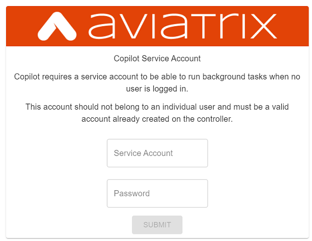

.. meta::
  :description: Aviatrix Getting Started
  :keywords: CoPilot,visibility

============================================================
Aviatrix CoPilot Deployment Guide
============================================================

Launch CoPilot
==================

Aviatrix CoPilot is available as an all-in-one virtual appliance that is hosted in a user's own IaaS cloud environment. 
It can be launched as an EC2 instance in AWS, a virtual machine in Azure, or a VM instance in GCP and OCI. Please make sure default configurations for resources settings that are recommended by marketplaces are applied during launch.
After successfully launching the instance, follow these steps to configure CoPilot instance parameters and launch. 
Please note that you will need an Aviatrix Controller to use CoPilot. CoPilot works in tandem with Aviatrix Controller. Aviatrix Controller and CoPilot are not required to be collocated. It is possible to run them in separate VPCs/VNets or separate cloud providers (in multi-cloud environments).

CoPilot Deployment Methods

============================

You can deploy Aviatrix CoPilot directly from any supported cloud service provider (CSP) marketplace, by using Terraform scripts, or by using the Aviatrix Controller user interface (available for AWS from Controller release 6.7). Deploying from the CSP marketplace takes only a few clicks to provision and launch the instance. Since you must subscribe to a CoPilot offer at a marketplace as a first step for all deployment methods, this method of deploying is commonly used right after subscribing (see "Subscribe to a CoPilot Offer"). If you are knowledgeable in deploying infrastructure-as-code using Terraform, you might find it convenient in some circumstances to launch CoPilot using a Terraform script (see "CoPilot instance launch using Terraform"). Lastly, starting from Aviatrix Controller release 6.7, you can deploy CoPilot from the controller UI. This method can be used if you deployed your controller in AWS and will deploy CoPilot in AWS also in the same region/AZ as the controller (see "CoPilot instance launch from the Controller UI)".

Instance Configuration Details
------------------------------

- Open your CoPilot security group for: 

  - TCP port 443 from anywhere user access (to reach CoPilot via HTTPS connection using web browser)

  - UDP port 5000 from all of your Aviatrix gateway IPs (gateways send Remote Syslog to CoPilot)

  - UDP port 31283 from all of your Aviatrix gateway IPs (gateways send Netflow to CoPilot)

.. tip::
  In Controller you can view the IP addresses of all your gateways from the Gateways page. 

Instance System Requirements
------------------------------
The configuration of the instance/virtual machine that you provision for your CoPilot deployment depends on the scale and the kind of networking infrastructure you have planned according to your business requirements. Work with your performance team to determine your sizing requirements.

- For the instance/VM size, CoPilot requires:

  - 4 GB of RAM (or more)

  - 1 attached disk/volume for storage (see `CoPilot Disk (Volume) Management <https://docs.aviatrix.com/HowTos/copilot_getting_started.html#id4>`_)

  - 2 vCPUs (or more)

CoPilot supports automatic memory sizing for the ETL and datastore based on the physical memory of the instance at boot. Base images default to the automatic settings. This auto-scaling memory support became available with the release of Aviatrix CoPilot image version 1.5.1.

CoPilot Customer IDs and Licensing
-----------------------------------

This section discusses Aviatrix CoPilot customer IDs and licensing.

**NOTE:** The CoPilot customer ID is separate from the Aviatrix Controller customer ID.

CoPilot is offered with a Bring Your Own License (BYOL) license model. If you are interested in a trial of CoPilot, contact us through the Aviatrix chat window of our doc website, or contact your Aviatrix Sales representative.

With a BYOL license model, you need to have a customer ID provided by Aviatrix to be able to use the product. Your Aviatrix Sales representative will provide you with a customer ID. Customer IDs for CoPilot use the prefix `avx-cplt-`.

When you perform the initial setup of CoPilot, you will be prompted to enter your customer ID and CoPilot will allocate a license to you based on your customer ID. You can view when the license will expire in the CoPilot Settings > Licensing page.

Each CoPilot instance consumes one license from your customer ID. When your customer ID expires, you can ask for a license extension from your Sales representative. In this case, you must reset your customer ID for the extension by navigating to CoPilot Settings > Licensing and clicking the **RESET** button. 

If you ever want to terminate your current instance of CoPilot and deploy a new instance using the same license associated with your customer ID, ensure you first release the CoPilot license of the current instance first by navigating to CoPilot Settings > Licensing and clicking the **RESET** button. After you deploy the new instance of CoPilot, you will be prompted to enter the customer ID during initial setup. Re-enter the same customer ID. 

Subscribe to a CoPilot Offer
============================

Subscribe to an Aviatrix CoPilot offer in a cloud provider marketplace and provision and launch your CoPilot instance.

For licensing and trials, CoPilot is offered with a BYOL model. Before subscribing to CoPilot in a cloud marketplace, obtain a license key for CoPilot by contacting your Aviatrix Sales representative. Since CoPilot works in tandem with Aviatrix Controller to provide visibility into your cloud resources managed by the controller, it is assumed that you already have a controller.

To subscribe to a CoPilot offer:

1.  Log in to the marketplace of your chosen cloud provider using your provider user account credentials. CoPilot is available in the marketplaces for:

    -   Amazon Web Services (AWS)
    -   Google Cloud Platform
    -   Microsoft Azure Marketplace
    -   Oracle Cloud Infrastructure (OCI)

2.  Locate the Aviatrix CoPilot software offer you want to subscribe to and click **Subscribe**.

    For information about Aviatrix CoPilot image versions, see `Aviatrix CoPilot Image Release Notes <https://docs.aviatrix.com/HowTos/copilot_release_notes_images.html>`_.

3.  When prompted, review the subscription pricing information and accept the terms and conditions. You may be prompted to confirm your subscription before moving on to configuration.

4.  Each marketplace will prompt you to configure and launch the CoPilot software. Apply the default configurations for resource settings that are recommmended by your chosen marketplace. For CoPilot instance configurations, you can accept the defaults or change them to suit your business needs. Note the following required CoPilot instance specifications:

    -   (Storage & Instance)

        When deploying the Aviatrix CoPilot 1.5.1 image release:

        -   For the minimum supported instance/VM size for CoPilot, see `Instance System Requirements <https://docs.aviatrix.com/HowTos/copilot_getting_started.html#instance-system-requirements>`_.
        -   You must attach at least one data disk (data volume) to your CoPilot instance to be used for expandable storage; this is a secondary data storage separate from the root disk that comes with CoPilot. For more information, see `CoPilot Disk (Volume) Management <https://docs.aviatrix.com/HowTos/copilot_getting_started.html#id4>`_. Create your disk (volume) and attach the disk (volume) to your CoPilot instance. You can choose the disk type (volume type) that meets your business needs given the size of your environment and performance requirements. There is no minimum requirement for the storage you add at this stage.

        When deploying Pre-1.5.1 image releases:

        -   For machine/instance/VM type, CoPilot requires a minimum of 8 vCPUs and 32 GB Memory.
        -   CoPilot requires 2 TB of storage (SSD recommended).

    -   CoPilot requires a static public IP address (for example, an Elastic IP address in AWS)
    -   Copilot requires the following service ports:

        -   TCP port 443 for Web UI (to reach CoPilot public IP via HTTPS using your web browser)
        -   UDP port 31283 for CoPilot FlowIQ data (port is configurable)
        -   UDP port 5000 for CoPilot Security audit data (Remote Syslog Service)
        
5.  In your cloud console, in the security group page of your CoPilot VM/instance, add entries FOR EACH of your Aviatrix gateways:

    -   For the UDP ports, change the default inbound rule of 0.0.0.0/0 to the IP addresses of your Aviatrix gateways: 
          -   Open your CoPilot Security Group for UDP 31283 from all of your Aviatrix Gateways.
          -   Open your CoPilot Security Group for UDP 5000 from all of your Aviatrix Gateways.
          -   For port 443, you can allow only your and other trusted user's IP addresses.
    .. note::
        Each time you launch a new gateway from your controller, you must also add a CIDR entry for it here. 
       
6.  After specifying all values for the marketplace configuration prompts, deploy/launch the CoPilot instance/virtual machine.

    For example, in AWS, you select the region and click **Continue to Launch**.

    You should receive a message from the cloud provider stating that the instance of CoPilot software is launched/deployed.

7.  Assign a static public IP address to the CoPilot software instance/virtual machine. For example, in the AWS EC2 console, you would go to the Elastic IP section, allocate a new EIP, and then associate it with your CoPilot instance.

    Take note of the IP address to use later during initial setup.

8.  Start the CoPilot instance/virtual machine.

    For example, in the AWS EC2 Dashboard, check the instance checkbox and from the Actions menu, choose Start Instance.

    You are now ready to launch CoPilot in a web browser or from the Aviatrix Controller homepage and perform initial setup.

Initial Setup of CoPilot
========================

Perform initial setup of CoPilot after you have launched the instance/virtual machine in the cloud provider environment.

For initial setup of CoPilot, have the following information available:

-   The static public IP address of your recently deployed CoPilot software instance/virtual machine (obtained from the cloud provider portal).
-   The static IP address for your Aviatrix Controller.
-   The login credentials of your Aviatrix Controller user account.
-   The login credentials for the user account to be used as the CoPilot service account. If you plan to use the ThreatGuard feature, the CoPilot service account must have a minimum of `all_firewall_write` permissions.
-   The CoPilot license key (obtained from your Aviatrix representative).

This procedure assumes your Aviatrix Controller is up and running and the controller instance's inbound rules have port 443 open to the public static IP address of the CoPilot instance (so that CoPilot can reach your controller). Your CoPilot software instance/virtual machine must also be up and running.

To perform an initial setup of CoPilot:

1.  Launch CoPilot in your web browser:

    `https://<copilot static ip address>/`

    where `<copilot static ip address>` is the static IP address of your newly deployed CoPilot software instance/virtual machine.

    Alternatively, you can launch CoPilot from Aviatrix Controller as described in the next step.

2.  (Optional) Launch CoPilot from Aviatrix Controller:

    a.  In Aviatrix Controller, under Settings, select CoPilot.

    b.  For the CoPilot Association, set the status to **Enabled** and enter the static IP address for your running CoPilot instance.

    c.  From the controller homepage, click the CoPilot button in the action bar.

3.  When prompted, enter the username and password of a valid Aviatrix Controller user account and click Login. Enter the static IP address of your controller and click Login.

    |copilot_login_user_account|

4.  When prompted for a **CoPilot Service Account**, enter the login credentials for a valid user account in Aviatrix Controller to be used as the CoPilot service account.

    See `About CoPilot User Accounts <https://docs.aviatrix.com/HowTos/copilot_getting_started.html#about-copilot-user-accounts>`_. 

    |copilot_login_service_account|

5.  When prompted for **CoPilot Customer ID**, enter your CoPilot license key.

    |copilot_login_customer_id|

    **TIP:** Later, if you decide to terminate your instance of CoPilot and deploy a new instance using the same license key, release the license of the current instance first by clicking **RESET** in Settings > Licensing.

6.  If a Data Disk Setup dialog does not appear, skip to step 8 to verify connectivity with your controller.

7.  In Data Disk Setup, select the disk/volume you created for CoPilot storage and click START. When the process is complete, click FINISH.

    Note that when you launch CoPilot at first your version number will be based on the version of the image release. Within an hour, the CoPilot version will be updated to the latest software release.

8.  (Verify connectivity with your controller) To verify Copilot has connected successfully to your controller, from the CoPilot dashboard, confirm that you can see the inventory of all resources across all clouds in your multi-cloud network that are managed by Aviatrix Controller. Confirm that the inventory tiles show the number and status of each of your managed resources and the global location of your managed VPCs/VPNs/VNETs are represented on the geographic map.

9.  (For FlowIQ feature) To use the FlowIQ feature in CoPilot, ensure that the controller is configured to forward NetFlow logs to CoPilot.

    a.  Log in to Aviatrix Controller.

    b.  Go to Settings -> Logging -> NetFlow Agent.

    c.  Use the static IP address of CoPilot as the Netflow server IP and UDP port 31283 (default, port is configurable).

    d.  Use version 9.

    e.  Tick the Advanced check box. In Gateways, verify all of your Aviatrix gateways are in the Include List.

    .. note::
        If you launch new gateways from your controller later, you must transfer the newly launched gateways to the Include List here. In addition, in your native cloud console, you must open your CoPilot security group for UDP 31283 from each newly launched gateway.  

    f.  Click **Enable**.

    You should start seeing NetFlow in CoPilot after a few minutes.

10. (For Security audit page feature) Remote syslog index 9 is used for the CoPilot > Security audit page. Ensure the controller is configured to specify CoPilot as the loghost server.

    a.  Log in to Aviatrix Controller.

    b.  Go to Settings -> Logging -> Remote Syslog.

    c.  Choose Profile Index 9.

    d.  In Enable Remote Syslog, enter the profile name you want to use, the static IP address of CoPilot as the server, and UDP port 5000 (default).

    e.  Tick the Advanced check box. In Gateways, verify all of your Aviatrix gateways are in the Include List.

    .. note::
        If you launch new gateways from your controller later, you must transfer the newly launched gateways to the Include List here. In addition, in your native cloud console, you must open your CoPilot security group for UDP 5000 from each newly launched gateway.  

    f.  Click **Enable**.

About CoPilot User Accounts
=============================================

This section describes user accounts for CoPilot and permissions required for some features.

You can use any valid user account defined on the controller to log in to CoPilot.

During initial setup of CoPilot, you specify a user account defined on the controller to be used as the CoPilot service account. The CoPilot service account is used to run CoPilot services, such as alerts, topology replay, and ThreatGuard (without any user logged in). If you plan to use the ThreatGuard feature, the CoPilot service account must have a minimum of `all_firewall_write` permissions.

For a user to enable ThreatGuard alerts or ThreatGuard blocking in CoPilot, they must log in to CoPilot with a user account that has `all_write` or `all_security_write` permissions.

Users who will not enable ThreatGuard alerts or blocking can log in to CoPilot with an account that has `read_only` permissions and use all of its other features.

Users should be granted only the permissions needed to perform their work. Review user privileges on a routine basis to confirm they are appropriate for current work tasks.

Configure Controller's access for CoPilot
=============================================

- Assign a static public IP address to CoPilot. For example, in EC2 console, you go to the Elastic IP section and assign an EIP to the CoPilot instance. 

- On Controller security groups, ensure 443 is open to the public IP of the CoPilot instance.

- Configure a dedicated user account on Aviatrix Controller for CoPilot if desired. 

- You should now be able to log in to CoPilot with the credentials we configured above.

.. note::
  If you are using RBAC, as of 1.1.5 CoPilot requires read-only access + access to ping and traceroute functions for diagnostic capabilities.

Enable Syslog for CoPilot Security Audit Data
==============================================

To use audit data of the Security feature in CoPilot, configure syslog to be sent to CoPilot: 

1.  Log in to Aviatrix Controller.

2.  Go to Settings -> Logging -> Remote Syslog.

3.  Choose Profile Index 9.

4.  In Enable Remote Syslog, enter the profile name you want to use, the static IP address of CoPilot as the server, and UDP port 5000 (default).

5.  Tick the Advanced check box. In Gateways, verify all of your Aviatrix gateways are in the Include List.

    .. note::
        If you launch new gateways from your controller later, you must transfer the newly launched gateways to the Include List also. In addition, in your native cloud console, you must open your CoPilot security group for UDP 5000 from each newly launched gateway. 

6.  Click **Enable**.

Enable Netflow for CoPilot FlowIQ Data
=======================================

To use the FlowIQ feature in CoPilot, ensure that the controller is configured to forward NetFlow logs to CoPilot: 

1.  Log in to Aviatrix Controller.

2.  Go to Settings -> Logging -> NetFlow Agent.

3.  Use the static IP address of CoPilot as the Netflow server IP and UDP port 31283 (default, port is configurable).

4.  Use version 9.

5.  Tick the Advanced check box. In Gateways, verify all of your Aviatrix gateways are in the Include List.

    .. note::
        If you launch new gateways from your controller later, you must transfer the newly launched gateways to the Include List also. In addition, in your native cloud console, you must open your CoPilot security group for UDP 31283 from each newly launched gateway. 

6.  Click **Enable**.

    You should start seeing NetFlow in CoPilot after a few minutes.

CoPilot Disk (Volume) Management 
================================

Allocate data disks (volumes) to your Aviatrix CoPilot deployment to be used for expandable storage.

When you initially provision CoPilot (from your cloud service provider), you must add a disk (volume) to be used for CoPilot storage. You are required to add at least one disk (volume) that is an additional disk (on the side) from the 25GB root disk that already comes with CoPilot. You create the data disk (volume) in your CSP account and attach it to your CoPilot instance. During instance provisioning, there is no minimum requirement for the disk/volume you add. You can choose the disk type (volume type) you want. You will be able to add more storage after deployment.

When you newly launch the CoPilot instance, the initial setup process automatically detects the disk/volume you attached during instance provisioning. An add-disk process prompts you to confirm the disk/volume to use and then formats and attaches your disk(s). A logical disk/volume is created from all physical disks (volumes) you added during provisioning. For example, if you launch Copilot and you added two physical disks that are 8G each, CoPilot will form a 16G volume.

The storage you need for CoPilot can increase based on several factors including the number of Aviatrix gateways launched and the type and volume of traffic in your network. When you need more storage, you can add additional disks (volumes) by using the CoPilot > Settings > Resources page (Add Additional Disks). For instructions, see `Add a Disk (Volume) for CoPilot Storage after Deployment <https://docs.aviatrix.com/HowTos/copilot_getting_started.html#id5>`_.

After you allocate new disks (volumes), you can only increase storage (you cannot decrease storage).

For data disks you already allocated to your CoPilot deployment, you can increase their size. For instructions, see Expand a Disk (Volume) for CoPilot Storage.

Disk (volume) management for expandable storage became available with the release of Aviatrix CoPilot image version 1.5.1. Prior to CoPilot image version 1.5.1, images had a static disk of 2 TB.

Add a Disk (Volume) for CoPilot Storage after Deployment
========================================================

Add a data disk (volume) to your Aviatrix CoPilot deployment to be used for expandable storage. For information about expandable storage, see `CoPilot Disk (Volume) Management <https://docs.aviatrix.com/HowTos/copilot_getting_started.html#id4>`_.

This procedure assumes you have a running CoPilot and want to add more storage (add a data disk/volume) above and beyond the storage you added when you first provisioned the CoPilot instance (from your CSP).

To add a data disk (volume) for CoPilot expandable storage after deployment:

1.  Log in to your CSP account and create the disk (volume) you want to add. Choose the disk type (volume type) that meets your business needs given the size of your environment and performance requirements.

2.  Attach the disk (volume) to your CoPilot instance. Do *not* reboot the instance (a disk can be dynamically added to an instance on any CSP without rebooting).

3.  After you receive confirmation from the CSP that the disk is attached, log in to CoPilot.

4.  Go to CoPilot > Settings > Resources and click Add Additional Disk. If you do not see the disk (volume) you created in the list, press the refresh icon.

5.  Select the disk/volume you created and click START.

6.  When the process is complete, click FINISH.

Expand a Disk (Volume) for CoPilot Storage
==========================================

For data disks you already allocated to your CoPilot deployment, increase their size.

To expand a disk (volume) that is allocated to your CoPilot deployment:

1.  Log in to your CSP account and locate the disk (volume) attached to your CoPilot instance that you want to expand for CoPilot storage.

2.  Increase the size of the disk (volume).

3.  After you receive confirmation from the CSP that the disk is resized, log in to CoPilot.

4.  Go to CoPilot > Settings > Resources.

5.  In the Disk Usage table, expand the tree-pane icon (shown) for the physical volume associated with your resized data disk.

    |tree_pane_icon_disk_usage_table|

6.  Click the enabled RESIZE button. CoPilot resizes the physical volume to match the size of your expanded disk.

CoPilot Auto-Scaling Memory Support  
===================================

CoPilot supports automatic memory sizing for the ETL and datastore based on the physical memory of the instance at boot. Base images default to the automatic settings. 

Auto-scaling memory support became available with the release of Aviatrix CoPilot image version 1.5.1. Prior to CoPilot image version 1.5.1, CoPilot required a minimum of 8 vCPUs and 32 GB Memory. Existing deployments will keep their current configuration unless updated. Memory settings are located under Settings > Configuration > Options.

System Design Considerations 
==================================

- For production, it is best practice to inspect your gateways sizing and load prior to enabling flow logging. 
- You have the option of selecting which gateways generate flows should you want to enable visibility in subsections of the network (configured in the controller).

Example - Deploy CoPilot in Microsoft Azure
===========================================

To deploy CoPilot in Azure:

1.  Log in to your Azure account with your Azure account credentials so that you enter your Azure Portal (portal.azure.com).

2.  Go to the Azure Marketplace at https://azuremarketplace.microsoft.com, and in the search field, search for "Aviatrix CoPilot".

3.  For the **Aviatrix CoPilot** Bring your own license offer, click **Get it now**.

    |cplt_azr_get_now|

4.  If prompted, enter the email address you use for acquiring apps on Azure Marketplace.

    |cplt_azr_email|

5.  In the "Create this app in Azure" dialog, click **Continue**.

    |cplt_azr_create_app|

6.  In the Aviatrix CoPilot page, click the blue **Create** button. If you want to view Azure recommended size choices, click "Start with a pre-set configuration". Do not choose the "Deploy programmatically" option.

    |cplt_azr_create|

7.  In Create a virtual machine, complete the provisioning steps for the Basics section by specifying the subscription, resource group, VM name, and size values and other values as needed for the Project details, Instance details, and Administrator account details sections. Click **Next: Disks**.

8.  You must attach at least one data disk to your CoPilot VM to be used for expandable storage. This is in addition to the 25GB root disk that comes with CoPilot. Click **Create and attach a new disk** or **Attach an existing disk** to add and attach an additional disk.

    |cplt_azr_attach_disk|

9.  Specify the disk options you want or click **OK** to accept the default disk options.

10. Click **Next: Networking** and specify the network interface details. For Public IP, click **Create new**. In the Create public IP address dialog, for Assignment, select Static and click **OK**.

11. Complete the rest of the provisioning steps for the Management, Advanced, and Tags sections. 

12. Click **Next: Review + create**. If blank, type your phone number in the Preferred phone number field. If the validation passed, review your settings and click **Create**.

    Verify that your instance is up and running in the Azure console.

13. After the instance is created, and you receive a message that your deployment is complete, click on **Go to resource**. Select the copilot instance name and take note of its External IP address.

14. You are ready to launch CoPilot in your web browser and perform initial setup. See `Initial Setup of CoPilot <https://docs.aviatrix.com/HowTos/copilot_getting_started.html#initial-setup-of-copilot>`_.

Example - Deploy CoPilot in Google Cloud Platform
=================================================

- Go to GCP marketplace.

- Find the product "Aviatrix CoPilot - BYOL".

- Click the button "LAUNCH".

|gcp_copilot_1|

If deploying the Aviatrix CoPilot 1.5.1 image release:

- For the minimum supported instance/VM size for CoPilot, see `Instance System Requirements <https://docs.aviatrix.com/HowTos/copilot_getting_started.html#instance-system-requirements>`_.

- You must attach at least one data disk (data volume) to your CoPilot instance to be used for expandable storage; this is a secondary data storage separate from the root disk that comes with CoPilot. For more information, see `CoPilot Disk (Volume) Management <https://docs.aviatrix.com/HowTos/copilot_getting_started.html#id4>`_. Create your disk (volume) and attach the disk (volume) to your CoPilot instance. You can choose the disk type (volume type) that meets your business needs given the size of your environment and performance requirements. There is no minimum requirement for the storage you add at this stage.

If deploying Pre-1.5.1 image releases:

- Make sure the selected Machine type has at least 8 vCPUs with 32 GB memory.

- Boot Disk is SSD Persistent Disk with 2000 GB.

|gcp_copilot_2|

- 443 from anywhere user access (User Interface).

- UDP port 31283 from specific gateway IPs (remove 0.0.0.0/0).

- UDP port 5000 from specific gateway IPs (remove 0.0.0.0/0).

|gcp_copilot_3|

- Click the button "Deploy".

CoPilot instance launch using Controller UI (AWS Only)
======================================================

This feature is available starting from Aviatrix Controller release 6.7. If you deployed Aviatrix Controller in AWS and you want to deploy Aviatrix CoPilot in AWS in the same region/AZ as the controller, you can deploy CoPilot directly from the controller UI by following these instructions. 

The instance will be launched in the same AWS region/availability zone as your controller. If you want to deploy CoPilot in a different AWS region/availability zone or in a different cloud, follow the instructions in "Subscribe to a CoPilot Offer" to perform the CoPilot instance launch from your cloud provider marketplace.

Your controller instance must have the `aviatrix-role-ec2` IAM role attached for the deployment to succeed. 

After you deploy a CoPilot instance from your controller, if you decide to terminate the instance, you must terminate it from the AWS environment.

Obtain the following information before you begin. You will need it for the initial setup of CoPilot after instance launch:

-   The login credentials of your Aviatrix Controller user account.
-   The login credentials for the user account to be used as the CoPilot service account. See "About CoPilot User Accounts".
-   The CoPilot customer ID obtained from your Aviatrix Sales representative.
-   Verify that your AWS account has been created in your controller (you create your AWS account by navigating to Controller > Account > Access Accounts > +Add New).

To deploy CoPilot from the controller UI (AWS Only):

1.  If you haven't already done so, subscribe to a CoPilot offer:

    a.  Log in to your account at the Amaazon Web Services (AWS) Marketplace. If your company has multiple AWS accounts, be sure to log in to the same AWS account that you registered (onboarded) in your controller.

    b.  Locate the Aviatrix CoPilot software offer you want to subscribe to and click **Subscribe**.

    c.  When prompted, review the subscription pricing information and accept the terms and conditions.

        You only need to subscribe, review the subscription pricing information, and accept the terms and conditions in the marketplace before proceeding to the next step. You would not move on to the configuration steps in the marketplace.

2.  In Aviatrix Controller, do one of the following to begin the deployment process:

    -   From the onboarding page, click the Aviatrix CoPilot tile.
    -   From the action bar, click the app icon and select **Deploy CoPilot**.
3.  In the Deploy CoPilot dialog, do one of the following to provision your CoPilot instance:

    -   To deploy CoPilot with the AWS recommended instance configuration, click **Deploy**

        The recommended is:
       
        VM Size: t2large
        Data Volume(GB): 100
        
        The configuration of the instance/virtual machine that you provision for your CoPilot deployment depends on the scale and the kind of networking infrastructure you have planned according to your business requirements. Work with your performance team to determine your sizing requirements. You can add more storage later. See "CoPilot Disk (Volume) Management" in *Aviatrix CoPilot Deployment Guide*.

    -   To specify a custom instance configuration, tick the **Customize Configuration** check box, select the instance size you want, and then click **Deploy**.

4.  Wait until the deployment progress indicator reads **Complete** and then click **Close**.

    **TIP**: During the deployment process, the background task dialog and Deploy CoPilot status dialog show the details of your CoPilot instance including the instance size, VPC name, region, and associated AWS account number. You can copy the information from the task or status dialog to take note of it.

5.  **Wait for approximately 15 minutes.** It takes about fifteen minutes for the CoPilot application to initialize and upgrade.

6.  From the controller action bar, click the app icon and select **CoPilot**.

7.  When prompted, enter the login and password of your Aviatrix Controller user account.

8.  When prompted for a **CoPilot Service Account**, enter the login credentials of the user account you created previously on the controller to be the service account.

9.  When prompted, enter your **CoPilot customer ID**.

    This is the customer ID obtained from your Aviatrix Sales representative. Note that the CoPilot customer ID is separate from the Aviatrix Controller customer ID.

10. When prompted to add a data disk, select the disk/volume to be used for CoPilot storage and click **START**.

11. After the data disk setup completes, click **Finish**.

    CoPilot opens to the Dashboard page.

12. (Verify connectivity with your controller) You are now successfully logged into CoPilot. To verify Copilot has connected successfully to your controller, from the CoPilot dashboard, confirm that you can see your resource inventory across all clouds in your multi-cloud network that is managed by Aviatrix Controller. Confirm that the inventory tiles show the number and status of each of your managed resources and the global location of your managed VPCs/VNets are represented on the geographic map.

13. After deployment, the CoPilot virtual machine ports 31283 and 5000 will be open for any IP (0.0.0.0/0). It is strongly recommended to remove the 0.0.0.0 entry from the CoPilot security group for these ports and add entries for all of your gateway IP addresses as described in the next steps.

14. (For FlowIQ feature) To use the FlowIQ feature in CoPilot, ensure that the controller is configured to forward NetFlow logs to CoPilot.

    a.  Log in to Aviatrix Controller.

    b.  Go to Settings -> Logging -> NetFlow Agent.

    c.  Use the static IP address of CoPilot as the Netflow server IP and UDP port 31283 (default, port is configurable).

    d.  Use version 9.

    e.  Tick the Advanced check box. In Gateways, verify all of your Aviatrix gateways are in the Include List.

    f.  Click **Enable**.

        Note that if you launch new gateways from your controller later, you must transfer the newly launched gateways to the Include List here. In addition, in your native cloud console, you must open your CoPilot security group for UDP 31283 from each newly launched gateway.

15. (For Security audit page feature) Remote syslog index 9 is used for the CoPilot > Security audit page. Ensure the controller is configured to specify CoPilot as the loghost server.

    a.  Log in to Aviatrix Controller.

    b.  Go to Settings -> Logging -> Remote Syslog.

    c.  Choose Profile Index 9.

    d.  In Enable Remote Syslog, enter the profile name you want to use, the static IP address of CoPilot as the server, and UDP port 5000 (default).

    e.  Tick the Advanced check box. In Gateways, verify all of your Aviatrix gateways are in the Include List.

    f.  Click **Enable**.

        Note that if you launch new gateways from your controller later, you must transfer the newly launched gateways to the Include List here. In addition, in your native cloud console, you must open your CoPilot security group for UDP 5000 from each newly launched gateway.

(Terraform) CoPilot instance launch using Terraform
==================================================== 

This section provides a summary of steps for launching an Aviatrix CoPilot instance using Terraform.

You can deploy Aviatrix CoPilot from the marketplace of any cloud service provider (CSP) that Aviatrix supports. The provisioning of the instance and instance launch via the CSP marketplace only takes a few steps as described in the topic "Subscribing to a CoPilot Offer". 

If you are knowledgeable in deploying infrastructure-as-code using Terraform, you may prefer or find it more convenient in some circumstances to launch the CoPilot VM/instance using a Terraform script rather than via the CSP marketplace. The instance launched using Terraform is the latest release version of CoPilot based on Aviatrix CoPilot image version 1.5.1.

Below is a summary of steps for a CoPilot instance launch via Terraform:

1.  If you haven't already done so, subscribe to a CoPilot offer in the CSP marketplace. See "Subscribe to a CoPilot Offer".

    You only need to subscribe, review the subscription pricing information, and accept the terms and conditions in the marketplace before proceeding to the next step. You would not move on to the configuration steps in the marketplace.

2.  Verify you have your CSP account credentials and you know which CSP region in which to launch CoPilot.

3.  Go to the Aviatrix repository GitHub - AviatrixSystems/terraform-modules-copilot (https://github.com/AviatrixSystems/terraform-modules-copilot) to access the sample code in the README file for the applicable CSP. The README file contains the variables that can be set for the CoPilot instance launch.

4.  In the folder where you put your Terraform scripts based on the sample code, create a `.tf`file to provide your CSP account credentials (for example, provider block below). You can name the `.tf`file whatever you want.

    **Important:** Ensure your CSP account credentials are always in a secure location.

5.  The following is an example of the format to enter your CSP account credentials. You can refer to your CSP Terraform Registry to verify the latest information that is required.

    Example of the format to enter your CSP account credentials ::
                
      AZURE
      
      provider "azurerm" {
      features {}
      
      subscription_id = ""
      client_id    = ""
      client_secret  = ""
      tenant_id    = ""
      }
      
      Refer to Terraform Registry for the latest information.
      
      GCP
      
      provider "google" {
      project = ""
      region = ""
      zone  = ""
      }
      
      Refer to Terraform Registry for the latest information.
      
      OCI
      
      provider "oci" {
      tenancy_ocid   = ""
      user_ocid    = ""
      fingerprint   = ""
      private_key_path = ""
      region      = ""
      }
      
      Refer to Terraform Registry for the latest information.
      
      AWS
      
      provider "aws" {
      region   = ""
      access_key = ""
      secret_key = ""
      }
      
      Refer to Terraform Registry  for the latest information.
       

6.  Ensure that you set the variable for the region in which to launch the instance in the provider block.

7.  Specify at least 1 data disk (volume) for Terraform to attach to your CoPilot instance for data storage. 

    For information about CoPilot storage, see "CoPilot Disk (Volume) Management".
    
    The following is sample code for building a single CoPilot instance. The variable default_data_volume_name is required to create the data volume ::
      
      module "copilot_build_aws" {
        source = "github.com/AviatrixSystems/terraform-modules-copilot.git//copilot_build_aws"
        
        allowed_cidrs = {
          "tcp_cidrs" = {
            protocol = "tcp"
            port = "443"
            cidrs = [“1.2.3.4/32"]
          }
          "udp_cidrs_1" = {
            protocol = "udp"
            port = "5000"
            cidrs = ["0.0.0.0/0"]
          }
          "udp_cidrs_2" = {
            protocol = "udp"
            port = "31283"
            cidrs = ["0.0.0.0/0"]
          }
        }
        
        keypair = "copilot_kp"
        
        default_data_volume_name = "/dev/sdf"
      }

8.  Run terraform (terraform apply).

    The CoPilot instance is launched in the CSP as defined by the script's source field. If you do not specify an availability zone (using the variable ``availability_zone``), an AZ that supports the instance type will be used. The AZ that is used will be listed in the output ``ec2-info``.

    The instance launched is the latest release version of CoPilot based on Aviatrix CoPilot image version 1.5.1.

9.  Wait to receive a success image message.

10. Launch the CoPilot application in your web browser:

    https://`copilot static ip address`/

    where `copilot static ip address` is the static IP address of your newly deployed CoPilot software instance/virtual machine.

11. Perform the initial setup of CoPilot.

    See `Initial Setup of CoPilot <https://docs.aviatrix.com/HowTos/copilot_getting_started.html#initial-setup-of-copilot>`_.

12. (Verify connectivity with your controller) You are now successfully logged into CoPilot. To verify Copilot has connected successfully to your controller, from the CoPilot dashboard, confirm that you can see your resource inventory across all clouds in your multi-cloud network that is managed by Aviatrix Controller. Confirm that the inventory tiles show the number and status of each of your managed resources and the global location of your managed VPCs/VNets are represented on the geographic map.

13. After deployment, the CoPilot virtual machine ports 31283 and 5000 will be open for any IP (0.0.0.0/0). It is strongly recommended to remove the 0.0.0.0 entry from the CoPilot security group for these ports and add entries for all of your gateway IP addresses as described in the next steps.

14. (For FlowIQ feature) To use the FlowIQ feature in CoPilot, ensure that the controller is configured to forward NetFlow logs to CoPilot.

    1.  Log in to Aviatrix Controller.

    2.  Go to Settings -> Logging -> NetFlow Agent.

    3.  Use the static IP address of CoPilot as the Netflow server IP and UDP port 31283 (default, port is configurable).

    4.  Use version 9.

    5.  Tick the Advanced check box. In Gateways, verify all of your Aviatrix gateways are in the Include List.

    6.  Click Enable.

        Note that if you launch new gateways from your controller later, you must transfer the newly launched gateways to the Include List here. In addition, in your native cloud console, you must open your CoPilot security group for UDP 31283 from each newly launched gateway.

15. (For Security audit page feature) Remote syslog index 9 is used for the CoPilot > Security audit page. Ensure the controller is configured to specify CoPilot as the loghost server.

    1.  Log in to Aviatrix Controller.

    2.  Go to Settings -> Logging -> Remote Syslog.

    3.  Choose Profile Index 9.

    4.  In Enable Remote Syslog, enter the profile name you want to use, the static IP address of CoPilot as the server, and UDP port 5000 (default).

    5.  Tick the Advanced check box. In Gateways, verify all of your Aviatrix gateways are in the Include List.

    6.  Click Enable.

        Note that if you launch new gateways from your controller later, you must transfer the newly launched gateways to the Include List here. In addition, in your native cloud console, you must open your CoPilot security group for UDP 5000 from each newly launched gateway.

.. |gcp_copilot_1| image:: copilot_getting_started_media/gcp_copilot_1.png
   :scale: 50%
   

   
.. |gcp_copilot_3| image:: copilot_getting_started_media/gcp_copilot_3.png
   :scale: 50%

.. |copilot_login_user_account| image:: copilot_getting_started_media/copilot_login_user_account.png
   :scale: 70%

.. |cplt_azr_attach_disk| image:: copilot_getting_started_media/cplt_azr_attach_disk.png
   :scale: 70%

.. |cplt_azr_create_app| image:: copilot_getting_started_media/cplt_azr_create_app.png
   :scale: 70%

.. |cplt_azr_email| image:: copilot_getting_started_media/cplt_azr_email.png
   :scale: 70%

.. disqus::
