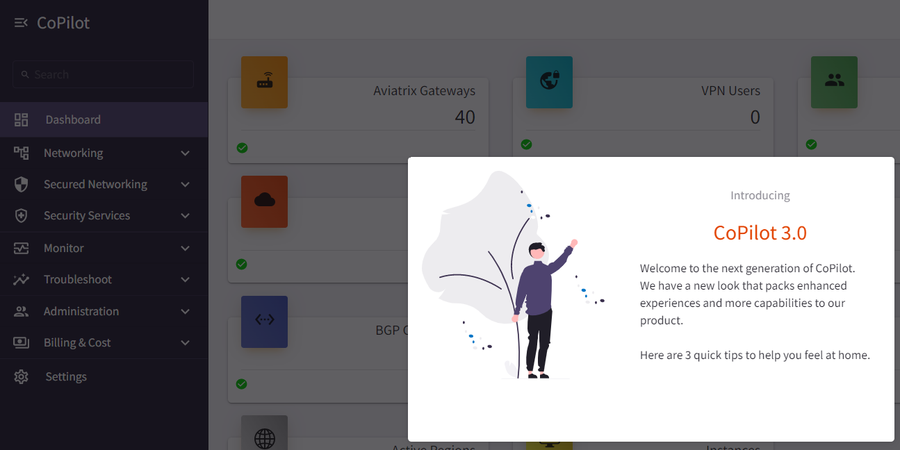
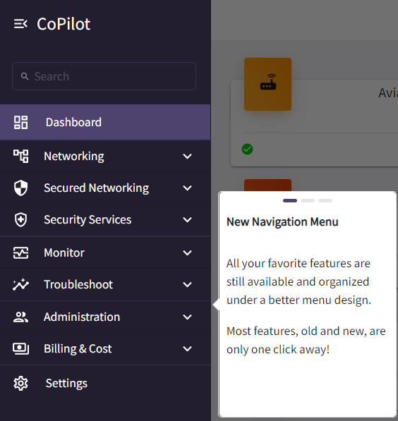
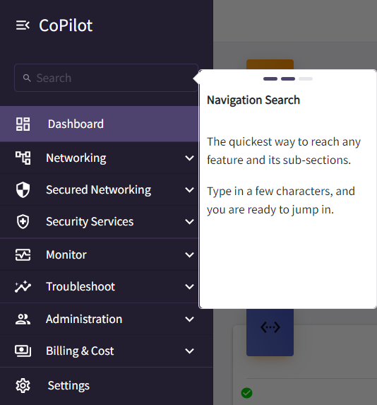
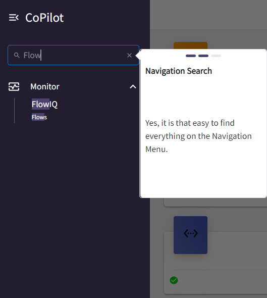
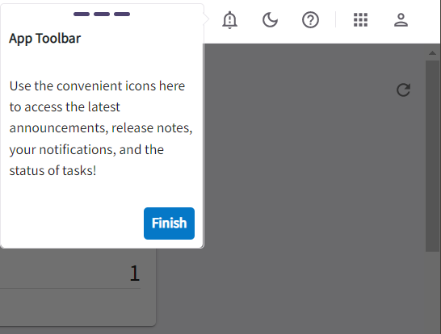

.. meta::
  :description: Aviatrix CoPilot Release Notes
  :keywords: CoPilot,visibility, monitoring, performance, operations

============================================================
Aviatrix CoPilot Release Notes
============================================================

This section describes new features and enhancements for Aviatrix CoPilot software releases.

For information about Aviatrix CoPilot image releases, see `Aviatrix CoPilot Image Release Notes <https://docs.aviatrix.com/HowTos/copilot_release_notes_images.html>`_.

Public Preview Features 
-------------------------

Aviatrix releases features in public preview mode to offer you the opportunity to experiment with concepts and features that may develop into official product offerings. Your valuable feedback helps shape and improve the experience for everyone.

- Features in public preview mode are fully tested and safe for deployment in production environments.
- Public preview mode feature options, performance, and scalability may be limited compared to the final feature.
- Aviatrix does not charge for using features in public preview mode. You could be charged if the public preview feature is promoted to an officially supported feature. 
- If a feature in public preview mode is promoted to an officially supported product it will be announced in the product release notes.
- Public preview mode features are clearly marked in the UI.

Private Preview Features
-------------------------

Aviatrix releases features in private preview mode to offer you the opportunity to experiment with concepts and features that may develop into official product offerings. Your valuable feedback helps shape and improve the experience for everyone.

- Features in private preview mode should not be deployed in production environments.
- Features in private preview mode may have undergone limited testing.
- Support for features in private preview mode may be limited and handled with low priority.  
- Aviatrix does not charge for using features in private preview mode. You could be charged if the private preview feature is promoted to an officially supported feature. 
- If a feature in private preview mode is promoted to an officially supported product it will be announced in the product release notes.
- Private preview mode features are clearly marked in the UI but are disabled by default. If you wish to enable a private preview mode feature, please contact your sales representative.

CoPilot and Controller Interoperability
----------------------------------------

CoPilot is deployed as an all-in-one virtual appliance and is available on multiple clouds including AWS, Azure, GCP, and OCI MarketPlaces. CoPilot works in tandem with Aviatrix Controller; in order to use CoPilot, you must have an operational Aviatrix Controller. CoPilot works with all Controller versions that are not End of Life (EOL). If you need information about `Aviatrix End of Engineering and End of Life (Support) policies <https://support.aviatrix.com/Aviatrix-EOL-Policy>`_ or how to plan and update to the latest software, please contact Aviatrix Support.

CoPilot Release 3.0.1 (10/04/2022)
---------------------------------------------

(Note: The following releases were built for internal use only: 2.6.0, 2.7.0, 3.0.0)

**Feature Enhancements in CoPilot release 3.0.1**

- **Improved UI Experience** with updated color scheme and layout for a streamlined, simplified, and consistent design. Consistent formats for tables and search/filter controls across user interface. Improved dark mode. 

  |tip_walk| 

- **New navigation menu and menu search** offers improved organization of functional areas. Search on menu names or key words related to pages and views you want to access.

  |tip_walk_1| |tip_walk_2|

  |tip_walk_3|

- **UI Walkthrough** upon initial login provides tips for what's new.

  |tip_walk_4|

- **CostIQ Shared Services** offers visibility into shared services used by cost centers for billback purposes. Shows which teams are creating the most traffic to your shared services. CostIQ is available as a public preview feature in CoPilot Release 3.0.0. See `Public Preview Features`_. For information about enabling and using the CostIQ feature, see `Aviatrix CoPilot User Reference Guide <https://docs.aviatrix.com/HowTos/copilot_reference_guide.html>`_. CoPilot Home > Billing & Cost > CostIQ.

  |cost-overview| |cost-centers|

  |cost-shared-services|

- **Aviatrix Billing Page** offers visibility into costs of your Aviatrix Controller and gateways. You can review your account's Total Cost and review costs by CSP (Cloud Service Provider), region, group of Cloud Accounts, and individual Cloud Account. For information about the Aviatrix Billing page, see `Aviatrix CoPilot User Reference Guide <https://docs.aviatrix.com/HowTos/copilot_reference_guide.html>`_. CoPilot Home > Monitor > FlowIQ.

- **New Topology Experience** with improved topology map that displays large network topologies. Streamlined and simplified map design. Use the toggle switch to switch to Topology Experience V1. Some functions have not migrated to V2 such as gateway diagnostics (note you can run gateway diagnostics from the Cloud Routes page also). CoPilot Home > Networking > Topology.

  |topology_v2| |topology_map_v2| 

- **New FlowIQ Experience** with updated UI design for Geolocation page, visualization of source and destination flows (Sankey chart), and other views. Updated FlowIQ overview page with more capabilities for viewing flow details. CoPilot Home > Monitor > FlowIQ.

- **Disk Utilization UI in Settings** shows the number of days/weeks before the current data disk usage is expected to reach the free space threshold. Provides recommendations for what disk size would meet data retention needs based on existing disk usage. Set data retention policies for CoPilot data. CoPilot Home > Settings > Disk Utilization.

  |disk_util_1| |disk_util_2|

- **CoPilot licensing unified with Controller** — A separate license for CoPilot is no longer required. The Aviatrix Controller license covers the use of CoPilot. The CoPilot licensing page now displays the Aviatrix Controller license details. CoPilot Home > Settings > Licensing.

- **Performance Improvements** for Alerts (Notifications) and database lookup tasks that run behind the scenes.

- **CoPilot Feature Enablement** SKU workflows for application administrators to enable and disable CoPilot features. CoPilot Home > Settings > Licensing.

- **Security updates**

CoPilot Release 2.5.4 (9/23/2022)
---------------------------------------------

-   Performance improvements

CoPilot Release 2.5.3 (9/16/2022)
---------------------------------------------

-   Performance improvements to AppIQ and Dashboard.

**Feature Enhancement in CoPilot release 2.5.3**

-   **FlightCheck SAP Destination Report** – If your enterprise runs SAP, you can quickly identify SAP known ports to see the resources in your network communicating with SAP services. When you generate a Flight Check Report, the report results now include a **Potential SAP Services** section that shows where SAP may be running in the environment. For more information about Reports, see `Working with Reports <https://docs.aviatrix.com/HowTos/copilot_reference_guide.html#working-with-reports>`_ in *Aviatrix CoPilot User Reference Guide*.

CoPilot Release 2.5.2 (9/06/2022)
---------------------------------------------

-   Bug Fix.

**Issue Corrected in CoPilot release 2.5.2**

    -   **Bug fix** — This release includes a fix required for infrastructure support. Please note it is recommended to allow updates to your CoPilot image for receiving the latest software versions.

CoPilot Release 2.5.1 (8/30/2022)
---------------------------------------------

-   Bug Fix.

**Issue Corrected in CoPilot release 2.5.1**

    -   **AVX-27965** — Removed the Cluster tab from Settings so it is not visible for single CoPilot deployments.

CoPilot Release 2.5.0 (8/24/2022)
---------------------------------------------

**Feature Enhancements in CoPilot release 2.5.0**

-   **Remote Support Function** – You can now allow an Aviatrix Support member to SSH into your CoPilot instance without having to open a security group. The SSH tunnel is enabled and disabled by you, so you have full control over the instance. To enable the SSH tunnel, go to Settings > Services > Remote Support and set the option to **Enabled**. Provide the port number shown to your Suppport representative. After the Support issue is resolved and access to your instance is no longer needed, set the option to **Disabled**.

-   **Run Gateway Diagnostics from Cloud Routes** – A gateway diagnostics button is now available on the Cloud Routes page, enabling you to perform diagnostic tasks for your Aviatrix gateways directly from that page. Performing diagnostics from Cloud Routes can dramatically reduce the time spent troubleshooting issues. To run diagnostics for a gateway, go to Cloud Routes > Gateway Routes. In the gateways list table, locate the Gateway Diagnostics button grouped with the Search in Topology and Filter in FlowIQ buttons. Click the button to open the gateway diagnostics dialog. Running diagnostics from a gateway is also still available from the Topology page by clicking on any gateway in the topology map and then clicking DIAG in the node properties pane. 

CoPilot Release 2.4.2 (8/12/2022)
---------------------------------------------

(Note: The following releases were built for internal use only: 2.4.0, 2.4.1)

**Feature Enhancements in CoPilot release 2.4.2**

-   **Export Reports to TSV** – Starting with CoPilot release 2.4.2, you can download Inventory and FlightCheck reports as TSV (Tab Separated Value).  For more information about Reports, see `Working with Reports <https://docs.aviatrix.com/HowTos/copilot_reference_guide.html#working-with-reports>`_ in *Aviatrix CoPilot User Reference Guide*.

-   **Alerts UI** – The display has been changed to a data grid which enables you to search, filter, and export alert instances. The alert detail panel is also changed to use the new design system which improves user interaction and clarity.

CoPilot Release 2.3.1 (8/8/2022)
---------------------------------------------

-   Bug Fix.

**Issue Corrected in CoPilot release 2.3.1**

    -   **AVX-26866** — A fix to a bug causing upgrades to fail from Release 2.2.2 on Appliance Version 1 CoPilot instance.

CoPilot Release 2.3.0 (7/28/2022)
---------------------------------------------

**Feature Enhancements in CoPilot release 2.3.0**

-   (Notifications) **Set alerts based on**:

        -   The percentage of disk free — Percent Disk Free condition

        -   The percentage of memory free — Percent Memory Free condition

        -   The status (potential outage detection) of the underlay connection — Underlay Connection Status condition

            This alert indicates a potential underlay communication issue. Potential causes of this alert include a CSP link outage, a misconfigured security group or ACL, a firewall blocking traffic, and a router dropping packets. For more information, see `Underlay Connection Status Alert <https://docs.aviatrix.com/HowTos/copilot_reference_guide.html#underlay-connection-status-alert>`_ in *Aviatrix CoPilot User Reference Guide*.

-   (System messages) **Notification for gateway tunnel limit** — CoPilot sends a notification if the limit for allowed number of gateway tunnels is reached.

-   (`Private Preview Features`_ in Release 2.3.0) The following private preview feature is available in this release:

    -   **CostIQ** – CostIQ offers visibility into costs of resources across all clouds in your multi-cloud network that are managed by Aviatrix Controller. Costs are currently reported as percentages of total traffic generated by end instances in spoke gateways. For more information about CostIQ, see `Working with CostIQ <https://docs.aviatrix.com/HowTos/copilot_reference_guide.html#working-with-costiq>`_ in *Aviatrix CoPilot User Reference Guide*.
 

CoPilot Release 2.2.2 (7/22/2022)
---------------------------------------------

-   Bug Fix.

**Issue Corrected in CoPilot release 2.2.2**

    -   **AVX-26326** — A fix is delivered for a bug that was causing new deployments on OCI/GCP/Azure to fail for release 2.2.1.

CoPilot Release 2.2.1 (7/15/2022)
---------------------------------------------

(Note: The following release was built for internal use only: 2.2.0)

-   Improved license handling. 

**Issues Corrected in CoPilot release 2.2.1**

    -   **AVX-25226** — In CoPilot Cloud Routes, the Cloud column was incorrectly displaying a cloud type of "AWS China" or "ARM China" for some managed resources.

    -   **AVX-25009** — When a CoPilot license expired, you were locked out even though other licenses were associated with your CoPilot Customer ID. CoPilot now uses all available licenses and does not require that you reset your CoPilot Customer ID to use them.
   

CoPilot Release 2.1.1 (7/07/2022)
---------------------------------------------

-   Bug fixes.

**Issues Corrected in CoPilot release 2.1.1**

    -   **AVX-25643** — CoPilot was logging users out after every page reload.

    -   **AVX-24413** — ThreatGuard: When notifications were enabled for ThreatGuard, the Block Threats slider was automatically switching back to Enabled.
   

CoPilot Release 2.1.0 (7/06/2022)
---------------------------------------------

-   (Anomalies) **New Anomaly Charts** — For a given anomaly, you can now view a 24-hour chart showing the time of day each metric within the anomaly deviated from its fingerprinted behavior. The chart also shows the severity of the full anomaly at the time the metric deviated. You can mark the full anomaly as not an anomaly from inside the chart dialog. If marked as not an anomaly, CoPilot will learn the new data point for all the deviated metrics in addition to the existing fingerprinted baseline and update all charts in the anomalies dashboard to reflect the learning.

-   (Reports) **New FlightCheck Report** — Create a report showing the results of validation checks run on your Aviatrix platform. The report will show you if: 1) your CSP account status is not intact (the IAM policy deviates from the Aviatrix default policy), 2) backups are not configured, 3) gateways are down, 4) syslog is not configured, 5) SAML login is not enabled, and 6) connections are down. The report also shows your current controller version, the latest controller version, the controller Apache version, and the CoPilot version.

-   (Syslog config) **TCP Support for syslog** — TCP is now supported for enabling syslog for CoPilot egress FQDN & audit data (TCP port 5000 (default)). 

-   UI enhancements 

CoPilot Release 2.0.6 (6/24/2022)
---------------------------------------------

-   Bug fix that resolves available disk space issues for customers who were previously impacted by issue **AVX-24966**.
   

CoPilot Release 2.0.5 (6/23/2022)
---------------------------------------------

-   Minor bug fixes.

**Issue Corrected in CoPilot release 2.0.5**

    -   **AVX-24966** — After the release of CoPilot 2.0.4, some disk cleanup policies were not enforced. This issue has been fixed. If you observed that available disk space was lower than the ``Free disk threshold`` set in Settings > Advanced Settings and you cannot start CoPilot, please contact Aviatrix Support for assistance.
   
   
CoPilot Release 2.0.4 (6/17/2022)
---------------------------------------------

(Note: The following releases were built for internal use only: 2.0.0, 2.0.1, 2.0.2, 2.0.3)

-   (Application Administration) **Data Migration** — Starting with CoPilot release 2.0.4, you can now migrate data from one (source) CoPilot instance to another (destination) CoPilot instance. Migration of CoPilot data is not supported across clouds. Data migration is supported across regions, availability zones, and VPCs/VNets within the same cloud. For instructions on migrating CoPilot data from one CoPilot instance to another, see `About Migrating CoPilot Data <https://docs.aviatrix.com/HowTos/copilot_getting_started.html#about-migrating-copilot-data>`_ in *Aviatrix CoPilot Deployment Guide*.

-   (Permissions) **Improved read-only access views** — CoPilot now hides/disables some actions in the UI for users logging in with a read-only account. Controller user accounts that belong to a group that have read_only permissions will no longer be able to perform certain actions: Saving and deleting filter groups (FlowIQ), saving and deleting topology layouts (Topology), deleting change-set data (Topology Replay), creating and deleting scaling policies (Performance), resolving and deleting alerts (Notifications), creating and deleting network domains (Security), and many more actions that are reserved for groups with all_write and all_security_write permissions.

-   (Login Page) **New login page** — The CoPilot login page now has a new look and feel and includes options for remembering your login credentials and resetting your password.  

-   (`Public Preview Features`_ in Release 2.0.4) The following public preview feature is available in this release:

    -   **Micro-segmentation** – Micro-segmentation provides granular network security policy enforcement for distributed applications in the cloud. It enables a unified network access policy model for your applications with distributed points of policy enforcement throughout your network. The micro-segmentation public preview feature is available starting from Controller release 6.7.1319. For information about micro-segmentation, see `Secure Networking with Micro-Segmentation <https://docs.aviatrix.com/HowTos/secure_networking_microsegmentation.html>`_ in the Aviatrix product documentation.

-   (Security - `Public Preview Features`_) The **Micro-segmentation** public preview feature has the following enhancements (starting from Controller release 6.7.1319):

      -   **Micro-segmentation logging** – For the micro-segmentation rules with logging enabled, a policy monitor is now introduced that shows which rules were hit by network traffic. The policy monitor displays logs that meet the criteria configured in your rules. You can filter the information by timestamp, related rule, and more criteria. You can also configure a retention period for how long to store the logs.

      -   **Micro-segmentation rule priority** – You can now specify a priority number to the micro-segmentation rules you create. The priority number determines the order in which your rules are applied. A lower priority number indicates higher precedence, with the highest priority being 0.

      -   **Micro-segmentation system messages** – You can now view a list of system messages about your micro-segmentation configurations by clicking the bell icon in the CoPilot action bar.

      -   For information about micro-segmentation, see `Secure Networking with Micro-Segmentation <https://docs.aviatrix.com/HowTos/secure_networking_microsegmentation.html>`_ in the Aviatrix product documentation.

CoPilot Release 1.11.3 (5/23/2022)
------------------------------------

-   (Security) **GeoBlocking** — You can now select a country to block IP traffic coming into and coming from the country. When GeoBlocking is enabled for a country, a tag-based security policy is implemented on each gateway to deny traffic for IP addresses associated with the country. All gateways in your VPC/VNets will block. When you unblock a country, the tag is removed from all gateways and the stateful firewall rules instantiated on them for that country are removed. For more information about GeoBlocking and how to enable it, see `Enable GeoBlocking <https://docs.aviatrix.com/HowTos/copilot_reference_guide.html#enable-geoblocking>`_ in *Aviatrix CoPilot User Reference Guide*. 

    -  **Attention**: A CSP-region IP may be blocked if that region is in the blocked country. For example, if the public IP for your service is registered in a specific country by the CSP and you block that country.   

-   Performance improvements.

-   Minor bug fixes.

CoPilot Release 1.10.0, 1.10.1 (5/09/2022)
---------------------------------------------

-   (Performance) **Create Policies for Scaling Managed Resources** — As in prior releases, CoPilot monitors the resource utilization (telemetry) data for all managed resources — gateways and controller — across your Aviatrix transit network (multi-cloud and single cloud). You can now create policies based on the telemetry data that guide you on when to replace or *scale* the managed resources up or down. When gateway virtual machines/instances exceed your policy thresholds, CoPilot generates a resource-scale alert. From the alerts page, you can scale up or down directly from CoPilot. When choosing the instance size, CoPilot displays the supported instance sizes for Aviatrix gateways in their respective cloud service provider. Policies are set on a per VPC/VNet basis. All gateways within the given VPC/VNet are monitored. You create the policies in CoPilot under Performance > Scaling > Policies. For information about creating resource-scale policies, see `Resizing managed resources (gateways) based on policies <https://docs.aviatrix.com/HowTos/copilot_reference_guide.html#resizing-managed-resources-gateways-based-on-policies>`_ in *Aviatrix CoPilot User Reference Guide*.  

-   (`Private Preview Features`_ in Release 1.10.0) The following private preview feature is available in this release:

    -   **Micro-segmentation** – Micro-segmentation provides granular network security policy enforcement for distributed applications in the cloud. It enables a unified network access policy model for your applications with distributed points of policy enforcement throughout your network. The micro-segmentation private preview feature is available starting from Controller release 6.7.1185. For information about micro-segmentation, see `Secure Networking with Micro-Segmentation <https://docs.aviatrix.com/HowTos/secure_networking_microsegmentation.html>`_ in the Aviatrix product documentation.

-   Performance improvements.

-   Minor bug fixes.

CoPilot Release 1.9.0, 1.9.1 (4/27/2022)
---------------------------------------------------------------------------

-   (Topology) **Limit Topology Render** — The Limit Topology Render configuration option is added to Settings > Advanced Settings > Topology Environment Settings. Enable this option if your network infrastructure is large and the full visible topology cannot be rendered in the topology map. In this case, you can still use the topology map feature by using filters to load scaled down portions of your topology. When this option is disabled (default), CoPilot will automatically attempt to load the full topology of your infrastructure in the map when the Topology page is opened. To enable the option, go to Settings > Advanced Settings > Topology Environment Settings, set the option to **Enabled**, and click **Save**.

-   (Security) **Network Segmentation for inter-VPC/VNet connectivity (reachability)** — You can now enable network segmentation in your Aviatrix Transit Network via the CoPilot user interface. Note the following points:

    -   You can still enable network segmentation for inter-VPC/VNet connectivity using Aviatrix Controller (as in prior releases).
    -   The term *network domain* used in CoPilot is synonymous with *security domain* used in Controller (the term *security domain* will eventually be deprecated).
    -   The network segmentation configurations you set in Aviatrix Controller can be accessed and modified in Aviatrix CoPilot and vice versa.
    -   When enabling network segmentation via CoPilot, you navigate to Security > Network Segmentation > Network Domain and click **Transit Gateways** to specify the Aviatrix transit gateways you want enabled for network segmentation. In the same view, you click **+ Network Domain** to create your network domains and specify how the resources you associate with them are allowed to communicate with each other. For detailed instructions, see the discussion about `enabling network segmentation using CoPilot <https://docs.aviatrix.com/HowTos/copilot_reference_guide.html#about-network-domains>`_ in *Aviatrix CoPilot User Reference Guide*.

-   (Performance) Improvements to chart displays.

-   Performance improvements.

-   Minor bug fixes.

CoPilot Releases 1.8.0, 1.8.1, 1.8.2, 1.8.3 (4/05/2022), 1.8.4 (4/11/2022)
---------------------------------------------------------------------------

-   (Anomalies - New!) **Network Behavior Analytics** — You can now select any VPC/VNet(s) in your clouds to have CoPilot learn their behaviors based on a group of metrics and alert you when it detects anomalous behavior in them. When configured for network behavior analytics, CoPilot performs continuous network behavior analysis of the VPC/VNet workloads during a configurable learning period. The learned behavior or *fingerprint* is a behavioral baseline against which CoPilot can detect abnormal network operating patterns or *anomalies*. Anomalies could represent threats on your network, systems being down, high traffic for a planned launch, or some other abnormal behavior. For information about enabling network behavior analytics, see `Working with Anomalies <https://docs.aviatrix.com/HowTos/copilot_reference_guide.html#working-with-anomalies>`_.

-   (FlowIQ) **FlowIQ Filter by CSP Tags** — You can now search for traffic using your cloud-native instance tags and VPC tags. Use the tags in FlowIQ filters that take an address field like Source Address or Destination Address. For example, to see traffic flows between business units, this filter group with the AND operand will show traffic flows between accounting and engineering resources where the CSP tag associated with each resource is Name = `department` and Value = `accounting` or `engineering` respectively ::

  Source Address is equal to department accounting
  
  Destination Address is equal to department engineering

-   (ThreatIQ with ThreatGuard) **Prepend/Append ThreatGuard Rules** — By default, ThreatGuard firewall rules *append* instantiated rules — Aviatrix Controller adds the ThreatGuard rule to the end of the rules list at the time the threat triggered the rule. You can now choose to have ThreatGuard firewall rules *prepend* instantiated rules where Aviatrix Controller adds the ThreatGuard rule to the beginning of the rules list at the time the threat triggered the rule. The prepend feature is available starting from Controller release 6.6.5544. From the ThreatIQ > ThreatGuard page, select the prepend option when configuring ThreatGuard blocking. For more information, see `About ThreatGuard Firewall Rules <https://docs.aviatrix.com/HowTos/copilot_reference_guide.html#about-threatguard-firewall-rules>`_.

-   (Notifications) **Edit Alerts** — You can now edit alert configurations. From the Notifications > Configure > Configured Alerts list, locate the alert and click on the blue pen icon. Make any changes needed to the name, condition, email recipient, or webhook payload and then click **Update**. For more information, see `Edit Notifications <https://docs.aviatrix.com/HowTos/copilot_reference_guide.html#edit-notifications>`_. 

-   Performance Improvements.

-   Bug fixes.

CoPilot Release 1.7.1, 1.7.2 (2/23/2022), 1.7.3 (2/24/2022)
-----------------------------------------------------------

Minor bug fixes.

CoPilot Release 1.7.0 (2/23/2022)
---------------------------------

-   (Reports) — You can create a report that summarizes the resource utilization (telemetry) data for Aviatrix gateways in a single cloud or across all clouds in your multi-cloud network. Of the approximately 80 performance metrics that CoPilot exposes (system and network metrics), you can select from any or all of them to report on for the time period you specify. Per gateway, when reporting on network metrics, CoPilot aggregates the metrics across all interfaces (default), or if specified, reports the metrics for each interface. The data in the report can be organized by gateway or by metric. The report can be exported in PDF. For information about creating a resource utilization report, see `Create a Resource Utilization Report <https://docs.aviatrix.com/HowTos/copilot_reference_guide.html#create-a-resource-utilization-report>`_.

-   (Topology) — Search and filter for cloud native VPC/VNET/VCN tags — You can search and filter for VPC/VNET/VCN tags that you set in the native cloud service provider console. This feature is available starting from Controller release 6.6. To filter for VPC/VNET/VCN tags, from Topology, click the Toggle Filter slider to enable it. In the key list, under the CSP Tags category, select the VPC/VNET/VCN tag to filter for.

-   (Topology) — You can create and save topology filters. From the main topology page, click the **Toggle Filter** slider to access the filter editor page. See `Create and Save Topology filters <https://docs.aviatrix.com/HowTos/copilot_reference_guide.html#create-and-save-topology-filters>`_.

-   (Topology) When doing packet capture on a gateway from topology, you can now filter by virtual interfaces.

-   (FlowIQ)  — The FlowIQ Records page format is improved. 

-   (Performance) — In performance charts, CoPilot now shows the minimum and maximum values for metrics so you can see the absolute valleys and peaks for the metric within the selected timeframe.

-   SAML users on Aviatric Controller with admin permissions also have admin access in CoPilot. 

-   (UI Improvement) — The auto-refresh component for setting the refresh interval in the Performance, Topology, and Settings > Resources pages is replaced by a button that takes up less space in the UI. Click on the button to set the refresh interval or disable auto-refresh for that page. 

-   Performance improvements.

-   Minor bug fixes.

CoPilot Release 1.6.3 (1/31/2022)
---------------------------------

-   **Security fix**: This patch mitigates a vulnerability that would allow an attacker to escalate user permissions.

CoPilot Release 1.6.2 (1/28/2022)
---------------------------------

-   **Security fix**: This patch mitigates a vulnerability that would allow an attacker to escalate user permissions.

CoPilot Release 1.6.1 (1/26/2022)
---------------------------------

-   Search and filter for instance tags — You can now search and filter for instance tags in Topology (feature available starting from Controller release 6.6). To filter for instance tags, from Topology, click the Filter slider to enable it. In the key list, under the CSP Tags category, select the instance tag to filter for.

-   Added auto refresh to the Resources page (Settings).

-   Performance improvements.

-   Minor bug fixes.

CoPilot Release 1.6.0 (1/25/2022)
---------------------------------

-   (Topology) Packet capture from Topology — You can now capture packets on any gateway. In a topology map, click on any gateway where you wish to do packet capture, click DIAG in the node properties pane, and then click the PACKET CAPTURE tab. In the Packet Capture page, you can further filter on host and port number and specify the capture time. You can also search and filter by time, source address, destination address, source port, destination port, protocol, flags, length, and info. Click Start to start the capture, click Stop to stop the capture, then click Download to download the pcap file. The pcap file can be viewed by Wireshark.

-   (FlowIQ) You can now filter for information by gateway name using the new FlowIQ fields: src_gateway_name (Source Gateway), dest_gateway_name (Destination Gateway), and gw_gateway (Gateway Name).

-   (ThreatIQ) Custom ThreatIQ IP List — Network administrators can now maintain a list of IP addresses they consider to be threat IPs. For each IP address in the custom threat IP list, you can specify a custom severity, classification, color (for display in lists), and informational note. When a custom threat-IP list is added, and those threat IPs are detected, the threats are shown in the ThreatIQ map on the Dashboard. The custom threat IPs are handled by Aviatrix Controller in the same manner as the threat IPs identified through ThreatIQ with ThreatGuard (detection, blocking, and unblocking functionality is the same). In the current release, custom ThreatIQ IP lists must be created in CoPilot under ThreatIQ > Custom Threat List.

-   Support for expanding existing physical volumes — For data disks you already allocated to your CoPilot deployment, you can increase their size. After increasing their size via the CSP, log into CoPilot and go to Settings > Resources. In the Resources page, locate the physical volume in the Disk Usage table associated with the resized data disk and click its corresponding RESIZE button. CoPilot resizes the physical volume to match the size of your expanded disk. TIP: In the Disk Usage table, click the detail control ( ˅ ) to the left of the Filesystem column for each physical volume until you locate the enabled RESIZE button.

-   (Usability) Latency Charts now have cross hairs that are synced across all visible charts for easy correlation between metrics.

-   Performance improvements.

-   Minor bug fixes.

CoPilot Release 1.5.1 (1/12/2022)
---------------------------------

-   (Performance) Performance Charts now have cross hairs that are synced across all visible charts for easy correlation between metrics.

-   (Topology) Run VPC/VNET/VCN diagnostics and submit them to Aviatrix Support from Topology. From Topology, click on any VPC/VNET/VCN in a topology map, and then click DIAG in the node properties pane.

-   (Notifications>Configure) Use new input box to type in a value (instead of using the slider) for configuring notification thresholds.

-   Performance improvements.

If you deploy Aviatrix CoPilot image version 1.5.1 from the marketplace, the following disk volume and auto-scaling features are now available:

-   New disk (volume) support — You can now allocate data disks (volumes) to your Aviatrix CoPilot deployment to be used for expandable storage. During instance creation in the marketplace, you can attach a data disk (data volume) to be used for CoPilot storage. When you deploy the instance, the initial setup process will automatically detect the disk/volume you attached during instance creation and format and attach your disks (a logical disk/volume is created from all physical disks). As your storage needs increase later (after deploying), you can also add more disks (volumes) as needed. See `CoPilot Disk (Volume) Management <https://docs.aviatrix.com/HowTos/copilot_getting_started.html#copilot-disk-volume-management>`_ for more information.

-   Auto-scaling memory support — CoPilot now supports automatic memory sizing for the ETL and datastore based on the physical memory of the instance at boot. New base images will default to these automatic settings, but existing deployments will keep their current configuration unless updated. Memory settings are still located under Settings > Configuration > Options.

CoPilot Release 1.5.0 (1/12/2022)
---------------------------------

-   **ThreatIQ map in dashboard** — The CoPilot Dashboard now includes the ThreatIQ map showing any threats over the last 24 hours.

-   **New gateway diagnostic features** 

      You can now perform the following diagnostic tasks for Aviatrix gateways (from Topology, click on any gateway in a topology map, and then click DIAG in the node properties pane):

     -   (TRACEPATH tab) Discover the MTU on the path (if router supports it).
     -   (TRACELOG tab) Upload a gateway's tracelog directly to Aviatrix Support. The controller and gateway tracelog is uploaded and the support team notified.
     -   (SERVICE ACTIONS tab) Check the status of gateway services and restart services.

-   Performance improvements and bug fixes.

Release 1.4.9.3 (12/28/2021)
-----------------------------
- UI improvements. 

  - You can now open Aviatrix Controller from CoPilot. From the CoPilot dashboard, click the Apps icon in the action bar, and then select **Controller**. The controller opens in a new browser tab.

  - Improvements were made to the ThreatIQ dashboard.

- Performance improvements. 
- Minor bug fixes. 

Releases 1.4.9.1, 1.4.9.2
-------------------------
- **Bug fix** Minor bug fixes.

Release 1.4.9
-----------------
- **New: Inventory Reports** You can now create customized, detailed reports for all or specific inventory (resources managed by Aviatrix Controller) running across your multi-cloud network.  To create a custom report, you answer questions that guide you to include only the information you want in the report. Each time you specify your criteria, the PDF report view updates in real time in an adjacent pane. You first specify the cloud provider(s) to include information about a single cloud or multiple clouds. You then specify the regions you have resources in that you want to include. You can further specify the VPCs/VNETs/VCNs in the region(s) and drill down further to specify the resource types (for example, gateways and instances). You can save and download the report. Currently, you cannot save a report filter.
- **Enhancement** (ThreatGuard) Now only users logged in to CoPilot who have Admin/Firewall Admin permissions can enable/disable ThreatGuard blocking.
- **Enhancement** (ThreatGuard) Selective Threat Blocking. You can now be selective about which VPCs/VNets/VCNs block threat IPs when ThreatGuard blocking is enabled. By default, all VPCs/VNets/VCNs block when ThreatGuard blocking is enabled. You can then use the Allow/Deny List to specify which ones will not block.
- **Enhancement** (Topology) Support for filtering on your own tags you created in the CSP (supported for tags added to gateways only at this time, not instances).
- **Enhancement** (Egress) For Egress, CoPilot now shows Rule and Action when a request hits a rule.
- **Enhancement** Performance improvements.
- **Bug fix** Minor bug fixes.

Release 1.4.8
-----------------
- **New: ThreatGuard** You can now block and get alerted on the threats detected in your network. A dashboard to configure and view ThreatGuard in action.
- **Enhancement** Improved alerts.
- **Enhancement** More metrics. All of Performance V2 metrics are now supported for receiving alerts.
- **Enhancement** Ability to pick and choose one/more/all hosts and one/more/all of interfaces to receive telemetry and node status alerts.
- **Enhancement** Support for filtering domains and hosts in Network Segmentation graphs.
- **Enhancement** Faster Cloud Routes pages and faster Notifications page.
- **Enhancement** Performance improvements.
- **Bug fix** Minor bug fixes.

Release 1.4.7.4
-----------------
- **Bug fix** Fixes to latencies in Topology.

Release 1.4.7.3
-----------------
- **Enhancement** Improvements to GW, Tunnel, S2C alerts.
- **Enhancement** Performance improvements in backend tasks.
- **Enhancement** Configurable settings for Network Segmentation charts.
- **Bug fix** Fix in V2 Telemetry alerts.

Release 1.4.7.2
-----------------
- **Bug fix** Fixes to Legend in Network Segmentation Page.
- Revert ETL migration for Customers with older than 6.4 Controllers
- **Bug fix** Minor improvements to Performance V2 Charts.

Release 1.4.7.1
-----------------
- **Bug fix** Minor bug fixes in Performance Monitor V2.

Release 1.4.7
-----------------
- **New: ThreatIQ** Real time identification of threats in ThreatIQ.
- **Enhancement** Performance V2. Many more metrics to monitor performance of hosts, interfaces and tunnels. In the Performance Page, click on **Switch to V2**.
- **Enhancement** Latencies for Site 2 Cloud links.
- **Enhancement** You can now filter topology data by node type.
- **Enhancement** Improved Cloud Routes Search and show only the routes with longest prefix.
- **Enhancement** Upgraded AppIQ with V2 performance metrics.
- **Enhancement** Performance improvements.
- **Bug fix** Minor bug fixes.

Archived release notes
-----------------------
Below are archived release notes for CoPilot release versions 1.4.6.4 and earlier.

**Release 1.4.6.4 (7/07/2021)**

- **Bug fix** Fixes to SSO login.

**Release 1.4.6.3**

- **Enhancement** Improvements to individual alerts per host.
- **Enhancement** In Dashboard, added a chart for instances per region.
- **Bug fix** Fixes to topology replay.
- **Bug fix** Fixes to topology saved layouts.

**Release 1.4.6.3**

- **Enhancement** Improvements to individual alerts per host.
- **Enhancement** In Dashboard, added a chart for instances per region.
- **Bug fix** Fixes to topology replay.
- **Bug fix** Fixes to topology saved layouts.

**Release 1.4.6.2**

- **Bug fix** Fix to the offline upgrade process.

**Release 1.4.1**

- **Bug fix** Fix in Webhooks test button.

**Release 1.4.6**

- **Enhancement** You can now receive individual alert notifications for each host.
- **Enhancement** AppIQ now works across all clouds.
- **Enhancement** In Topology, you can show and hide latencies.
- **Bug fix** Fixes for Dashboard Charts.
- **Bug fix** Fixes for Security Charts.

**Release 1.4.5.3**

- **Enhancement** In Dashboard, new chart for Instances Per Cloud.
- **Bug fix** Fixes for Gateways Active Sessions and Interfaces.
- **Bug fix** Fixes for Security Charts.

**Release 1.4.5.2**

- **Enhancement** Security updates.
- **Bug fix** Webhook templates bug fix.

**Release 1.4.5.1**

- **Bug fixes** Minor bug fixes in Dashboard pie charts and VPC Routes.

**Release 1.4.5**

- **Enhancement** Support for offline upgrade and offline installation of CoPilot.
- **Enhancement** Support for templates in Webhooks.
- **Enhancement** Support for Alibaba Cloud.
- **Settings -> Index Management** Support for searching and filtering indices.
- **Bug fixes** Minor bug fixes.

**Release 1.4.4**

- **Bug fix** Performance Fixes for Dashboard - Overview and Traffic Pages load faster.
- **Bug fix** Security fixes
- **Improvement** Topology loads better
- **Enhancement** Latencies can now be refreshed at user specified intervals
- **Enhancement** Topology Replay - loads much faster for bigger changes

**Release 1.4.3.3**

- **Bug fix** Security fixes

**Release 1.4.3**

- **Dashboard -> Traffic page** Detailed metrics on data sent and received in the last hour and day for instances, regions, GWs and VPCs/VNETs/VCNs. Also shows the trend and detailed traffic chart for each cloud construct. Ties into FlowIQ for deeper visibility.
- **Security -> Audit** End to end audit on every API call (with response status, user who made the call, arguments for the call), aggregated hourly, daily, monthly and fully searchable, filterable and sortable.
- **Search for titles/notes in the topology replay timeline across timestamps** Replay now ties into Audit so that you know who made the infrastructure change(s) and when it was (they were) made.
- **SSO** Configure CoPilot in the Controller UI and login into CoPilot from the Controller directly without having to enter the credentials. 
- **Cloud Routes and BGP** section now scale to work with Controller 6.4 API changes, backward compatible with pre-6.4 APIs.
- **Cloud Routes Search** Search, filter and highlight across routes/GWs for anything you see on the page (name, routes, cloud provider, status, tunnels). Search for IP in Subnet also highlights which CIDR the IP is part of.
- Look and feel improvements for Settings Pages and Notifications page.
- **Bug fix** Good number of UX enhancements and bug fixes.

**Release 1.4.2.1**

- A patch update to the release 1.4.2 
- **Improvement** in scalability and security. Support 100k+ changes in topology diff and more than 250k tunnels in the cloud routes section (which is about 40MB of tunnels data rendered in less than 5 secs). We also made improvements to our middleware to secure CoPilot. We now logout the user immediately from accessing copilot data, if the user gets deleted from the Controller.

**Release 1.4.2**

- **Scale** Scaled the cloud routes section to handle any number of routes, so for GWs with 10ks of routes is blazing fast. The Latency charts are scaled too to handle 1000s of charts each for one topology edge.
- **Search** You can even search and highlight across 1000s of routes across GWs. 
- **Bug fix** We fixed our disk cleanup logic that periodically frees up space in the copilot instance for a user specified threshold percentage of free disk.
- **Bug fix** We fixed some bugs in topology replay, talking of which, you can now hide/show highlited nodes to clear the clutter while viewing changed nodes.
- **Enhancement** When you receive a ‘closed’ alert (email or webhook) it also contains what hosts were previously affected, so customers can use third party tools (like OpsGenie) to parse for fields of their interest.
- **Improvement** Minor UX improvements 

**Release 1.4.1** 

- **Bug Fixes** 
- **Scale** Large environment support in Latency Monitor and in Replay. 
- **Topology Replay** Ability to now add notes and a tag to a change in replay.

**Releases 1.4.0.1, 1.4.0.2**

- **Enhancement** Enhanced Topology Replay to add zoom and move to preview timeline
- **Enhancement** Throttle Latency Calls to reduce Controller cpu usage (for large scale env), removed duplicate latency calls for edges
- **Bug fix** Topology Transit View - Single node clusters for VPC, Fix for Spokes with Peering Connections, Connect S2C to regions
- **Bug fix** Dashboard not showing OCI in Geo Map
- **Bug fix** Segments not showing up randomly on Domain Segmentation. Truncate long labels and add tooltip

**Release 1.4.0**

- **CoPilot Theme** New Dark Mode The moon icon in the CoPilot header can be toggled to switch between light mode and dark mode.
- **Topology Replay** Full view of what’s changed in your infrastructure. Instantly see any change (for ex: GWs go up/down, tunnels flap, peerings added) to your topology at any timestamp and manage your changesets.
- **Multi Cloud Network Segmentation** Now in Security tab, Logical view -> you can visualize which spoke (or Site2Cloud instance) can reach which other spokes based on the security domains they are part of. In the physical view -> you can visualize the spokes (or S2C instances) grouped by the transit gateways and their reachability based on the security domains they are attached to.
- **Transit View for Topology** Topology Revamped. Clear the clutter and visualize multi-cloud topology with just the Aviatrix transits connected to regions. Double click to open/close VPC/VNET clusters.
- **Improved FlowIQ Filters** Use “not equal to” in a filter rule to specify negation. Group filter rules using “NOT” to specify negation of all the filter rules together.
- **Interface Stats** Use the Diag button in topology to view interface statistics for a gateway

**Releases 1.3.2.1, 1.3.2.2, 1.3.2.3**

- **Bug fix** Fixes to saved filter groups in FlowIQ
- **Bug fix** Fixes to pie charts in FlowIQ Trends
- **Bug fix** Fixes to top navigation header to always show it
- **Enhancement** Better error checking for dashboard APIs
- **Enhancement** Changes to slider step while defining alerts for Rx, Tx and RxTx metrics

**Release 1.3.2**

- **Enhanced FlowIQ Filters** Now filter FlowIQ results by performing complex queries by doing logical ANDs and ORs between different filters. Filter groups can now be searched and selected in FlowIQ
- **Alerts** Now get alerted when a Site2Cloud tunnel or BGP connection status changes
- **Enhanced Diagnosis in Topology** Test connectivity from a selected gateway to a host IP
- **Session Visibility** Active Sessions for a selected Gateway
- **Enhanced Index Management and Data Retention policies** Now you can better control how long you want to retain data for each of FlowIQ, Performance, FlowIQ, latencies.
- **Multi-Cloud AppIQ Support** AppIQ supports all clouds (FlightPath may not work across all clouds)
- **Performance Monitoring** A much cleaner legend for performance monitoring charts
- **Topology Enhancement** New Truncate/expand labels in topology

**Release 1.3.1.2**

- **Bug fix** to flight path in AppIQ report
- **Enhancement** Change Cluster Labels in Topology to VPC Labels
- **Enhancement** Gov Cloud icons show up in Topology

**Release 1.3.1.1**

 - **Bug fix** Fixes to latency tracker

**Release 1.3.1**

- **Enhancement** Receive email and webhook alerts when a Gateway or Tunnel is down
- **Latencies** View historical latencies and perform search to filter latencies of interest
- **Enhancement** Cleaner topology with truncated labels and latency numbers align along edges
- **Enhancement** Cleaner topology in AppIQ
- **Enhancement** Filter table columns in GW Routes and VPC Routes

**Release 1.3.0**

- **Security** Egress FQDN Dashboard, search and live monitoring
- **Alerts** Webhooks integration for alerts - Use Webhooks to alert on telemetry data

**Release 1.2.1.2**

- **Bug fix** A fix to AppIQ inconsistency in topology instances

**Release 1.2.1.1**

- **Enhancements** Compressed the AppIQ report file size for easier download
- **Bug fix** in BGP routes and AppIQ charts

**Release 1.2.1**

- **AppIQ** generates a comprehensive report of control plane connectivity between any two cloud endpoints connected with Aviatrix Transit Network which includes link status, latency, bandwidth, traffic, and performance monitoring data.

  |appIQ_1| |appIQ_2| |appIQ_3|

- **BGP Info** shows detailed BGP connections information with routes, map and status inside Cloud Routes

  |bgp_1| |bgp_2| |bgp_3|

- **Continuous Latency Monitoring** allows to see the continuous historical latencies data on Topology in Multi-Cloud environment between Transit and Spoke.

  |latency_1| |latency_2|
  
  
- **Performance Improvements** for Cloud Routes and Scheduled Tasks that run behind the scenes.

**Release 1.2.0.5**

- **Topology Enhancement** Search and Filter capability and Customize Topology Layout options
- **Site2Cloud** shows detailed S2C connections information with routes and status inside Cloud Routes
- **Notification** allows to pause alerts and delete old alert notifications
- **Operational Enhancements** auto delete flowIQ and Perfmon indexes to save disk space

**Release 1.2.0.3**

Version 1.2.0.3 requires users to enter valid credentials for the Controller that CoPilot will store as a **Service Account**. This Service Account is needed
so CoPilot can process and send alerts based on configured thresholds. This Service Account can be a read-only account the user created on
the controller. This dialog will only show one time when no service account has been configured.
The Service Account can be changed in **Settings** .

|service_account_modal|

- Notifications
  Ability to configure and receive alerts when CPU Utilization, Free Disk, Free Memory, Rx, Tx, Rx Tx of any host exceeds a user specified threshold
  Add email addresses of recipients in settings -> notifications to receive alerts
  Monitor and manage the lifecycle of alerts from the time they first triggered to the time they are resolved in the notifications page

- CloudRoutes
  Multi cloud GW Routes and VPC/VNET Routes with search functionality

- Topology
  Cluster Latency Click on connections between 2 clusters and start latency monitor for all connections between clusters

- FlowIQ
  Support for CSV export in records page
  Added support for filtering of instances using tags
  Now showing Flow Throughput and Flow Duration data in the records page

- Bug Fixes
  Few Bug fixes and performance improvements to load topology and instances faster

**Release 1.1.9**

- Security Updates

**Release 1.1.8**

- Topology Clustering 
- Enhancements to Perf Mon charts with time period support
- Saving of Filter Groups in Flow IQ

**Release 1.1.7.1**

- Topology Highlight
- Performance Monitoring Charts with multiple hosts
- && and || support for FlowIQ Filters

**Release 1.1.6.1**

- Tagging functionality extended, Tag Manager in Settings Pages, Latency Charts, Filtering in Flow IQ improved

**Release 1.1.5.2** 

- Added support for tagging in Topology 
- Added support for custom SSL certificate import

**Release 1.1.4.2** 

- Addressed the issue with license key validation

**Release 1.1.4 (GA)**

- Enabled license management
- Added support for multi-select
- Added ability to delete indexes
- Added storage auto-delete threshold configuration
- Added diagnostics (ping/traceroute) to topology

.. disqus::

.. |service_account_modal| image:: copilot_releases/service_account_modal.png

.. |topology_map_v2| image:: copilot_releases/topology_map_v2.png
    :width: 30%

.. |appIQ_1| image:: copilot_releases/appIQ_1.png
    :width: 30%
.. |appIQ_2| image:: copilot_releases/appIQ_2.png
    :width: 30%
.. |appIQ_3| image:: copilot_releases/appIQ_3.png
    :width: 30%
.. |bgp_1| image:: copilot_releases/bgp_1.png
    :width: 35%
.. |bgp_2| image:: copilot_releases/bgp_2.png
    :width: 30%
.. |bgp_3| image:: copilot_releases/bgp_3.png
    :width: 30%

.. |latency_2| image:: copilot_releases/latency_2.png
    :width: 40%
