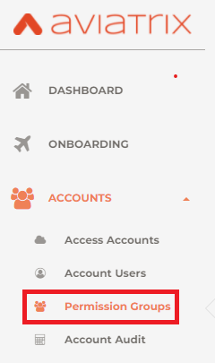
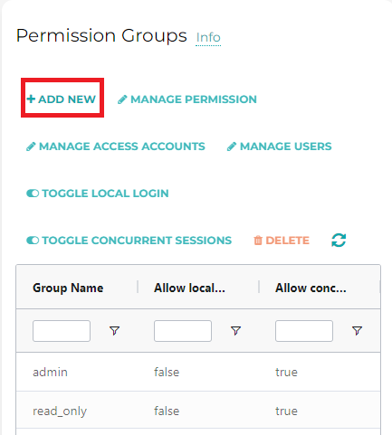
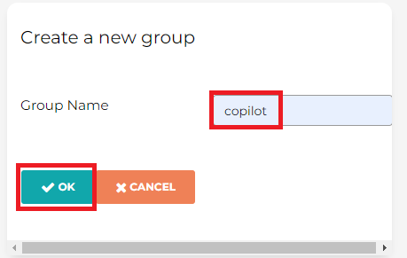
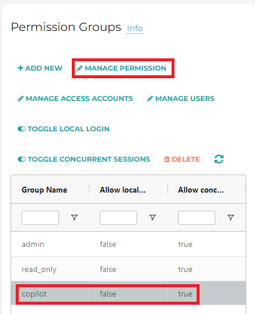
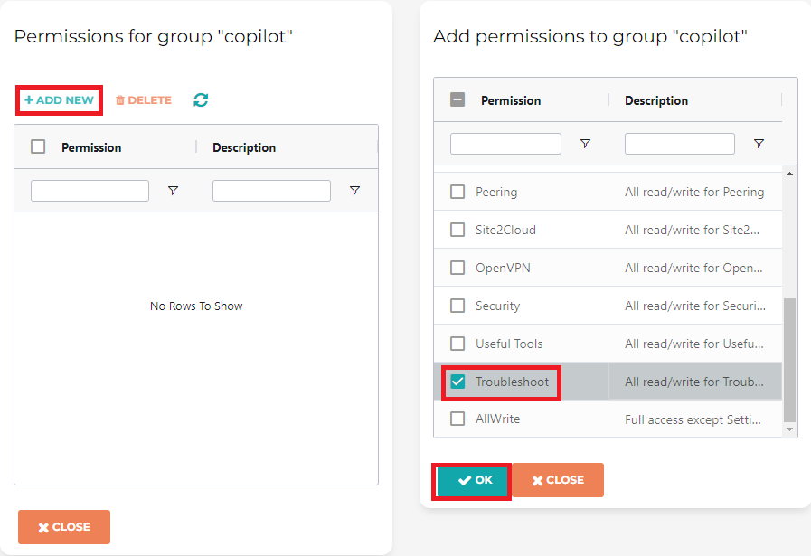
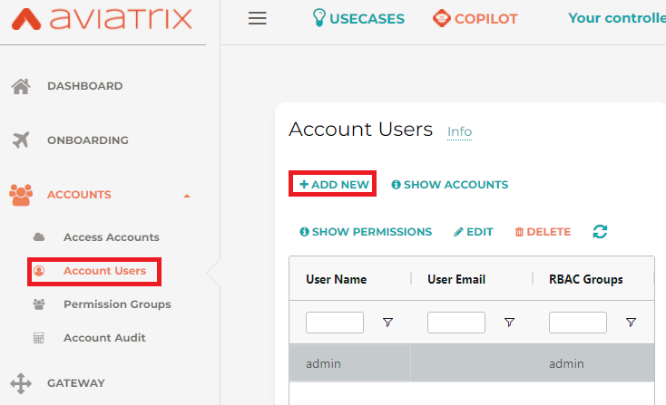
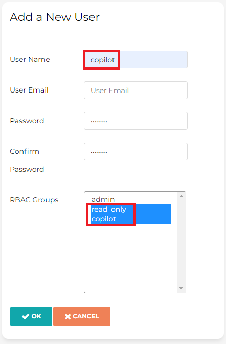
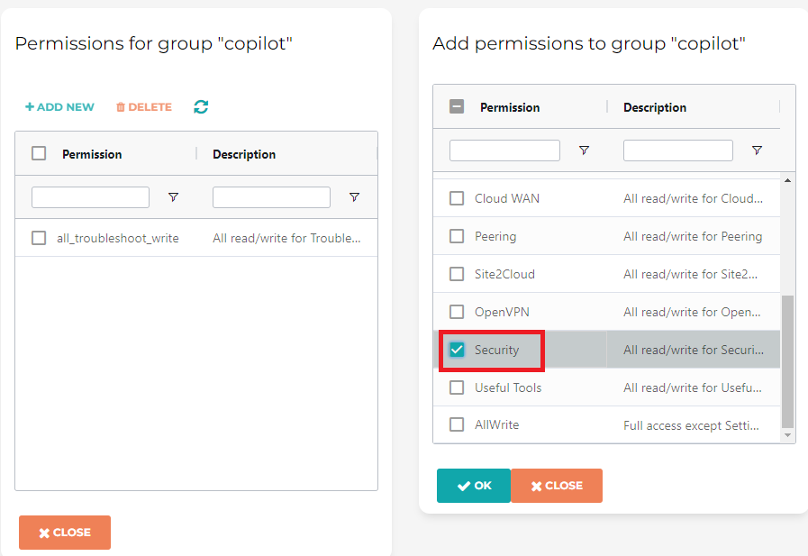

.. meta::
  :description: Aviatrix Getting Started
  :keywords: CoPilot,user account

============================================================
Aviatrix CoPilot User Account
============================================================

Step 1: Create Co-Pilot Permission Group
========================================

.. note::
  If you are using RBAC, as of 1.1.5 Copilot requires read-only access + access to ping and traceroute functions for diagnostic capabilities
  Ping and traceroute functions are under controller 'Troubleshoot' menu.

- Login to controller
  
  - Left side menu -> Accounts -> Permission Groups

    |copilot_user_account_1|
  
  - Under 'Permission Groups' -> '+ ADD NEW'
  
    |copilot_user_account_2|

  - Give group name: 'copilot', then 'OK'

    |copilot_user_account_3|

  - Click on newly created group 'copilot', then click 'MANAGE PERMISSION'
    
    |copilot_user_account_4|

  - Click 'ADD NEW', check 'Troubleshoot', then click 'OK'

    |copilot_user_account_5|

Step 2: Create Co-Pilot user
============================

- While still witin Controller

  - Left side menu -> ACCOUNTS -> Account Users -> ADD NEW

    |copilot_user_account_6|
    
  - Username 'copilot', fill in email, password, and select both 'read_only' and 'copilot' (which was created in step 1), then click 'OK'
  
    |copilot_user_account_7|

Step 3: Login to Co-Pilot

- Login to Co-Pilot via https://<copilot_public_ip>
- Ignore certificate error
- Use the 'copilot' user account create in step 2 to login, when prompted to provide username/password/controller IP
- Provide customer ID (for BYOL, not applicable for metered)
- Use the same 'copilot' user account for co-pilot service account

.. note::
  If you are using ThreatGuard to block IPs you also need to add security/stateful firewall permissions in the permission group 'copilot'

.. tip:: Security/stateful firewall permissions are under controller 'SECURITY' menu.

  |copilot_user_account_8|

.. disqus::
