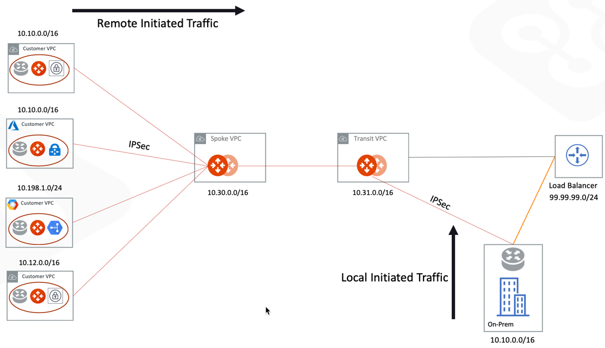

.. meta::
   :description: Create site2cloud connection with overlap network address ranges
   :keywords: Mapped site2cloud, VGW, SNAT, DNAT, Overlap Network CIDR, overlap CIDRs

===========================================================================================
Site2Cloud (S2C) Custom Network Mapped Solutions Workflow
===========================================================================================

This document describes a solution to solving network connectivity issues where there are overlapping network CIDRs. The solution uses the Custom Mapped under the `Mapped` option
of Aviatrix `Site2Cloud <https://docs.aviatrix.com/HowTos/site2cloud.html>`_ feature when building IPSEC tunnels.

Custom Mapped Site2Cloud provides the advantage of not having to configure individual SNAT/DNAT rules, also
it gives flexibility to build address translations of all scenarios. (e.g. Many-to-Many, Many-to-One etc.)

This document covers examples with Aviatrix Transit Gateway only and below topology will be used for all scenarios.

|cmap_topology|

.. note::
 Same virtual CIDR for multiple customer sites cannot be used.

.. important::
 This document applies to both Aviatrix Transit and AWS Transit Gateway (TGW). "Forward Traffic to Transit Gateway" needs to be enabled under S2C connection in Aviatrix Transit Gateway case.

Terminology Definitions
--------------------------

The primary reason for terminology definitions is that in connecting overlapping networks with IPSec tunnels, the address translation
requirements are
often not symmetric. For example, Remote Initiated Traffic may all require to be source NATed to a single or small range of addresses, while
Local Initiated Traffic may require to have a 1-1 DNAT and SNAT. By separating different traffic directions, address translations can 
be done specifically for the direction, thus providing the ultimate flexibility. 

Remote Initiated Traffic
~~~~~~~~~~~~~~~~~~~~~~~~~~~

From the point of view of an Aviatrix gateway where site2cloud (with IPSec tunnel) connection is established, traffic initiating from the 
remote end of the IPSec tunnel is called Remote Initiated Traffic. 

Local Initiated Traffic
~~~~~~~~~~~~~~~~~~~~~~~~~

From the point of view of an Aviatrix gateway where site2cloud (with IPSec tunnel) connection is established, traffic initiating from the 
Aviatrix gateway side of the IPSec tunnel is called Local Initiated Traffic. This traffic may originally come from an Aviatrix Transit Gateway
to the Aviatrix Spoke gateway where IPSec tunnels are established. 

Problem Statement
-------------------------------------------------------------------------
In this use case, a customer needs to connect certain on-prem hosts to certain EC2 instances in a VPC over an IPSEC tunnel over the Internet, but the on-prem network range overlaps with the customer's VPC CIDR range, and the requirement from the customer is that traffic can be initiated from either side.

::

  VPC       CIDR = 10.10.0.0/16, instance-1 in Client-1 has an IP address 10.10.43.145
            CIDR = 10.10.0.0/16, instance-1 in Client-2 has an IP address 10.10.35.41
  On-Prem   CIDR = 10.10.0.0/16, host-1 in On-Prem has an IP address 10.10.0.212.

Aviatrix offers multiple solutions to this requirement. The solutions uses in this document to solve this scenario is called "custom mapped" feature in Site2Cloud that removes the need to configure individual SNAT/DNAT rules and gives flexibility to map Real CIDRs to small Virtual CIDRs range.

.. note::
 The maximum number of CIDRs for Site2Cloud network maps is 32.

This solution uses a site2cloud route-based IPSEC tunnel using Virtual Tunnel Interface (VTI) between VPC and On-Prem Router. The packet flow is demonstrated as below:

 1. Client-1 instance-1 sends a packet to host-1 with a virtual destination IP address, for example 11.10.0.212. From Client-1 instance-1's point of view, the destination instance is a virtual address - 11.10.0.212.
 #. When the packet arrives at the Aviatrix Spoke gateway, the gateway does DNAT on the packet to translate the virtual destination IP address to 10.10.0.212 which is the host-1 physical IP address.
 #. The Spoke gateway then translates the packet source IP address (10.10.43.145) to a virtual source IP address, say it is 100.64.101.17.
 #. The packet then arrives at On-Prem Cisco IOS Router with destination IP address 10.10.0.212 and source IP address 100.64.101.17. From host-1's point of view, instance-1's address is a virtual IP address - 100.64.101.17.
 #. When host-1 sends a packet to instance-1, the destination is the virtual IP address 100.64.101.17.
 #.  When the packet arrives at the Spoke gateway over the IPSEC tunnel, the Spoke gateway translates its destination IP address from virtual address 100.64.101.17 to 10.10.43.145.
 #. The Spoke gateway then translates the source IP address of the packet from 10.10.0.212 to virtual address 11.10.0.212.

Scenarios:
--------------

Use Case 1:  Customer's Multi-Sites CIDRs overlaps with on-prem CIDRs
-------------------------------------------------------------------------

Traffic Initiated from either sides.

Traffic initiated from customer's side
########################################

Traffic initiated from Client's side means it is a remote initiated traffic from Aviatrix Gateway perspective as shown below.

Furthermore, requirement is to map customer's Real CIDR into the smaller Virtual CIDRs of 16 IP addresses range.

SNAT is only required to translate 10.10.0.0/16 to small range of ip address 100.64.0.16/28, 100.64.0.32/28 respectively.

==================================================                =======================================================================
  **Client 1 S2C CIDR**                                             **Remote Initiated**
==================================================                =======================================================================
  Source (Real)                                                     10.10.0.0/16
  Source (Virtual)                                                  100.64.0.16/28
  Destination (Real)                                                10.10.0.212/32
  Destination (Virual)                                              11.10.0.212/32
==================================================                =======================================================================

Traffic initiated from on-prem's side
########################################

Traffic initiated from the on-prem's side means it is a local initiated traffic from Aviatrix Gateway perspective as shown below.

==================================================                =======================================================================
  **Client 1 S2C CIDR**                                             **Remote Initiated**
==================================================                =======================================================================
  Source (Real)                                                     10.10.0.0/16
  Source (Virtual)                                                  11.11.1.5/32
  Destination (Real)                                                10.10.43.144/28
  Destination (Virual)                                              100.64.101.16/28
==================================================                =======================================================================

Use Case 2: Customer's Multi-Sites CIDRs overlaps each other and on-prem CIDRs is non-overlapping
--------------------------------------------------------------------------------------------------

SNAT is only required to translate 10.10.0.0/16 to small range of ip address 100.64.0.16/28, 100.64.0.32/28 respectively, and DNAT will not be required.

Traffic initiated from customer's side
########################################

Traffic initiated from Client's side means it is a remote initiated traffic from Aviatrix Gateway perspective as shown below.

Furthermore, requirement is to map customer's Real CIDR into the smaller Virtual CIDRs of 16 IP addresses range.

==================================================                =======================================================================
  **Client 1 S2C CIDR**                                             **Remote Initiated**
==================================================                =======================================================================
  Source (Real)                                                     10.10.0.0/16
  Source (Virtual)                                                  100.64.0.16/28
  Destination (Real)                                                99.99.99.75/32
  Destination (Virual)                                              99.99.99.75/32
==================================================                =======================================================================

Traffic initiated from on-prem's side
########################################

Traffic initiated from the on-prem's side means it is a local initiated traffic from Aviatrix Gateway perspective as shown below.

|scenario2_local_initiated|

==================================================                =======================================================================
  **Client 1 S2C CIDR**                                             **Remote Initiated**
==================================================                =======================================================================
  Source (Real)                                                     10.10.0.0/16,99.99.99.102/32
  Source (Virtual)                                                  11.11.1.5/32,99.99.99.102/32
  Destination (Real)                                                10.10.43.144/28
  Destination (Virual)                                              100.64.101.16/28
==================================================                =======================================================================

The Configuration Steps
==========================

Step 1: Launch Transit Gateway
~~~~~~~~~~~~~~~~~~~~~~~~~~~~~~~~~~~~~

Log in to the Controller console, go to Multi-Cloud Network. Follow step 1 to launch a gateway in the VPC.

Transit Aviatrix Gateway can be deployed using the `Transit Gateway Workflow <https://docs.aviatrix.com/HowTos/transitvpc_workflow.html#launch-a-transit-gateway>`_

1.	Navigate to **MULTI-CLOUD TRANSIT -> Setup -> #1 Launch an Aviatrix Transit Gateway**
#.	Choose instance size **C5x.large**
#.	Enable **ActiveMesh Mode (Mandatory)**
#.	Enable InsaneMode for higher throughputs (optional)
#.	Enable Transit VPC GW HA by navigating to **MULTI-CLOUD TRANSIT -> Setup -> #2 (Optional) Enable HA to an Aviatrix Transit Gateway**

.. note::
    Instance size of c5.xlarge will be required for Insane Mode Encryption for higher throughput.

Step 2: Deploy Spoke Gateways
~~~~~~~~~~~~~~~~~~~~~~~~~~~~~~

Now that we have Aviatrix Transit Gateway, we can deploy Aviatrix Spoke Gateways in the spoke VPCs using `Aviatrix Spoke Gateway Workflow <https://docs.aviatrix.com/HowTos/transitvpc_workflow.html#launch-a-spoke-gateway>`_.

1.	Navigate to **MULTI-CLOUD TRANSIT -> Setup -> #4 Launch an Aviatrix Spoke Gateway**
#.	Deploy a Spoke Gateway (GW) in the spoke VPCs using defaults while choose correct Account and VPC info
#.	Choose the Public Subnet
#.	Enable Spoke Gateway HA by navigating to Transit network -> Setup -> #5 (Optional) Enable/Disable HA at Spoke GW

.. note::
    Instance size of c5.xlarge will be required for Insane Mode Encryption for higher throughput.

Step 3: Attach Spoke Gateways to Transit Network
~~~~~~~~~~~~~~~~~~~~~~~~~~~~~~~~~~~~~~~~~~~~~~~~~~

Transit and spoke gateways are deployed, next step is to connect them. Navigate to **MULTI-CLOUD TRANSIT -> Setup -> #6a Attach Spoke Gateway to Transit Network**

Step 4: Connect Transit Gateway to On-Prem
~~~~~~~~~~~~~~~~~~~~~~~~~~~~~~~~~~~~~~~~~~~~~~~~~~

Aviatrix Transit Gateway can be connected to On-Prem Cisco IOS from Multi-Cloud Transit using `Connect Transit Gateway to External Device workflow <https://docs.aviatrix.com/HowTos/transitvpc_workflow.html#external-device>`_

Step 5: Create a Site2Cloud tunnel
~~~~~~~~~~~~~~~~~~~~~~~~~~~~~~~~~~~~~~~~~~~~~~~~~~~~~~~~~~~~~~~~~~~~~~~

Before creating a S2C tunnel, it is important to understand few terms here:

Go to Controller Console -> Site2Cloud.

Click "+Add New". Fill the form and click OK. Select "Mapped" for the Connection Type field.

|s2c_connection|

5.1 VPC-1 gateway-1 side
#########################

For the VPC gateway side, the Local Subnet field should be the subnet of VPC-1 (e.g. 10.24.0.0/20), and the Remote Subnet field should be the subnet of OnPrem Router (e.g. 10.24.0.0/20), as shown below.

==================================================                =======================================================================
  **Field**                                                         **Value**
==================================================                =======================================================================
  VPC ID/VNet Name                                                  Choose VPC ID
  Connection Type                                                   Mapped
  Connection Name                                                   Arbitrary (e.g. S2C-VPC-OnPrem)
  Remote Gateway Type                                               Generic
  Tunnel Type                                                       Route-based
  Algorithms                                                        Uncheck this box
  Encryption over ExpressRoute/DirectConnect                        Uncheck this box
  Enable HA                                                         Check this box if HA is required
  Primary Cloud Gateway                                             Select the Aviatrix Gateway created above
  Remote Gateway IP Address                                         Public IP of IOS Router WAN port (52.40.45.197 in this example)
  Pre-shared Key                                                    Optional (auto-generated if not entered)
  Remote Subnet (Real)                                              10.24.0.0/20 (On-Prem Network CIDR)
  Remote Subnet (Virtual)                                           Any/20 (On-Prem Network Virtual CIDR)
  Local Subnet  (Real)                                              10.24.0.0/20 (VPC-Cloud Network CIDR)
  Local Subnet  (Virtual)                                           Any/20 (VPC-Cloud Network Virtual CIDR)
==================================================                =======================================================================

.. |scenario1_overlapping_cidr| image:: custom_mapped_solution_media/scenario1_overlapping_cidr.png
   :scale: 35%

.. |scenario1_remote_initiated| image:: custom_mapped_solution_media/scenario1_remote_initiated.png
   :scale: 35%

.. |scenario1_local_initiated| image:: custom_mapped_solution_media/scenario1_local_initiated.png
   :scale: 35%

.. |scenario2_remote_initiated| image:: custom_mapped_solution_media/scenario2_remote_initiated.png
   :scale: 35%

.. |scenario2_local_initiated| image:: custom_mapped_solution_media/scenario2_local_initiated.png
   :scale: 35%

.. |s2c_connection| image:: connect_overlap_cidrs_media/s2c_connection.png
   :scale: 35%

.. disqus::
