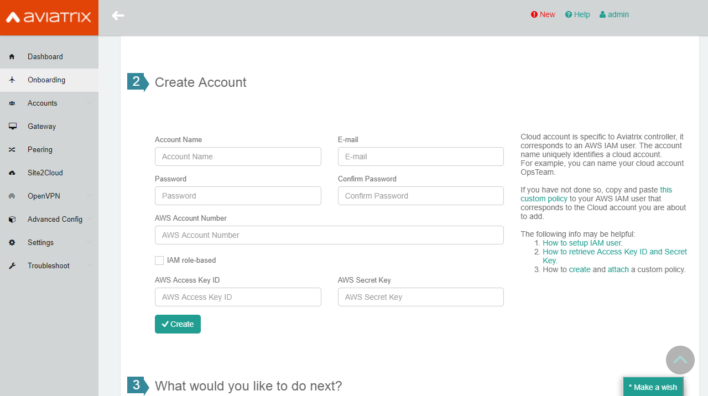

.. meta::

================================================
Customize AWS-IAM-Policy for Aviatrix Controller
================================================

Introduction
============

Aviatrix provides the `default Aviatrix-AWS-IAM-Policy <https://s3-us-west-2.amazonaws.com/aviatrix-download/IAM_access_policy_for_CloudN.txt>`__ for its solution. This document provides examples on how to customize these IAM policies. The customization reduces the scope of resource privileges and helps you meet your organization's security requirements. Please do understand that without the right access and permissions, Aviatrix Controller and Gateways will not be able to function as designed and any changes you might make could disrupt your network - **we strongly request you to test all changes, thoroughly, in your sandbox/preprod/test environment before you push them to your production environment**. Please open a support ticket at `Aviatrix Support Portal <https://support.aviatrix.com>`_, if you have any questions or issues.

You can remove some of the policy rules by using this `default IAM-Policy <https://s3-us-west-2.amazonaws.com/aviatrix-download/IAM_Policy_For_Peering.txt>`__ if you only plan on using the following Aviatrix features:
  1. Gateway creation without ELB (Elastic Load Balancer)
  2. Encrypted-Peering
  3. Transitive-Peering
  4. Peering-HA (High Ability)
  5. Site2Cloud 
  6. Controller Backup & Restore

.. Note:: Most features (such as VPN with ELB/NLB, etc.) are not stated above, we recommend using the default IAM policy to avoid some issues.
..

.. Note:: Both the Aviatrix Controllers and the Aviatrix Gateways need access to the IAM policies.
..

.. Note:: Ensure that IAM policies are consistent across all AWS accounts that the Controllers and Gateways are located in.
..

|

IAM Policies Required for Aviatrix Use Cases
===========================================================

IAM Policy for Aviatrix Transit Gateway & VGW
--------------------------------------------------------------

.. raw:: html

    <iframe src="https://s3-us-west-2.amazonaws.com/aviatrix-download/aviatrix-iam-policies/transit-network/aviatrix-iam-policy-for-aws-accounts-own-aviatrix-transit-gateways.txt" height="300px" width="100%"></iframe>

|

IAM Policy for Aviatrix Transit VPC Spoke Gateway
------------------------------------------------------------

.. raw:: html

    <iframe src="https://s3-us-west-2.amazonaws.com/aviatrix-download/aviatrix-iam-policies/transit-network/aviatrix-iam-policy-for-aws-accounts-own-aviatrix-spoke-gateways.txt" height="300px" width="100%"></iframe>

The next few sections provide examples on how to restrict policy rule scopes.

|

When to Modify AWS-IAM-Policy (aviatrix-app-role-policy)
========================================================

Before customizing the AWS-IAM-Policy for the Aviatrix Controller, follow
the steps below:

1. Use the original/default Aviatrix-AWS-IAM-Policy for every
Aviatrix-Cloud-Account creation. The following screenshot is the account
creation during the AVX Controller Onboarding process.

|image0|

2. After account creation, as an administrator, you can start editing/customizing
the AWS-IAM-Policy, "aviatrix-app-role-policy" from your AWS-IAM-Policy
section to increase the security level of your AWS
environment/resources. Please see the following for more reference.

How to Modify AWS-IAM-Policy
============================

1. Log in to your AWS console.

|image1|

2. Go to IAM service.

|image2|

3. Click **Policies** and select the policy. 

If you have not created "aviatrix-app-policy", please see
`here <http://docs.aviatrix.com/HowTos/HowTo_IAM_role.html>`__.

|image3|

4. Click **Edit Policy**.

|image4|

Now you are ready to edit the policy! Please refer to the examples 
later in this document.

What Permissions are Required in App Role Policy and Why
========================================================

The App role policy
(`example <https://s3-us-west-2.amazonaws.com/aviatrix-download/IAM_access_policy_for_CloudN.txt>`__),
has different “Actions” to allow on certain resources. Your Aviatrix
Controller needs those policies to function.

a. ec2 – to create/delete/list/modify VPCs, Aviatrix Gateways, security
   groups, route tables, tags, start instance, stop instance, reboot
   instance, associate/de-associate IP address, etc.

b. elasticloadbalancing – to create/configure/delete/modify ELB for
   Aviatrix VPN Gateway

c. s3 – to create/add/delete s3 buckets for save-and-restore and
   cloudTrail features

d. sqs – to create/delete/list/send/get SQS and SQS messages for
   Controller-to-gateway communication

e. sns – to create/delete/list/subscribe/unsubscribe SNS and SNS topic
   for Gateway HA feature

f. route53 – to create/delete/list hosted zone, and change the resource
   record for GeoVPN feature

g. cloudwatch – to put/delete alarm for Aviatrix Gateway HA feature

h. iam – to support role-based IAM account

How to Reduce APP Role Policy 
==============================

1. Default APP Role-Based Policy
--------------------------------

Click
`here <https://s3-us-west-2.amazonaws.com/aviatrix-download/IAM_access_policy_for_CloudN.txt>`__
to see a default APP role-based policy. In the default APP role-based
policy, it allows actions to apply to all resource. By changing Resource
field from a wildcard ‘*’ to a more specific resource ARN can limit the
service the assumed role can do. The examples are described in the later
sections.

2. Use Aviatrix Tags To Limit Resource Deleting Policy Scope
-------------------------------------------------------------

The Aviatrix Controller automatically creates a tag when it creates resources, such as gateways, security groups and route entries. The tag has the syntax as follows:

:: 

  aviatrix tag key = "Aviatrix-Created-Resource"
  aviatrix tag value = "Do-Not-Delete-Aviatrix-Created-Resource"

Click `here <https://s3-us-west-2.amazonaws.com/aviatrix-download/aviatrix_customized_IAM_app_policy.txt>`_ to download a complete IAM policy that reduces the IAM app policy for deleting instances.

3. Use Condition to Allow Service Requests from Certain IP Addresses
--------------------------------------------------------------------

A user can add a “Condition” field to deny all requests not initiated from
the Aviatrix Controller IP address or a range of CIDRs. The following
policy only allows service requests from IP address 192.0.2.0/24, or
54.31.45.88/32, or 203.0.113.0/24.

::

	{
	  "Version": "2012-10-17",
	  "Statement": {
	    "Effect": "Deny",
	    "Action": [
	      "ec2:DescribeImageAttribute",
	      "ec2:DescribeImages",
		      :
		      :
	      "ec2:DescribeVpcPeeringConnections"
	    ],
	    "Resource": "*",
	    "Condition": {"NotIpAddress": {"aws:SourceIp": [
	      "192.0.2.0/24",
	      "54.31.45.88/32",
	      "203.0.113.0/24"
	    ]}}
	  }
	}

We can also use "Allow" instead of using "Deny" in the "Effect" element/key. Both ways have the same behavior. See the following:

Syntax:
~~~~~~~
::

  {
    "Effect": "Allow",
    "Action": [
      "ec2:RunInstances"
    ],
    "Resource": "*",
    "Condition": {
      "IpAddress": { "aws:SourceIp": ["AVIATRIX-CONTROLLER-IP/32"] }
    }
  }

Example:
~~~~~~~~

::

   {
     "Effect": "Allow",
     "Action": [
       "ec2:RunInstances"
     ],
     "Resource": "*",
     "Condition": {
       "IpAddress": { "aws:SourceIp": ["54.88.88.88/32"] }
      }
   }

NOTE:
~~~~~

The method of specifying the IP address of AWS instance(s) can apply to many
AWS-API permissions, such as:

| "ec2:Describe*",
| "elasticloadbalancing:Describe*",
| "route53:List*",
| "route53:Get*",
| "sns:List*",
| "s3:List*",
| "s3:Get*",
| etc...
| not only for "ec2:RunInstances".

4. Launch Instances(Aviatrix-Gateway) on a Specific Subnet Only from the Aviatrix Controller
-------------------------------------------------------------------------------------------------------------------

Syntax:
~~~~~~~~~
::

  {
    "Effect": "Allow",
    "Action": "ec2:RunInstances",
    "Condition": {
      "IpAddress": {
        "aws:SourceIp": [
          "AVIATRIX-CONTROLLER-IP/32"
        ]
      }
    },
    "Resource": [
      "arn:aws:ec2:*:*:image/ami-*",
      "arn:aws:ec2:REGION:AWS-ACCOUNT-ID:subnet/SUBNET-ID",
      "arn:aws:ec2:REGION:AWS-ACCOUNT-ID:instance/*",
      "arn:aws:ec2:REGION:AWS-ACCOUNT-ID:network-interface/*",
      "arn:aws:ec2:REGION:AWS-ACCOUNT-ID:volume/*",
      "arn:aws:ec2:REGION:AWS-ACCOUNT-ID:key-pair/*",
      "arn:aws:ec2:REGION:AWS-ACCOUNT-ID:security-group/*"
    ]
  }

Example:
~~~~~~~~

::

  {
    "Effect": "Allow",
    "Action": "ec2:RunInstances",
    "Condition": {
      "IpAddress": {
        "aws:SourceIp": [
          "54.88.88.88/32"
        ]
      }
    },
    "Resource": [
      "arn:aws:ec2:*:*:image/ami-*",
      "arn:aws:ec2:us-west-2:888888888888:subnet/subnet-abcd1234",
      "arn:aws:ec2:us-west-2:888888888888:instance/*",
      "arn:aws:ec2:us-west-2:888888888888:network-interface/*",
      "arn:aws:ec2:us-west-2:888888888888:volume/*",
      "arn:aws:ec2:us-west-2:888888888888:key-pair/*",
      "arn:aws:ec2:us-west-2:888888888888:security-group/*"
    ]
  }

5. Launching Instances on Specific VPC(s)
-----------------------------------------

The policy can be modified to limit running gateways on certain VPCs
only. In the following examples, we limit the role to launch an Aviatrix
Gateway on AWS account 177688881379, region us-west-2, and vpc-873db7e2
and vpc-fda23c98. Note: we can use wildcard “*” to replace region,
account number, or VPC ID.
::

  {
    "Effect": "Allow",
    "Action": [
      "ec2:RunInstances"
    ],
    "Resource": "arn:aws:ec2:us-west-2:177658351379:subnet/*",
    "Condition": {
      "StringEqualsIgnoreCase": {
        "ec2:vpc": [
          "arn:aws:ec2:us-west-2:177688881379:vpc/vpc-873db7e2",
          "arn:aws:ec2:us-west-2:177688881379:vpc/vpc-fda23c98"
        ]
      }
    }  
  },
  {
    "Effect": "Allow",
    "Action": "ec2:RunInstances",
    "Resource": "arn:aws:ec2:*:*:image/ami-*"
  },
  {
    "Effect": "Allow",
    "Action": "ec2:RunInstances",
    "Resource": [
      "arn:aws:ec2:*:*:instance/*",
      "arn:aws:ec2:*:*:volume/*",
      "arn:aws:ec2:*:*:network-interface/*",
      "arn:aws:ec2:*:*:key-pair/*",
      "arn:aws:ec2:*:*:security-group/*"
    ]
  }

Syntax
~~~~~~
::

  {
    "Effect": "Allow",
    "Action": "ec2:RunInstances",
    "Resource": "arn:aws:ec2:REGION:AWS-ACCOUNT-ID:subnet/subnet-*",
    "Condition": {
      "StringEquals": {
        "ec2:Vpc": [
          "arn:aws:ec2:REGION:AWS-ACCOUNT-ID:vpc/vpc-abcd1234"
        ]
      },
      "IpAddress": {
        "aws:SourceIp": [
          "54.88.88.88/32"
        ]
      }
    }
  },
  {
    "Effect": "Allow",
    "Action": "ec2:RunInstances",
    "Resource": [
      "arn:aws:ec2:*:*:image/ami-*",
      "arn:aws:ec2:REGION:AWS-ACCOUNT-ID:instance/*",
      "arn:aws:ec2:REGION:AWS-ACCOUNT-ID:network-interface/*",
      "arn:aws:ec2:REGION:AWS-ACCOUNT-ID:volume/*",
      "arn:aws:ec2:REGION:AWS-ACCOUNT-ID:key-pair/*",
      "arn:aws:ec2:REGION:AWS-ACCOUNT-ID:security-group/*"
    ]
  }

Example
~~~~~~~
::

  {
    "Effect": "Allow",
    "Action": "ec2:RunInstances",
    "Resource": "arn:aws:ec2:us-west-2:888888888888:subnet/subnet-*",
    "Condition": {
      "StringEquals": {
        "ec2:Vpc": [
          "arn:aws:ec2:us-west-2:888888888888:vpc/vpc-abcd1234"
        ]
      },
      "IpAddress": {
        "aws:SourceIp": [
          "54.88.88.88/32"
        ]
      }
    }
  },
  {
    "Effect": "Allow",
    "Action": "ec2:RunInstances",
    "Resource": [
      "arn:aws:ec2:*:*:image/ami-*",
      "arn:aws:ec2:us-west-2:888888888888:instance/*",
      "arn:aws:ec2:us-west-2:888888888888:network-interface/*",
      "arn:aws:ec2:us-west-2:888888888888:volume/*",
      "arn:aws:ec2:us-west-2:888888888888:key-pair/*",
      "arn:aws:ec2:us-west-2:888888888888:security-group/*"
    ]
  }

6. AWS S3 Permissions/Policies
---------------------------------------------

The following S3 IAM-Policy examples demonstrate allowing an AWS API to write/PutObject AVX-Controller-Backup configuration file to a
specified AWS-S3-Bucket. The command is issued only by your AVX
Controller.

Syntax:
~~~~~~~
::

  {
    "Effect": "Allow",
    "Action": [
      "s3:List*"
    ],
    "Resource": "arn:aws:s3:::*",
    "Condition": {
      "IpAddress": {
        "aws:SourceIp": [
          "AVIATRIX-CONTROLLER-IP-ADDRESS/32"
        ]
      }
    }
  },
  {
    "Effect": "Allow",
    "Action": [
      "s3:CreateBucket",
      "s3:DeleteBucket"
    ],
    "Resource": "arn:aws:s3:::*aviatrix*",
    "Condition": {
      "IpAddress": {
        "aws:SourceIp": [
          "AVIATRIX-CONTROLLER-IP-ADDRESS/32"
        ]
      }
    }
  },
  {
    "Effect": "Allow",
    "Action": [
      "s3:PutObject"
    ],
    "Resource": "arn:aws:s3:::YOUR-S3-BUCKET-NAME/*",
    "Condition": {
      "IpAddress": {
        "aws:SourceIp": [
          "AVIATRIX-CONTROLLER-IP-ADDRESS/32"
        ]
      }
    }
  },
  {
    "Effect": "Allow",
    "Action": [
      "s3:Get*"
    ],
    "Resource": "arn:aws:s3:::YOUR-S3-BUCKET-NAME*",
    "Condition": {
      "IpAddress": {
        "aws:SourceIp": [
          "AVIATRIX-CONTROLLER-IP-ADDRESS/32"
        ]
      }
    }
  }

Example:
~~~~~~~~
::

  {
    "Effect": "Allow",
    "Action":[ 
      "s3:List*"
    ],
    "Resource": "arn:aws:s3:::*",
    "Condition": {
      "IpAddress": {
        "aws:SourceIp": [
          "54.88.88.88/32"
        ]
      }
    }
  },
  {
    "Effect": "Allow",
    "Action": [
      "s3:CreateBucket",
      "s3:DeleteBucket"
    ],
    "Resource": "arn:aws:s3:::*aviatrix*/*"
    "Condition": {
      "IpAddress": {
        "aws:SourceIp": [
          "54.88.88.88/32"
        ]
      }
    }
  },
  {
    "Effect": "Allow",
    "Action": [
      "s3:PutObject"
    ],
    "Resource": "arn:aws:s3:::*aviatrix*/*"
    "Condition": {
      "IpAddress": {
        "aws:SourceIp": [
          "54.88.88.88/32"
        ]
      }
    }
  },
  {
    "Effect": "Allow",
    "Action": [
      "s3:Get*"
    ],
    "Resource": "arn:aws:s3:::*aviatrix*",
    "Condition": {
      "IpAddress": {
        "aws:SourceIp": [
          "54.88.88.88/32"
        ]
      }
    }
  }

7. AWS-Simple-Queue Permissions/Policies
---------------------------------------------------------

The following example(s) demonstrate allowing the IAM User/Role to
access AWS-Simple-Queue object(s) only to the queues with names
starting with the string "aviatrix".

Syntax:
~~~~~~~
::

  {
    "Effect": "Allow",
    "Action": [
      "sqs:List*",
      "sqs:Get*",
    ],
    "Resource": "arn:aws:sqs:*:AWS-Account-ID:aviatrix-*"
  },
  {
    "Effect": "Allow",
    "Action": [
      "sqs:AddPermission",
      "sqs:ChangeMessageVisibility",
      "sqs:CreateQueue",
      "sqs:DeleteMessage",
      "sqs:DeleteQueue",
      "sqs:PurgeQueue",
      "sqs:ReceiveMessage",
      "sqs:RemovePermission",
      "sqs:SendMessage",
      "sqs:SetQueueAttributes"
    ],
    "Resource": "arn:aws:sqs:*:AWS-Account-ID:aviatrix-*"
  }

Example:
~~~~~~~~
::

  {
    "Effect": "Allow",
    "Action":[
      "sqs:List*",
      "sqs:Get*",
    ],
    "Resource": "arn:aws:sqs:*:888888666666:aviatrix-*"
  },
  {
    "Effect": "Allow",
    "Action":[
      "sqs:AddPermission",
      "sqs:ChangeMessageVisibility",
      "sqs:CreateQueue",
      "sqs:DeleteMessage",
      "sqs:DeleteQueue",
      "sqs:PurgeQueue",
      "sqs:ReceiveMessage",
      "sqs:RemovePermission",
      "sqs:SendMessage",
      "sqs:SetQueueAttributes"
    ],
    "Resource": "arn:aws:sqs:*:888888666666:aviatrix-*"
  }

.. Warning:: We do not recommend using the AWS-resource-IP checking mechanism to modify AWS-SQS API permissions.
..

8. Restricting Operations Using the AWS Resource Tag
--------------------------------------------------------------------

The following example(s) demonstrate using IAM Policy to limit 
IAM user/role to be able to operate only on instances that have a customized AWS Resource Tag.

Syntax:
~~~~~~~
::

  {
      "Version": "2012-10-17",
      "Statement": [
          {
              "Effect": "Allow",
              "Action": [
                  "ec2:StartInstances",
                  "ec2:StopInstances",
                  "ec2:TerminateInstances"
              ],
              "Resource": "*",
              "Condition": {
                  "StringEqualsIgnoreCase": {
                      "ec2:ResourceTag/KEY_OF_RESOURCE_TAG": "VALUE_OF_RESOURCE_TAG"
                  }
              }
          }
      ]
  }

Example:
~~~~~~~~
::

  {
      "Version": "2012-10-17",
      "Statement": [
          {
              "Effect": "Allow",
              "Action": [
                  "ec2:StartInstances",
                  "ec2:StopInstances",
                  "ec2:TerminateInstances"
              ],
              "Resource": "*",
              "Condition": {
                  "StringEqualsIgnoreCase": {
                      "ec2:ResourceTag/Aviatrix-Created-Resource": "*Do-Not-Delete*"
                  }
              }
          }
      ]
  }

EC2 Role Policy Examples
========================

1. Default EC2 Role Policy
----------------------------------

The Amazon EC2 role allows EC2 instances to call AWS services on your
behalf.

This policy allows action “AssumeRole” to ALL roles.

The default EC2 role policy allows an AWS EC2 instance to assume to any
role. By changing the “Resource” field from a wildcard * to a more
specific account number, the role name or prefix of the role name can limit the
EC2 instance’s role.
::

  {
      "Version": "2012-10-17",
      "Statement": [
          {
              "Effect": "Allow",
              "Action": [
                  "sts:AssumeRole"
              ],
              "Resource": "arn:aws:iam::*:role/aviatrix-*"
          },
          {
              "Effect": "Allow",
              "Action": [
                  "aws-marketplace:MeterUsage"
              ],
              "Resource": "*"
          }
      ]
  }

2: Example of EC2 Role Policy with More Specific Resource Field
--------------------------------------------------------------------------------

The policy attached to the Amazon EC2 role can limit the role it can
assume by specifying the 12-digit AWS account number, role name, or
prefix of the role name.

In this example, the EC2 instance can assume role to any 12-digit AWS
account with role name prefix “HR-", or AWS account number 177658388888
with role name prefix “aviatrix-", or AWS account number 188658399999,
role name developer.
::

  {
    "Version": "2012-10-17",
    "Statement": [
      {
        "Effect": "Allow",
        "Action": [
          "sts:AssumeRole"
        ],
        "Resource": [
          "arn:aws:iam::177658388888:role/aviatrix-*",
          "arn:aws:iam::*:role/aviatrix-role-app",
          "arn:aws:iam::*:role/HR-*",
          "arn:aws:iam::188658399999:role/developer"
        ]
      }
    ]
  }

NOTE:

Please refer to the policy example below. Aviatrix recommends our
customers to add the ARN (Amazon Resource Name) of your APP-Role
(aviatrix-role-app) into the "Resource" section. However, we do not
recommend specifying any IP addresses such as your Aviatrix-Controller
or Aviatrix-Gateway instances under the Condition section in order to
avoid further unexpected issues. The best practice to specify which of
your AWS instances are allowed to operate your AWS resources is to
modify the APP-Role (aviatrix-role-app). Please see the examples under the
`"APP Role Examples" <https://docs.aviatrix.com/HowTos/customize_aws_iam_policy.html#when-to-modify-aws-iam-policy-aviatrix-app-role-policy>`_ section of this document.

Recommended:

::

  {
    "Version": "2012-10-17",
    "Statement": [
      {
        "Effect": "Allow",
        "Action": [
          "sts:AssumeRole"
        ],
        "Resource": ["arn:aws:iam::188658399999:role/aviatrix-role-app"]
      }
    ]
  }

Not Recommended:

::

  {
    "Version": "2012-10-17",
    "Statement": [
      {
        "Effect": "Allow",
        "Action": [
          "sts:AssumeRole"
        ],
        "Condition": {
          "IpAddress": { "aws:SourceIp": ["35.164.224.157/32"] }
        },
        "Resource": ["arn:aws:iam::188658399999:role/aviatrix-role-app"]
      }
    ]
  }

.. |image1| image:: customize_aws_iam_policy_media/image2.png
   :width: 3.42946in
   :height: 2.39623in
.. |image2| image:: customize_aws_iam_policy_media/image3.png
   :width: 5.23044in
   :height: 3.58491in
.. |image3| image:: customize_aws_iam_policy_media/image4.png
   :width: 5.13900in
   :height: 3.28302in
.. |image4| image:: customize_aws_iam_policy_media/image5.png
   :width: 6.11245in
   :height: 3.92453in

   
.. disqus::   
