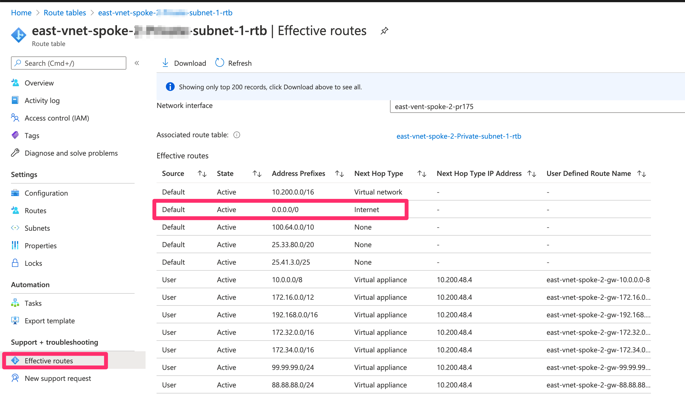

=========================================================
Aviatrix Default Route Handling  
=========================================================

This document explains how Aviatrix handles the default route 0.0.0.0/0 starting from R6.2. 

Public Subnet vs. Private Subnet
================================================================

A public subnet is different from a private subnet in a VPC/VNet in each Cloud Service Provider (CSP) by way of how the default route is managed.

In AWS, a public subnet is well-defined. If the subnet associated route table has a route entry 0.0.0.0/0 pointing to IGW, the subnet is a public subnet. On the other hand, if 0.0.0.0/0 does not point to IGW, this is a private subnet. 

In Azure, such distinction is less defined via explicit route entries. By default any VM in Azure is a public instance 
with direct Internet access and can be reached 
from the Internet as long as it has a public IP address. This is because Azure automatically programs a system route entry with 0.0.0.0/0 pointing to Internet, as shown in the screenshot below after a VM is launched. Azure's "system programmed default route" is displayed in Effective Routes.

|system_default_route|

Since Aviatrix Controller programs route table extensively and there are use cases that deal with egress control, it is important that the Controller follow well-defined rules when handling different types of subnets.  

Below are what Aviatrix Controller defines as public or private subnet.  

+--------------------------------------+--------------------------------------+---------------------------------------------+
| **Aviatrix definition table 1**      | **AWS**                              | **Azure**                                   |
+--------------------------------------+--------------------------------------+---------------------------------------------+
| **Public** cloud subnet/route table  | 0.0.0.0/0 to IGW                     | UDR does not exist                          |
|                                      |                                      +---------------------------------------------+
|                                      |                                      | UDR is associated with a subnet:            |
|                                      |                                      +---------------------------------------------+
|                                      |                                      | - UDR: 0.0.0.0/0 entry doesn't exist        |
|                                      |                                      +---------------------------------------------+
|                                      |                                      | - UDR: 0.0.0.0/0 to Cloud Internet          |
+--------------------------------------+--------------------------------------+---------------------------------------------+
| **Private** cloud subnet/route table | 0.0.0.0/0 route entry does not exist | UDR is associated with a subnet:            |
|                                      +--------------------------------------+---------------------------------------------+
|                                      | 0.0.0.0/0 to non-Aviatrix NVA        | - UDR: 0.0.0.0/0 to None                    |
|                                      +--------------------------------------+---------------------------------------------+
|                                      | 0.0.0.0/0 to VGW                     | - UDR: 0.0.0.0/0 to non-Aviatrix NVA        |
|                                      +--------------------------------------+---------------------------------------------+
|                                      | 0.0.0.0/0 to TGW                     | - UDR: 0.0.0.0/0 to Virtual Network         |
|                                      +--------------------------------------+---------------------------------------------+
|                                      | 0.0.0.0/0 to AWS NAT gateway         | - UDR: 0.0.0.0/0 to Virtual Network Gateway |
|                                      +--------------------------------------+---------------------------------------------+
|                                      | overall: 0.0.0.0/0 to non-IGW        |                                             |
+--------------------------------------+--------------------------------------+---------------------------------------------+
| Notes:                               | IGW: Internet gateways               | UDR: User Defined Routing                   |
|                                      +--------------------------------------+---------------------------------------------+
|                                      | NVA: Network Virtual Appliance       | NVA: Network Virtual Appliance              |
|                                      +--------------------------------------+---------------------------------------------+
|                                      | VGW: Virtual private gateway         |                                             |
|                                      +--------------------------------------+---------------------------------------------+
|                                      | TGW: AWS Transit Gateway             |                                             |
+--------------------------------------+--------------------------------------+---------------------------------------------+

.. important::

  In Azure, the rule of thumb of classifying a subnet as private is that the subnet's associated route table has a UDR (User Defined Routes) route entry of 0.0.0.0/0 pointing to None, an NVA appliance, Virtual Network or Virtual Network Gateway. 

Changes Made on **Azure** in R6.2
=========================================================================

Prior to 6.2, Aviatrix Controller blindly overwrites the default route to point to Aviatrix gateway in every route table whenever egress control is involved. This can cause
outages if the deployment
has public facing application or VMs. In 6.2, the rules for Aviatrix Controller to overwrite the default route becomes well defined.

.. tip::

  Use the Useful Tool "create a VPC tool" to create an Spoke and Transit Azure VNet. For Spoke VNet, the Controller will program a UDR default route 0.0.0.0 pointing to next hop type "None" to the route table associated with the private subnets. Check `Create a VPC <https://docs.aviatrix.com/HowTos/create_vpc.html>`_ for more info.

If you created Azure VNet via `create a VPC tool` prior R6.2 or created Azure VNet via your own scrip, make sure you inject a UDR route 0.0.0.0 pointing to the next hop type 
"None" to signal to the Aviatrix Controller that this is a private subnet and its default route can be overwritten.

If you have already deploy Transit FireNet with Egress Control, upgrading to 6.2 does not impact the existing traffic. However if you detach a Spoke VNet and re-attach it or 
disable Egress Inspection and re-enable it, the new rules will kick in. 

Testing
===================

When testing egress control from a VM in Azure VNet, make sure this VM is on a private subnet as defined in this document. Since this VM is on a private subnet without a public IP
address, you cannot directly SSH into the VM. You can use `Azure Bastion Service <https://docs.microsoft.com/en-us/azure/bastion/bastion-overview>`_ or `Aviatrix User VPN gateway <https://docs.aviatrix.com/HowTos/uservpn.html>`_ to connect to the private IP address of the VM via SSH.

Use Case: Single SNAT or FQDN in a VPC/VNet
========================================================

Users can launch Aviatrix Gateways within the network, and enable Single SNAT or FQDN feature on the gateway. Aviatrix gateway will discover 'private' subnets/route tables, then program default route 0.0.0.0/0 pointing to Aviatrix gateway into it. Furthermore, to reduce friction and to shorten downtime when users remove default route in their cloud environment by themselves, Aviatrix performs overwriting default route logic by default. By doing this, private instances/VMs internet traffic will go through Aviatrix gateway, and inspected by FQDN (if enabled).

Rule 4.1: Overwrite default route entry 0.0.0.0/0 in subnet/route table where Aviatrix defines it as “Private” when the below features are enabled:
---------------------------------------------------------------------------------------------------------------------------------------------------

Features:
^^^^^^^^^

- Single SNAT

- FQDN discovery

- FQDN

High-level logic:
^^^^^^^^^^^^^^^^^

- Utilize the definition in this document above to discover private subnet/route table 

- Save customer's original route entry 0.0.0.0 configuration

- Overwrite route entry 0.0.0.0 to Aviatrix

- Restore back customer's original route entry 0.0.0.0 configuration if users disable the above features

Rule 4.2: Load balance the route entry 0.0.0.0/0 between Aviatrix gateways when users attempt to enable the same type of feature such as Single SNAT/FQDN which is already deployed in the same network.
--------------------------------------------------------------------------------------------------------------------------------------------------------------------------------------------------------

- Refer to `NAT GW Load-balance with AZ affinity <https://docs.aviatrix.com/HowTos/nat_gw_LoadBalance_AZ.html>`_ for Aviatrix load balance detail

Use Case: Aviatrix Centralized Egress or On-Prem Advertising Default Route 0.0.0.0/0
========================================================================================

In the Aviatrix Transit Network solution, for private instances/VMS in spoke networks, users can choose centralized egress by using Aviatrix FireNet, or using on-prem egress. In either case, Aviatrix transit gateway propagates 0.0.0.0/0 route to Aviatrix spoke gateways, and program 0.0.0.0/0 route in spoke private subnets/route tables. Thus, all private instance/VM's internet traffic are forwarded to transit gateway, and then forwarded to FireNet or on-prem networks.

How does Aviatrix Define a Public or Private Subnet/Route Table in Each Cloud, and What are the Rules/Scenarios for Use Case 2?
------------------------------------------------------------------------------------------------------------------------

Here, we only discuss AWS and Azure.

.. _aviatrixdefinitiontable2:

+--------------------------------------+--------------------------------------+---------------------------------------------+
| **Aviatrix definition table 2**      | **AWS**                              | **Azure**                                   |
+--------------------------------------+--------------------------------------+---------------------------------------------+
| **Public** cloud subnet/route table  | 0.0.0.0/0 to IGW                     | UDR does not exist                          |
|                                      |                                      +---------------------------------------------+
|                                      |                                      | UDR is associated with a subnet:            |
|                                      |                                      +---------------------------------------------+
|                                      |                                      | - UDR: 0.0.0.0/0 entry doesn't exist        |
|                                      |                                      +---------------------------------------------+
|                                      |                                      | - UDR: 0.0.0.0/0 to Cloud Internet          |
+--------------------------------------+--------------------------------------+---------------------------------------------+
| **Private** cloud subnet/route table | 0.0.0.0/0 route entry does not exist | UDR is associated with a subnet:            |
|                                      |                                      +---------------------------------------------+
|                                      |                                      | - UDR: 0.0.0.0/0 to None                    |
|                                      |                                      +---------------------------------------------+
|                                      |                                      | - UDR: 0.0.0.0/0 to Virtual Network         |
+--------------------------------------+--------------------------------------+---------------------------------------------+

Rule 5.1: Aviatrix Transit Gateway on route 0.0.0.0/0
------------------------------------------------------------------------------

Scenarios:
^^^^^^^^^^

- Learning default route 0.0.0.0/0 from on-prem

- Learning default route 0.0.0.0/0 from Aviatrix Transit peering

- Enabling Central Egress feature

High-level logic:
^^^^^^^^^^^^^^^^^

- Utilize the `Aviatrix definition table 2 <#aviatrixdefinitiontable2>`_ above to discover private subnet/route table 

- Program '0.0.0.0/0 to Aviatrix Spoke Gateway' into private subnet/route table of Spoke network, but it has a slightly different implementation for each cloud as below table.

- Program '0.0.0.0/0 to Aviatrix Transit Gateway' into private subnet/route table of Spoke network by following Azure implementation as below table if Azure ARM Spoke through Native Peering feature is deployed

+--------------------------------------+--------------------------------------------------------+-------------------------------------------------------------------------------------------------------------------------------+
| **Aviatrix definition**              | **AWS**                                                | **Azure**                                                                                                                     |
+--------------------------------------+--------------------------------------------------------+-------------------------------------------------------------------------------------------------------------------------------+
| **Private** cloud subnet/route table | Silently ignore if there is a route 0.0.0.0/0 existed. | Silently ignore most of the route 0.0.0.0/0 if it is existed, but Aviatrix overwrites the default route 0.0.0.0/0 as follows: |
|                                      +--------------------------------------------------------+-------------------------------------------------------------------------------------------------------------------------------+
|                                      | Aviatrix does NOT overwrite 0.0.0.0/0 in this case.    | - UDR: 0.0.0.0/0 to None                                                                                                      |
|                                      +--------------------------------------------------------+-------------------------------------------------------------------------------------------------------------------------------+
|                                      |                                                        | - UDR: 0.0.0.0/0 to Virtual Network                                                                                           |
+--------------------------------------+--------------------------------------------------------+-------------------------------------------------------------------------------------------------------------------------------+

Rule 5.2: Error out a warning message when users attempt to enable single SNAT/FQDN in a Spoke network where default route 0.0.0.0/0 is already programmed by Rule 3.1.
---------------------------------------------------------------------------------------------------------------------------------------------------------------------------

Example:
^^^^^^^^

If there is a default route 0.0.0.0/0 learned from on-prem already existed in Aviatrix Transit solution, then Aviatrix will pop out a warning message when users attempt to enable single SNAT/FQDN features in Spoke network.

.. disqus::
